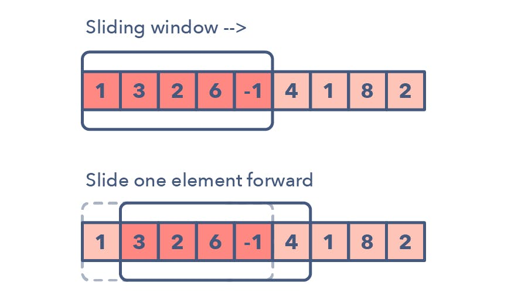
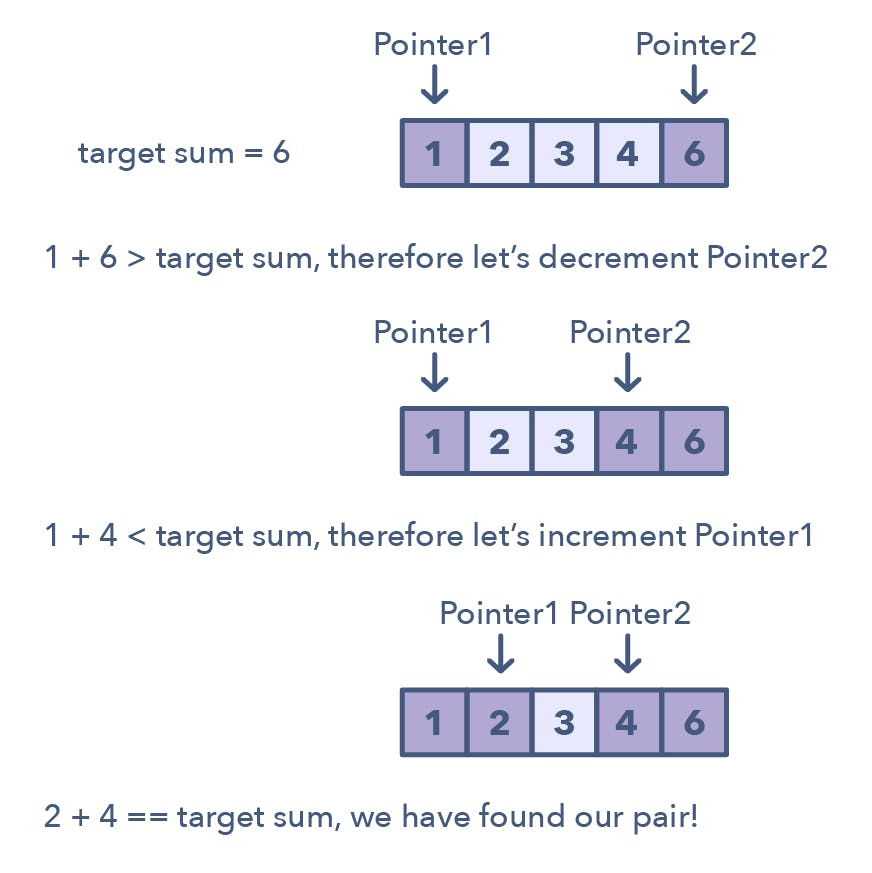
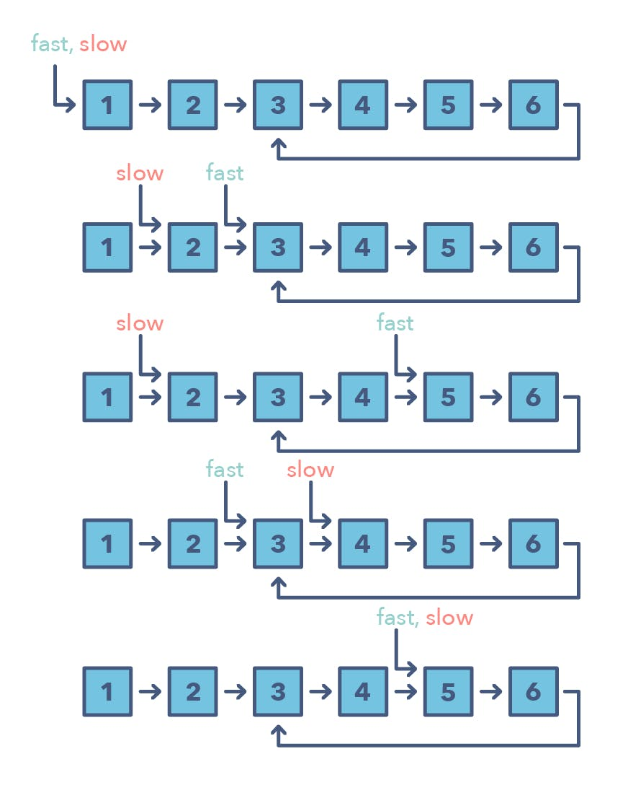
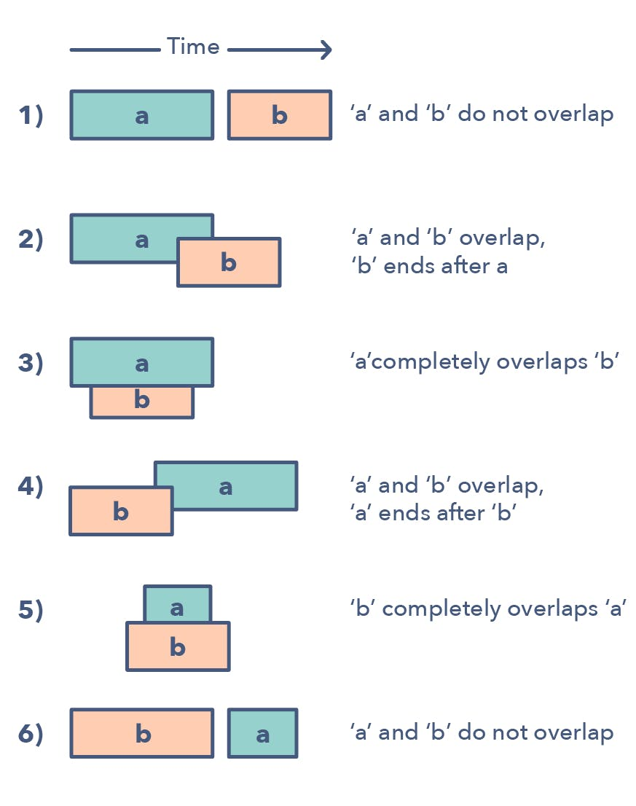
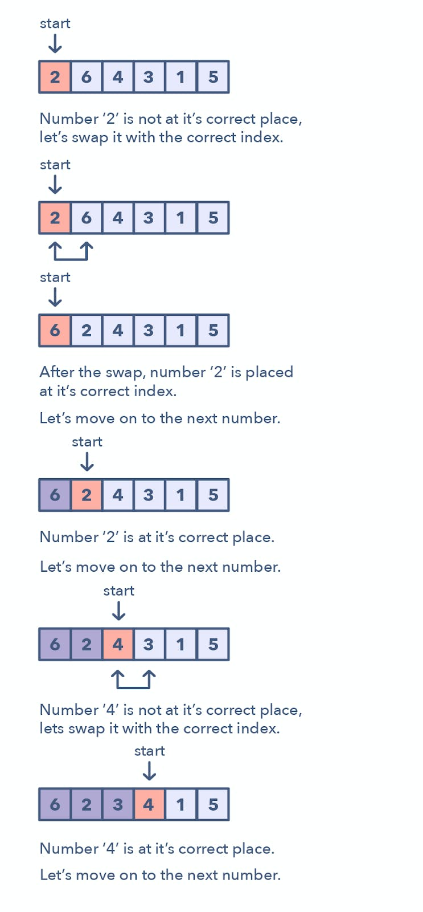
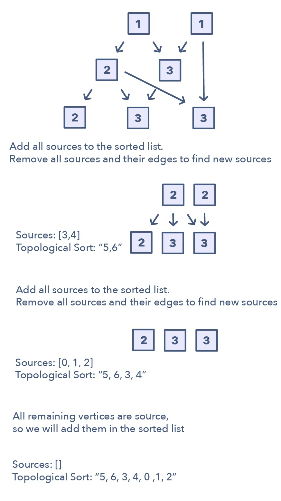

# Algorithms and Data Structures
## Problem Solving Patterns
1. #### Sliding Window

    The Sliding Window pattern is used to perform a required operation on a specific window size of a given array or linked list.

    

    Following are some ways you can identify that the given problem might require a sliding window:
    * The problem input is a linear data structure such as a linked list, array, or string
    * You’re asked to find the longest/shortest substring, subarray, or a desired value
    
    Common problems you use the sliding window pattern with:
    * Maximum sum subarray of size ‘K’ (easy)
    * Longest substring with ‘K’ distinct characters (medium)
    * String anagrams (hard)

2. #### Two Pointers or Iterators

    Two Pointers is a pattern where two pointers iterate through the data structure in tandem until one or both of the pointers hit a certain condition.

    

    Ways to identify when to use the Two Pointer method:
    * It will feature problems where you deal with sorted arrays (or Linked Lists) and need to find a set of elements that fulfill certain constraints
    * The set of elements in the array is a pair, a triplet, or even a subarray

    * Squaring a sorted array (easy)
    * Triplets that sum to zero (medium)
    * Comparing strings that contain backspaces (medium)

3. Fast and Slow pointers

    The Fast and Slow pointer approach, also known as the Hare & Tortoise algorithm, is a pointer algorithm that uses two pointers which move through the array (or sequence/linked list) at different speeds. This approach is quite useful when dealing with cyclic linked lists or arrays.

    

    How do you identify when to use the Fast and Slow pattern?
    * The problem will deal with a loop in a linked list or array
    * When you need to know the position of a certain element or the overall length of the linked list.

    When should I use it over the Two Pointer method mentioned above? There are some cases where you shouldn’t use the Two Pointer approach such as in a singly linked list where you can’t move in a backwards direction. An example of when to use the Fast and Slow pattern is when you’re trying to determine if a linked list is a palindrome.
    
    Problems featuring the fast and slow pointers pattern:
    * Linked List Cycle (easy)
    * Palindrome Linked List (medium)
    * Cycle in a Circular Array (hard)

4. Merge Intervals

    The Merge Intervals pattern is an efficient technique to deal with overlapping intervals. In a lot of problems involving intervals, you either need to find overlapping intervals or merge intervals if they overlap.
    
    The pattern works like this: Given two intervals (‘a’ and ‘b’), there will be six different ways the two intervals can relate to each other:

    

    How do you identify when to use the Merge Intervals pattern?
    * If you’re asked to produce a list with only mutually exclusive intervals
    * If you hear the term “overlapping intervals”.

    Merge interval problem patterns:
    * Intervals Intersection (medium)
    * Maximum CPU Load (hard)

5. Cyclic sort

    This pattern describes an interesting approach to deal with problems involving arrays containing numbers in a given range. The Cyclic Sort pattern iterates over the array one number at a time, and if the current number you are iterating is not at the correct index, you swap it with the number at its correct index.

    

    How do I identify this pattern?
    * They will be problems involving a sorted array with numbers in a given range
    * If the problem asks you to find the missing/duplicate/smallest number in an sorted/rotated array

    Problems featuring cyclic sort pattern:
    * Find the Missing Number (easy)
    * Find the Smallest Missing Positive Number (medium)

6. Tree BFS
7. Tree BFS

8. Two heaps

    In many problems, we are given a set of elements such that we can divide them into two parts. To solve the problem, we are interested in knowing the smallest element in one part and the biggest element in the other part. This pattern is an efficient approach to solve such problems.

    This pattern uses two heaps; A Min Heap to find the smallest element and a Max Heap to find the biggest element. The pattern works by storing the first half of numbers in a Max Heap, this is because you want to find the largest number in the first half. You then store the second half of numbers in a Min Heap, as you want to find the smallest number in the second half. At any time, the median of the current list of numbers can be calculated from the top element of the two heaps.

    Ways to identify the Two Heaps pattern:
    * Useful in situations like Priority Queue, Scheduling
    * If the problem states that you need to find the smallest/largest/median elements of a set
    * Sometimes, useful in problems featuring a binary tree data structure

    Problems featuring
    * Find the Median of a Number Stream (medium)

9. Modified binary search

    Whenever you are given a sorted array, linked list, or matrix, and are asked to find a certain element, the best algorithm you can use is the Binary Search. This pattern describes an efficient way to handle all problems involving Binary Search.

    The patterns looks like this for an ascending order set:
    1. First, find the middle of start and end. An easy way to find the middle would be: `middle = (start + end) / 2`. But this has a good chance of producing an integer overflow so it’s recommended that you represent the middle as: `middle = start + (end — start) / 2`
    2. If the key is equal to the number at index middle then return middle
    3. If ‘key’ isn’t equal to the index middle:
        * Check if key < arr[middle]. If it is reduce your search to end = middle — 1
        * Check if key > arr[middle]. If it is reduce your search to end = middle + 1

    Here is a visual representation of the Modified Binary Search pattern:

10. Topological sort

    Topological Sort is used to find a linear ordering of elements that have dependencies on each other. For example, if event ‘B’ is dependent on event ‘A’, ‘A’ comes before ‘B’ in topological ordering.

    This pattern defines an easy way to understand the technique for performing topological sorting of a set of elements.

    

    How to identify the Topological Sort pattern:
    * The problem will deal with graphs that have no directed cycles
    * If you’re asked to update all objects in a sorted order
    * If you have a class of objects that follow a particular order

    Problems featuring the Topological Sort pattern:
    * Task scheduling (medium)
    * Minimum height of a tree (hard)
