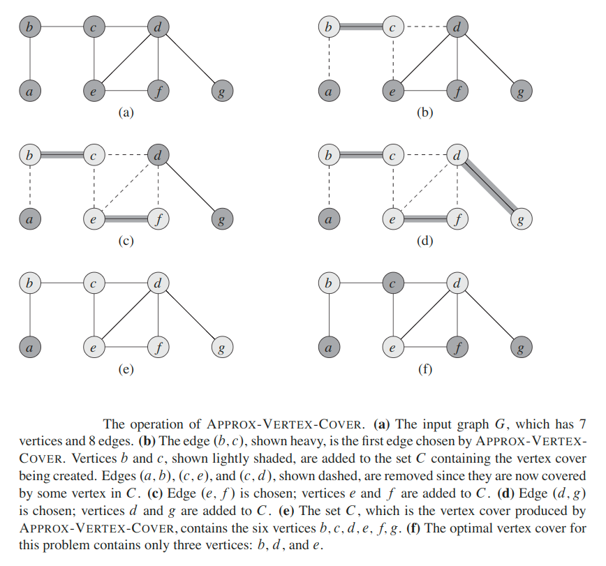
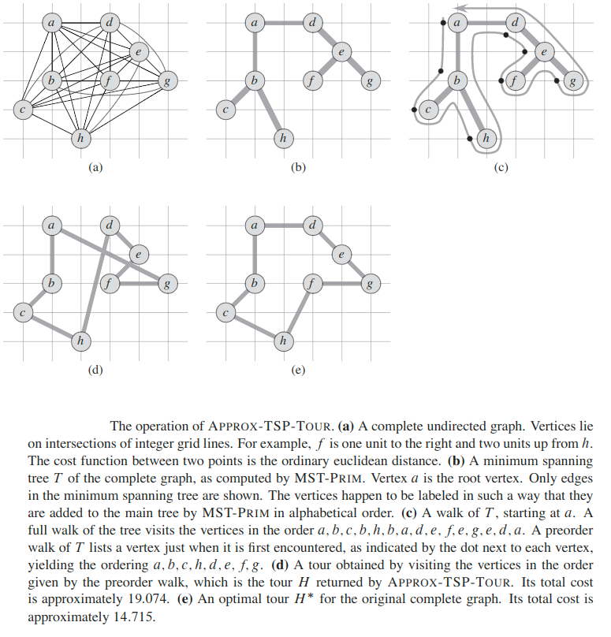
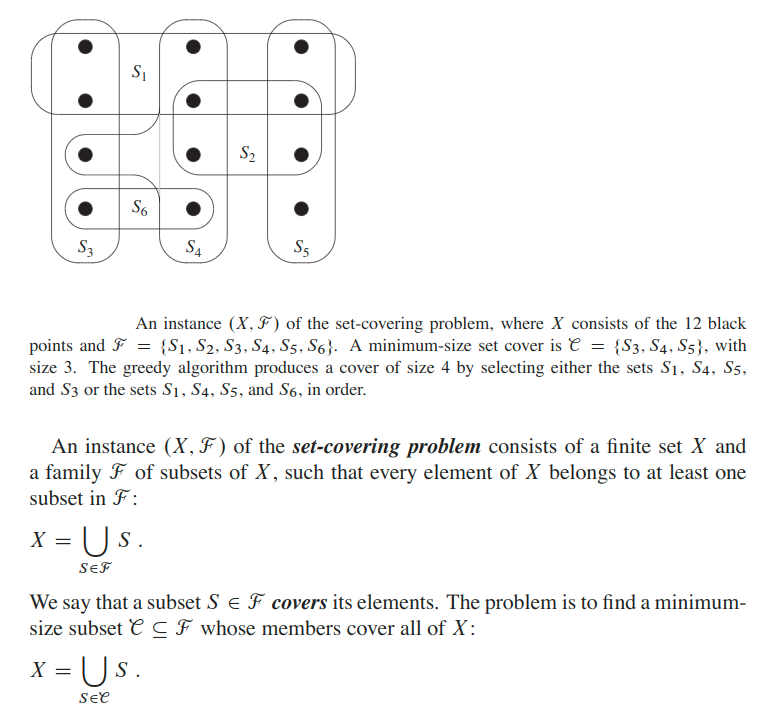
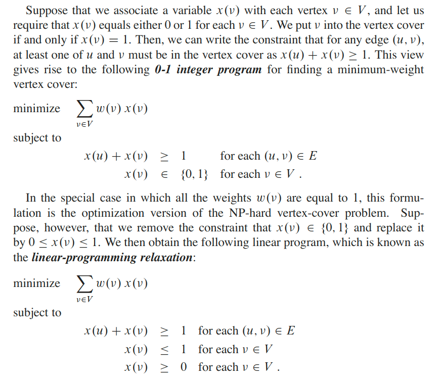

## Approximation Algorithms
Many problems of practical significance are NP-complete, yet they are too important to abandon merely because we don’t know how to find an optimal solution in polynomial time. Even if a problem is NP-complete, there may be hope. We have at least three ways to get around NP-completeness.
1. If the actual inputs are small, an algorithm with exponential running time may be perfectly satisfactory.
2. We may be able to isolate important special cases that we can solve in polynomial time.
3. We might come up with approaches to find near-optimal solutions in polynomial time (either in the worst case or the expected case).

We call an algorithm that returns near-optimal solutions an __approximation algorithm__.

We say that an algorithm for a problem has an approximation ratio of `ρ(n)` if, for any input  of size `n`,  the cost `C` of the solution produced  by the algorithm  is within a factor of `ρ(n)` of the cost `C'` of an optimal solution:

`max(C/C', C'/C) ≤ ρ(n)`

If an algorithm achieves an approximation ratio of `ρ(n)`, we call it a __`ρ(n)`-approximation algorithm__. For example a __2-approximation algorithm__ returns a solution whose cost is at most twice the optimal.

The  definitions  of  the  approximation  ratio  and  of  a `ρ(n)`-approximation algorithm apply to both minimization and maximization problems.

* For a maximization problem, `0 < C ≤ C'`, and the ratio `C'/C` gives the factor by which the cost of an optimal solution is larger than the cost of the approximate solution. 
* Similarly, for a minimization problem, `0 < C' ≤ C`, and the ratio `C/C'` gives the factor by which the cost of the approximate  solution is larger  than the cost of an optimal  solution.

The approximation ratio of an approximation  algorithm  is  never  less  than `1`, since `C/C' ≤ 1` implies `C'/C ≥ 1`. Therefore, a `1`-approximation algorithm produces an optimal solution, and an approximation algorithm with a large approximation ratio may return a solution tha tis much worse than optimal.

Some NP-complete problems allow polynomial-time approximation algorithms that can achieve increasingly better approximation ratios by using more and more computation time. That is, we can trade computation time for the quality of the approximation. In order to find how much better the result will get in this case, we use approximation schema.

An __approximation scheme__ for an optimization problem is an approximation algorithm that takes as input not only an instance of the problem, but also a value `Ɛ > 0` such that for any fixed `Ɛ`, the scheme is a `(1 + Ɛ)`-approximation algorithm. We say that an approximation scheme is a __polynomial-time approximation scheme__ if for any fixed `Ɛ > 0`, the scheme runs in time polynomial in the size `n` of its input instance.

We say that an approximation scheme is a __fully polynomial-time approximation scheme__ if  it  is  an  approximation  scheme  and  its  running  time  is  polynomial  in both `1/Ɛ` and the size `n` of the input instance. For example, the scheme might have a running time of `O((1/Ɛ)^2 * n^3)`. With such a scheme, any constant-factor decrease in `Ɛ` comes with a corresponding constant-factor increase in the running time.

### The Vertex-Cover Problem
A __vertex cover__ of an undirected graph `G = (V, E)` is a subset `V' ⊆ V` such that if `(u, v) ∈ E`, then either `u ∈ V'` or `v ∈ V'` (or both).  That is, each vertex “covers” its incident edges (two edges are _incident_ if they share a common vertex), and a vertex cover for `G` is a set of vertices that covers all the edges in `E`. The __size__ of a vertex cover is the number of vertices in it.

The vertex-cover problem is to find a vertex cover of minimum size in a given graph. We call such a vertex cover an optimal vertex cover. This problem is the optimization version of an NP-complete decision problem.

Even though we don’t know how to find an optimal vertex cover in a graphGin  polynomial  time,  we  can  efficiently  find  a  vertex  cover  that  is  near-optimal.

#### Theorem
The `approxVertexCover()` is a polynomial-time 2-approximation algorithm.

The algorithm returns a vertex cover whose size is at most twice the size  of  the maximal matching.

> An alternative way of solving the problem would be picking a vertex with max degree in each iteration.

### The Traveling-Salesman Problem
In the  traveling-salesman  problem we are  given  a complete undirected graph `G(V, E)` that has a nonnegative integer cost `c(u, v)` associated  with each edge `(u, v) ∈ E`,  and we must find a hamiltonian cycle (a tour) of `G` with minimum cost.  As an extension of our notation, let `c(A)` denote the total cost of the edges in the subset `A ⊆ E`:

`c(A) = ∑[(u, v) ∈ A](c(u, v))`

In many practical situations, the least costly way to go from a place `u` to a place `w` is to go directly, with no intermediate steps.  Put another way, cutting out an intermediate stop never increases the cost.  We formalize this notion by saying that the cost function `c` satisfies the __triangle inequality__ if, for all vertices `u, v, w ∈ V`,

`c(u, w) ≤ c(u, v) + c(v, w)`

We shall first compute a structure — a minimum spanning tree — whose weight gives a lower bound on the length of an optimal traveling-salesman tour.  We shall then use the minimum spanning tree to create a tour whose cost is no more than twice that of the minimum spanning tree’s weight, as long as the cost function satisfies the triangle inequality.

#### Theorem
`approxTourFrom()` is  a  polynomial-time 2-approximation  algorithm  for  the traveling-salesman problem with the triangle inequality.

Meaning if the cost function for an instance of the traveling-salesman problem satisfies the triangle inequality, then `approxTourFrom()` returns a tour whose cost is not more than twice the cost of an optimal tour (`≤ 2 × optimal solution`).

> `approxTourFrom()` is usually not the best practical choice for this problem. There are other approximation algorithms that typically perform much better in practice.

### The general Traveling-Salesman Problem
If we drop the assumption that the cost function `c` satisfies the triangle inequality, then we cannot find good approximate tours in polynomial time unless `P = NP`.

#### Theorem
If `P ≠ NP`, then for any constant `ρ ≥ 1`, there is no polynomial-time approximation algorithm with approximation ratio `ρ` for the general traveling-salesman problem.

### The Set-Covering Problem
The set-covering problem is an optimization problem that models many problems that require resources to be allocated.

We say that any `C` satisfying above equation __covers__ `X`.  The size of `C` is the number of sets it contains, rather than the number of individual elements in these sets, since every subset `C` that covers `X` must contain all `|X|` individual elements.

The set-covering problem abstracts many commonly arising combinatorial prob-lems. As a simple example, suppose that `X` represents a set of skills that are needed to solve a problem and that we have a given set of people available to work on the problem.   We  wish  to  form  a  committee,  containing  as  few  people  as  possible, such that for every requisite skill in `X`, at least one member of the committee has that skill.  In the decision version of the set-covering problem, we ask whether a covering exists with size at most `k`, where `k` is an additional parameter specified in the problem instance. The decision version of the problem is NP-complete.

The greedy method works by picking, at each stage, the set `S` that covers the greatest number of remaining elements that are uncovered.

#### Theorem
`approxSetCover()` is a polynomial-time. `(ln|X| + 1)` - approximation algorithm.

### A randomized approximation algorithm for MAX-3-CNF satisfiability
A particular instance of 3-CNF satisfiability, may or may not be satisfiable. In order to be satisfiable, there must exist an assignment of the variables so that every clause evaluates to `1`. If an instance is not satisfiable, we may want to compute how “close” to satisfiable it is, that is, we may wish to find an assignment of the variables that satisfies as many clauses as possible.  We call the resulting maximization problem __MAX-3-CNF satisfiability__.

The input to MAX-3-CNF satisfiability is the same as for 3-CNF satisfiability, and the goal is to return an assignment  of the variables that maximizes the number of clauses evaluating to `1`.

#### Theorem
Given  an  instance  of  MAX-3-CNF  satisfiability  with `n` variables `x_1, x_2, ..., x_n` and `m` clauses,  the  randomized  algorithm  that  independently  sets  each  variable  to `1` with  probability `1/2` and  to `0` with  probability `1/2` is a randomized `8/7`-approximation algorithm.

### Approximating weighted vertex cover using linear programming
In the __minimum-weight vertex-cover problem__, we are given an undirected graph `G = (V, E)` in which each vertex `v ∈ V` has an associated positive weight `w(v)`. For any vertex cover `V' ⊆ V`, we define the weight of the vertex cover `w(V') = ∑[v ∈ V'](w(v))`. The goal is to find a vertex cover of min weight.

We cannot apply the algorithm used for unweighted vertex cover, nor can we use a random solution;  both methods may return solutions that are far from optimal.

Any feasible solution to the `0-1` integer program is also a feasible solution to the above linear program. Therefore, the value of an optimal solution to the linear program gives a lower bound on the value of an optimal solution to the `0-1` integer program, and hence a lower bound on the optimal weight in the minimum-weight vertex-cover problem.

#### Theorem
The algorithm for solving minimum-weight vertex-cover problem is a polynomial-time 2-approximation algorithm for the minimum-weight vertex-cover problem.

### The Subset-Sum Problem
An  instance  of  the  subset-sum  problem  is  a pair `(S, t)`, where `S` is a set `{x_1, x_2, ..., x_n}` of positive integers and `t` is a positive integer. This decision  problem  asks whether  there exists a subset  of `S` that adds up exactly to the target value `t`.

Example: we may have a truck that can carry no more than `t` pounds, and `n` different boxes to ship, the `i`th of which weighs `x_i` pounds. We wish to fill the truck with as heavy a load as possible without exceeding the given weight limit.

Suppose  that  we  computed,  for  each  subset `S'` of `S`,  the  sum  of  the  elements in `S'`,  and  then  we  selected,  among  the  subsets  whose  sum  does  not  exceed `t`, the one whose sum was closest to `t`.  Clearly this algorithm would return the optimal solution,  but it could take exponential  time.  To implement this algorithm, we  could  use  an  iterative  procedure  that,  in  iteration `i`,  computes  the  sums  of all  subsets  of `{x_1, x_2, ..., x_i}`,  using  as  a  starting  point  the  sums  of  all  subsets of `{x_1, x_2, ..., x_i-1}`. In doing so, we would realize that once a particular subset `S'` had a sum exceeding `t`, there would be no reason to maintain it, since no super-set of `S'` could be the optimal solution.

---

#### [MIT: Approximation Algorithms](https://www.youtube.com/watch?v=MEz1J9wY2iM)
