## Linear Programming
Many problems  take the form  of maximizing  or minimizing  an objective,  given limited resources  and competing  constraints.   If we can specify  the objective  asa  linear  function  of  certain  variables,  and  if  we  can  specify  the  constraints  on resources as equalities or inequalities  on those variables,  then we have a __linear-programming problem__.

In the general linear-programming problem, we wish to optimize a linear function subject to a set of linear inequalities. Given a set of real numbers `a_1, a_2, ..., a_n` and a set of variables `x_1, x_2, ..., x_n`, we define a linear function `f` on those variables by 

`f(x_1, x_2, ..., x_n) = a_1 * x_1 + a_2 + x_2 + ... + a_n * x_n`

If `b` is a real number and `f` is a linear function, then the equation 

`f(x_1, x_2, ..., x_n) = b`

is a __linear equality__ and the inequalities

`f(x_1, x_2, ..., x_n) ≤ b` and `f(x_1, x_2, ..., x_n) ≥ b`

are __linear inequalities__. We use the general term __linear constraints__ to denote either linear  equalities  or linear  inequalities. In linear  programming,  we do not allow strict  inequalities.

Formally, a __linear-programming problem__ is  the  problem  of either minimizing or maximizing a linear function subject to a finite set of linear constraints. If we are to minimize, then we call the linear program a __minimization linear program__,  and  if  we  are  to  maximize,  then  we  call  the  linear  program  a __maximization linear program__.

Let us first consider the following linear program with two variables:

```
maximize:       x_1 + x_2

subject to:     4x_1 - x_2 ≤ 8
                2x_1 + x_2 ≤ 10
                5x_1 - 2x_2 ≥ -2
                x_1, x_2 ≥ 0
```

We  call  any  setting  of  the  variables `x_1` and `x_2` that  satisfies  all  the  above constraints  a __feasible solution__ to the linear  program. If  we graph  the constraints in the `(x_1, x_2)` - Cartesian coordinate  system, as in following figure:

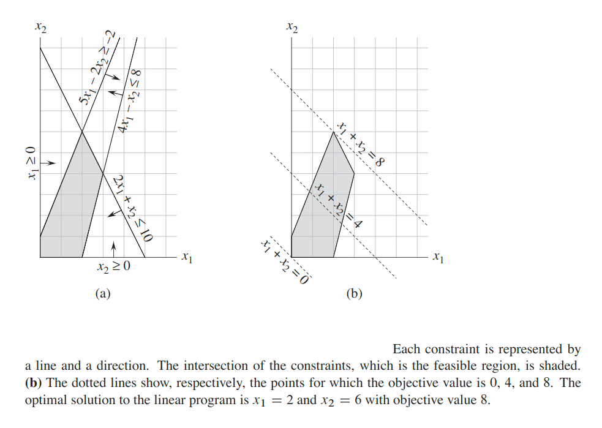

The set of feasible solutions (shaded in the figure) forms a convex region in the two-dimensional space. We call this convex region the __feasible region__ and the function we wish to maximize the __objective function__.

Conceptually, we could evaluate the objective function `x_1 + x_2` at each point in the feasible region; we call the value of the objective function at a particular point the __objective value__. We could then identify a point that has the maximum objective value as an optimal solution.


### Standard form
A linear program in __standard form__ is the maximization of a linear function subject to linear inequalities, whereas a linear program in __slack form__ is the maximization of a linear function subject to linear equalities.

In standard form, we are given `n` real numbers `c_1, c_2, ..., c_n` real  numbers `b_1, b_2, ..., b_m` and `m` `n` real numbers `a_ij` for `i = 1, 2, ..., m` and `j = 1, 2, ..., n`. We wish to find `n` real numbers `x_1, x_2, ..., x_n` that maximize

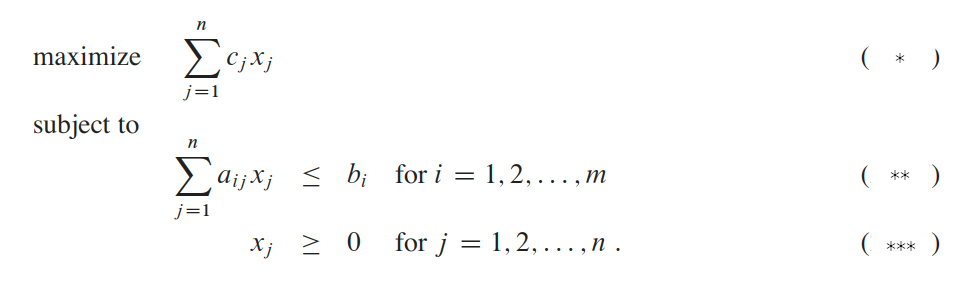

We call  expression  __(`*`)__  the __objective function__ and the `n + m` inequalities in lines __(`**`)__ and __(`***`)__ the constraints.Then __constraints__ in line __(`***`)__ are the __non-negativity constraints__. An arbitrary linear program need not have non-negativity constraints, but standard form requires them.

Sometimes we find it convenient to express a linear program in a more compact form. If we create an `m x n` matrix `A = (a_ij)`, an `m`-vector `b = (b_i)`, an `n`-vector `c = (c_j)`, and an `n`-vector `x = (x_j)`, then we can rewrite the linear program as:

maximize `c`<sup>`T`</sup>`x`

subject to: `Ax ≤ b`, `x ≥ 0`

We say that a solution `x` has __objective value__ `c`<sup>`T`</sup>`x`.  feasible solution `x` whose objective value is maximum over all feasible solutions is an __optimal solution__, and we call its objective value the __optimal objective value__.

If a linear program has no feasible solutions, we say that the linear program is __infeasible__; otherwise it is __feasible__. If a linear program has some feasible solutions but does not have a finite optimal objective value, we say that the linear program is __unbounded__.

#### Converting linear programs into standard form
It is always possible  to convert  a linear  program,  given as minimizing  or maximizing a linear function subject to linear constraints, into standard form.  A linear program might not be in standard form for any of four possible reasons:

1. The objective function might be a minimization rather than a maximization.

    To convert a minimization linear program `L` into an equivalent maximization linear program `L'`, we simply negate the coefficients in the _objective function_. That is: `cx' = -cx`.

    ```
    minimize:   -2 * x1 + 3 * x2
                        ⟱
    maximize:   2 * x1 - 3 * x2
    ```
 
2. There might be variables without non-negativity constraints.

    > __Standard form requires the whole vector `x` to be `≥ 0`.__

    Suppose that some variable `x_j` does not have a non-negativity constraint (`x_j < 0`). Then, we replace each occurrence of `x_j` by `x'_j - x"_j`, and add the non-negativity constraints `x'_j ≥ 0` and `x"_j ≥ 0`. Thus, if the objective function has a term `c_j * x_j`, we replace it by `c_j * x'_j - c_j * x"_j`, and if constraint `i` has a term `a_ij * x_j`, we replace it by `a_ij * x'_j - a_ij * x"_j`. Any feasible solution `x` to the new linear program corresponds to a feasible solution `x` to the original linear program with `x_j = x'_j - x"_j` and with the same objective value.  Also, any feasible solution `x` to the original linear program corresponds to a feasible solution `x` to the new linear program with `x'_j = x_j` and `x"_j = 0` if `x_j ≥ 0`, or with `x"_j = x_j` and `x'_j = 0` if `x_j < 0`.

    ```
    minimize:       -2 * x1 + 3 * x2
    subject to:     x1 + x2 = 7
                    x2 - 2 * x2 ≤ 4
                    x1 ≥ 0
                            ⟱
    maximize:       2 * x1 - 3 * x2' + 3 * x2"
    subject to:     x1 + x2' - x2" = 7
                    x1 - 2 * (x2' + x2") ≤ 4
                    x1, x2', x2" ≥ 0
    ```

3. There might bee _quality constraints_, which have an equal  sign rather  than a less-than-or-equal-to sign.

    Suppose that a linear program has an equality constraint `f(x_1, x_2, ..., x_n)`. Since `x = y` if and only if both `x ≥ y` and `x ≤ y`, we can replace this equality constraint by the pair of inequality constraints `f(x_1, x_2, ..., x_n) ≤ b` and `f(x_1, x_2, ..., x_n) ≥ b`.

4. There  might  be _inequality constraints_,  but  instead  of  having  a  less-than-or-equal-to sign, they have a greater-than-or-equal-to sign.

    Finally, we can convert the greater-than-or-equal-to constraints to less-than-or-equal-to constraints by multiplying these constraints through by `-1`.

When converting one linear program `L` into another linear program `L'`, we would like the property that an optimal solution to `L'` yields an optimal solution to `L`. To capture  this  idea,  we  say  that  two  maximization  linear  programs `L` and `L'` are __equivalent__.

### Slack Form
To efficiently solve a linear program with the simplex algorithm, we prefer to ex-press it in a form in which some of the constraints are equality constraints.  More precisely, we shall convert it into a form in which the non-negativity constraints are the only inequality constraints, and the remaining constraints are equalities.

Let `Ax ≤ b` be an inequality  constraint. We introduce  a new variable `s` and rewrite inequality as the two constraints: `s = b - Ax`, `s ≥ 0`.

We call `s` a __slack variable__ because it measures the slack,  or difference,  between the left-hand and right-hand sides of original equation.

When  converting  from standard to slack form, we shall use `x`<sub>`n + i`</sub> (instead of `s`) to denote the slack variable associated with the `i`th inequality. The `i`th constraint is therefore:

`x`<sub>`n + i`</sub>` = b_i - ∑[j = 1 -> n](a_ij * x_j)`.

along with the non-negativity constraint `x`<sub>`n + i`</sub>` ≥ 0`.

We call the variables on the left-hand side of the equalities __basic variables__ and those on the right-hand side __nonbasic variables__.

We use `N` to denote the set of indices of the nonbasic variables and `B` to denote the set of indices of the  basic  variables. We always  have  that `|N| = n`, `|B| = m`, and `N ∪ B = {1, 2, ..., n + m}`.

The equations are indexed by the entries of `B`, and the variables on the right-hand sides are indexed by the entries of `N`.

We also use `v` to denote an optional constant term in the objective function.

Thus we can concisely define a slack form by a tuple `(N, B, A, b, c, v)`, denoting the slack form:

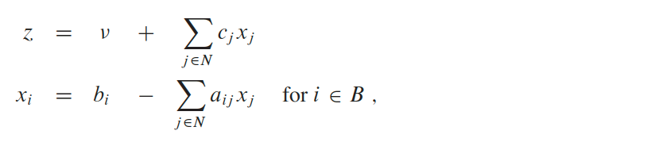

For example

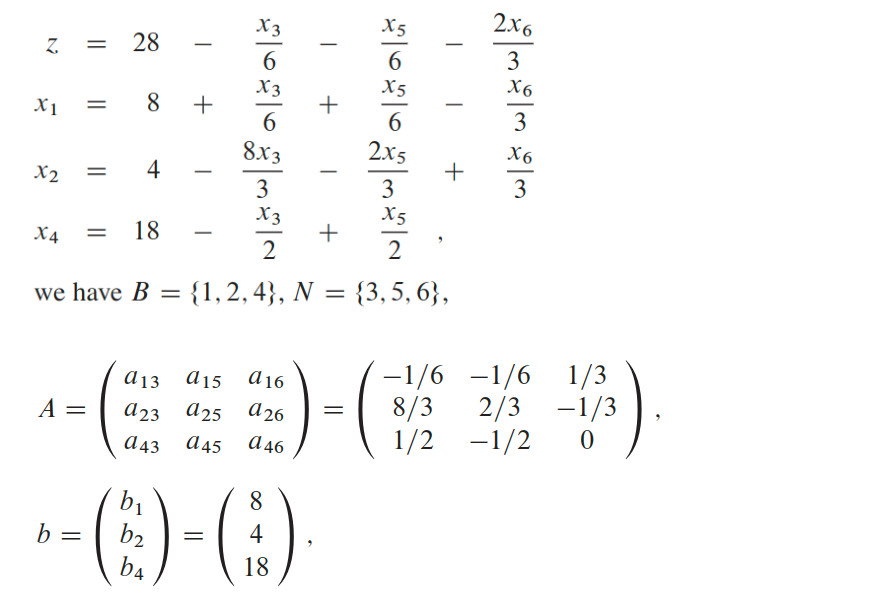

`c = (c3, c5, c6)`<sup>`T`</sup>` = (-1/6, -1/6, -2/3)`<sup>`T`</sup>, and `v = 28`.


### Single Source Shortest Paths
We can formulate  the single-source  shortest-paths  problem  as a linear  program.

In the single-pair shortest-path problem, we are given a weighted, directed graph `G = (V, E)`,  with weight function `w: E -> ℝ` mapping  edges to real-valued weights,  a  source  vertex `s`,  and  destination  vertex `t`. We  wish  to  compute  the value `d_t`, which is the weight of a shortest path from `s` to `t`.

To express this problem as a linear program, we need to determine a set of variables and constraints that define when we have a shortest path from `s` to `t`. Fortunately, the Bellman-Ford algorithm  does  exactly  this.   When the Bellman-Ford algorithm  terminates,  it has computed, for each vertex `v`, a value `d_v` (using subscript notation here rather than attribute notation) such that for each edge `(u, v) ∈ E`, we have `d_v ≤ d_u + w(u, v)`.

The source vertex initially receives a value `d_s = 0`, which never changes.  Thus we obtain the following linear program to compute the shortest-path weight from `s` to `t`:

```
maximize:       d_t
subject to:     d_v ≤ d_u + w(u, v) for each edge (u, v) ∈ E
                d_s = 0
```

You might be surprised that this linear program maximizes an objective function when it is supposed to compute shortest paths.  We do not want to minimize the objective function, since then setting `d_v = 0` for all `v ∈ V` would yield an optimal solution  to  the  linear  program  without  solving  the  shortest-paths  problem.   We maximize because an optimal solution to the shortest-paths problem sets each `d_v` to `min{d_u + w(u, v)}` for all `u: (u, v) ∈ E`, so that `d_v` is the largest value that is less than or equal  to  all  of  the  values  in  the  set `{d_v + w(u, v)}`. We  want  to  maximize `d_v` for all vertices `v` on a shortest path from `s` to `t` subject to these constraints on all vertices `v`, and maximizing `d_t` achieves this goal.

This linear program has `|V|` variables `d_v`, one for each vertex `v ∈ V`.It also has `|E| + 1` constraints:  one for each edge, plus the additional constraint that the source vertex’s shortest-path weight always has the value `0`.

### Shortest Paths
In the general linear-programming problem, we are given an `m x n` matrix `A`, an `m`-vector `b`, and an `n`-vector `c`. We wish to find a vector `x` of `n` elements that maximizes the objective function `∑[i = 1 -> n](c_i * x_i)` subject to the `m` constraints given by `Ax ≤ b`.

#### Lemma
Let `x = (x1, x2, ..., x_n)` be a solution to a system `Ax ≤ b` of  difference  constraints, and let `d` be any constant.  Then `x + d = (x1 + d, x2 + d, ..., x_n + d)` is a solution to `Ax ≤ b` as well.

### Constraint graphs
We  can  interpret  systems  of  difference  constraints  from  a  graph-theoretic  point of  view.   In  a  system `Ax ≤ b` of  difference  constraints,  we  view  the `m x n` linear-programming  matrix `A` as the transpose of an incidence matrix for a graph with `n` vertices and `m` edges.  Each vertex `v_i` in the graph, for `i = 1, 2, ..., n`, corresponds to one of the `n` unknown variables `x_i`. Each directed edge in the graph corresponds  to one of the min equalities  involving  two unknowns.

More formally, given a system `Ax ≤ b` of difference constraints, the corresponding __constraint graph__ is a weighted, directed graph `G = (V, E)`, where `V = {v0, v1, ..., v_n}` and `E = {(v_i, v_j): x_j - x_i ≤ b_k is a constraint} ⋃ {(v0, v1), (v0, v2), (v0, v3), ..., (v0, v_n)}`.

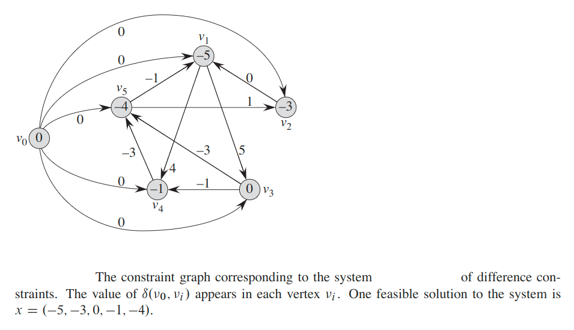

The constraint graph contains the additional vertex `v0`, as we shall see shortly, to guarantee that the graph has some vertex which can reach all other vertices. Thus, the vertex set `V` consists of a vertex `v_i` for each unknown `x_i`, plus an additional vertex `v0`.  The edge set `E` contains  an edge for each difference  constraint,  plus an edge `(v0, v_i)` for each unknown `x_i`.If `x_j - x_i ≤ b` is a difference constraint, then the weight of edge `(v_i), v_j)` is `w(v_i, v_j) = b_k`. The weight of each edge leaving `v0` is `0`.

#### Theorem
Given a system `Ax ≤ b` of difference constraints, let `G = (V, E)` be the corresponding constraint graph. If `G` contains no negative-weight cycles, then

`x = (ẟ(v0, v1), ẟ(v0, v2), ẟ(v0, v3), ..., ẟ(v0, v_n))`, where `ẟ(u, v)` is a shortest path between vertices `u` and `v` in the graph `G`.

is a feasible solution for the system. If `G` contains a negative-weight cycle, then there is no feasible solution for the system.

#### Solving systems of difference constraints
The above theorem  tells  us  that  we  can  use  the  __Bellman-Ford  algorithm__  to  solve  a system  of  difference  constraints.    Because  the  constraint  graph  contains  edges from the source vertex `v0` to all other vertices,  any negative-weight  cycle in the constraint  graph  is  reachable  from `v0`. If  the  Bellman-Ford  algorithm  returns `true`,  then  the  shortest-path  weights  give  a feasible  solution  to  the  system.

In the constraint graph above, for example,  the shortest-path  weights provide the feasible solution `x = (-5, -3, 0, -1, -4)`, and by above Lemma, `x = (d - 5, d - 3, d, d - 1, d - 4)` is also a feasible solution for any constant `d`.

If the Bellman-Ford algorithm returns `false`, there is no feasible solution to the system of difference constraints.

A system of difference constraints with `m` constraints on `n` unknowns produces a graph with `n + 1` vertices and `n + m` edges. Thus, using  the  Bellman-Ford algorithm, we can solve the system in `O((n + 1)(n + m)) = O(n*m + n^2)` time.

### Maximum Flow
Next, we express the maximum-flow problem as a linear program.  Recall that we are  given  a  directed  graph `G = (V, E)` in  which  each  edge `(u, v) ∈ E` has  a nonnegative capacity `c(u, v) ≥ 0`, and two distinguished vertices:  a source `s` and a sink `t`.  A flow is a nonnegative real-valued function `F: V x V -> ℝ` that  satisfies  the  capacity  constraint  and  flow  conservation. A maximum  flow is a flow that  satisfies  these  constraints  and maximizes  the  flow value, which is the total flow coming out of the source minus the total flow into the source.

A flow, therefore, satisfies linear constraints, and the value of a flow is a linear function.  Recalling also that we assume that `c(u, v) = 0` if `(u, v) ∉ E` and that there are no antiparallel edges, we can express the maximum-flow problem asa linear program:

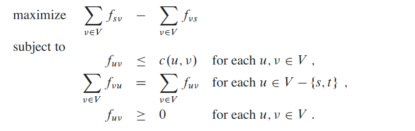

This linear program  has `|V|^2` variables,  corresponding  to the flow between each pair of vertices, and it has `2|V|^2 + |V| - 2` constraints.

### Minimum-cost flow
The real power of linear programming comes from the ability to solve new problems. 

Consider, for example, the following generalization of the maximum-flow problem.  Suppose that, in addition to a capacity `c(u, v)` for each edge `(u, v)`, we are given a real-valued costa `a(u, v)`. As in the maximum-flow problem, we assume that `c(u, v) = 0` if `(u, v) ∉ E`, and that there are no antiparallel edges.  If we send `f_uv` units of flow over edge `(u, v)`, we incur a cost of `a(u, v) * f_uv`.  We are also given a flow demand `d`.We wish to send `d` units of flow from `s` to `t` while minimizing the total cost incurred by the flow. This problem is known as the minimum-cost-flow problem.

There are polynomial-time algorithms specifically designed for the minimum-cost-flow problem. We can, however, express the minimum-cost-flow problem as a linear program.  The linear program looks similar to the one for the maximum-flow problem with the additional constraint  that the value of the flow be exactly `d` units,  and with the new objective function of minimizing the cost:

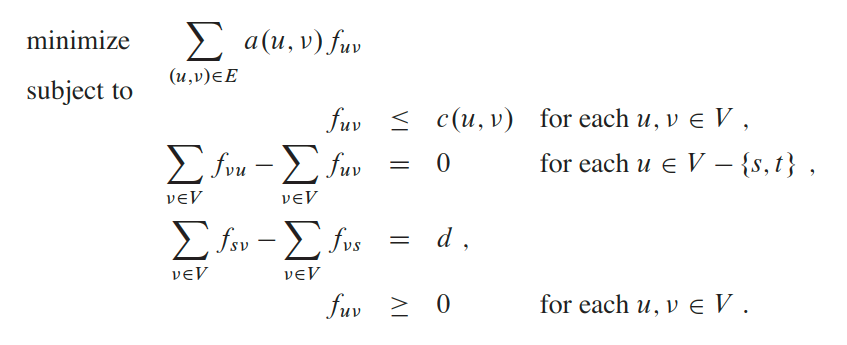

Example

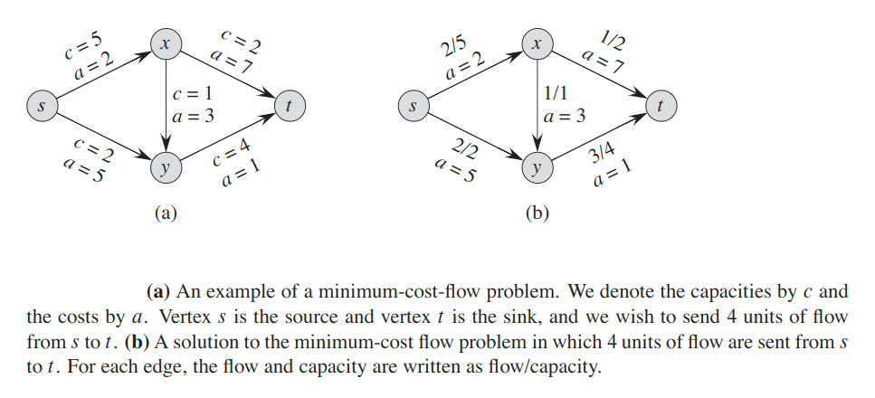

### Multicommodity flow
In a __multicommodity-flow problem__, we are again given a directed graph `G = (V, E)` in which each edge `(u, v) ∈ E` has a nonnegative capacity `c(u, v) ≥ 0`. As in the maximum-flow problem, we implicitly assume that `c(u, v) = 0` for `(u, v) ∉ E`, and that the graph has no antiparallel edges.  In addition,  we are given `k` different commodities, `K_1, K_2, ..., K_k`, where we specify commodity `i` by the triple `K_i = (s_i, t_i, d_i)`. Here, vertex `s_i` is the source of commodity `i`, vertex `t_i` is the sink of commodity `i`, and `d_i` is the demand for commodity `i`, which is the desired flow value for the commodity from `s_i` to `t_i`. We define a flow for commodity `i`, denoted by `f_i`, (so that `f_iuv` is the flow of commodity `i` from vertex `u` to vertex `v`) to be a real-valued function that satisfies the flow-conservation and capacity constraints.  We now define `f_uv`, the aggregate flow, to be the sum of the various commodity flows, so that `f_uv = ∑[i = 1 -> k](f_iuv)`. The aggregate flow on edge `(u, v)` must be no more than the capacity of edge `(u, v)`. We are  not trying  to minimize  any  objective  function  in this  problem;  we need only determine whether such a flow exists. Thus, we write a linear program with a “null” objective function:

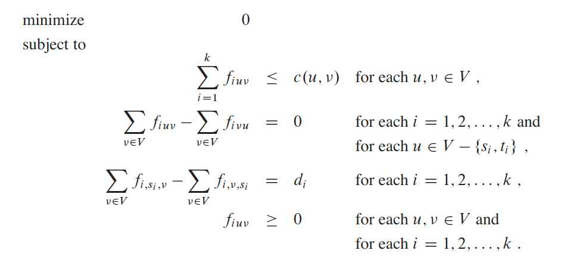


### Simplex Algorithm
__Simplex__ is a generalization of the notion of a triangle to arbitrary dimensions.

For example,
* 0-simplex is a point
* 1-simplex is a line segment
* 2-simplex is a triangle
* 3-simplex is a triangular pyramid

The simplex algorithm is the classical method for solving linear programs.

The __simplex algorithm__ takes as input a linear program and returns an optimal solution.  It starts at some vertex of the simplex and performs a sequence of iterations. In each iteration, it moves along an edge of the simplex from a current vertex to a neighboring vertex whose objective value is no smaller than that of the current vertex (and usually is larger.)  The simplex algorithm terminates when it reaches a local  maximum,  which is a vertex from which all neighboring  vertices have a smaller objective value.  Because the feasible region is convex and the objective function is linear, this local optimum is actually a global optimum.

> If we add to a linear program the additional requirement that all variables take on integer values, we have an integer linear program. Finding  a  feasible  solution  to  this  problem  is  NP-hard.

#### Example
Consider  the following  linear  program  in standard form:

```
maximize:       3 * x1 + x2 + 2 * x3
subject to:     x1 + x2 + 3 * x3 ≤ 30
                2 * x1 + 2 * x2 + 5 * x3 ≤ 24
                4 * x1 + x2 + 2 * x3 ≤ 36
                x1, x2, x3 ≥ 0
```

Recalling that each variable  has  a  corresponding  non-negativity  constraint,  we  say  that  an equality constraint is __tight__ for a particular setting of its nonbasic variables if they cause the constraint’s basic variable to become `0`. Similarly, a setting of the non-basic  variables  that  would  make  a  basic  variable  become  negative _violates_ that constraint.  Thus, the slack variables explicitly maintain how far each constraint is from being tight, and so they help to determine how much we can increase values of nonbasic variables without violating any constraints.

In order to use the simplex algorithm, we must convert the linear program into slack form;

```
z = 3 * x1 + x2 + 2 * x3
x4 = 30 - x1 - x2 - 3 * x3
x5 = 24 - 2 * x1 - 2 * x2 - 5 * x3
x6 = 36 - 4 * x1 - x2 - 2 * x3
```

The system of constraints has 3 equations and 6 variables. Any setting of the variables `x1`, `x2`, and `x3` defines values for `x4`, `x5`, and `x6`; therefore, we have an infinite number of solutions to this system of equations. A solution is feasible if all of `x1, x2, ..., x6` are nonnegative, and there can be an infinite number of feasible  solutions  as well.

We focus on the __basic solution__:  set all the (nonbasic) variables on the right-hand side to0and then compute the values of the (basic) variables on the left-hand side. In this example, the basic  solution  is `(x1, x2, ..., x3) = (0, 0, 0, 30, 24, 36)` and  it  has  objective  value ́`z = (3 *0) + (1 * 0) + (2 * 0) = 0`.

If a basic solution is also feasible, we call it a __basic feasible solution__.

Our goal, in each iteration, is to reformulate the linear program so that the basic solution  has  a greater  objective  value.   We select  a  nonbasic  variable `x_e` whose coefficient in the objective function is positive, and we increase the value of `x_e` as much as possible without violating any of the constraints. The variable `x_e` becomes basic,  and some other  variable `x_l` becomes  nonbasic.   The values of other  basic variables and of the objective function may also change.

To continue the example,  let’s think about  increasing  the value of `x1`. As we increase `x1`, the values of `x4`, `x5`, and `x6` all decrease. Because we have a non-negativity constraint for each variable, we cannot allow any of them to become negative. If `x1` increases above `30`, then `x4` becomes negative, and `x5` and `x6` become negative when `x1` increases above `12` and `9`, respectively. The third constraint is the tightest constraint, and it limits how much we can increase `x1`. Therefore, we switch the roles of `x1` and `x6`. We solve equation for `x1` and obtain:

`x1 = 9 - x2/4 - x3/2 - x6/4`

To rewrite the other equations with `x6` on the right-hand side, we substitute for `x1` using above equation. Doing so for first constraint equation, we obtain:

`x4 = 30 - x1 - x2 - 3 * x3 = 30 - (9 - x2/4 - x3/2 - x6/4) - x2 - 3 * x3 = 21 - 3 * x2/4 - 5 * x3/2 + x6/4`

Thus, we have:

```
z = 27 + x2/4 + x3/2 - 3 * x6/4
x1 = 9 - x2/4 - x3/2 - x6/4
x4 = 21 - 3 * x2/4 - 5 * x3/2 + x6/4
x5 = 6 - 3 * x2/2 - 4 * x3 + x6/2
```

We call this operation a __pivot__. As demonstrated above, a pivot chooses a nonbasic variable `x_e`, called the __entering variable__, and a basic variable `x_l`, called the __leaving variable__, and exchanges their roles.

Observe that our original basic solution `(0, 0, 0, 30, 24, 36)` satisfies the new equations and has objective value `0`. The basic solution associated with the new linear program sets the nonbasic values to `0` and is `(9, 0, 0, 21, 6, 0)`, with objective value `27`.

Continuing the example, we wish to find a new variable whose value we wish to increase.  We do not want to increase `x6`, since as its value (`-3 * x6/4`) increases, the objective value decreases. We can attempt to increase either `x2` or `x3`. Lets increase `x3` and then increase `x2`. After we will have:

```
z = 28 - x3/6 - x5/6 - 2 * x6/3
x1 = 8 + x3/6 + x5/6 - x6/3
x2 = 4 - 8 * x3/3 - 2 * x5/3 + x6/3
x4 = 18 - x3/2 + x5/2
```

At this point, all coefficients in the objective function are negative. This situation occurs only when we have rewritten the linear program so that the basic solution is an optimal solution.  Thus, for this problem, the  solution.`(8, 4, 0, 18, 0, 0)`,  with  objective  value `28`, is  optimal.

We  can  now return to our original linear program. The only variables in the original linear program are `x1`, `x2`, and `x3`, and so our solution is `x1 = 8`, `x2 = 4`, and `x3 = 0`, with objective value `3 * 8 + 1 * 4 + 2 * 0 = 28`.

#### Lemma
Consider a call to `simplexPivot(N, B, A, b, c, v, l, e)`. Let the values returned from the call be `(N', B', A', b', c', v')`, and let `x` denote the basic solution after the call. Then:
1. `x[j] = 0` for each `j ∈ N'`
2. `x[e] = b[l] / A[l][e]`
3. `x[i] = b[i] - a[i][e] * b'[e]` for each `i ∈ B' - {e}`

So, each iteration of the simplex algorithm increased the objective value associated with the basic solution.  Unfortunately, it is possible that an iteration leaves the objective value unchanged. This phenomenon is called __degeneracy__.

Degeneracy can prevent the simplex algorithm from terminating, because it can lead to a phenomenon  known as __cycling__: the slack forms at two different  iterations are identical. Because of degeneracy, `simplex()` could choose a sequence of pivot operations that leave the objective value unchanged but repeat a slack form within the sequence.

Cycling is the only reason that `simplex()` might not terminate.

#### Lemma
Let `(A, b, c)` be a linear program in standard form. Given a set `B` of basic variables, the associated slack form is uniquely determined.

> Binomial coefficients `C(n, k)` denotes the number of `k`-combinations of an `n`-set: `C(n, k) = n! / (k! * (n - k)!)`.

#### Lemma
If `simplex()` fails to terminate in at most `C(n + m, m)` iterations, then it cycles.

Proof: There are `n + m` variables and `|B| = m`, and therefore, there are at most `C(n + m, m)` ways to choose `B`.  Thus, there are only at most `C(n + m, m)` unique slack forms. Therefore, if `simplex()` runs for more than `C(n + m, m)` iterations, it must cycle.

Cycling is theoretically possible, but extremely rare. We can prevent it by choosing the entering and leaving variables somewhat more carefully. One options is always choosing the variable with the smallest index, a strategy known as __Bland’s rule__.

#### Lemma
If `pickEnteringVariable()` and `pickLeavingVariable()` of `simplex()` always break ties by choosing the variable with the smallest index, then `simplex()` must terminate.

#### Lemma
Assuming that `toSlackForm()` returns a slack form for which the basic solution is feasible, `simplex()` either reports that a linear program is unbounded, or it terminates with a feasible solution in at most `C(n + m, m)` iterations.

### Duality
Given a linear program in which the objective is to maximize, we shall describe how to formulate a __dual__ linear program in which the objective is to minimize and whose optimal value is identical to that of the original linear program. When referring to dual linear programs, we call the original linear program the __primal__.

Given a primal linear program in standard form, as in __(`*`)__, __(`**`)__ , __(`***`)__ , we define the dual linear program as:

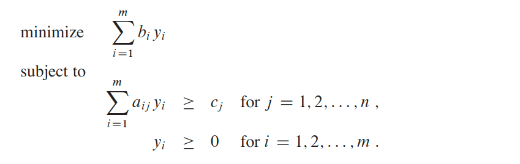

To form the dual, we change the maximization to a minimization, exchange the roles of coefficients on the right-hand sides and the objective function, and replace each less-than-or-equal-to by a greater-than-or-equal-to. Each of the `m` constraints in the primal has an associated variable `y_i` in the dual, and each of the `n` constraints in the dual has an associated variable `x_j` in the primal.

#### Lemma 29.8 (Weak linear-programming duality)
Let `x` be any feasible solution to the primal linear program and let `y` be any feasible solution to the dual linear program. Then, we have:

`∑[j = 1 -> n](c_j * x_j) ≤ ∑[i = 1 -> m](b_i * y_i)`

#### Corollary
Let `x` be a feasible  solution to a primal linear program `(A, b, c)`, and let `y` be a feasible solution to the corresponding dual linear program. If:

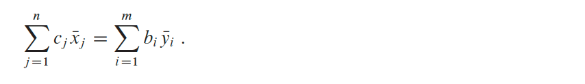

then `x` and `y` are optimal solutions to the primal and dual linear programs, respectively.

#### Theorem (Linear-programming duality)
Suppose that the last slack form of the primal is:

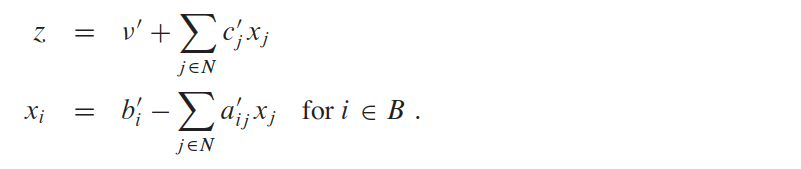

Suppose  that `simplex()` returns  values `x = (x_1, x_2, ..., x_n)` for  the  primal  linear program `(A, b, c)`. Let `N` and `B` denote the nonbasic and basic variables for the final slack form, let `c'` denote the coefficients in the final slack form, and let `y = (y_1, y_2, ..., y_n)` be defined as:

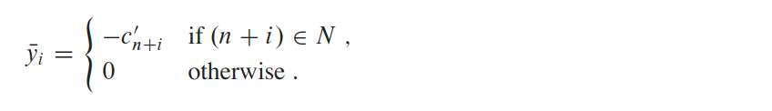

Then `x` is an optimal  solution  to  the  primal  linear  program, `y` is  an  optimal  solution  to  the  dual  linear program, and:


### The initial basic feasible solution
A  linear  program  can  be  feasible,  yet  the  initial  basic  solution  might  not  be feasible.  In order to determine whether a linear program has any feasible solutions, we will formulate an __auxiliary linear program `L`<sub>`aux`</sub>__.  For this auxiliary linear program, we can find (with a little work) a slack form for which the basic solution is feasible.

#### Lemma
Let `L` be a linear program in standard form, given as in. Let `x_0` bea new variable, and let `L`<sub>`aux`</sub> be the following linear program with `n + 1` variables:

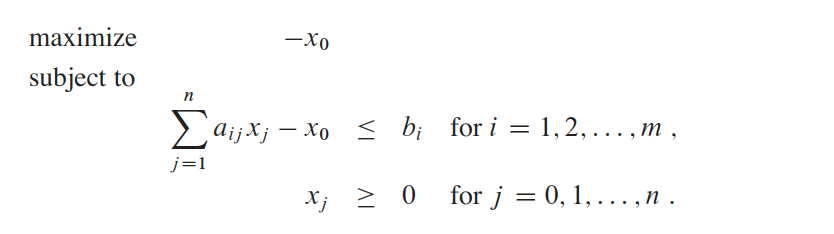

Then `L` is feasible if and only if the optimal objective value of `L`<sub>`aux`</sub> is `0`.

### Theorem (Fundamental theorem of linear programming)
Any linear program `L`, given in standard form, either

1. has an optimal solution with a finite objective value
2. is infeasible, or
3. is unbounded.

If `L` is infeasible, `simplex()` throws `“infeasible!”` exception . If `L` is unbounded, `simplex()` returns `“unbounded!”` Otherwise, `simplex()` returns an optimal solution with a finite objective value.

### Some simplex example
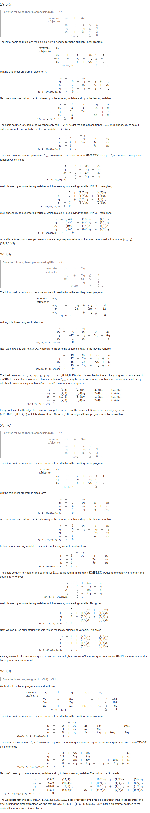

---

#### [MIT: LP, reductions, Simplex](https://www.youtube.com/watch?v=WwMz2fJwUCg)
