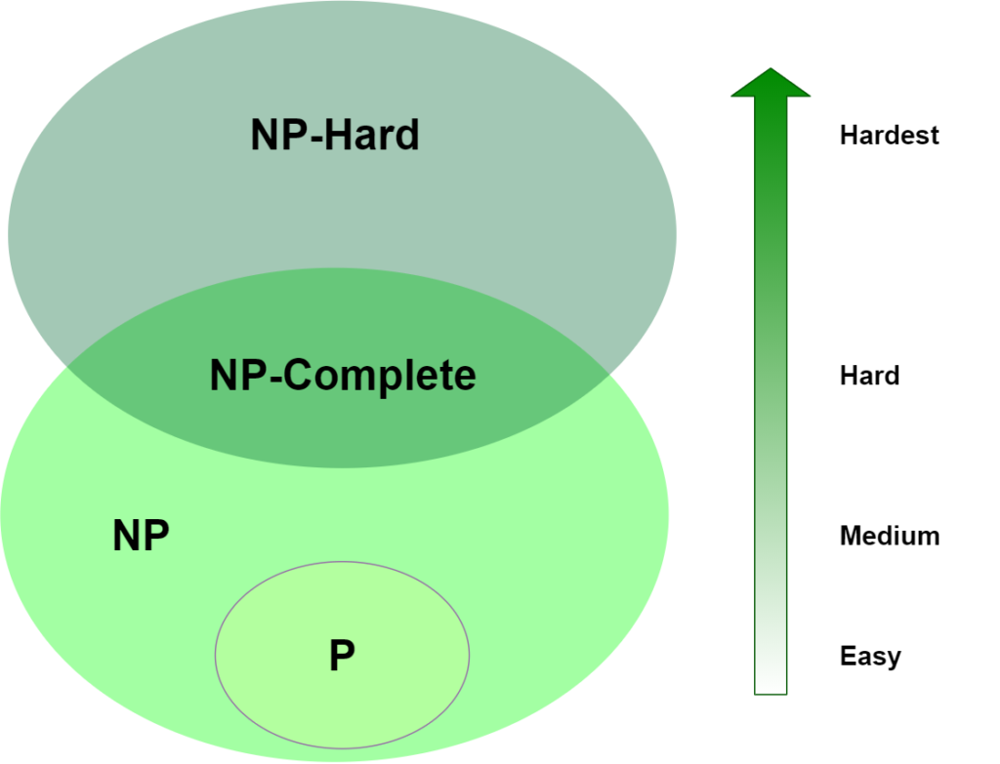
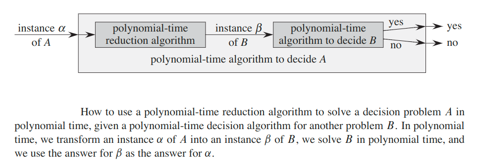

## NP-Completeness
We have two classes of algorithms:
1. __Deterministic__ - for a given particular input, the computer will always produce the same output going through the same states

    Example can be any algorithm implemented in this repo using typescript.

2. __Nondeterministic__ - for the same input, the compiler may produce different output in different runs. In fact non-deterministic algorithms can’t solve the problem in polynomial time and can’t determine what is the next step.

    Example: Search an element `x` on `A[1...n]` where `n ≥ 1`, on successful search return `j` if `a[j]` is equals to `x` otherwise return `0`.

    ```
    j = choice(a, n); // Chooses any value randomly from the set A.

    if(A[j]==x) then
       write(j);
       success(); // Solution is successful and current thread terminates.

    write(0);
    failure(); // Denotes the unsuccessful solution.
    ```

    > Nondeterministic algorithms are used to record the recent success.


Almost all the algorithms we have studied thus far have been polynomial-time algorithms: on inputs of size `n`, their worst-case running time is `O(n`<sup>`k`</sup>`)` for some constant `k`.

Whether all problems can be solved in polynomial time. The answer is no. For example, there are problems, such as __Turing’s “Halting Problem”__ (the problem of determining, from a description of an arbitrary computer program and an input, whether the program will finish running, or continue to run forever) that cannot be solved by any computer, no matter how much time we allow.

Generally, we think of problems that are solvable by polynomial-time algorithms as being __easy__, and problems that require super polynomial time as being __hard__.

#### There are three classes of problems:
1. __P__ -  consists  of  those  problems  that  are  solvable  in  polynomial  time. More specifically,  they are problems that can be solved in time `O(n^k)` for some constant `k`, where `n` is the size of the input to the problem.

    > P = {Polynomial time deterministic algorithms}

2. __NP__ - consists of those problems that are “verifiable” in polynomial time. What do we mean by a problem being verifiable?  If we were somehow given a _“certificate”_ of a solution, then we could verify that the certificate is correct in time polynomial in the size of the input to the problem.

    > NP = {Polynomial time non-deterministic algorithms}

3. __NP-Hard__ - are the hardest problems overall. A problem `L` is in NP-Hard if:

    * Every problem in NP is reducible to `L` in polynomial time.

4. __NPC (NP-Complete)__ - are the hardest problems in NP set. A problem `L` is in NPC if:

    * `L` is in NP (`L ∈ NP`).
    * `L` is in NP-Hard (`L ∈ NP-Hard`).

#### Properties:
* __`P ⊆ NP`__ (any problem in P is also in NP), since if a problem is in P then we can solve it in polynomial time without even being supplied a certificate.
* If any NP-complete  problem can be solved in polynomial  time,  then every problem  in NP has a polynomial-time algorithm.

### Euler diagram
Euler diagram for P, NP, NP-complete, and NP-hard set of problems. The left side is valid under the assumption that `P ≠ NP`, while the right side is valid under the assumption that `P = NP` (except that the empty language and its complement are never NP-complete, and in general, not every problem in P or NP is NP-complete)




### Decision problems vs. optimization problems
Many problems of interest are __optimization problems__, in which each feasible solution has an associated value, and we wish to find a feasible solution with the best value. For example a problem of finding a single-source shortest path in a directed graph.

NP-completeness applies directly not to optimization problems, however, but to __decision problems__, in which the answer is simply “yes” or “no” (or, more formally, `1` or `0`).

We usually can cast a given optimization problem as a related decision  problem  by imposing a bound  on the value to be optimized.   For example, a decision problem related to SHORTEST-PATH is PATH:  given a directed graph `G`, vertices `u` and `v`, and an integer `k`, does a path exist from `u` to `v` consisting of at most `k` edges?

The relationship between an optimization problem and its related decision problem  works  in  our  favor  when  we  try  to  show  that  the  optimization  problem  is“hard.”  That is because the decision problem is in a sense “easier,” or at least “no harder.” As a specific example, we can solve PATH by solving SHORTEST-PATH and then comparing the number of edges in the shortest path found to the value of  the  decision-problem  parameter `k`.   In  other  words,  if  an  optimization  problem is easy, its related decision problem is easy as well.  Stated in a way that has more relevance  to NP-completeness,  if we can provide  evidence  that a decision problem is hard, we also provide evidence that its related optimization problem is hard.  Thus, even though it restricts attention to decision problems, the theory of NP-completeness often has implications for optimization problems as well.

### Reductions
Let us consider a decision problem `A`, which we would like to solve in polynomial time. We call the input to a particular problem an instance of that problem; for example, in PATH, an instance would be a particular graph `G`, particular vertices `u` and `v` of `G`, and a particular integer `k`.

Now suppose that we already know how to solve a different decision problem `B` in polynomial time.
 
Finally, suppose that we have a procedure that transforms any instance `α` of `A` into some instance `β` of `B` with the following characteristics:
* The transformation takes polynomial time.
* The answers are the same. That is, the answer for `α` is “yes” if and only if the answer for `β` is also “yes.”

We  call  such  a  procedure  a  polynomial-time __reduction algorithm__.



By “reducing” solving problem `A` to solving problem `B`, we use the “easiness” of `B` to prove the “easiness” of `A`.

Recalling that NP-completeness is about showing how hard a problem is rather than how easy it is, we use polynomial-time reductions in the opposite way to show that a problem is NP-complete.

Let us take the idea a step further, and show how we could use polynomial-time reductions to show that no polynomial-time algorithm can exist for a particular problem `B`.  Suppose we have a decision problem `A` for which we already know that no polynomial-time algorithm can exist. (Let us not concern ourselves for now with how to find such a problem `A`.)  Suppose further that we have a polynomial-time reduction transforming instances of `A` to instances of `B`. Now we can use a simple proof by contradiction to show that no polynomial-time  algorithm  can  exist  for `B`.   Suppose  otherwise;  i.e.,  suppose  that `B` has a polynomial-time  algorithm.   Then,  using  the  reduction method,  we would have a way to solve problemAin polynomial time, which contradicts our assumption that there is no polynomial-time algorithm for `A`.

Because the technique of reduction relies on having a problem already known to be  NP-complete  in  order  to  prove  a different  problem  NP-complete,  we need  a “first” NP-complete problem. The problem we shall use is the _SAT_ problem, in which we are given a boolean combinational circuit composed of AND, OR, and NOT gates, and we wish to know whether there exists some set of boolean inputs to this circuit that causes its output to be `1`.

### Satisfiability Problem
Boolean Satisfiability or simply __SAT__ is the problem of determining if a Boolean formula is satisfiable or unsatisfiable.
* __Satisfiable__ : If the Boolean variables can be assigned values such that the formula turns out to be `TRUE`, then we say that the formula is satisfiable.
* __Unsatisfiable__ : If it is not possible to assign such values, then we say that the formula is unsatisfiable.

__Conjunctive Normal Form (CNF)__ is a conjunction (`AND (__V__)`) of clauses, where every clause is a disjunction (`OR (__Ʌ__)`).

Now, 2-SAT limits the problem of SAT to only those Boolean formula which are expressed as a CNF with every clause having only __2 terms__ (also called __2-CNF__).

`F = (A_1 V B_1) Ʌ (A_2 V B_2) Ʌ ... Ʌ (A_m V B_m)`

Where:
* formula = AND of clauses
* clause = OR of 2 literals
* literal ∈ `{A_1, B_1, A_3, B_2, ...}`.

Thus, Problem of __2-Satisfiabilty (2-SAT)__ can be stated as: Given CNF with each clause having only 2 terms, is it possible to assign such values to the variables so that the CNF is `TRUE`?

#### Theorem
The Satisfiability of boolean formulas is an NP-Complete problem.

#### Theorem
Satisfiability of boolean formulas in `n`-conjunctive normal form is NP-complete.

### Proving
How to prove a problem `L` is an NP-Complete:
1. `L ∈ NP` via nondeterministic algorithm or certificate + verifier
2. Reduce from known NP-complete problem `K` to `L`.

    1. Polynomial-time conversion from `K` inputs to `L` inputs.
    2. If `K` answer is "YES", then `L` answer is "YES".
    3. If `L` answer is "YES", then `K` answer is "YES".

### NP-Complete Problems
1. __Super Mario Bros.__
2. __3-Dimensional Matching__ - Given disjoint sets `X`, `Y`, and `Z`, each of `n` elements and triples `T ⊆ X × Y × Z` is there a subset `S ⊆ T` such that each element `∈ X ∪ Y ∪ Z` is in exactly one `s ∈ S`?
3. __Subset Sum__ - Given n integers `A = {a_1, a_2,..., a_n}` and a target sum
`t`, is there a subset `S ⊆ A` such that: `∑(S) = ∑[a ∈ S](a) = t`?
4. __Partition__ - Given `A = {a_1, a_2,..., a_n}`, is there a subset `S ⊆ A` such that: `∑(S) = ∑(A\S) = 1/2 * ∑(A)`.
    
    It is a special case of the Subset Sum problem, where we set `t = 1/2 * ∑(A)`.

5. __Rectangle Packing__ - Given a set of rectangles `R_i` and a target rectangle `T`, can we pack the rectangles in `T` such that there is no overlap? Note that sum of the area of the rectangles `R_i` is equivalent to the area of the target rectangle or `∑`<sub>`i`</sub>`(R_i) = T`.
6. __Jigsaw Puzzles__ - Given square tiles with no patterns, can these tiles be arranged to fit a target rectangular shape? Note that the tiles can have a side tab, pocket, or boundary, but tabs and pockets must have matching shapes.
7. __4-Partition__ - Given n integers `A = {a_1, a_2,..., a_n} ∈ (t/5, t/3)`, is there a partition into `n/4` subsets of `4` elements, each with the same sum `t = ∑(A/(n/4))`?

The proof of NP-Completeness of above problems can be found __[here](https://ocw.mit.edu/courses/electrical-engineering-and-computer-science/6-046j-design-and-analysis-of-algorithms-spring-2015/lecture-notes/MIT6_046JS15_lec16.pdf)__.

Some more NP-Complete problems:

8. __Hamiltonian cycles__ - __hamiltonian cycle__ of an undirected graph `G = (V, E)` is a simple cycle that contains each vertex in `V`. A graph that contains a hamiltonian cycle is said to be __hamiltonian__; otherwise, it is __non-hamiltonian__.
 
    The problem is: "Does a graph `G` have a hamiltonian cycle?"

9. __The clique problem__ - A __clique__ in an undirected graph `G = (V, E)` is a subset `V' ⊆ V` of vertices, each pair of which is connected by an edge in `E`. In other words, a clique is a complete subgraph  of `G`. The __size__ of a clique  is the number  of vertices  it  contains.
    
    The clique problem is the optimization problem of finding a clique of maximum size in `G`. As a decision problem, we ask simply whether a clique of a given size `k` exists in the graph.

10. __The vertex-cover problem__ - A __vertex cover__ of an undirected graph `G = (V, E)` is a subset `V' ⊆ V` such that if `(u, v) ∈ E`, then `u ∈ V'` or `v ∈ V'` (or both).  That is, each vertex “covers” its incident edges (two edges are _incident_ if they share a common vertex), and a vertex cover for `G` is a set of vertices that covers all the edges in `E`. The __size__ of a vertex cover is the number of vertices in it.

    The vertex-cover problem is to find a vertex cover of minimum size in a given graph. Restating  this  optimization  problem  as  a  decision  problem,  we  wish  to determine whether a graph has a vertex cover of a given size `k`.

11. __The traveling-salesman problem__ - In the traveling-salesman problem, a salesman must visit `n` cities. Modeling the problem as a complete graph  with `n` vertices,  we  can  say  that  the  salesman  wishes  to  make  a __tour__, or hamiltonian cycle, visiting each city exactly once and finishing at the city he starts from.  The salesman incurs a nonnegative integer cost `c(i, j)` to travel from city `i` to city `j`, and the salesman wishes to make the tour whose total cost is minimum, where the total cost is the sum of the individual costs along the edges of the tour.

12. __Independent set__ - of a graph `G = (V, E)` is a subset `V' ⊆ V` of vertices such that each edge in `E` is incident on at most one vertex in `V'`. 

    The independent-set problem is to find a maximum-size independent set in `G`.

13. __The subgraph-isomorphism problem__ - takes two undirected graphs `G1` and `G2`, and it asks whether `G1` is isomorphic to a subgraph of `G2`. 

---

#### [NP-Hard and NP-Complete Problems](https://www.youtube.com/watch?v=e2cF8a5aAhE)

#### [NP-Hard Graph Problem - Clique Decision Problem](https://www.youtube.com/watch?v=qZs767KQcvE)

#### [MIT: Complexity: P, NP, NP-completeness, Reductions](https://www.youtube.com/watch?v=eHZifpgyH_4)
