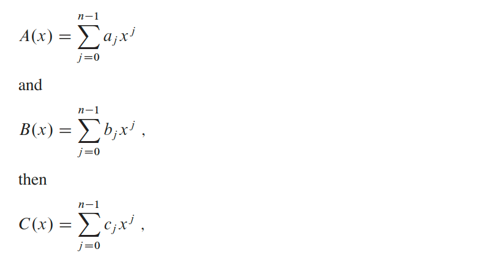
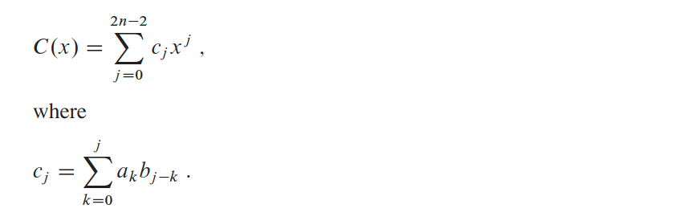
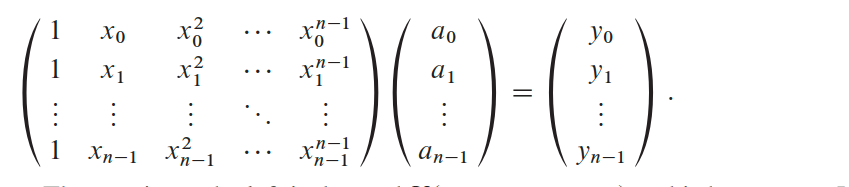
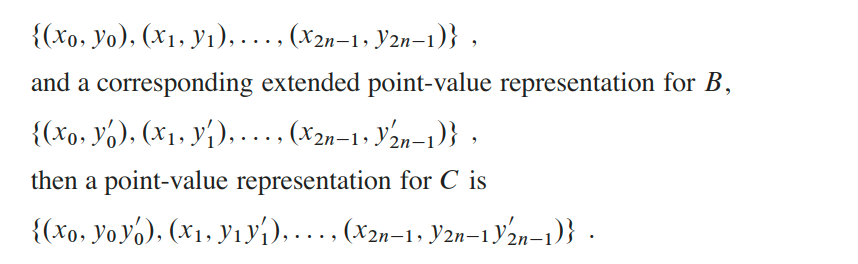

## Polynomials and the FFT
A __polynomial__ in the variable `x` over an algebraic field `F` represents a function `A(x)` as a formal sum:

`a``0`` + a``1`` * x + a``2`` * x``2`` + ... + a``n-1`` * x``n-1`

We call  the  values `a0, a1, ... a_(n-1)` the __coefficients__ of  the  polynomial.   The coefficients are drawn from a field `F`, typically the set `ℂ` of complex numbers.  A polynomial `A(x)` has __degree__ `k` if its highest  nonzero coefficient  is `a``k`;  we write that `degree(A) = k`.  Any integer strictly greater than the degree of a polynomial is a degree-bound of that polynomial.

### Operations
We can define a variety  of  operations  on polynomials:
1. __Polynomial addition__, if `A(x)` and `B(x)` are polynomials of degree-bound `n`, their sum is a polynomial `C(x)`, also of degree-bound `n`, such that `C(x) = A(x) + B(x)` for all `x` in the underlying field. Where `c_j = a_j + b_j` for `j = 0, 1, ..., n - 1`.

    

    `A(x) = 6x^3 + 7x^3 - 10x + 9`, `B(x) = -2x^3 + 4x - 5`, then `C(x) = 4x^3 + 7x^2 - 6x + 4`

2. __Polynomial multiplication__ if `A(x)` and `B(x)` are polynomials  of  degree-bound `n`, their product `C(x)` is a polynomial  of degree-bound `2n - 1` such that `C(x) = A(x)B(x)` for all `x` in the underlying  field.   You probably  have multi-plied polynomials before, by multiplying each term in `A(x)` by each term in `B(x)` and  then  combining  terms  with  equal  powers.

    

    `A(x) = 6x^3 + 7x^3 - 10x + 9`, `B(x) = -2x^3 + 4x - 5`, then `C(x) = -12x^6 - 14x^5 + 44x^4 - 20x^3 - 75x^2 + 86x - 45`

    Note that `degree(C) = degree(A) + degree(B)`, implying that if `A` is a polynomial of degree-bound `n_a` and `B` is a polynomial of degree-bound `n_b`, then `C` is a polynomial of degree-bound `n_a + n_b = 1`.  Since a polynomial of degree-bound `k` is also a polynomial of degree-bound `k + 1`, we will normally say that the product polynomial `C` is a polynomial of degree-bound `n_a + n_b`.

### Representations
#### Coefficient representation
A coefficient representation of  a  polynomial `A(x)` of  degree-bound `n` is a vector  of coefficients `a = (a``0``, a``1``, ..., a``n-1``)`.

The coefficient  representation  is convenient  for  certain  operations  on polynomials.  For example, the operation of evaluating the polynomial `A(x)` at a given point `x0` consists of computing the value of `A(x0)`.  We can evaluate a polynomial in‚ `θ(n)` time using `Horner’s rule`:

`A(x``0``) = a``0`` + x``0``(a``1`` + x``0``(a``2`` + ... + x``0``(a``n-2`` + x``0``(a``n-1``))...))`

The resulting coefficient vector `c = a * b`, is also called the __convolution__ of the input vectors `a` and `b`, denoted `c = a ⓧ b`.

#### Point-value representation
A __point-value representation__ of a polynomial `A(x)` of degree-bound `n` is a set of `n` __point-value pairs__

`{(x``0``, y``0``), (x``1``, y``1``), ..., (x``n-1``, y``n-1``)}`

such that all of the `x``k` are distinct and `y``k`` = A(x``k``)`

for `k = 0, 1, ..., n-1`. A polynomial has many different point-value representations, since we can use any set of `n` distinct points `x``0``, x``1``, ..., x``n-1` as a basis for the representation.

Computing  a  point-value  representation  for  a  polynomial  given  in  coefficient form  is  in principle  straightforward,  since  all  we have  to do  is select `n` distinct points `x``0``, x``1``, ..., x``n-1` and then evaluate `A(x``k``)` for `k = 0, 1, ..., n-1`. With Horner’s method, evaluating a polynomial at `n` points takes time `θ(n)`.

The  inverse  of  evaluation—determining  the  coefficient  form  of  a  polynomial from a point-value representation—is __interpolation__.

#### Theorem (Uniqueness of an interpolating polynomial)
For any set `{(x``0``, y``0``), (x``1``, y``1``), ..., (x``n-1``, y``n-1``)}` of `n` point-value  pairs such that all the `x``k` values are distinct, there is a unique polynomial `A(x)` of degree-bound `n` such that `y``k`` = A(x``k``)` for `k = 0, 1, ..., n-1`.

Proof: Equation `y``k`` = A(x``k``)` is equivalent to the matrix equation:

The matrix on the left is denoted `V(x``0``, x``1``, ..., x``n-1`) and is known as a __Vandermonde matrix__.

This matrix has determinant and therefore it is invertible (that is non-singular) if the `x``k` are distinct. Thus, we can solve for the coefficients `a``j` uniquely given the point-value representation:

`a = V(x``0``, x``1``, ..., x``n-1`)`-1``y`

Using the LU decomposition algorithms, we can solve these equations in time `θ(n^3)`. A faster algorithm for `n`-point interpolation is based on __Lagrange’s formula__ which takes `θ(n^2)`.

The point-value representation is convenient for multiplying polynomials. We must face the problem, however, that `degree(C)  = degree(A) + degree(B)`;if `A` and `B` are of degree-bound `n`,then `C` is of degree-bound `2n`.  A standard point-value representation for `A` and `B` consists of `n` point-value pairs for each polynomial.  When we multiply these together, we get `n` point-value pairs, but we need `2n` pairs to interpolate a unique polynomial `C` of degree-bound `2n`. We must therefore begin with _“extended”_ point-value representations for `A` and for`B` consisting of `2n` point-value pairs each. Given an extended point-value representation for `A`,

Given two input polynomials in extended point-value form, we see that the time to multiply them to obtain the point-value form of the result is `θ(n)`, much less than the time required to multiply polynomials in coefficient form.

### Roots representation
Any polynomial is uniquely determined by the set of its roots. Any plynomial of degree `n` has `n` roots.

If `r``0``, r``0``, ..., r``0` are roots of a polynomial `A(x)`, then `A(x)` can be represented as:

`c(x - r``0``)(x - r``1``) ... (x - r``n-1``)`

The problem with roots representation is that it is impossible to find roots of a polynomial of degree grater that `4`. There is no such algorithm. That is why we say it takes infinite time to find roots.

Addition is very hard to implement for root representation.

### Summary
| Algorithms | Coefficient | Roots | Point-value |
|-|:-:|:-:|:-:|
| __Evaluation__ | `θ(n)` | `θ(n)` | `θ(n^2)` |
| __Addition__ | `θ(n)` | `∞` | `θ(n)` |
| __Multiplication__ | `θ(n^2)` | `θ(n)` | `θ(n)` |

As we can see the best representations to work with are coefficient and point-value representations.

In order to implement all operation in less than `θ(n^2)` time, we meed as algorithm that could convert coefficient representation to point-value representation and vise-versa. This algorithm is called __Fast Fourier Transformation (FFT)__ and it runs in `θ(n * lgn)`.

### Fast multiplication of polynomials in coefficient form
Given the FFT, we have the following `θ(n * lgn)`-time procedure for multiplying two polynomials `A(x)` and `B(x)` of degree-bound `n`, where the input and output representations are in coefficient form. We assume that `n` is a power of `2`; we can always meet this requirement by adding high-order zero coefficients.

1. _Double degree-bound_: Create coefficient representations of `A(x)` and `B(x)` as degree-bound `2n` polynomials by adding `n` high-order zero coefficients to each.
2. _Evaluate_: Compute point-value representations of `A(x)` and `B(x)` of length `2n` by applying the FFT of order `2n` on each polynomial.  These representations contain the values of the two polynomials at the `(2n)`th roots of unity.
3. _Pointwise multiply_: Compute a point-value representation  for the polynomial `C(x) = A(x)*B(x)` by multiplying these values together pointwise. This representation contains the value of `C(x)` at each `(2n)`th root of unity.
4. Interpolate: Create the coefficient  representation  of the polynomial `C(x)` by applying the FFT on `2n` point-value pairs to compute the inverse __discrete Fourier transform (DFT)__.

Steps (1) and (3) take time `θ(n)`, and steps (2) and (4) take time `θ(n * lgn)`.

#### Theorem
We can multiply two polynomials of degree-bound `n` in time‚ `θ(n * lgn)`, with both the input and output representations in coefficient form.

Read more about FFT __[here](https://cp-algorithms.com/algebra/fft.html)__.

### Application
Some of the important applications of the FFT include:
* Fast large-integer and polynomial multiplication
* Efficient matrix–vector multiplication for Toeplitz, circulant and other structured matrices
* Filtering algorithms (see overlap–add and overlap–save methods)
* Fast algorithms for discrete cosine or sine transforms (e.g. fast DCT used for JPEG and MPEG/MP3 encoding and decoding)
* Fast Chebyshev approximation
* Solving difference equations
* Computation of isotopic distributions.
