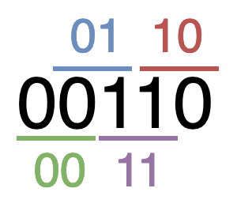
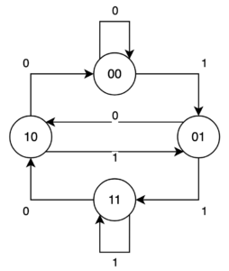
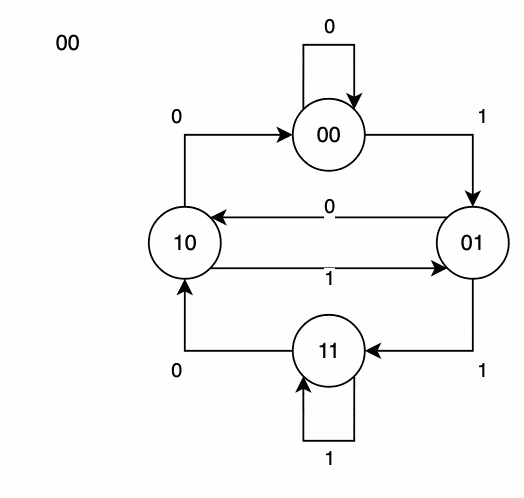

# Optimization Methods
## Max Flow Problem
`/data-structures/flow-network`

## Symmetric positive-definite matrices and least-squares approximation
Symmetric positive-definite matrices are non-singular, and we can perform LU decomposition on them without having to worry about dividing by `0`.

> About how to to do LU decomposition see `/data-structures/matrix`.

#### Lemma
Any positive-definite matrix is nonsingular.

the `k`th __leading submatrix__ of `A`to be the matrix `A_k` consisting  of the intersection  of the first `k` rows and first `k` columns of `A`.

#### Lemma
If `A` is a symmetric positive-definite matrix, then every leading submatrix of `A` is symmetric and positive-definite.

### Application
One important application of symmetric positive-definite matrices arises in fitting curves to given sets of data points. Suppose that we are given a set of `m` data points:

`(x_1, y_1), (x_2, y_2), ..., (x_m, y_m)`.

where we know that the `y_i` are subject to measurement errors.  We would like to determine a function `F(x)` such that the approximation errors:

`Ƞ = F(x_i) - y_i` __(*)__

are small for `i = 1,2, ..., m`. The form of the function `F` depends on the problem at hand. Here, we assume that it has the form of a linearly weighted sum

`F(x) = ∑[j = 1 -> n](c_i * f_i(x))`

where the number of summands `n` and the specific basis functions `f_j` are chosen based on knowledge of the problem at hand.  A common choice is `f_i(x) = x``j - 1`, which means that:

`F(x) = c_1 + c_2 * x + c_3 + x^2 + ... + c_n * x^(n - 1)`

is a polynomial of degree `n - 1` in `x`. Thus, given `m` data points `(x_1, y_1), (x_2, y_2), ..., (x_m, y_m)`, we wish to calculate `n` coefficients `c_1, c_2, ..., c_n` that minimize the approximation errors `Ƞ_1, Ƞ_2, ..., Ƞ_m`.

[This](http://staff.ustc.edu.cn/~csli/graduate/algorithms/book6/chap31.htm) article have more details on the topic.

Watch [this](https://www.youtube.com/watch?v=AmQcoopBUTk) video to find out more about the __Least Square Method__.

# The de Bruijn Sequence
A de Bruijn sequence is a mathematical construct. Given an alphabet with `k` elements, a __de Bruijn sequence__ of order `n` is a sequence in which every possible string of length `n` from this alphabet appears exactly once.

As such, a de Bruijn sequence is a single continuous sequence of symbols from our alphabet that contains each of these strings exactly once and nothing else.

For example, a de Bruijn sequence of order 2 for binary numbers would be:

Considering the initial and final “0” symbols as being the same, we can see that this sequence is actually cyclical. That is, it can repeat forever, and we can start from anywhere in it, and it’ll still be the same. For example, this can be considered as `….00110011001100110011001100…..` as an infinite cyclical de Bruijn sequence.

### Application
Imagine we have a lock with 10 unique buttons and a passcode that we know is 4 digits long, and it will unlock the instant we enter the correct 4 digits.

If we wanted to brute force this lock, we could start entering codes starting from “0000” and working our way up to “9999”. This will work but is inefficient – it would take up to 10,000 combinations which means up to 40,000 key presses.

Alternatively, we can generate a de Bruijn sequence of order 4 for an alphabet of size 10. This is a string that has every unique combination of symbols in it. As such, we can just start entering this sequence, and at some point, it’s guaranteed to contain the correct code.

The very fact that every code overlaps the previous one means that this sequence of key presses is guaranteed to be significantly shorter than just working our way from the start.

### Generating de Bruijn Sequences
We start by generating a set of nodes. If we’re working with a de Bruijn sequence of order `k` then each node contains a unique string of length `k-1` from our alphabet. For example, given our alphabet of binary digits and a de Bruijn sequence of _order 3_, we would generate every unique string of length 2: `00`, `01`, `10`, `11`.

Having done this, we can then build a directed graph. Every node has an edge leaving it that joins it to the node that would be next in the de Bruijn sequence. For example, node “01” would join to “10” using an edge of “0”, and to “11” using an edge of “1”.

By definition, every one of our nodes will have one edge leaving it for every symbol in our alphabet, and an equally will have one edge entering it for every symbol in our alphabet. This means that we will always have an even number of edges for every node. This in turn means that we always have an _Euler Path_ (a path that visites every edge once) in our graph.

We can then make use of this to generate our de Bruijn sequence. We pick a node as our start, then follow the Euler Path throughout the entire graph, adding the appropriate symbol from that edge. Once we’ve traced the entire path we will have our de Bruijn sequence.

For example, if we start at node “00” and follow edges “0”, “1”, “0”, “1”, “1”, “1”, “0”, “0” then we will have generated our sequence:

Hierholzer’s algorithm is a technique that can be used to discover an Euler path in a graph. That is a path that traverses every edge on the graph exactly once and ends up on the same node that it started. If we can do this, then we can programmatically achieve what we discussed above – traverse every edge in our graph and add it to our sequence until we have generated the entire de Bruijn sequence.

Hierholzer’s algorithm relies on the fact that our graph has an equal number of entry and exit vertices from every node, and recursively builds circuits up until we have the entire path.

#### [Watch this wideo about de Bruijn Sequence](https://www.youtube.com/watch?v=FpeBsBwJMbc)

---

#### [Read for more details about Positive Definitive Matrix](http://slpl.cse.nsysu.edu.tw/chiaping/la/pdm.pdf).

#### [Design and Analysis of Algorithms by MIT](https://ocw.mit.edu/courses/electrical-engineering-and-computer-science/6-046j-design-and-analysis-of-algorithms-spring-2015/)

#### [Introduction to Algorithms by Thomas H. Cormen, Charles E. Leiserson, and Ronald L. Rivest](http://staff.ustc.edu.cn/~csli/graduate/algorithms/book6/partvii.htm)
