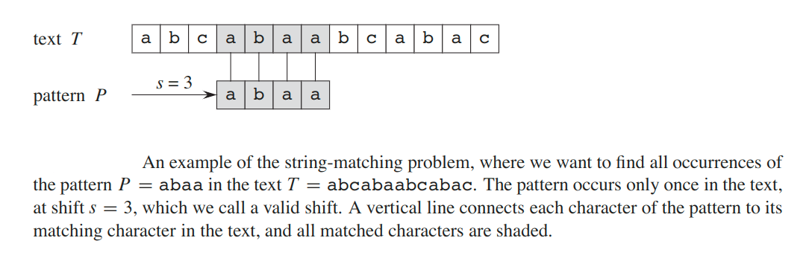
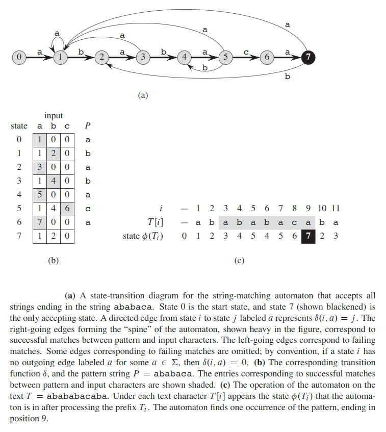
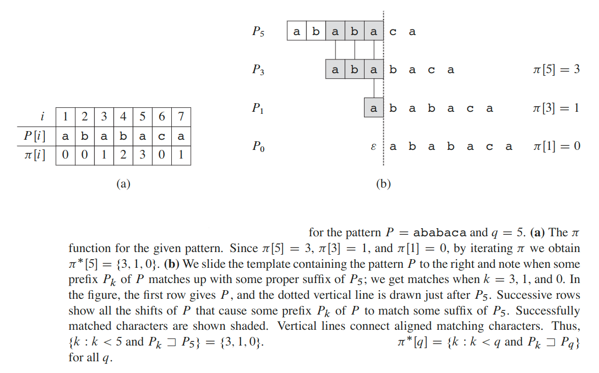

## String Matching
Text-editing programs frequently need to find all occurrences  of a pattern in the text. Typically, the text is a document being edited, and the pattern searched for is a particular word supplied by the user. Efficient algorithms for this problem—called __“string matching”__—can greatly aid the responsiveness of the text-editing program.  Internet search engines also use them to find Web pages relevant to queries.

We  formalize  the  string-matching  problem  as  follows.    We  assume  that  the __text__  is  an  array `T[1 ... n]` of  length `n` and  that  the  __pattern__  is  an  array `P[1 ... m]` of  length `m` n.   We  further  assume  that  the  elements  of `P` and `T` are  characters drawn from a finite __alphabet__ `∑`.  For example,  we may have `∑ = {0, 1}` or `∑ = {a, b, ..., z}`.  The character arrays `P` and `T` are often called __strings__ of characters.

We say that pattern `P` __occurs with shift `s`__ in text `T` (or, equivalently, that pattern `P` __occurs beginning at position `s + 1`__ in text `T`) if `0 ≤ s ≤ n-m` and `T[s+1 ... a+m] = P[1 ... m]` (that is, if `T[s + j] = P[j]`, for `1 ≤ j ≤ m`). If `P` occurs with shift `s` in `T`, then we call `s` a __valid shift__; otherwise, we call `s` an __invalid shift__.The __string-matching problem__ is the problem of finding all valid shifts with which a given pattern `P` occurs in a given text `T`.

The process of finding all valid shifts is called __matching__.

We  denote  by `⅀` the  set  of  all  finite-length  strings  formed using  characters  from  the  alphabet `∑`.   In  this  chapter,  we consider  only  finite-length strings.  The zero-length __empty string__, denoted `Ɛ`, also belongs to `⅀`. The length  of  a string `x` is denoted `|x|`.The __concatenation__ of  two strings `x` and `y`, denoted `xy`, has length `|x| + |y|` and consists of the characters from `x` followed by the characters from `y`.

We say that a string `w` is a __prefix__ of a string `x`, denoted `w ⊏ x`,if `x = wy` for some string `y ∈ ⅀`.  Note that if `w ⊏ x`, then `|w| ≤ |x|`.  Similarly, we say that a string `w` is a __suffix__ of a string `x`, denoted `w ⊐ x`, if `x = yw` for some `y ∈ ⅀`. As with a prefix, `w ⊐ x` implies `|w| ≤ |x|`. For example, we have `ab ⊏ abcca` and `cca ⊐ abcca`. The empty string `Ɛ` is both a suffix and a prefix of every string. For any strings `x` and `y` and any character `a`, we have `x ⊐ y` if and only if `xa ⊐ ya`.

#### Lemma (Overlapping-suffix lemma)
Suppose that `x`, `y`, and `z` are strings such that `x ⊐ z` and `y ⊐ z`.
* If `|x| ≤ |y|`, then `x ⊐ y`.
* If `|x| ≥ |y|`, then `y ⊐ x`.
* If `|x| = |y|`, then `x = y`.

We denote the `k`-character prefix `P[1 ... k]` of the pattern `P[1 ... m]` by `P_k`.  Thus, `P_0 = Ɛ` and `P_m = P = P[1 ... m]`. Similarly, we denote the `k`-character prefix of the text `T` by `T_k`.  Using this notation,  we can state the string-matching problem as that of finding all shifts `s` in the range `0 ≤ s ≤ n-m` such that `P ⊐ T``s+m`.

### The Rabin-Karp Algorithm
#### [Rabin-Karp Algorithm for Pattern Searching](https://www.geeksforgeeks.org/rabin-karp-algorithm-for-pattern-searching/)

#### [The Rabin-Karp Algorithm (YouTube)](https://www.youtube.com/watch?v=qQ8vS2btsxI)

### The Finite Automaton Algorithm
Many string-matching algorithms build a finite automaton — a simple machine for processing information—that scans the text string `T` for all occurrences of the pattern `P`.

A finite automaton `M`, is  a  5-tuple `(Q, q_0, A, ∑, δ)`, where:
* `Q` - is a finite set of __states__.
* `q_0 ∈ Q` is the __start state__.
* `A ⊆ Q` is a distinguished set of __accepting states__.
* `∑` is a finite __input alphabet__.
* `δ` is a function from `Q x ∑` into `Q`, called the __transition function__ of `M`.

The finite automaton begins in state `q_0` and reads the characters of its input string one at a time.  If the automaton is in state `q` and reads input character `a`, it moves (“makes a transition”) from state `q` to state `δ(q, a)`.

In order to specify the string-matching automaton corresponding to a given pattern `P[1...m]`, we first define an auxiliary function `σ`, called the __suffix function__ corresponding to `P`. The function `σ` maps `⅀` to `{0, 1, ..., m}` such that `σ(x)` is the length of the longest prefix of `P` that is also a suffix of `x`:

`σ(x) = max{k: P_k ⊐ x}`

The  suffix  function `σ` is  well  defined  since  the  empty  string `P_0 = Ɛ` is  a  suffix of every string. As examples,  for the pattern `P = ab`, we have `σ(Ɛ) = 0`, `σ(ccaca) = 1`, and `σ(ccab) = 2`.   For  a  pattern `P` of  length `m`, we have `σ(x) = m` if  and  only  if `P ⊐ x`. From  the  definition  of  the  suffix  function, `x ⊐ y` implies `σ(x) ≤ σ(y)`.

We define  the  string-matching  automaton  that  corresponds  to  a  given  pattern `P[1...m]` as follows:
* The state set `Q` is `{0, 1, ..., m}`. The start state `q_0` is state `0`, and state `m` is the only accepting state.
* The transition function `δ` is defined by the following equation, for any state `q` and character `a`:
    
    `δ(q, a) = σ(P``q``a)`

If the automaton is in state `q` and reads the next character `T[i+1] = a`,then we want the transition to lead to the state corresponding to the longest prefix of `P` that is a suffix of `T``i``a`, and that state is `σ(T``i``a)`. Because `P_q` is the longest prefix of `P` that is a suffix of `T_i`, the longest prefix of `P` that is a suffix of `T``i``a` is not only `σ(T``i``a)`, but  also `σ(P``q``a)`.

#### [Finite Automaton Algorithm for Pattern Searching](https://www.geeksforgeeks.org/finite-automata-algorithm-for-pattern-searching/)

#### [The Finite Automaton Algorithm (YouTube)](https://www.youtube.com/watch?v=njzrUYrCK0w)

### The Knuth-Morris-Pratt Algorithm
This algorithm avoids computing the transition function `δ` altogether, and its matching time is `θ(n)` using just an auxiliary function `π`, which we precompute from the pattern in time `θ(m)` and store in an array `π[1...m]`. The array `π` allows us to compute the transition function `δ` efficiently (in an amortized sense) “on the fly” as needed and that does not depend on `a ∈ ∑`.

The prefix  function `π` for  a pattern  encapsulates  knowledge  about  how  the  pattern matches against shifts of itself.  We can take advantage of this information to avoid testing useless shifts in the naive pattern-matching  algorithm  and to avoid precomputing the full transition function `δ` for a string-matching automaton.

Given a pattern `P[1...m]`, the __prefix function__ for the pattern `P` is the function `π: {1, 2, ..., m} -> {0, 1, ..., m-1}` such that:

`π[q] = max{k: k < q and P_k ⊐ P_q}`

That is, `π[q]` is the length of the longest prefix of `P` that is a proper suffix of `P_q`.

Example of `π`:
* For `"AAAA"`, `π = [0, 1, 2, 3]`.
* For `"ABCDE"`, `π = [0, 0, 0, 0]`.
* For `"AABAACAABAA"`, `π = [0, 1, 0, 1, 2, 0, 1, 2, 3, 4, 5]`.
* For `"AAABAAA"`, `π = [0, 1, 2, 0, 1, 2, 3]]`.

#### Complexity Analysis
We start by making some  observations  about `k`. 

1. `computePrefixFunction()` starts `k` at `0`,  and  the only  way that `k` increases is by the increment operation (`k++`), which executes at most once per iteration of the `for` loop. Thus, the total increase in `k` is at most `m - 1`. 
2. Since `k < q` upon entering the `for` loop and each iteration of the loop increments `q`, we always have `k < q`.  Therefore, the assignments of `π[q]` ensure that `π[q] < q` for all `q = 1, 2, ..., m`, which means that each iteration of the `while` loop decreases `k`.
3. `k` never becomes negative.

Putting these facts together, we see that the total decrease in `k` from the `while` loop is bounded from above by the total increase in `k` over all iterations of the `for` loop, which is `m - 1`. Thus, the `while` loop iterates at most `m - 1` times in all. So, the total time is `O(m + m - 1) = O(m)`.

These two procedures (`knuthMorrisPrattMatcher()` and `computePrefixFunction()`) have much in common, because both match a string against the pattern `P`: `knuthMorrisPrattMatcher()` matches the text `T` against `P`,and `computePrefixFunction()` matches `P` against itself. That is why the complexity analysis of these two functions are similar.

#### [The Knuth-Morris-Pratt Algorithm for Pattern Searching](https://www.educative.io/edpresso/what-is-the-knuth-morris-pratt-algorithm)

#### [The Knuth-Morris-Pratt Algorithm (YouTube)](https://www.youtube.com/watch?v=V5-7GzOfADQ)

The string-matching algorithms in this chapter and their preprocessing and matching times.
| __Algorithms__ | __Preprocessing time__ | __Matching time__ |
| :-: | :-: | :-: |
| Naive | `0` | `O((n - m + 1) * m)` |
| Rabin-Karp | `θ(m)` | `O((n - m + 1) * m)` |
| Finite Automation | `O(m * \|∑\|)` | `θ(n)` |
| Knuth-Morris-Pratt | `θ(m)` | `θ(n)` |

The total running time of each algorithm is the sum of the preprocessing and matching times. 

---

#### [MIT: String Matching](https://www.youtube.com/watch?v=NinWEPPrkDQ)
