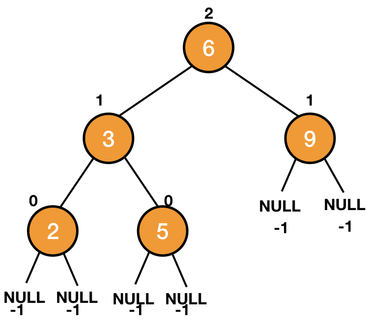
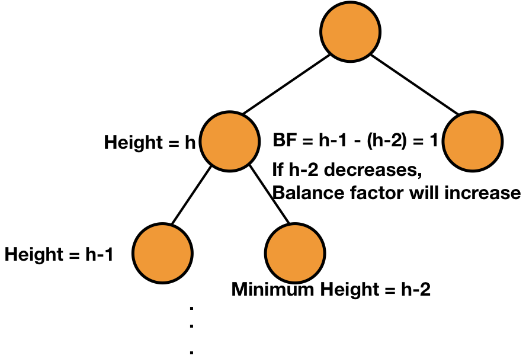
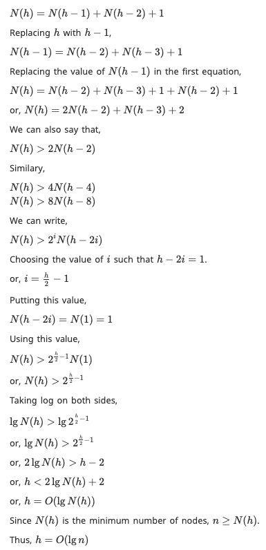
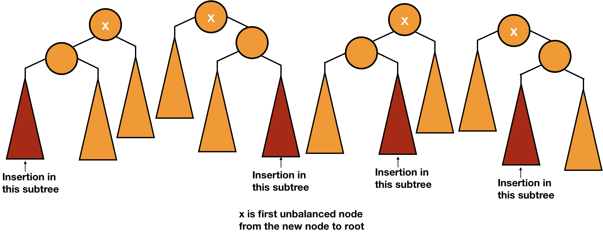

## AVL Tree
A binary tree is __balanced__ if for any two leaves the difference of the depth is at most __1__.

AVL (Adelson-Velskii and Landis) tree is a self-balancing binary search tree in which each node maintains an extra information called as balance factor whose value is either `-1`, `0` or `+1`.

Balance factor of a node in an AVL tree is the difference between the height of the left subtree and that of right subtree of that node.

> Balance Factor = (Height of Left Subtree - Height of Right Subtree) or (Height of Right Subtree - Height of Left Subtree)

The self balancing property of an AVL tree is maintained by the balance factor. The value of balance factor should always be `-1`, `0` or `+1`.

The height of `NIL` is `-1`.

__Theorem:__ An AVL tree with `n` nodes has height `O(lg n)`.

__Proof:__

Let `N(h)` be the minimum number of nodes in an AVL tree of height `h`. We can say that `N(0) = 1` and `N(1) = 2`.

Let there be a node with a height `h` and one of its child has a height of `h - 1`, then for an AVL tree, the minimum height of the other child will be `h - 2`. It means that the minimum number of nodes at height `h` will be the sum of the minimum number of nodes at heights `h - 1` and `h - 2 + 1` (the node itself).

### Insertion
Inserting a new node can cause the balance factor of some node to become `2` or `-2`. In that case, we fix the balance factors by use of rotations.

There can be __4 cases__ of __insertion__ & __deletion__:
* Outside Cases (require single rotation)
    * Insertion into left subtree of left child of `x`.
    * Insertion into right subtree of right child of `x`.
* Inside Cases (require double rotation)
    * Insertion into right subtree of left child of `x`.
    * Insertion into left subtree of right child of `x`.

### Deletion
In deletion also, we delete the node to be deleted in the same way as we do with a normal binary search tree. After that, we fix the unbalance of any ancestor node with suitable rotations.

The only thing is that unlike insertion, it might be possible that the unbalance propagates above the tree in deletion which makes us rebalance the ancestor nodes.

### AVL Tree vs Red-Black Tree
* AVL trees provide _faster lookups_ than Red Black Trees because they are more strictly balanced.
* Red Black Trees provide _faster insertion and removal_ operations than AVL trees as fewer rotations are done due to relatively relaxed balancing. But the theoretical asymptotic complexity for both of them are the same. They differ by a constant in performance in practice.
* AVL trees store balance factors or heights with each node, thus requires storage for an integer per node whereas Red Black Tree requires only _1_ bit of information per node.
* Red Black Trees are used in most of the language libraries like `map`, `multimap`, `multiset` in `C++` whereas AVL trees are used in _databases_ where faster retrievals are required.

---

#### [Read More](https://www.codesdope.com/course/data-structures-avl-trees/)
