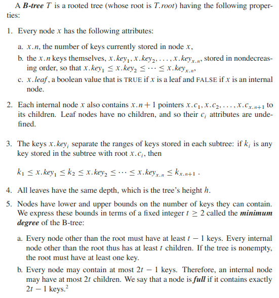
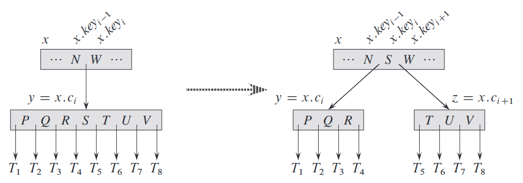
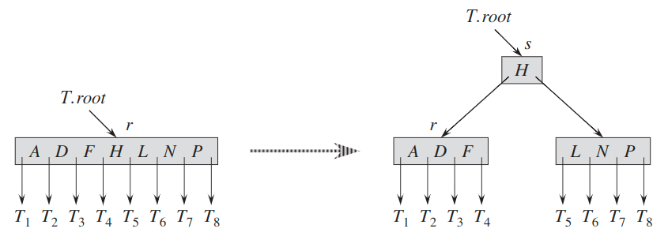
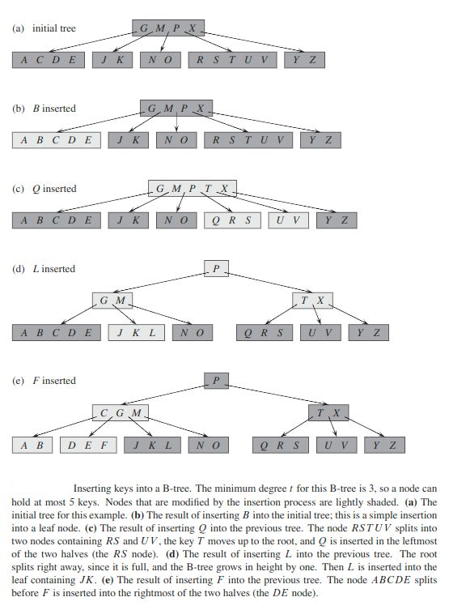
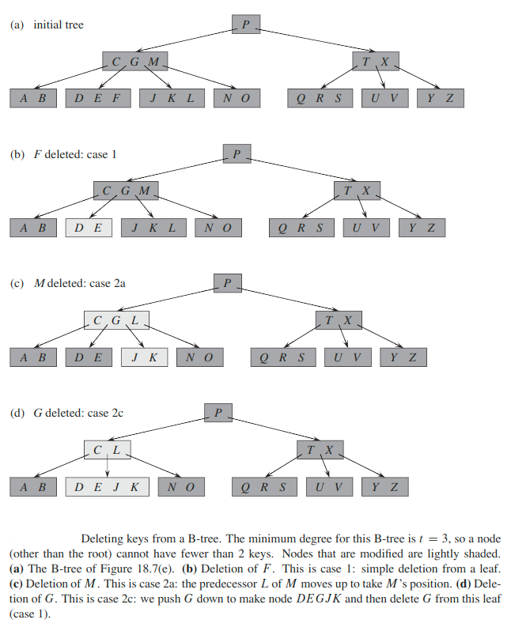
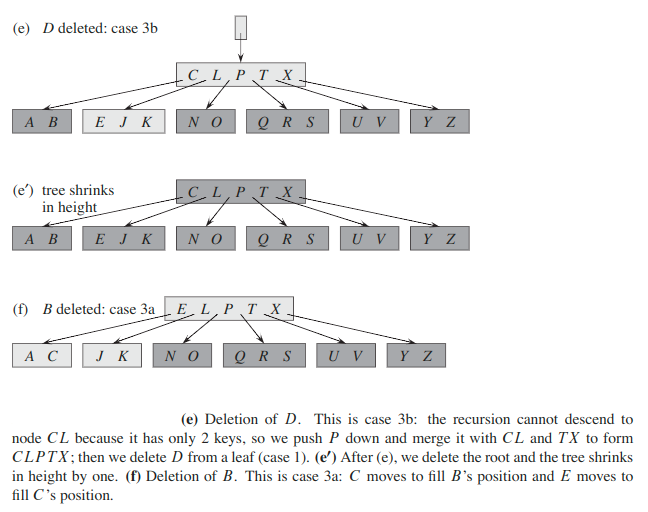
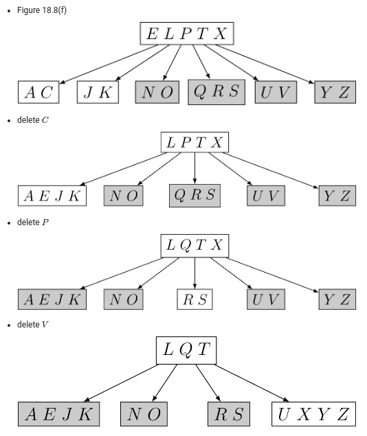

## B-Tree
B-trees are balanced search trees designed to work well on disks or other direct-access secondary storage devices. B-trees are similar to red-black  trees, but they are better at minimizing disk I/O operations.

B-trees differ significantly from red-black trees in that B-tree nodes may have many children, from a handful to thousands.

B-trees are similar to red-black trees in that every `n`-node B-tree has height `O(lg n)`, although the height of a B-tree can be considerably less than that of a red-black tree because its branching factor can be much larger.

Many database systems use B-trees, or variants of B-trees, to store information.

Any "satellite information" associated with a key is stored in the same node as the key.

The simplest B-tree occurs when `t = 2`. Every internal node then has either 2,3,or 4 children, and we have a __2-3-4 tree__.

If `n ≥ 1`, then for any `n`-key B-tree `T` of height `h` and minimum order `t ≥ 2`, `h ≤ log_t((n + 1) / 2)`

Here we see the power of B-trees, as compared with red-black trees. Although the height of the tree grows as `O(lg n)` in both cases (recall that `t` is a constant), for B-trees the base of the logarithm can be many times larger. Thus, B-trees save a factor of about `lgt` over red-black trees in the number of nodes examined for most tree operations. Because we usually have to access the disk to examine an arbitrary node in a tree, B-trees avoid a substantial number of disk accesses.

### B-Tree operations
#### Searching
Searching a B-tree is much like searching a binary search tree, except that instead of making a binary, or “two-way,” branching decision at each node, we make a multi-way branching decision according to the number of the node’s children. More precisely, at each internal node `x`, we make a `(x.n + 1)`-way branching decision.

#### Insertion
We cannot simply create a new leaf node and insert it, as the resulting tree would fail to be a valid B-tree. Instead, we insert the new key into an existing leaf node. Since we cannot insert a key into a leaf node that is full, we introduce an operation that __splits__ a full node `y` (having `2t - 1` keys) around its __median key__ `y.key_t` into two nodes having only `t - 1` keys each. The median key moves up into `y`’s parent to identify the dividing point between the two new trees. But if `y`’s parent is also full, we must split it before we can insert the new key, and thus we could end up splitting full nodes all the way up the tree.

As with a binary search tree, we can insert a key into a B-tree in a single pass down the tree from the root to a leaf. To do so, we do not wait to find out whether we will actually need to split a full node in order to do the insertion. Instead, as we travel down the tree searching for the position where the new key belongs, we split each full node we come to along the way (including the leaf itself). Thus whenever we want to split a full node `y`, we are assured that its parent is not full.

The split procedure:

Te insertion procedure to a full tree:

Splitting the root is the only way to increase the height of a B-tree. Unlike a binary search tree, a B-tree increases in height at the top instead of at the bottom.

Example:

#### Deletion
Deletion from a B-tree is analogous to insertion but a little more complicated, be-cause we can delete a key from any node—not just a leaf—and when we delete a key from an internal node,  we will have to rearrange the node’s children.  As in insertion, we must guard against deletion producing a tree whose structure violates the B-tree properties. Just as we had to ensure that a node didn’t get too big due to insertion, we must ensure that a node doesn’t get too small during deletion (except that the root is allowed to have fewer than the minimum number `t - 1` of keys).Just as a simple insertion algorithm might have to back up if a node on the path to where the key was to be inserted was full, a simple approach to deletion might have to back up if a node (other than the root) along the path to where the key is to be deleted has the minimum number of keys.

Deletion has several cases which should be covered separately:

Example:

---

### [Read More](https://www.programiz.com/dsa/b-tree)
