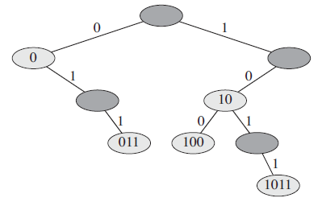
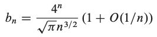

## Binary Search Tree (BST)
We can represent a binary tree by a linked data structure in which each node is an object. In addition to a _key_ and _satellite data_, each node contains attributes _left_, _right_, and _p_ that point to the nodes corresponding to its left child, its right child, and its parent, respectively. If a child or the parent is missing, the appropriate attribute contains the value `NIL`. The root node is the only node in the tree whose parent is `NIL`.

The keys in a binary search tree are always stored in such a way as to satisfy the __binary-search-tree property__:

> Let `x` be a node in a binary search tree. If `y` is a node in the left subtree of `x`, then `y.key ≤ x.key`. If `y` is a node in the right subtree of `x`, then `y.key ≥ x.key`.

__Theorem:__ If `x` is the root of an `n`-node subtree, then the call INORDER-TREE-WALK(x)
takes `O(n)` time.

Proof:
`T(n) = 2T(n/2) + c`
`T(n/2) = 2T(n/4) + c    ==>     T(n) = 4T(n/4) +2c + c`
`T(n) = 8T(n/8) + 4c+ 2c + c`
`...`

Last step - height of the binary tree, which is `log_2(n)`:

`T(n) = 2^h * T(n/2^h) + c * (1 + 2 + 4 + ... 2^h)`

By the geometric progression formula:

`T(n) = 2^h * 1 + c * ((1 - 2^(h + 1))/(1 - 2))`
`T(n) = 2^log_2(n) + c * (2^(log_2(n) + 1) - 1)`
`T(n) = n + c *2 * n - c = O(n)`

### Node removing
The overall strategy for deleting a node from a BST has 3 basic cases:
1. The node is a leaf

    Just remove it from the tree (cut off the links).

2. The node has one child.

    Elevate that child to take the position of the node (parent).

3. The node has both children.

    Find the successor of the node (which is in the right subtree) and have the successor take the node's position.

> All BST basic operations runs in `O(h)` time.

## Randomly built binary search tree
The height of a BST varies, however, as items are inserted and deleted. If, for example, the `n` items
are inserted in strictly increasing order, the tree will be a chain with height `n - 1`.

__Randomly built binary search tree__ on `n` keys as one that arises from inserting the
keys in random order into an initially empty tree, where each of the `n!` permutations
of the input keys is equally likely.

__Theorem:__ The expected height of a randomly built binary search tree on `n` distinct keys is `O(lg n)`.

> But in the worst case (all children are right or all are left) it might be `h = n`.

## Binary search trees with equal keys
Equal keys pose a problem for the implementation of BST.

Two solutions:
1. Store the amount of each key along with the key and value in a list.

    Pros:
    *  Height of tree is small irrespective of number of duplicates. Note that most of the BST operations (search, insert and delete) have time complexity as O(h) where h is height of BST. So if we are able to keep the height small, we get advantage of less number of key comparisons.

   * Search, Insert and Delete become easier to do. We can use same insert, search and delete algorithms with small modifications (see below code).

   * This approach is suited for self-balancing BSTs (AVL Tree, Red-Black Tree, etc) also. These trees involve rotations, and a rotation may violate BST property of simple solution as a same key can be in either left side or right side after rotation.

    Build time of equal `n` keys is `θ(1)` as the tree is going to have only one note (root).

2. Randomly store the node either in the left or in the right subtree.

    Build time of equal `n` keys is `θ(n * log n)` because half of key will go to the left and half will go to the right. We end up with relatively balanced tree.

3. Always store the node either in the left or in the right subtree.

    Build time of equal `n` keys is `θ(n^2)` as the tree wil be similar to a list.

## Radix trees (Tries)
Given two strings `a = a_0a_1a_2 ... a_p` and `b = b_0b_1b_2 ... b_q`, where each `a_i` and each `b_j` is in some ordered set of characters, we say that string `a` is lexicographically less than string `b` if either:
1. there exists an integer `j`, where `0 ≤ j ≤ min(p.q)`, such that `a_i = b_i` for all `i = 0, 1, ..., j-1` and `a_j < b_j`

OR

2. `p < q` and `a_i = b_i` for all `i = 0, 1, ..., p`.

For example, if `a` and `b` are bit strings, then:
* `10100 < 10110` by rule 1 (letting `j = 3`)
* `10100 < 101000` by rule 2.

This ordering is similar to that used in English-language dictionaries.

The __radix tree__ data structure shown below, stores the bit strings `1011`, `10`, `011`, `100`, and `0`. When searching for a key `a = a_0a_1a_2 ... a_p`, we go left at a node of depth `i` if `a_i = 0` and right if `a_i = 1`. Let `S` be a set of distinct bit strings whose lengths sum to `n`. Show how to use a radix tree to sort `S` lexicographically in `θ(n)` time.

For the example in the radix tree below, the output of the sort should be the sequence `0`, `011`, `10`, `100`, `1011`.

## Average node depth in a randomly built binary tree
__Total Path Length P(T)__ of a binary tree `T` is the sum, over all nodes `x` in `T`, of the _depth of node_ `x`, which we denote by `d(x, T)`.

__Theorem:__ `P(T) = Σ[x ∈ T](d(x, T)) = O(n * log n)`

## Number of different binary trees
Let `b_n` denote the number of different binary trees with `n` nodes.

__Theorem:__ 

---

#### [Read More](https://www.codesdope.com/course/data-structures-binary-search-trees/)
