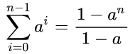
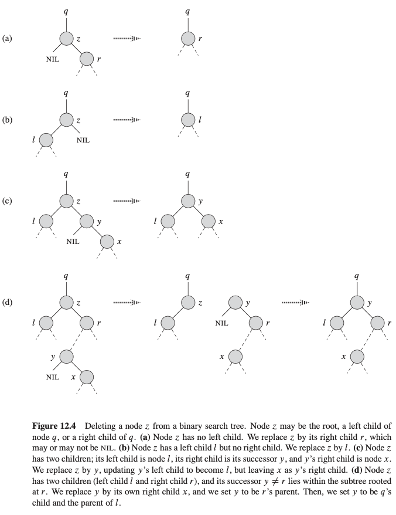

## Binary Search Tree
We can represent a binary tree by a linked data structure in which each node is an object. In addition to a _key_ and _satellite data_, each node contains attributes _left_, _right_, and _p_ that point to the nodes corresponding to its left child, its right child, and its parent, respectively. If a child or the parent is missing, the appropriate attribute contains the value `NIL`. The root node is the only node in the tree whose parent is `NIL`.

The keys in a binary search tree are always stored in such a way as to satisfy the __binary-search-tree property__:

> Let `x` be a node in a binary search tree. If `y` is a node in the left subtree of `x`, then `y.key ≤ x.key`. If `y` is a node in the right subtree of `x`, then `y.key ≥ x.key`.

__Theorem:__ If `x` is the root of an `n`-node subtree, then the call INORDER-TREE-WALK.x/
takes ‚.n/ time

Proof:
`T(n) = 2T(n/2) + c`
`T(n/2) = 2T(n/4) + c    ==>     T(n) = 4T(n/4) +2c + c`
`T(n) = 8T(n/8) + 4c+ 2c + c`
`...`

Last step - height of the binary tree, which is `log_2(n)`:

`T(n) = 2^h * T(n/2^h) + c * (1 + 2 + 4 + ... 2^h)`

By the geometric progression formula:

`T(n) = 2^h * 1 + c * ((1 - 2^(h + 1))/(1 - 2))`
`T(n) = 2^log_2(n) + c * (2^(log_2(n) + 1) - 1)`
`T(n) = n + c *2 * n - c = O(n)`

### Node removing

