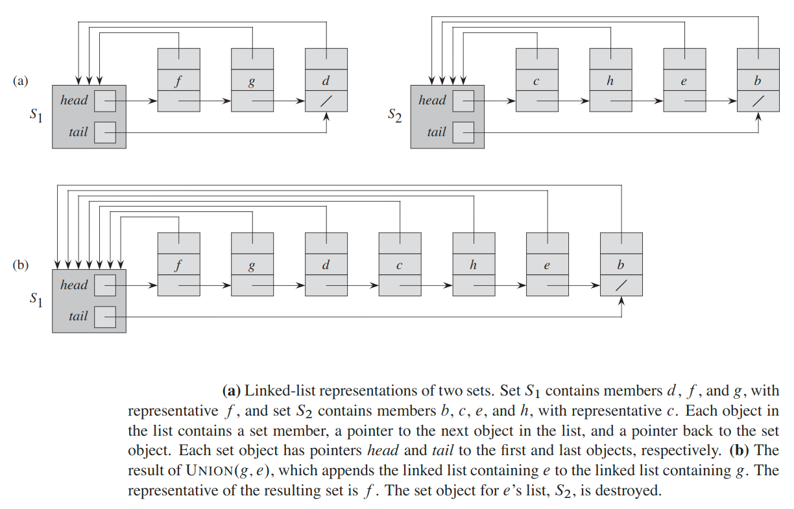
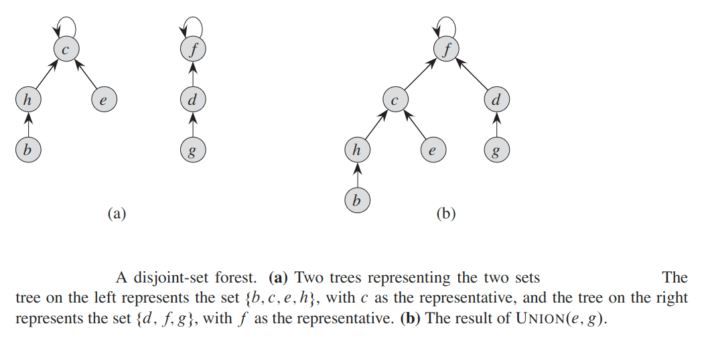

## Disjoint Set
In computer science, a __disjoint-set__ data structure, also called a __union–find__ data structure or __merge–find set__, is a data structure that stores a collection of _disjoint_ (non-overlapping) sets `S = {S_1, S_2,  ..., S_k}`.

We identify each set by a __representative__, which is some member of the set. In some applications, it doesn’t matter which member is used as the representative; we care only that if we ask for the representative of a dynamic set twice without modifying the set between the requests, we get the same answer both times.

As in the other dynamic-set implementations we have studied, we represent each element of a set by an __object__.  Letting `x` denote an object, we wish to support the following operations:
* `makeSet(x)` - creates a new set whose only member (and thus representative) s `x`. Since the sets are disjoint, we require that `x` not already be in some other set.
* `union(x, y)` - unites the dynamic sets that contain `x` and `y`, say `S_x` and `S_y`, into a new set that is the union of these two sets.  We assume that the two sets are dis-joint prior to the operation. The representative of the resulting set is any member of `S_x U S_y`.
* `findSet(x)` - returns a pointer  to the representative  of the (unique)  set containing `x`.

### Application
One  of  the  many  applications  of  disjoint-set  data  structures  arises  in  determining  the  connected  components  of  an  undirected  graph.

### Representations
#### Linked-list representation
Each set is represented by its own linked list. The object for each set has attributes `head`, pointing  to the first object  in the list (_representative_ of a set),  and `tail`,  pointing  to the last object.   Each object in the list contains a set member, a pointer to the next object in the list, and a pointer back to the set object.  Within each linked list, the objects may appear in any order.

#### Disjoint-set forests
In a faster implementation of disjoint sets, we represent sets by rooted trees, with each node containing one member and each tree representing one set.  In a __disjoint-set forest__, each member points only to its parent.

We perform the three disjoint-set operations as follows. A `makeSet()` operation simply creates a tree with just one node.  We perform a `findSet()` operation by following parent pointers until we find the root of the tree.  The nodes visited on this  simple  path  toward  the  root  constitute  the __find path__. A `union()` operation, causes the root of one tree to point to the root of the other.

So far,  we have not improved on the linked-list  implementation.   A sequence  of `n - 1` `union()` operations may create a tree that is just a linear chain of `n` nodes. By using two heuristics, however, we can achieve a running time that is almost linear in the total number of operations `m`.

1. The first heuristic, __union by rank__, is similar to the weighted-union heuristic we used with the linked-list representation.  The obvious approach would be to make the root of the tree with fewer nodes point to the root of the tree with more nodes.Rather than explicitly keeping track of the size of the subtree rooted at each node, we shall use an approach that eases the analysis.  For each node,  we maintain a __rank__, which is an upper bound on the height of the node.  In union by rank,  we make the root with smaller rank point to the root with larger rank during a `union()` operation.
2. The second heuristic, __path compression__, is also quite simple and highly effective. We use it during `findSet()` operations to make each node on the find path point directly to the root. Path compression does not change any ranks.

### Amortized Analysis
We shall analyze the running times of disjoint-set data structures in terms of two parameters: `n`, the number of `makeSet()` operations, and `m`, the total number of `makeSet()`, `union()`, and `findSet()` operations. Since the sets  are disjoint,  each  `union()` operation  reduces  the number  of  sets by one.After `n - 1` `union()` operations,  therefore,  only one set remains.  The number of `union()` operations  is  thus  at  most `n - 1`.   Note  also  that  since  the  `makeSet()` operations are included in the total number of operations `m`, we have `m ≥ n`. We assume that then `makeSet()` operations are the first `n` operations performed.

#### Linked-list representation
With this linked-list  representation,  both `makeSet()` and `findSet()` are easy, requiring `O(1)` time.   To  carry  out  `makeSet(x)`,  we  create  a  new  linked  list whose only object is `x`. For `findSet(x)`, we just follow the pointer from `x` back to its set object and then return the member in the object that `head` points to.

we perform  `union(x, y)` by appending `y`’s list onto the end of `x`’s list. The representative of `x`’s list becomes the representative of the resulting set. We use the `tail` pointer for `x`’s list to quickly find where to append `y`’s list. Because all members of `y`’s list join `x`’s list, we can destroy the set object for `y`’s list. Unfortunately, we must update the pointer to the set object for each object originally on `y`’s list, which takes time linear in the length of `y`’s list.

In fact,  we can easily construct  a sequence  of `m` operations  on `n` objects that requires `θ(n^2)` time by appending the longer list onto a shorter list each time, where the average time of each operation is `θ(n)`.

Suppose instead that each list also includes the length of the list (which we can easily maintain) and that we always append the shorter list onto the longer, breaking ties arbitrarily.  With this simple __weighted-union heuristic__, a  single `union()` operation can still take `Ω(n)` time if both sets have `Ω(n)` members.

__Theorem:__ Using the linked-list representation of disjoint sets and the weighted-union heuristic, a sequence of `m` `makeSet()`, `union()`, and `findSet()` operations, `n` of which are `makeSet()` operations, takes `O(m + n lg(n))` time.

__Proof:__ Because  each `union()` operation  unites  two  disjoint  sets,  we  perform  at most `n - 1` `union()` operations over all.

We start by determining, for each object, an upper bound on the number of times the object’s pointer back to its set object is updated.  Consider a particular object `x`. We know that each time `x`’s pointer was updated, `x` must have started in the smaller set.  The first timex’s pointer  was updated,  therefore,  the resulting set must have had at least 2 members. Similarly, the next timex’s pointer was updated, the resulting set must have had at least 4 members.  Continuing on, we observe that for any `k ≤ n`, after `x`’s pointer has been updated &lceil;`lg k`&rceil; times, the resulting set must have at least `k` members.  Since the largest set has at most `n` members, each object’s pointer is updated at most &lceil;`lg n`&rceil; times over all the `union()` operations. Thus  the  total  time  spent  updating  object  pointers  over  all `union()` operations is `O(n lgn)`.  We must also account for updating the `tail` pointers and the list lengths, which take only‚ `θ(1)` time per `union()` operation.  The total time spent in all `union()` operations is thus `O(n lgn)`.

The time for the entire sequence of `m` operations follows easily.  Each `makeSet()` and `findSet()` operation takes `O(1)` time, and there are `O(m)` of them.  The total time for the entire sequence is thus `O(m + n lgn)`.

#### Disjoint-set forests
A sequence of `m` `makeSet()`, `union()`, and `findSet()` operations, `n` of which are `makeSet()` operations,  can be performed  on a disjoint-set  forest  with union  by rank and path compression in worst-case time `O(m α(n))`.

The `α(n)` - is a very slowly growing function. In any conceivable application of a disjoint-set data structure, ̨`α(n) ≤ 4` thus, we can view the running time as linear in `m` in all practical situations.

---

#### [Watch YouTube Video](https://www.youtube.com/watch?v=wU6udHRIkcc&t=4s)
