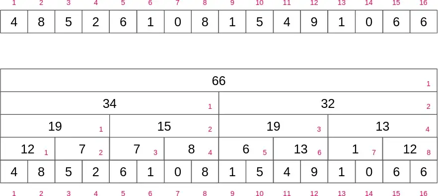
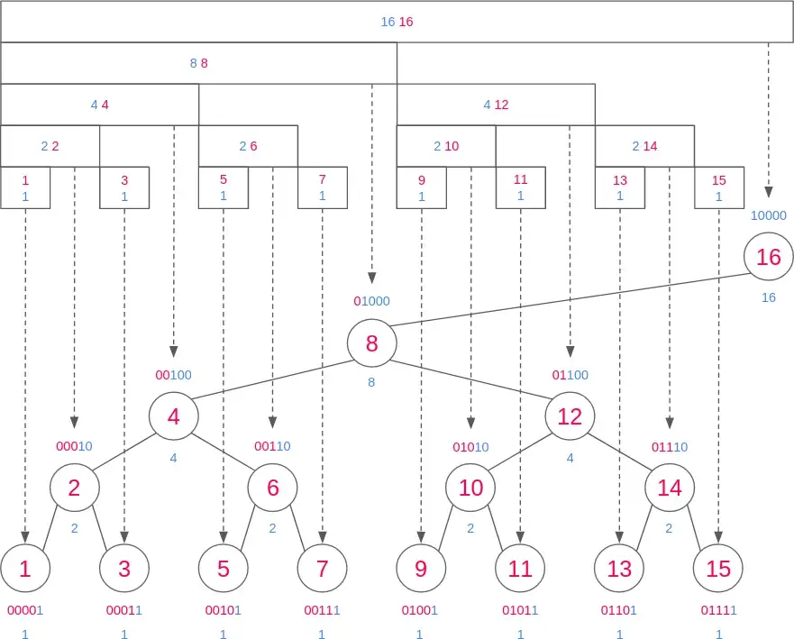
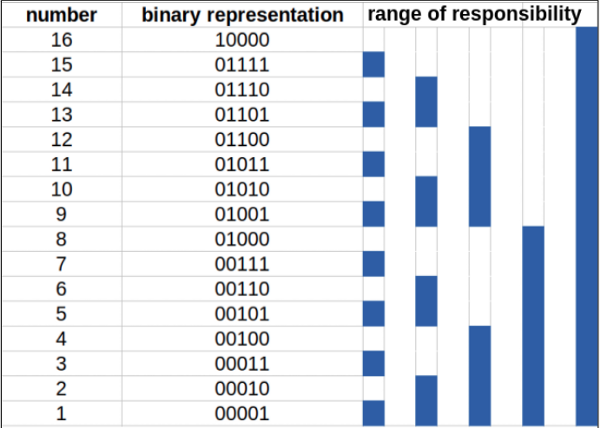
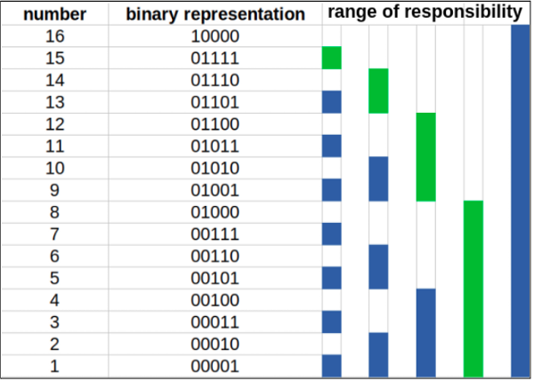
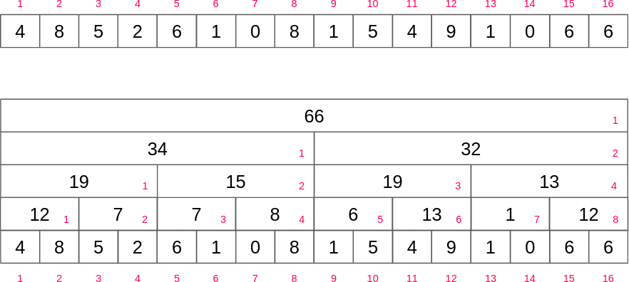
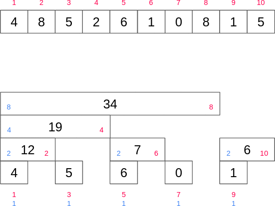
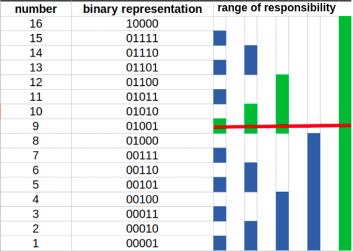
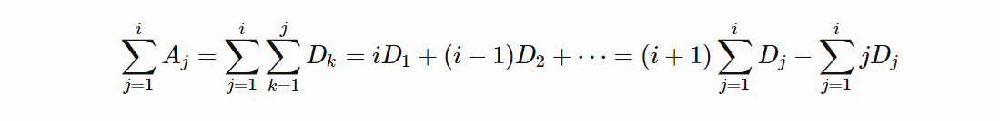

# Fenwick Tree
Let, `f`  be some group operation (binary associative function over a set with identity element and inverse elements) and `A` be an array of integers of length `N`.

Fenwick tree is a data structure which:
* Calculates the value of function  `f` in the given range `[l, r]` in  `O(log N)` time;
* Updates the value of an element of  `A`  in  `O(log N)`  time;
* Requires  `O(N)`  memory;

The most common application of Fenwick tree is calculating the sum of a range (i.e. using addition over the set of integers `ℤ` :  `f(A_1, A_2, ..., A_k) = A_1 + A_2 + ... + A_k` ).

Fenwick tree is also called __Binary Indexed Tree__, or just __BIT__ abbreviated.

For the sake of simplicity, we will assume that function  `f`  is just a sum function.

The data structure is called tree, because there is a nice representation of the data structure as tree, although we don't need to model an actual tree with nodes and edges. We will only need to maintain the array  `T`  to handle all queries.

## RSB




In a Fenwick tree, each index has a range of responsibilities. The _position of the first non-zero bit from right in the binary representation_ of the index of the cell determines the range of responsibility of that cell below itself. Let’s call this position __RSB__(rightmost set bit). For example, the binary representation of 11 is `(1011)`<sub>`2`</sub>. The range of responsibility of 11 is then 1 as its RSB gives value `(1)`<sub>`2`</sub>` = 1`. Another example of a range of responsibilities is for the number `12 = (1100)`<sub>`2`</sub>. The range of responsibility of `12` is `4` as its RSB gives value `(100)`<sub>`2`</sub>` = 4`.



> Also, note that the positions from the right are one-based.

We can see that as the height of the tree is `log`<sub>`2`</sub>`(n)`, the update and query operations `log`<sub>`2`</sub>`(n)` time at max.

RSB of `i` is `i & -i`. It works because the negative of a number is produced by inverting the number, then adding `1` (that’s the definition of two’s complement). When you add `1`, every bit starting at the bottom will overflow into the next higher bit; this stops once you reach zero. Those overflowed bits will all be zero, and the bits above the last one affected will be the inverse of each other, so the only bit left is the one that stopped the cascade — the one that started as `1` and was inverted to `0`.

## Query the group operation
Let's calculate the sum of all numbers till index `15`.



Therefore `prefixSum(15) = tree[15] + tree[14] + tree[12] + tree[8]`.

If you combine the range of responsisbilities (green lines) you will get the sum till index 15. Because the green lines cover all indices from `1` to `15`. But how do we know which indexes to use. Let's break down the algorithm steb-by-step:
1. Add tree node value of 15 to the `sum`. The find RSB and subtract it from `15`. `15 - RSB(15) = 15 - 1 = 14`.
2. Repeat the process with 14. Add tree node value of 14 to the `sum`. Then `14 - RSB(14) = 14 - 2 = 12`.
3. `12 - RSB(12) = 12 - 4 = 8`
4. `8 - RSB(8) = 8 - 8 = 0`


Another example:





## Update operation
Now, how to update a value in tree.



As you can see from the above image, if we want to update the value at index `9` by increasing the value in the original array at index `9` by `x`, we would have to propagate upwards from `9` to `10`, `10` to `12`, and `12` to `16`.

So the required updates are: `tree[9] += x`, `tree[10] += x`, `tree[12] += x`, `tree[16] += x`.

## Tree construction
We can construct the tree in linear time. The idea is to add the value in the current cell to the next immediate cell that is responsible for the current cell. It resembles the method for point updates but one cell at a time. This creates a cascading effect by propagating the value in each cell throughout the tree.

Let our current position be `i`. The immediate position responsible for `i` is `i + RSB(i)`. We can consider cell `i + RSB(i)` as the parent of cell `i`. We must ignore this update if the parent cell is out of bounds.

## Range updates and point queries
Let the Fenwick tree be initialized with zeros. Suppose we want to increment the interval `[l, r]` by `x`. We need to make 2 point update operations on the Fenwick tree: `add(l, x)` and `add(r+1, -x)`.

After these operations, the values from `0` to `i < l` have no effect. The values from `l <= i <= r` are incremented by `x`. And if `i > r`, then the second update operation will cancel the effect of the first one.

## Range Updates and Range Queries
To support both range updates and range queries we will use two BITs namely `B1[]` and `B2[]` , initialized with zeros.



Where `D`<sub>`i`</sub>` = A`<sub>`i`</sub>` − A`<sub>`i - 1`</sub>`

We can maintain the two prefix sums, `D`<sub>`i`</sub> and `iD`<sub>`i`</sub>, with two BITs.

So, in order to get the sum of a range `[l, r]`, overall we should calculate the difference: `prefixSum(r) - prefixSum(l - 1)`.

```java
int A[N], B1[N], B2[N], n;
void upd(int* B, int x, int v) {
  for(int i = x ; i <= n ; i += lowbit(i)) B[i] += v;
}
int sum(int* B, int x) {
  int ans = 0;
  for(int i = x ; i > 0 ; i -= lowbit(i)) ans += B[i];
  return ans;
}
void update(int l, int r, int v) {
  upd(B1, r + 1, -v); upd(B1, l, v);
  upd(B2, r + 1, -(r + 1) * v); upd(B2, l, l * v);
}
int query(int l, int r) {
  return ((r + 1) * sum(B1, r) - sum(B2, r)) - (l * sum(B1, l - 1) - sum(B2, l - 1));
}
```

---

# 2D Fenwick Tree
In case of 1D example, we were iterating directly over the indices of the array in 1 direction, but here in the case of a matrix, we have a 2-dimensional indices. Hence in order to use the concept of BIT for 2D case, we'll iterate in both the directions, i.e. over the rows and columns of the matrix to perform the update and query method. If `i` and `j` represents the indices corresponding to rows and columns that are used for iterating over the matrix, we simply increment these variables by `rsb(i)` and `rsb(j)` in the update operation and decrement by `rsb(i)` and `rsb(j)` in decrement operation.

Similarly, in 2D BIT, the `(i,j)`-th element store the sum of rectangle ending (right-bottom point) at point `(i,j)`.

Basically, every row is a standalone 1D Fenwick Tree.

---

#### [An extensive documentation](https://robert1003.github.io/2020/01/27/fenwick-tree.html#d-range-update-range-query)

#### [Youtube Video](https://youtu.be/RgITNht_f4Q)
