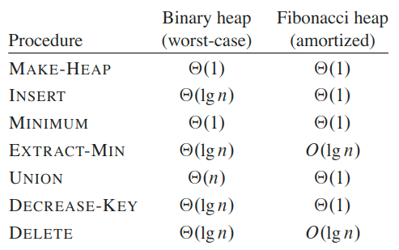
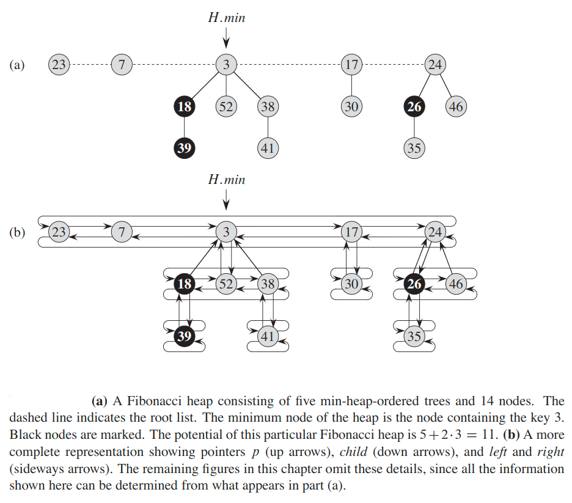

## Fibonacci Heap
The Fibonacci heap data structure serves a dual purpose.  First, it supports a set of operations that constitutes what is known as a _mergeable heap_.  Second, several Fibonacci-heap operations run in constant amortized time.

### Mergeable heaps
A __mergeable heap__ is any data structure that supports the following five operations,in which each element has a key:
* `maleHeap()` - creates and returns a new heap containing no elements.
* `insert(x)` - inserts element `x`, whose key has already been filled in.
* `min()` - returns a pointer to the element in heap whose key is minimum.
* `extractMin()` - deletes the element from heap whose key is minimum.
* `union(H1, H2)` - creates and returns a new heap that contains all the elements of both heaps.
* `decreaseKey(x, k)` - assigns to element `x` within heap the new key value `k`.
* `delete(x)` - deletes element `x` from heap.



If we don’t need the `union()` operation, ordinary binary heaps, as used in heapsort, work fairly well. Operations other than  `union()` run in worst-case time `O(lg n)` on a binary heap.

From a theoretical standpoint, Fibonacci heaps are especially desirable when the number of `extractMin()` and `delete()` operations is small relative to the number of other operations performed.

From a practical point of view, however, the constant factors and programming complexity of Fibonacci heaps make them less desirable than ordinary binary (or `k`-ary) heaps for most applications, except for certain applications that manage large amounts of data. Thus, Fibonacci heaps are predominantly of theoretical interest.

### Structure
AFibonacci heap is a collection of rooted trees that are _min-heap ordered_.That is, each tree obeys the _min-heap property_: the key of a node is greater than or equal to the key of its parent.



Circular, doubly linked lists have two advantages for use inFibonacci heaps.  First, we can insert a node into any location or remove a node from anywhere in a circular, doubly linked list in `O(1)` time. Second, given two such lists, we can concatenate them (or “splice” them together) into one circular, doubly linked list in `O(1)` time.

> If more than one root has a key with the minimum value, then any such root may serve  as  the  minimum  node.

### Potential function
We set the potential function as `Ф(H) = t(H) + 2m(H)`, where:
* `t(H)` - number of trees in the root list of `H`.
* `m(H)` - number of marked nodes in `H`.

The amortized analyses we shall perform assume that we know an upper bound `D(n)` the maximum degree of any node in an `n`-node Fibonacci heap. We won’t prove it, but when only the mergeable-heap operations are supported `D(n) ≤ `&lfloor;`log_φ(n)`&rfloor;, where `φ = (1 + Math.sqrt(5)) / 2`.

### Insert and Union
As in the `insert()` procedure, all roots remain roots. The change in potential is:
```
Ф(H) - (Ф(H_1) + Ф(H_2)) = 
    = (t(H) + 2m(H)) - ((t(H_1) + 2m(H_1)) + (t(H_2) + 2m(H_2)))
    = 0
```

because `t(H) = t(H_1) + t(H_2)` and `m(H) = m(H_1) + m(H_2)`. The amortized cost of `union()` is therefore equals to its `O(1)` actual cost.

### Extracting the minimum node
The sizeof the root list upon calling `consolidate()` is at most `D(n) + t(H) - 1`, since it consists of the original `t(H)` root-list nodes, minus the extracted root node, plus the children of the extracted node, which number at most `D(n)`.

Within a given iteration of the first `for` loop of `consolidate()` procedure, the number of iterations of the `while` loop inside that `for` loop depends on the root list. But we know that every time through the `while` loop, one of the roots is linked to another, and thus the total number of iterations of the while loop over all iterations of the for loop is at most the number of roots in the root list.  Hence, the total amount of work performed in the `for` loop is at most proportional to `D(n) + t(H)`.  Thus, the total actual work in extracting the minimum node is `O(D(n) + t(H))`.

The potential before extracting the minimum node is `t(H) + 2m(H)`,and the potential afterward is at most `(D(n) + 1) + 2m(H)`, since at most `D(n) + 1` roots remain and no nodes become marked during the operation.  The amortized cost is thus at most

```
O(D(n) + t(H) + (D(n) + 1) + 2m(H)) - (t(H) + 2m(H))
    = O(D(n)) + O(t(H)) - t(H)
    = O(D(n))
```

Intuitively, the cost of performing each link is paid for by the reduction in potential due to the link’s reducing the number of roots by one.

### Decreasing a key
Each call of `cascadingCut()`, except for the last one, cuts a marked node and clears the mark bit. Afterward, the Fibonacci heap contains `t(H) + c` trees (the original `t(H)` trees, `c-1` trees produced by cascading cuts, and the tree rooted at `x`) and at most `m(H) - c + 2` marked nodes(`c-1` were unmarked by cascading cuts and the last call of `cascadingCut()` may have marked a node. The change in potential is therefore at most

`((t(H) + c) + 2(m(H) - c + 2)) - (t(H) + 2m(H)) = 4 - c`

Thus the amortized cost is: `O(c) + 4 - c = O(1)`

### Deleting a node
The amortized time of `delete()` is the sum of the `O(1)` amortized time of `decreaseKey()` and the `O(lg n)` amortized time of `extractMin()`.

### Increase a key
Delete the current value `x` and insert `x` again with a new key.

The amortized time is `O(lg n)`.

---

#### [Read More](https://www.programiz.com/dsa/fibonacci-heap)

#### [Read Even More](https://www.programiz.com/dsa/decrease-key-and-delete-node-from-a-fibonacci-heap)
