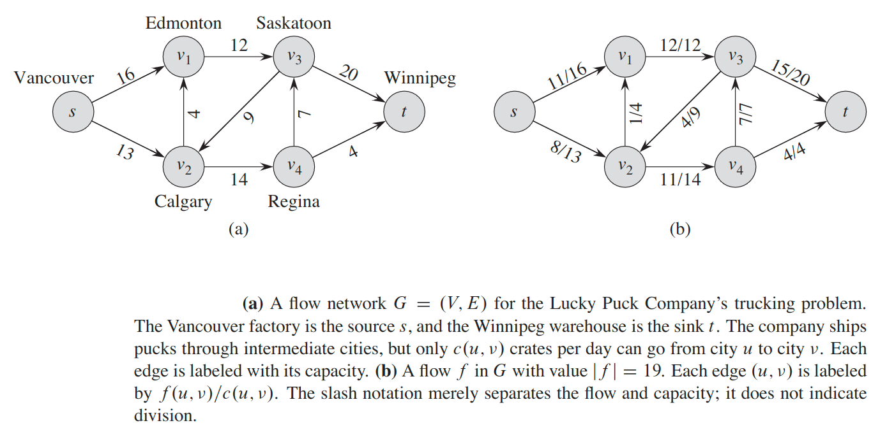
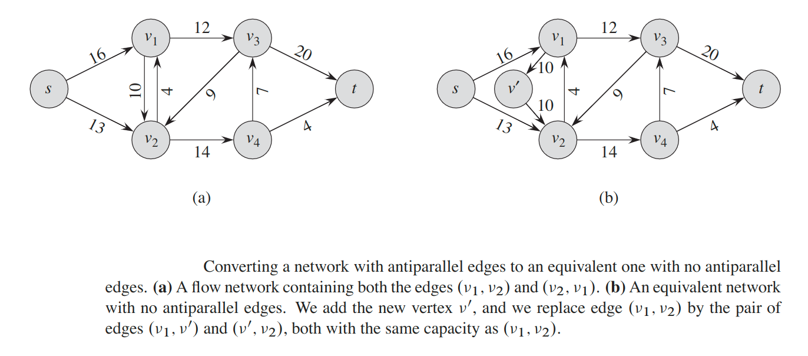
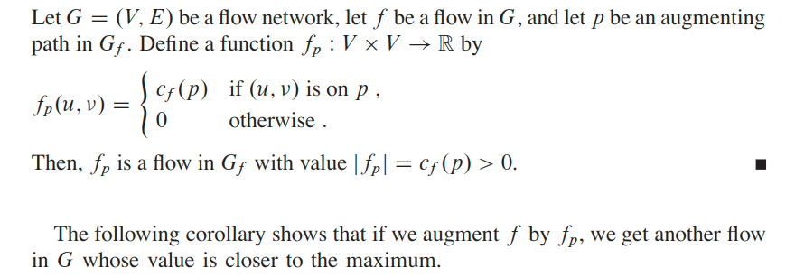
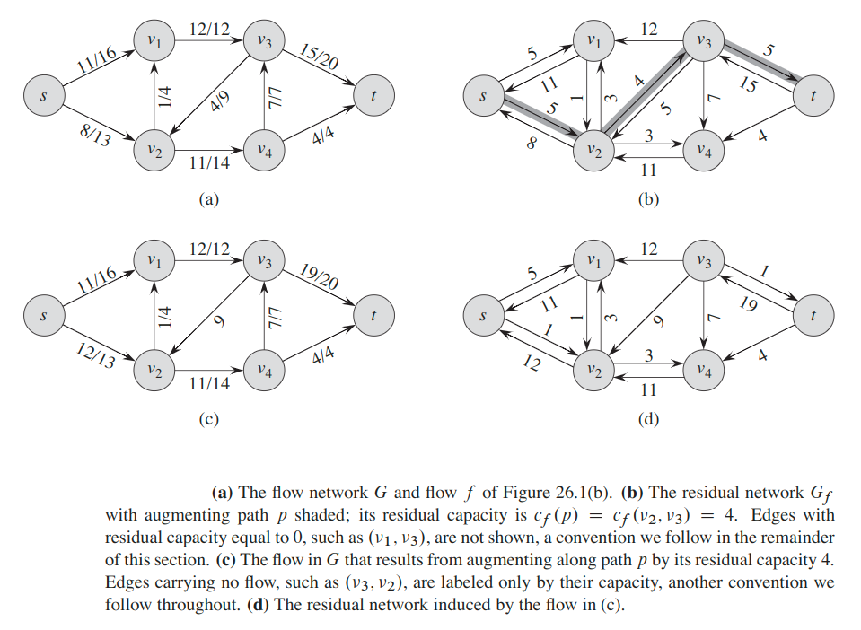
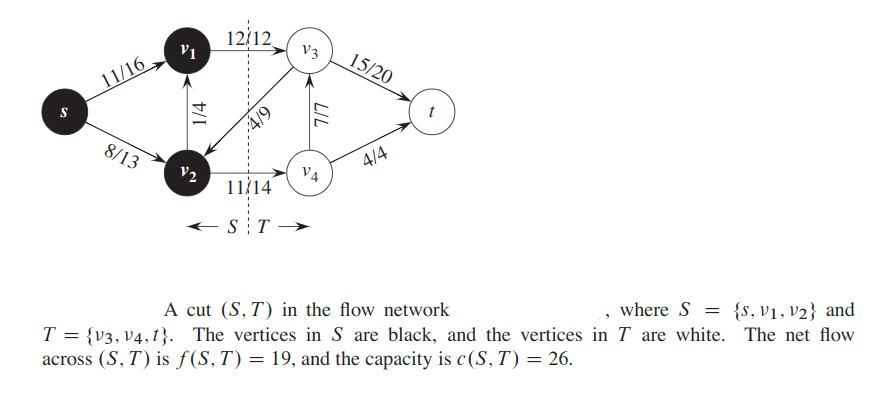
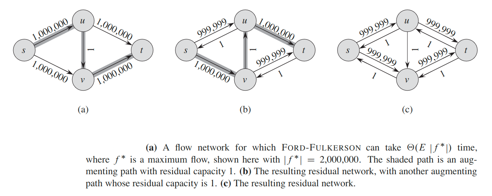

# Maximum Flow
A __flow network__ `G = (V, E)` is a directed graph in which each edge `(u, v) ∈ E` has a non-negative __capacity__ `c(u, v) ≥ 0`.

We further require that if `E` contains an edge `(u, v)`,  then there is no edge `(v, u)` in the reverse  direction.

If `(u, v) ∉ E`, then for convenience we define `c(u, v) = 0`, and we disallow  self-loops.

We distinguish two vertices in a flow network: a __source__ `s` and a __sink__ `t`. For convenience, we assume that each vertex lies on some path from the source to the sink. That is, for each vertex `v ∈ V`, the flow network contains a paths `s ↝ v ↝ t`.  The graph is therefore connected and, since each vertex other than `s` has at least one entering edge, `|E| ≥ |V| - 1`.

Let `G = (V, E)` be a flow network with a capacity function `c`. Let `s` be the source of the network, and let `t` be the sink. A __flow__ in `G` is a real-valued function `f: V x V -> ℝ` that satisfies the following two properties:

1. __Capacity constraints__: For all `u, v ∈ V`, we require `0 ≤ f(u, v) ≤ c(u, v)`.

    The  capacity  constraint  simply says that the flow from one vertex to another must be nonnegative and must not exceed the given capacity.

2. __Flow conservation__: For all `u ∈ V - {s, t}`, we require: `∑[v ∈ V]f(v, u) = ∑[v ∈ V]f(u, v)`.

    The flow-conservation property says that the total flow into  a vertex  other  than the  source  or  sink must  equal  the total  flow out  of  that vertex — informally, “flow in equals flow out.”

When `(u, v) ∉ E`, there can be no flow from `u` to `v`, and `f(u, v) = 0`.

We call the non-negative quantity `f(u, v)` the flow from vertex `u` to vertex `v`. The __value__ `|f|` of a flow `f` is defined as `|f| = ∑[v ∈ V]f(s, v) - ∑[v ∈ V]f(v, s)`. That is, the total flow out of the source minus the flow into the source.

Typically, a flow network will not have any edges into the source, and the flow into the source, given by the summation `∑[v ∈ V]f(v, s)`, will be `0`.

In the __maximum-flow problem__, we are given a flow network `G` with source `s` and sink `t`, and we wish to find a flow of maximum value.

> The maximum-flow problem is related to optimization methods.

#### Example

### Modeling problems with antiparallel edges
We call the two edges `(v_1, v_2)` and `(v_2, v_1)` antiparallel.  Thus, if we wish to model a flow problem with antiparallel edges, we must transform the network into an equivalent one containing no antiparallel  edges.

### Networks with multiple sources and sinks
We can reduce the problem of determining a maximum flow in a network with multiple sources and multiple sinks to an ordinary maximum-flow problem.

We add a __super-sources__ and add a directed edge `(s, s_i)` with capacity `c(s, s_i) = ∞` for each `i = 1, 2, ..., m`. We also create a new __super-sink__ `t` and add a directed edge `(t_i, t)` with capacity `c(t_i, t) = ∞` for each `i = 1, 2, ..., n`. Intuitively, any flow in the network in (a) corresponds toa flow in the network in (b), and vice versa.  The single sources simply provides as much flow as desired for the multiple sources `s_i`, and the single sink `t` likewise consumes as much flow as desired for the multiple sinks `t_i`.

## Residual networks
Intuitively, given a flow network `G` and a flow `f`, the residual network `G_f` consists of edges with capacities that represent how we can change the flow on edges of `G`.

An edge of the flow network can admit an amount of additional flow equal to the edge’s capacity  minus the flow on that  edge.   If that  value is positive,  we place that  edge  into `G_f` with  a  “residual  capacity”  of `c_f(u, v) = c(u, v) - f(u, v)`. The  only  edges  of `G` that  are  in `G_f` are  those  that  can  admit  more  flow;  those edges `(u, v)` whose flow equals their capacity have `c_f(u, v) = 0`, and they are not in `G_f`.

The residual  network `G_f` may also contain  edges that  are not  in `G`, however.As an algorithm manipulates the flow, with the goal of increasing the total flow, it might need to decrease the flow on a particular edge.  In order to represent a possible decrease of a positive flow `f(u, v)` on an edge in `G`, we place an edge `(v, u)` into `G_f` with residual capacity `c_f(v, u) = f(u, v)` - that is, an edge that can admit flow in the opposite direction to `(u, v)`, at most canceling out the flow on `(u, v)`. These reverse edges in the residual network allow an algorithm to send back flow it  has  already  sent  along  an  edge.   Sending  flow back  along  an  edge  is  equivalent to decreasing the flow on the edge,  which is a necessary operation in many algorithms.

More formally, suppose that we have a flow network `G = (V, E)` with source `s` and sink `t`. Let `f` be a flow in `G`, and consider a pair of vertices `u, v ∈ V`. We define the __residual capacity__ `c_f(u, v)` by

Because of our assumption that `(u, v) ∈ E` implies `(v, u) ∉ E`, exactly one case in  above equation applies to each ordered pair of vertices.

As an example, if `c(u, v) = 16` and `f(u, v) = 11`, then we can increase `f(u, v)` by up to `c_f(u, v) = 5` units before we exceed the capacity constraint on edge `(u, v)`.  We also wish to allow an algorithm to return up to 11 units of flow from `v` to `u`, and hence `c_f(v, u) = 11`.

Given a flow network `G = (V, E)` and a flow `f`, the __residual network__ of `G` _induced by `f`_ is `G_f = (V, E_f)`, where `E_f = {(u, v) ∈ V x V: c_f(u, v) > 0}`.

That is, as promised above, each edge of the residual network, or __residual edge__, can admit a flow that is greater than 0.

The edges in `E_f` are either edges in `E` or their reversals, and thus `|E_f| ≤ 2 |E|`.

Observe that the residual network `G_f` is similar to a flow network with capacities given by `c_f`.  It does not satisfy our definition of a flow network because it may contain both an edge `(u, v)` and its reversal `(v, u)`. Other than this difference,  a residual network has the same properties as a flow network, and we can define a flow in the residual network as one that satisfies the definition of a flow, but with respect to capacities `c_f` in the network `G_f`.

A flow in a residual network provides a roadmap for adding flow to the original flow network.  If `f` is a flow in `G` and `f'` is a flow in the corresponding residual network `G_f`, we define `f ↑ f'`, the __augmentation__ of flow `f` by `f'`, to be a function from `V x V` to `R`, defined by:

The intuition behind this definition follows the definition of the residual network. We increase  the  flow  on `(u, v)` by `f'(u, v)` but  decrease  it  by `f'(v, u)` because pushing flow on the reverse edge in the residual network signifies decreasing the flow  in  the  original  network. Pushing  flow  on  the  reverse  edge  in  the  residual network is also known as __cancellation__.

#### Lemma
Let `G = (V, E)` be a flow network with source `s` and sink `t`, and let `f` be a flow in `G`. Let `G_f` be the residual network of `G` induced by `f`, and let `f'` be a flow in `G_f`.  Then the function `f ↑ f'` is a flow in `G` with value `|f ↑ f'| = |f| + |f'|`.

## Augmenting paths
Given  a  flow  network `G = (V, E)` and  a  flow `f`, an __augmenting path__ `p` is  a simple path from `s` to `t` in the residual network `G_f`.

We call the maximum amount by which we can increase the flow on each edge in an augmenting path `p` the residual capacity of `p`, given by `c_f(p) = min{c_f(u, v): (u, v) is on p}`.

#### Lemma

The following figure (c) shows the result of augmenting the flow `f` from Figure (a) by the flow `f_p` in (b).

#### Corollary
Let `G = (V, E)` be  a  flow  network,  let `f` be  a  flow  in `G`, and let `p` be  an augmenting  path  in `G_f`. Let `f_p` be  defined  as  in  above lemma,  and  suppose that  we augment `f` by `f_p`. Then the function `f ↑ f_p` is a flow in `G` with value `|f ↑ f_p| = |f| + |f_p| > |f|`.

## Cuts of flow networks
A __cut__ `(S, T)` of  flow  network `G = (V, E)` is  a  partition  of `V` into `S` and `T = V - S` such thats `s ∈ S` and `t ∈ T`. (This definition  is similar to the definition of “cut” that we used for minimum spanning  trees,  except that here we are cutting a directed graph rather than an undirected graph, and we insist that `s ∈ S` and `t ∈ T`.)

If `f` is a flow, then the `net flow` `f(S, T)` across the cut `(S, T)` is defined to be:

A __minimum cut__ of a network is a cut whose capacity is minimum over all cuts of the network.

The figure above shows the cut `({s, v_1, v_2}, {v_3, v_4, t})` in the flow network. The net flow across this cut is

`f(v_1, v_3) + f(v_2, v_4) - f(v_3, v_2) = 12 + 11 - 4 = 19`

and the capacity of this cut is

`c(v_1, v_3) + c(v_2, v_4) = 12 + 14 = 26`

#### Lemma
Let `f` be a flow in a flow network `G` with source `s` and sink `t`, and let `(S, T)` be any cut of `G`. Then the net flow across `(S, T)` is `f(S, T) = |f|`.

Basically it shows that, for a given flow `f`, the net flow across any cut is the same, and it equals `|f|`, the value of the flow.

#### Corollary
The value of any flow `f` in a flow network `G` is bounded from above by the capacity of any cut of `G`.

### Theorem (Max-flow min-cut theorem)
If `f` is a flow in a flow network `G = (V, E)` with source `s` and sink `t`, then the following conditions are equivalent:
1. `f` is a maximum flow in `G`.
2. The residual network `G_f` contains no augmenting paths.
3. `|f| = c(S, T)` for some cut `(S, T)` of `G`.

## The basic Ford-Fulkerson algorithm
It is a generic method for increasing flows incrementally along paths from source to sink.

The flow: Increase the flow along any augmenting path from source to sink, continuing until there are no such paths in the network. This  method  always  finds  a  maxflow,  no  matter  how  we  choose  the  paths.

In each iteration of the `fordFulkersonMaxFlow()` method, we find some augmenting path `p` and use `p` to modify the flow `f`. We replace `f` by `f ↑ f_p`, obtaining a new flow whose value is `|f| + |f_p|`.

### Analysis
In practice, the maximum-flow problem often arises with integral capacities.  If the capacities are rational numbers, we can apply an appropriate scaling transformation to make them all integral. If `f*` denotes a maximum flow in the transformed network, then a straightforward  implementation of  `fordFulkersonMaxFlow()` executes the while loop at most `|f*|` times, since the flow value increases by at least one unit in each iteration.

Let us assume that we keep a data structure cor-responding to a directed graph `G' = (V, E')`, where `E] = {(u, v): (u, v) ∈ E or (v, u) ∈ E}`. Edges in the network `G` are also edges in `G'`, and therefore we can easily maintain capacities and flows in this data structure.  Given a flow `f` on `G`, the edges in the residual network `G_f` consist  of all edges `(u, v)` of `G'` such that `c_f(u, v) > 0`. The time to find a path ina residual network is therefore `O(V + E') = O(E)` if we use either depth-first search or breadth-first search.  Each iteration of the while loop thus takes `O(E)` time, as does the initialization step, making the total running time of the algorithm is `O(E|f*|)`.

When the capacities are integral and the optimal flow value `|f*|` is small, the running time of the Ford-Fulkerson algorithm is good.

## The Edmonds-Karp algorithm
We  can  improve  the  bound  on  FORD-FULKERSON by  finding  the  augmenting path `p` a _breadth-first search_.   That is,  we choose the augmenting path as a shortest path from `s` to `t` in the residual network, where each edge has unit  distance  (weight). We call  the Ford-Fulkerson  method  so implemented  the __Edmonds-Karp algorithm__.

We say that an edge `(u, v)` in a residual network `G_f` is __critical__ on an augmenting path `p` if the residual capacity of `p` is the residual capacity of `(u, v)`, that is, if `c_f(p) = c_f(u, v)`. After we have augmented flow along an augmenting path, any critical edge on the path disappears from the residual network.  Moreover, at least one edge on any augmenting path must be critical.

Why not DFS? Using a DFS can lead to zigzagging through the flow graph to find the sink which can cause longer augmenting paths. Longer paths are generally undesirable because the longer the path, the higher the chance for a small bottleneck value which results in a longer runtime. BFS on the other hand always gives a shortest path in terms of number of edges. That is why using BFS is a great approach to avoid the DFS worse case and reduce the length of augmented path.

#### Theorem
If the Edmonds-Karp algorithm is run on a flow network `G = (V, E)` with source `s` and sink `t`, then the total number of flow augmentations performed by the algorithm is `O(V * E)`.

Because we can implement each iteration of `fordFulkersonMaxFlow()` in `O(E)` time when we find the augmenting path by breadth-first search, the total running time of the Edmonds-Karp algorithm is `O(V * E^2)`.

## Maximum Bipartite Matching
Given an undirected graph `G = (V, E)`, a __matching__ is a subset of edges `M ⊆ E` such  that  for all vertices `v ∈ V`,  at  most  one  edge of `M` is incident  on `v`. We say  that a vertex `v ∈ V` is __matched__ by the matching `M` if  some edge  in `M` is incident on `v`; otherwise, `v` is __unmatched__. A __maximum matching__ is a matching of maximum _cardinality_,  that is,  a matching `M` such that  for any matching `M'`, we have `|M| ≥ |M'|`.

__Bipartite Graph__ is graphs  in  which  the vertex  set  can  be partitioned into `V = L ∪ R`, where `L` and `R` are  disjoint  and  all  edges  in `E` go between `L` and `R`.

The  problem  of  finding  a  maximum  matching  in  a  bipartite  graph  has  many practical applications. As an example, we might consider matching a set `L` of machines with a set `R` of tasks to be performed simultaneously.

We can use the Ford-Fulkerson method to find a maximum matching in an undirected bipartite graph `G = (V, E)` in time polynomial in `|V|` and `|E|`. The trick is to construct a flow network in which flows correspond to matchings, as shown below.

We define the __corresponding flow network__ `G = (V, E)` for the bipartite graph `G` as follows. We let the source `s` and sink `t` be new vertices not in `V`, and we let `V' = V ∪ {s, t}`. If the vertex partition of `G` is `V = L ∪ R`, the directed edges of `G'` are the edges of `E`, directed from `L` to `R`, along with `|V|` new directed edges:

`E' = {(s, u): u ∈ L} ∪ {(u, v): (u, v) u ∈ E} ∪ {(v, t): v ∈ R}`

To complete the construction,  we assign unit capacity to each edge in `E'`.Since each vertex in `V` has at least one incident edge, `|E| ≥ |V| / 2`. Thus, `|E| ≤ |E'| = |E| + |V| ≤ 3|E|`, and so `|E'| = θ(E)`.

## Push-relabel algorithms
Push-Relabel approach is the more efficient than Ford-Fulkerson algorithm. In this post, Goldberg’s “generic” maximum-flow algorithm is discussed that runs in `O(E V^2)` time. This time complexity is better than `O(V * E^2)` which is time complexity of Edmond-Karp algorithm (a BFS based implementation of Ford-Fulkerson).

Push-relabel methods also efficiently solve other flow problems, such as the minimum-cost flow problem.

Read more about the algorithm [here](https://www.geeksforgeeks.org/push-relabel-algorithm-set-1-introduction-and-illustration/)

## The relabel-to-front algorithm
The __relabel-to-front algorithm__ is used to find the maximum flow in the network. The relabel-to-front algorithm is more efficient than the generic push-relabel method.

The relabel-to-front algorithm's running time is `O(V^3)`, which is asymptotically at least as good as `O(E * V^2)`, and even better for dense networks.

Read more about the algorithm [here](https://www.geeksforgeeks.org/relabel-to-front-algorithm/)

---

#### [Incremental Improvement: Max Flow, Min Cut (from MIT)](https://www.youtube.com/watch?v=VYZGlgzr_As)

#### [Incremental Improvement: Matching (from MIT)](https://www.youtube.com/watch?v=8C_T4iTzPCU)

#### [Max Flow Ford Fulkerson | Network Flow | Graph Theory](https://www.youtube.com/watch?v=LdOnanfc5TM)

#### [Max Flow Ford Fulkerson | Source Code](https://www.youtube.com/watch?v=Xu8jjJnwvxE)

#### [Edmonds Karp Algorithm | Network Flow | Graph Theory](https://www.youtube.com/watch?v=RppuJYwlcI8)

#### [Capacity Scaling | Network Flow | Graph Theory](https://www.youtube.com/watch?v=1ewLrXUz4kk)

#### [Unweighted Bipartite Matching | Network Flow | Graph Theory](https://www.youtube.com/watch?v=GhjwOiJ4SqU)

#### [Bipartite Matching | Elementary Math problem | Network Flow | Graph Theory](https://www.youtube.com/watch?v=zrGnYstL4ss)

#### [Bipartite Matching | Mice and Owls problem | Network Flow | Graph Theory](https://www.youtube.com/watch?v=ar6x7dHfGHA)

#### [Dinic's Algorithm | Network Flow | Graph Theory](https://www.youtube.com/watch?v=M6cm8UeeziI)

#### [Dinic's Algorithm | Network Flow | Source Code](https://www.youtube.com/watch?v=_SdF4KK_dyM)
