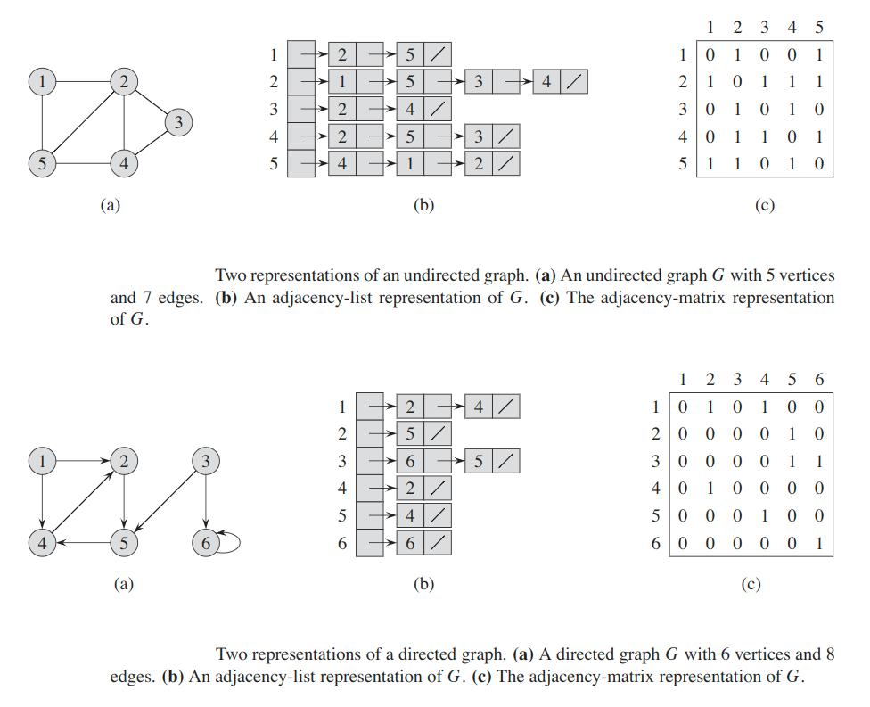
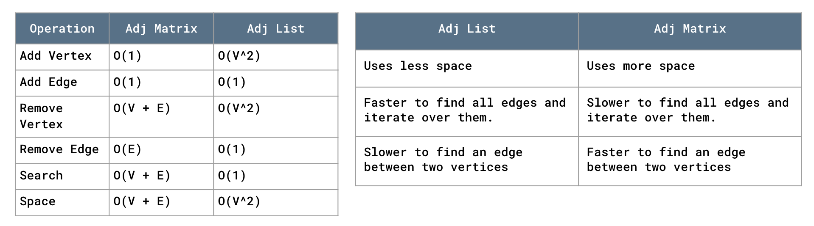
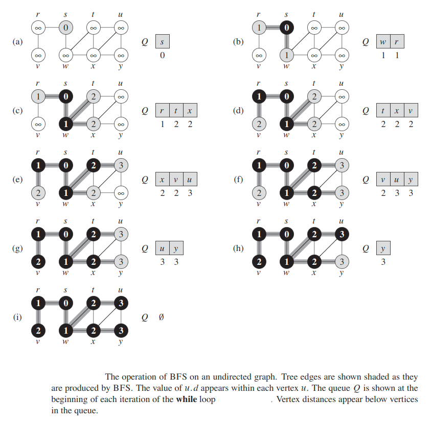
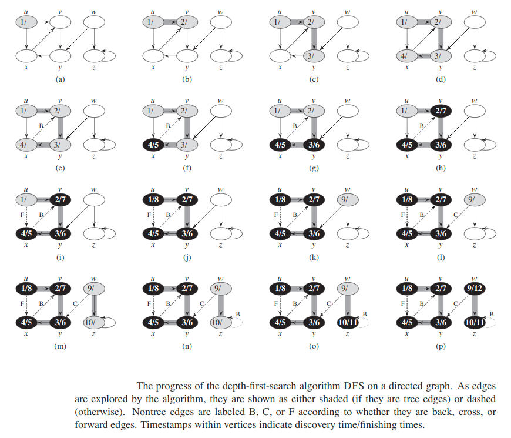
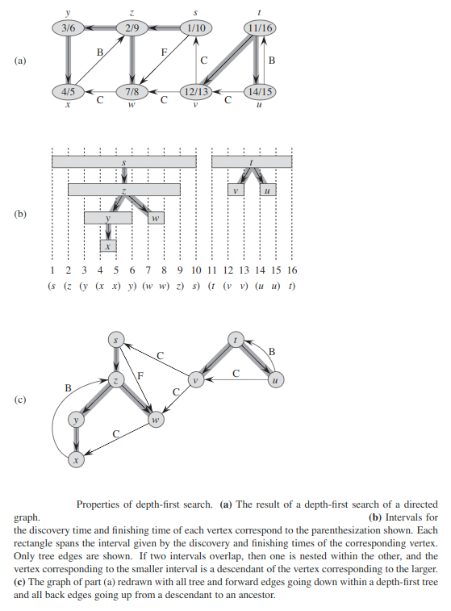
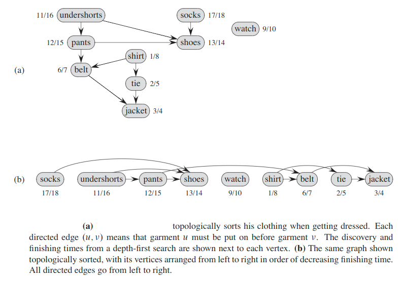
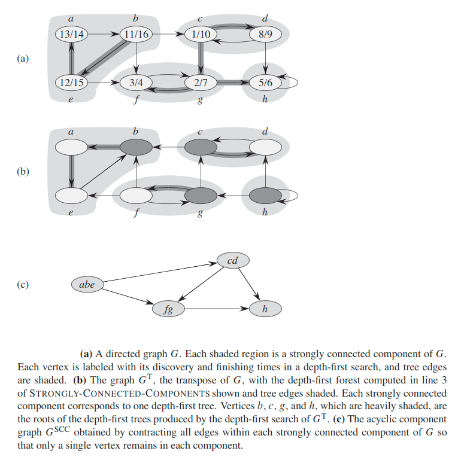
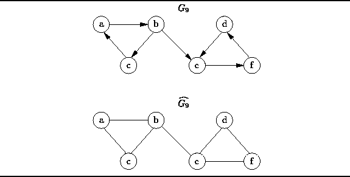

# Graph

## Graph representations
### Adjacency-list Representation
We  can  choose  between  two  standard  ways  to  represent  a  graph `G = (V, E)`: as a collection  of adjacency  lists or as an adjacency  matrix.  Either way applies to both directed and undirected graphs.

The __adjacency-list representation__ of  a  graph `G = (V, E)` consists  of  an  array `Adj` of `|V|` lists, one for each vertex in `V`.  For each `u ∈ V`, the adjacency list `Adj[u]` contains all the vertices such that there is an edge `(u, v) ∈ E`. That is, `Adj[u]` consists of all the vertices adjacent to `u` in `G`.

If `G` is a directed graph, the sum of the lengths of all the adjacency lists is `|E|`, since an edge of the form `(u, v)` is represented by having `v` appear in `Adj[u]`. If `G` is an undirected graph, the sum of the lengths of all the adjacency lists is `2|E|`, since if `(u, v)` is an undirected edge, then `u` appears in `v`’s adjacency list and vice versa. For both directed and undirected graphs, the adjacency-list representation has the desirable property that the amount of memory it requires is `θ(V + E)`.

We can readily adapt adjacency lists to represent __weighted graphs__, that is, graphs for which each edge has an associated __weight__, typically given by a __weight function__ `w: E -> R`. For example, let `G = (V, E)` be a weighted  graph  with weight function `w`.   We  simply  store  the  weight `w(u ,v)` of  the  edge `(u, v) ∈ E` with vertex `v` in `u`’s adjacency list.

A potential disadvantage of the adjacency-list representation is that it provides no quicker way to determine whether a given edge `(u, v)` is present in the graph than to search for `v` in the adjacency list `Adj[u]`.  An adjacency-matrix representation of the graph remedies this disadvantage, but at the cost of using asymptotically more memory.

### Adjacency-matrix Representation
For the adjacency-matrix representation of a graph `G = (V, E)`, we assume that the vertices are numbered `1, 2, ..., |V|` in some arbitrary manner.  Then the adjacency-matrix  representation  of  a  graph `G` consists  of  `|V| x |V|` matrix `A = (a[i, j])` such that: `a[i, j] = {1, if (i, j) ∈ E, 0 otherwise}`

The adjacency matrix of a graph requires‚ `θ(V^2)` memory, independent of the number of edges in the graph.

Observe the symmetry along the main diagonal of the adjacency matrix.   Since in  an undirected  graph, `(u, v)` and `(v, u)` represent  the  same edge, the adjacency matrix `A` of an undirected graph is its own transpose: `A = A^T`. In some applications, it pays to store only the entries on and above the diagonal of the adjacency matrix, thereby cutting the memory needed to store the graph almost in half.

Like the adjacency-list representation of a graph, an adjacency matrix can rep resent a weighted graph. For example, if `G = (V, E)` is a weighted graph with edge-weight function `w`, we can simply store the weight `w(u ,v)` of the edge `(u, v) ∈ E` as the entry in row `u` and column `v` of the adjacency matrix.  If an edge does not exist, we can store a `null` value as its corresponding matrix entry, though for many problems it is convenient to use a value such as `0` or `∞`.

Because the adjacency-list representation provides a compact way to represent __sparse__ graphs — those for which `|E|` is much less than `|V|^2` — it is usually the method of choice.

We may prefer an adjacency-matrix representation,  however, when the graph is __dense__ — `|E|` is close to `|V|^2` — or when we need to be able to tell quickly if there is an edge connecting two given vertices.

## Search
Searching a graph means systematically following the edges of the graph so as to visit  the vertices  of the graph.

### Breadth-first Search (BFS)
Given a graph `G = (V, E))` and a distinguished source vertex `s`,  breadth-first search  systematically  explores  the edges ofGto “discover”  every vertex that is reachable  from `s`.   It  computes  the  distance  (smallest  number  of  edges)  from `s` to each reachable  vertex.

It also produces  a __breadth-first tree__ with root `s` that contains all reachable vertices. For any vertex `v` reachable from `s`, the __simple path__ in the breadth-first tree from `s` to `v` corresponds to a _shortest path_ from `s` to `v` in `G`, that is, a path containing the smallest number of edges.

> The algorithm works on both directed and undirected graphs.

Breadth-first search is so named because it expands the frontier between discovered and undiscovered vertices uniformly across the breadth of the frontier.  That is, the algorithm discovers all vertices at distance `k` from`s` before discovering any vertices at distance `k+1`.

To keep track of progress, breadth-first search colors each vertex __white__, __gray__, or __black__.  All vertices start out white and may later become gray and then black.

Breadth-first search constructs a __breadth-first tree__,  initially containing  only it `s` root, which is the source vertex `s`. Whenever the search discovers a white vertex `v` in the course of scanning the adjacency list of an already discovered vertex `u`, the vertex `v` and the edge `(u, v)` are added to the tree. We say that `u` is the __predecessor__ or __parent__ of `v` in the breadth-first tree. Since a vertex is discovered at most once, it has at most one parent.  Ancestor and descendant relationships in the breadth-first tree are defined relative to the root `s` as usual: if `u` is on the simple path in the tree from the root `s` to vertex `v`, then `u` is an ancestor of `v` and `v` is a descendant of `u`.

#### Analysis
The operations of enqueuing and dequeuing take `O(1)` time, and so the total time devoted to queue operations is `O(V)`. Because the procedure scans the adjacency list of each vertex only when the vertex is dequeued, it scans each adjacency list at most once. Since the sum of the lengths of all the adjacency lists is‚ `O(E)`, the total time spent in scanning  adjacency  lists is `O(E)`.  The overhead  for initialization  is `O(V)`, and thus the total running time of the BFS procedure is `O(V + E)`.

#### Shortest Path
Define the __shortest-path distance__ `d(s, v)` from `s` to `v` as the minimum number of edges in any path from vertex `s` to vertex `v`; if there is no path from `s` to `v`, then `d(s, v) = ∞`.  We call a path of length `d(s, v)` from `s` to `v` a __shortest path__ from `s` to `v`.

#### Theorem (Correctness of breadth-first search)
Let `G = (V, E)` be a directed or undirected graph, and suppose that BFS is run on `G` from a given source vertex `s ∈ V`. Then, during its execution, BFS discovers every  vertex `v ∈ V` that  is  reachable  from  the  sources,  and  upon  termination, `v.d = d(s, v)` for all `v ∈ V`. Moreover, for any vertex `v ≠ s` that is reachable from `s`,  one  of  the  shortest  paths  from `s` to `v` is  a  shortest  path  from `s` to `v.p` followed by the edge `(v.p, v)`.

> In other words: Breadth-first search correctly computes shortest-path distances.

#### Breadth-first trees
The  procedure  BFS  builds  a  breadth-first  tree  as  it  searches  the  graph.

For a graph `G = (V, E)` with sources, we define the predecessor subgraph of `G` as `G_p = (V_p, E_p)`, where:
* `G_p = {v ∈ V: v.p ≠ null} U {s}`
* `E_p = {(v.p, v): v ∈ V_p - {s}}`

The predecessor subgraph `G_p` is a __breadth-first tree__ if `V_p` consists of the vertices reachable from `s` and, for all `v ∈ V_p`, the subgraph `G_p` contains a unique simple path from `s` to `v` that is also a shortest path from `s` to `v` in `G`.  A breadth-first tree is in fact a tree, since it is connected and `|E_p| = |V_p| - 1`. We call the edges in `E_p` tree edges.

__Theorem__: The BFS produces a Breadth First Tree.

### Depth-first Search
Depth-first  search  explores  edges out of the most recently discovered vertex `v` that still has unexplored edges leaving it.Once all of `v`’s edges have been explored, the search “backtracks” to explore edges leaving the vertex from which `v` was discovered.  This process continues until we have discovered all the vertices that are reachable from the original source vertex. If any undiscovered vertices remain, then depth-first search selects one of them asa new source, and it repeats the search from that source. The algorithm repeats this entire process until it has discovered every vertex.

As in breadth-first search, whenever depth-first search discovers a vertex `v` dur-ing a scan of the adjacency list of an already discovered vertex `u`, it records this event  by setting `v`’s predecessor  attribute `v.p` to `u`.

Unlike  breadth-first  search,whose predecessor subgraph forms a tree, the predecessor subgraph produced bya  depth-first  search  may  be  composed  of  several  trees,  because  the  search  may repeat from multiple sources.  Therefore, we define the __predecessor subgraph__ of a depth-first search slightly differently from that of a breadth-first search:

`G_p = (V, E_p)`, where `E_p = {(v.p, v): v ∈ V and v.p ≠ null}`.

The predecessor  subgraph of a depth-first search forms a __depth-first forest__ comprising several __depth-first trees__. The edges in `E_p` are __tree edges__.

As in breadth-first search, depth-first search colors vertices during the search to indicate their state.  Each vertex is initially white, is grayed when it is _discovered_ in the search, and is blackened when it is _visited_, that is, when its adjacency list has been examined completely. This technique guarantees that each vertex ends up in exactly one depth-first tree, so that these trees are disjoint.

Besides creating a depth-first forest, depth-first search also __timestamps__ each vertex.  Each vertex `v` has two timestamps:  the first timestamp`v.d` records when `v` is first discovered (and grayed),  and the second timestamp `v.f` records when the search finishes examining `v`’s adjacency list (and blackens `v`). These timestamps provide important information about the structure of the graph and are generally helpful in reasoning about the behavior of depth-first search.

These timestamps are integers between `1` and `2|V|`, since there is one discovery event and one finishing event foreach of the `|V|` vertices. For every vertex `u`, `u.d < u.f`. Vertex `u` is `WHITE` before time `u.d`, `GRAY` between time `u.d` and time `u.f`, and `BLACK` thereafter.

#### Properties
Per-haps  the  most  basic  property  of  depth-first  search  is  that  the  predecessor  sub-graph `G_p` does  indeed  form  a  forest  of  trees,  since  the  structure  of  the  depth-first trees exactly mirrors the structure of recursive calls of `depthFirstSearchVisit()`.That is, `u = v.p` if and only if `depthFirstSearchVisit(v)` was called during a search of `u`’s  adjacency list.  Additionally,  vertex `v` is a descendant  of vertex `u` in the depth-first forest if and only if `v` is discovered during the time in which `u` is gray.

Another important property of depth-first search is that discovery and finishing times have __parenthesis structure__.  If we represent the discovery of vertex `u` with a left parenthesis __“(u”__ and represent its finishing by a right parenthesis __“u)”__, then the  history  of discoveries  and finishings  makes a well-formed  expression  in the sense that the parentheses are properly nested.

#### Theorem (Parenthesis theorem)
In any depth-first search of a (directed or undirected) graph `G = (V, E)`,for any two vertices `u` and `v`, exactly one of the following three conditions holds:
* the intervals `[u.d, u.f]` and `[v.d, v.f]` are entirely disjoint, and neither `u` nor `v` is a descendant of the other in the depth-first forest,
* the interval `[u.d, u.f]` is  contained entirely within the interval `[v.d, v.f]`, and `u` is a descendant of `v` in a depth-first tree, or
* the interval `[v.d, v.f]` is contained entirely within the interval `[u.d, u.f]`, and `v` is a descendant of `u` in a depth-first tree.

#### Theorem (Nesting of descendants’ intervals)
Vertex `v` is a proper descendant of vertex `u` in the depth-first forest for a (directed or undirected) graph `G` if and only if `u.d < v.d < v.f < u.f`.

#### Theorem (White-path theorem)
In a depth-first forest of a (directed or undirected) graph `G = (V, E)`, vertex `v` is a descendant of vertex `u` if and only if at the time `u.d` that the search discovers `u`,there is a path from `u` to `v` consisting entirely of white vertices.

#### Classification of edges
The type of each edge canprovide important information about a graph.
We can define four edge types in terms of the depth-first forest `G_p` produced by a depth-first search on `G`:
1. __Tree edges__ are edges in the depth-first forest `G_p`. Edge `(u, v)` is a tree edge if `v` was first discovered by exploring edge `(u, v)`.
2. __Back edges__ are those edges `(u, v)` connecting a vertex `u` to an ancestor `v` in a depth-first tree. We consider self-loops, which may occur in directed graphs, to be back edges.
3. __Forward edges__ are those non-tree edges `(u, v)` connecting a vertex `u` to a descendant `v` in a depth-first tree.
4. __Cross edges__ are  all  other  edges.   They can  go  between  vertices  in  the  same depth-first tree, as long as one vertex is not an ancestor of the other, or they can go between vertices in different depth-first trees.

The DFS algorithm has enough information to classify some edges as it encounters them.  The key idea is that when we first explore an edge `(u, v)`,the color of vertex `v` tells us something about the edge:
1. `WHITE` indicates a _tree edge_.
2. `GRAY` indicates a _back edge_.
3. `BLACK` indicates a _forward_ or _cross edge_.

#### Theorem:
In a depth-first search of an _undirected_ graph `G`, every edge of `G` is either a tree edge or a back edge.

## Topological sort
A __topological sort__ of a __dag__ (_directed acyclic graph_) `G = (V, E)` is a linear ordering of all its vertices such that if `G` contains an edge `(u, v)`, then `u` appears before `v` in the ordering. We can view a topological sort of a graph as an ordering of its vertices along a horizontal line so that all directed edges go from left to right.

> If the graph contains a cycle,then no linear ordering is possible.

As an example that arises when Jafar gets dressed  in the morning.   The professor  must put on certain garments before others(e.g., socks before shoes). Other items may be put on in any order (e.g., socks and pants).

A topological sort of this dag therefore gives an order for getting dressed.

#### Lemma
A directed graph `G` is acyclic if and only if a depth-first search of `G` yields no back edges.

#### Theorem
The `topologicalSort()` produces  a  topological  sort  of  the  directed  acyclic  graph.

_Proof_: Suppose that  DFS  is run on a given dag `G = (V, E)` to determine  finishing (time when vertex is blacken) times for its vertices.  It suffices to show that for any pair of distinct vertices `u, v ∈ V`, if `G` contains an edge from `u` to `v`, then `v.f < u.f`.  Consider any edge `(u, v)` explored by `DFS`.

* When this edge is explored, `v` cannot be gray, since then `v` would be an ancestor of `u` and `(u, v)` would be a back edge, contradicting above Lemma.  * Therefore, `v` must be either white or black. If `v` is white, it becomes a descendant of `u`, and so `v.f < u.f`.
* If `v` is black, it has already been finished/visited, so that `v.f` has already been set.

Because we are still exploring from `u`, we have yet to assign a timestamp to `u.f`, and so once we do, we will have `v.f < u.f` as well.  Thus,  for any edge `(u, v)` in the dag, we have `v.f < u.f`,  proving  the theorem.

## Strongly connected components
The __strongly connected component (SCC)__  of  a  directed graph `G = (V, E)` is a maximal set of vertices `C ⊆ V` such that for every pair of vertices `u` and `v` in `C`, we have both `u -> v` and `v -> u`; that is, vertices `u` and `v` are reachable from each other.

> A directed graph is strongly connected if there is a path between all pairs of vertices.

Transpose of graph `G` is `G^T = (V, E^T)`, where `E^T = {(u, v): (v, u) ∈ E}`. That is, `E^T` consists of the edges of `G` with their directions reversed.

It is interesting to observe that `G` and `G^T` have exactly the same strongly connected components: `u` and `v` are reach-able from each other in `G` if and only if they are reachable from each other in `G^T`.

#### Lemma
Let `C` and `C'` be distinct strongly connected components in directed graph `G = (V, E)`, let `u, v ∈ C`, let `u', v' ∈ C'`, and suppose that `G` contains a path `u -> u'`. Then `G` cannot also contain a path `v' -> v`.

__Out-Degree__ of `u` refers to the number of edges directed away from the vertex `u`.

__In-Degree__ of `u` refers to the number of edges directed towards the vertex `u`.

## Weakly Connected Graph
A graph `G = (U, V)` is weakly connected, if the _underlying undirected graph_ of `G` is connected.

As you can see, the underlying undirected graph is a graph `G` without direction on edges.

## Graph Isomorphism
In mathematics, a __bijection__, one-to-one correspondence, or invertible function, is a function between the elements of two sets, where

* Each element of one set is paired with exactly one element of the other set
* Each element of the other set is paired with exactly one element of the first set.
* There are no unpaired elements.

In graph theory, an __isomorphism__ of graphs `G` and `H` is a _bijection_ between the vertex sets of `G` and `H`: `f: V(G) -> V(H)` such that any two vertices `u` and `v` of `G` are adjacent in `G` if and only if `f(u)` and `f(v)` are adjacent in `H`.

If an isomorphism exists between two graphs, then the graphs are called isomorphic and denoted as `G  H`.

In other words two graphs are isomorphic, is they have a similar structure

### Graph isomorphism problem
The __graph isomorphism problem__ is the computational problem of determining whether two finite graphs are isomorphic.

The problem is not known to be solvable in polynomial time nor to be NP-complete.

---

#### [Read More](https://www.programiz.com/dsa/graph)

#### [Kosaraju's Algorithm: Strongly Connected Components](https://www.youtube.com/watch?v=5wFyZJ8yH9Q)
