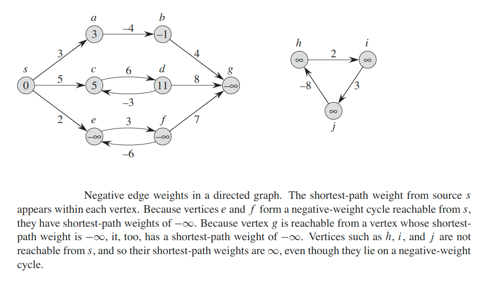

# Graph

## Graph representations
### Adjacency-list Representation
We  can  choose  between  two  standard  ways  to  represent  a  graph `G = (V, E)`: as a collection  of adjacency  lists or as an adjacency  matrix.  Either way applies to both directed and undirected graphs.


The __adjacency-list representation__ of  a  graph `G = (V, E)` consists  of  an  array `Adj` of `|V|` lists, one for each vertex in `V`.  For each `u ∈ V`, the adjacency list `Adj[u]` contains all the vertices such that there is an edge `(u, v) ∈ E`. That is, `Adj[u]` consists of all the vertices adjacent to `u` in `G`.

If `G` is a directed graph, the sum of the lengths of all the adjacency lists is `|E|`, since an edge of the form `(u, v)` is represented by having `v` appear in `Adj[u]`. If `G` is an undirected graph, the sum of the lengths of all the adjacency lists is `2|E|`, since if `(u, v)` is an undirected edge, then `u` appears in `v`’s adjacency list and vice versa. For both directed and undirected graphs, the adjacency-list representation has the desirable property that the amount of memory it requires is `θ(V + E)`.

We can readily adapt adjacency lists to represent __weighted graphs__, that is, graphs for which each edge has an associated __weight__, typically given by a __weight function__ `w: E -> ℝ`. For example, let `G = (V, E)` be a weighted  graph  with weight function `w`.   We  simply  store  the  weight `w(u ,v)` of  the  edge `(u, v) ∈ E` with vertex `v` in `u`’s adjacency list.

A potential disadvantage of the adjacency-list representation is that it provides no quicker way to determine whether a given edge `(u, v)` is present in the graph than to search for `v` in the adjacency list `Adj[u]`.  An adjacency-matrix representation of the graph remedies this disadvantage, but at the cost of using asymptotically more memory.

### Adjacency-matrix Representation
For the adjacency-matrix representation of a graph `G = (V, E)`, we assume that the vertices are numbered `1, 2, ..., |V|` in some arbitrary manner.  Then the adjacency-matrix  representation  of  a  graph `G` consists  of  `|V| x |V|` matrix `A = (a[i, j])` such that: `a[i, j] = {1, if (i, j) ∈ E, 0 otherwise}`

The adjacency matrix of a graph requires‚ `θ(V^2)` memory, independent of the number of edges in the graph.

Observe the symmetry along the main diagonal of the adjacency matrix.   Since in  an undirected  graph, `(u, v)` and `(v, u)` represent  the  same edge, the adjacency matrix `A` of an undirected graph is its own transpose: `A = A^T`. In some applications, it pays to store only the entries on and above the diagonal of the adjacency matrix, thereby cutting the memory needed to store the graph almost in half.

Like the adjacency-list representation of a graph, an adjacency matrix can rep resent a weighted graph. For example, if `G = (V, E)` is a weighted graph with edge-weight function `w`, we can simply store the weight `w(u ,v)` of the edge `(u, v) ∈ E` as the entry in row `u` and column `v` of the adjacency matrix.  If an edge does not exist, we can store a `null` value as its corresponding matrix entry, though for many problems it is convenient to use a value such as `0` or `∞`.


Because the adjacency-list representation provides a compact way to represent __sparse__ graphs — those for which `|E|` is much less than `|V|^2` — it is usually the method of choice.

We may prefer an adjacency-matrix representation,  however, when the graph is __dense__ — `|E|` is close to `|V|^2` — or when we need to be able to tell quickly if there is an edge connecting two given vertices.


### Incidence matrix
In graph theory, a vertex is __incident__ to an edge if the vertex is one of the two vertices the edge connects.

__Incidence matrix__ is that (0, 1)-matrix which represents the graph such that with the help of that matrix we can draw a graph.

The __incidence matrix__ of a directed graph `G = (V, E)` with no self-loops is a `|V| x |E|` matrix `B = (b_ij)` such that:

`b_ij =`
* `-1, if j leaves vertex i`
* `1, if edge j enters vertex i`
* `0, otherwise`

## Search
Searching a graph means systematically following the edges of the graph so as to visit  the vertices  of the graph.


### Breadth-first Search (BFS)
Given a graph `G = (V, E))` and a distinguished source vertex `s`,  breadth-first search  systematically  explores  the edges ofGto “discover”  every vertex that is reachable  from `s`.   It  computes  the  distance  (smallest  number  of  edges)  from `s` to each reachable  vertex.

It also produces  a __breadth-first tree__ with root `s` that contains all reachable vertices. For any vertex `v` reachable from `s`, the __simple path__ in the breadth-first tree from `s` to `v` corresponds to a _shortest path_ from `s` to `v` in `G`, that is, a path containing the smallest number of edges.

> The algorithm works on both directed and undirected graphs.

Breadth-first search is so named because it expands the frontier between discovered and undiscovered vertices uniformly across the breadth of the frontier.  That is, the algorithm discovers all vertices at distance `k` from`s` before discovering any vertices at distance `k+1`.

To keep track of progress, breadth-first search colors each vertex __white__, __gray__, or __black__.  All vertices start out white and may later become gray and then black.

Breadth-first search constructs a __breadth-first tree__,  initially containing  only it `s` root, which is the source vertex `s`. Whenever the search discovers a white vertex `v` in the course of scanning the adjacency list of an already discovered vertex `u`, the vertex `v` and the edge `(u, v)` are added to the tree. We say that `u` is the __predecessor__ or __parent__ of `v` in the breadth-first tree. Since a vertex is discovered at most once, it has at most one parent.  Ancestor and descendant relationships in the breadth-first tree are defined relative to the root `s` as usual: if `u` is on the simple path in the tree from the root `s` to vertex `v`, then `u` is an ancestor of `v` and `v` is a descendant of `u`.


#### Analysis
The operations of enqueuing and dequeuing take `O(1)` time, and so the total time devoted to queue operations is `O(V)`. Because the procedure scans the adjacency list of each vertex only when the vertex is dequeued, it scans each adjacency list at most once. Since the sum of the lengths of all the adjacency lists is‚ `O(E)`, the total time spent in scanning  adjacency  lists is `O(E)`.  The overhead  for initialization  is `O(V)`, and thus the total running time of the BFS procedure is `O(V + E)`.

#### Shortest Path
Define the __shortest-path distance__ `d(s, v)` from `s` to `v` as the minimum number of edges in any path from vertex `s` to vertex `v`; if there is no path from `s` to `v`, then `d(s, v) = ∞`.  We call a path of length `d(s, v)` from `s` to `v` a __shortest path__ from `s` to `v`.

#### Theorem (Correctness of breadth-first search)
Let `G = (V, E)` be a directed or undirected graph, and suppose that BFS is run on `G` from a given source vertex `s ∈ V`. Then, during its execution, BFS discovers every  vertex `v ∈ V` that  is  reachable  from  the  sources,  and  upon  termination, `v.d = d(s, v)` for all `v ∈ V`. Moreover, for any vertex `v ≠ s` that is reachable from `s`,  one  of  the  shortest  paths  from `s` to `v` is  a  shortest  path  from `s` to `v.p` followed by the edge `(v.p, v)`.

> In other words: Breadth-first search correctly computes shortest-path distances.

#### Breadth-first trees
The  procedure  BFS  builds  a  breadth-first  tree  as  it  searches  the  graph.

For a graph `G = (V, E)` with sources, we define the predecessor subgraph of `G` as `G_p = (V_p, E_p)`, where:
* `G_p = {v ∈ V: v.p ≠ null} U {s}`
* `E_p = {(v.p, v): v ∈ V_p - {s}}`

The predecessor subgraph `G_p` is a __breadth-first tree__ if `V_p` consists of the vertices reachable from `s` and, for all `v ∈ V_p`, the subgraph `G_p` contains a unique simple path from `s` to `v` that is also a shortest path from `s` to `v` in `G`.  A breadth-first tree is in fact a tree, since it is connected and `|E_p| = |V_p| - 1`. We call the edges in `E_p` tree edges.

__Theorem__: The BFS produces a Breadth First Tree.


### Depth-first Search
Depth-first  search  explores  edges out of the most recently discovered vertex `v` that still has unexplored edges leaving it.Once all of `v`’s edges have been explored, the search “backtracks” to explore edges leaving the vertex from which `v` was discovered.  This process continues until we have discovered all the vertices that are reachable from the original source vertex. If any undiscovered vertices remain, then depth-first search selects one of them asa new source, and it repeats the search from that source. The algorithm repeats this entire process until it has discovered every vertex.

As in breadth-first search, whenever depth-first search discovers a vertex `v` during a scan of the adjacency list of an already discovered vertex `u`, it records this event  by setting `v`’s predecessor  attribute `v.p` to `u`.

Unlike  breadth-first  search, whose predecessor subgraph forms a tree, the predecessor subgraph produced by a  depth-first  search  may  be  composed  of  several  trees,  because  the  search  may repeat from multiple sources.  Therefore, we define the __predecessor subgraph__ of a depth-first search slightly differently from that of a breadth-first search:

`G_p = (V, E_p)`, where `E_p = {(v.p, v): v ∈ V and v.p ≠ null}`.

The predecessor  subgraph of a depth-first search forms a __depth-first forest__ comprising several __depth-first trees__. The edges in `E_p` are __tree edges__.

As in breadth-first search, depth-first search colors vertices during the search to indicate their state.  Each vertex is initially white, is grayed when it is _discovered_ in the search, and is blackened when it is _visited_, that is, when its adjacency list has been examined completely. This technique guarantees that each vertex ends up in exactly one depth-first tree, so that these trees are disjoint.

Besides creating a depth-first forest, depth-first search also __timestamps__ each vertex.  Each vertex `v` has two timestamps:  the first timestamp`v.d` records when `v` is first discovered (and grayed),  and the second timestamp `v.f` records when the search finishes examining `v`’s adjacency list (and blackens `v`). These timestamps provide important information about the structure of the graph and are generally helpful in reasoning about the behavior of depth-first search.

These timestamps are integers between `1` and `2|V|`, since there is one discovery event and one finishing event foreach of the `|V|` vertices. For every vertex `u`, `u.d < u.f`. Vertex `u` is `WHITE` before time `u.d`, `GRAY` between time `u.d` and time `u.f`, and `BLACK` thereafter.


#### Properties
Perhaps  the  most  basic  property  of  depth-first  search  is  that  the  predecessor  sub-graph `G_p` does  indeed  form  a  forest  of  trees,  since  the  structure  of  the  depth-first trees exactly mirrors the structure of recursive calls of `depthFirstSearchVisit()`.That is, `u = v.p` if and only if `depthFirstSearchVisit(v)` was called during a search of `u`’s  adjacency list.  Additionally,  vertex `v` is a descendant  of vertex `u` in the depth-first forest if and only if `v` is discovered during the time in which `u` is gray.

Another important property of depth-first search is that discovery and finishing times have __parenthesis structure__.  If we represent the discovery of vertex `u` with a left parenthesis __“(u”__ and represent its finishing by a right parenthesis __“u)”__, then the  history  of discoveries  and finishings  makes a well-formed  expression  in the sense that the parentheses are properly nested.

#### Theorem (Parenthesis theorem)
In any depth-first search of a (directed or undirected) graph `G = (V, E)`, for any two vertices `u` and `v`, exactly one of the following three conditions holds:
* the intervals `[u.d, u.f]` and `[v.d, v.f]` are entirely disjoint, and neither `u` nor `v` is a descendant of the other in the depth-first forest,
* the interval `[u.d, u.f]` is  contained entirely within the interval `[v.d, v.f]`, and `u` is a descendant of `v` in a depth-first tree, or
* the interval `[v.d, v.f]` is contained entirely within the interval `[u.d, u.f]`, and `v` is a descendant of `u` in a depth-first tree.

#### Theorem (Nesting of descendants’ intervals)
Vertex `v` is a proper descendant of vertex `u` in the depth-first forest for a (directed or undirected) graph `G` if and only if `u.d < v.d < v.f < u.f`.

#### Theorem (White-path theorem)
In a depth-first forest of a (directed or undirected) graph `G = (V, E)`, vertex `v` is a descendant of vertex `u` if and only if at the time `u.d` that the search discovers `u`, there is a path from `u` to `v` consisting entirely of white vertices.

#### Classification of edges
The type of each edge canprovide important information about a graph.
We can define four edge types in terms of the depth-first forest `G_p` produced by a depth-first search on `G`:
1. __Tree edges__ are edges in the depth-first forest `G_p`. Edge `(u, v)` is a tree edge if `v` was first discovered by exploring edge `(u, v)`.
2. __Back edges__ are those edges `(u, v)` connecting a vertex `u` to an ancestor `v` in a depth-first tree. We consider self-loops, which may occur in directed graphs, to be back edges.
3. __Forward edges__ are those non-tree edges `(u, v)` connecting a vertex `u` to a descendant `v` in a depth-first tree.
4. __Cross edges__ are  all  other  edges.   They can  go  between  vertices  in  the  same depth-first tree, as long as one vertex is not an ancestor of the other, or they can go between vertices in different depth-first trees.


The DFS algorithm has enough information to classify some edges as it encounters them.  The key idea is that when we first explore an edge `(u, v)`, the color of vertex `v` tells us something about the edge:
1. `WHITE` indicates a _tree edge_.
2. `GRAY` indicates a _back edge_.
3. `BLACK` indicates a _forward_ or _cross edge_.


#### Theorem:
In a depth-first search of an _undirected_ graph `G`, every edge of `G` is either a tree edge or a back edge.


### Best-first Search
All search methods can be broadly classified into two categories:
* __Uninformed (or Exhaustive or Blind) methods__, where the search is carried out without any additional information that is already provided in the problem statement. Some examples include Breadth First Search, Depth First Search etc.
* __Informed (or Heuristic) methods__, where search is carried out by using additional information to determine the next step towards finding the solution. Best First Search is an example of such algorithms

Informed search methods are more efficient, low in cost and high in performance as compared to the uninformed search methods.

In BFS and DFS, when we are at a node, we can consider any of the adjacent as next node. So both BFS and DFS blindly explore paths without considering any cost function. The idea of Best First Search is to use an evaluation function to decide which adjacent is most promising and then explore.

It makes use of the concept of priority queues and heuristic search. The objective of this algorithm is to reach the goal state or final state from an initial state by the shortest route possible.

> It can get stuck in loops.

#### [Watch more here](https://www.youtube.com/watch?v=dv1m3L6QXWs)


## Topological sort
A __topological sort__ of a __dag__ (_directed acyclic graph_) `G = (V, E)` is a linear ordering of all its vertices such that if `G` contains an edge `(u, v)`, then `u` appears before `v` in the ordering. We can view a topological sort of a graph as an ordering of its vertices along a horizontal line so that all directed edges go from left to right.

> If the graph contains a cycle, then no linear ordering is possible.

As an example that arises when Jafar gets dressed  in the morning.   The professor  must put on certain garments before others(e.g., socks before shoes). Other items may be put on in any order (e.g., socks and pants).


A topological sort of this dag therefore gives an order for getting dressed.

#### Lemma
A directed graph `G` is acyclic if and only if a depth-first search of `G` yields no back edges.

#### Theorem
The `topologicalSort()` produces  a  topological  sort  of  the  directed  acyclic  graph.

_Proof_: Suppose that  DFS  is run on a given dag `G = (V, E)` to determine  finishing (time when vertex is blacken) times for its vertices.  It suffices to show that for any pair of distinct vertices `u, v ∈ V`, if `G` contains an edge from `u` to `v`, then `v.f < u.f`.  Consider any edge `(u, v)` explored by `DFS`.

* When this edge is explored, `v` cannot be gray, since then `v` would be an ancestor of `u` and `(u, v)` would be a back edge, contradicting above Lemma.  * Therefore, `v` must be either white or black. If `v` is white, it becomes a descendant of `u`, and so `v.f < u.f`.
* If `v` is black, it has already been finished/visited, so that `v.f` has already been set.

Because we are still exploring from `u`, we have yet to assign a timestamp to `u.f`, and so once we do, we will have `v.f < u.f` as well.  Thus,  for any edge `(u, v)` in the dag, we have `v.f < u.f`,  proving  the theorem.


## Strongly connected components
The __strongly connected component (SCC)__  of  a  directed graph `G = (V, E)` is a maximal set of vertices `C ⊆ V` such that for every pair of vertices `u` and `v` in `C`, we have both `u -> v` and `v -> u`; that is, vertices `u` and `v` are reachable from each other.

> A directed graph is strongly connected if there is a path between all pairs of vertices.

Transpose of graph `G` is `G^T = (V, E^T)`, where `E^T = {(u, v): (v, u) ∈ E}`. That is, `E^T` consists of the edges of `G` with their directions reversed.

It is interesting to observe that `G` and `G^T` have exactly the same strongly connected components: `u` and `v` are reachable from each other in `G` if and only if they are reachable from each other in `G^T`.


An algorithm for finding the strongly connected components of a directed graph is called a [Kosaraju's algorithm](https://www.youtube.com/watch?v=Jb1XlDsr46o).

An algorithm for finding the strongly connected components of a directed graph is called a [Tarjan's algorithm](https://en.wikipedia.org/wiki/Tarjan%27s_strongly_connected_components_algorithm).

#### Lemma
Let `C` and `C'` be distinct strongly connected components in directed graph `G = (V, E)`, let `u, v ∈ C`, let `u', v' ∈ C'`, and suppose that `G` contains a path `u -> u'`. Then `G` cannot also contain a path `v' -> v`.

__Degree__ of a graph vertex `v` of a graph is the number of graph edges which touch `v`.

__Out-Degree__ of `u` refers to the number of edges directed away from the vertex `u`.

__In-Degree__ of `u` refers to the number of edges directed towards the vertex `u`.


## Weakly Connected Graph
A graph `G = (U, V)` is weakly connected, if the _underlying undirected graph_ of `G` is connected.


As you can see, the underlying undirected graph is a graph `G` without direction on edges.

## Graph Isomorphism
In mathematics, a __bijection__, one-to-one correspondence, or invertible function, is a function between the elements of two sets, where

* Each element of one set is paired with exactly one element of the other set
* Each element of the other set is paired with exactly one element of the first set.
* There are no unpaired elements.

In graph theory, an __isomorphism__ of graphs `G` and `H` is a _bijection_ between the vertex sets of `G` and `H`: `f: V(G) -> V(H)` such that any two vertices `u` and `v` of `G` are adjacent in `G` if and only if `f(u)` and `f(v)` are adjacent in `H`.

If an isomorphism exists between two graphs, then the graphs are called __isomorphic__.

In other words two graphs are isomorphic, is they have a similar structure


### Graph isomorphism problem
The __graph isomorphism problem__ is the computational problem of determining whether two finite graphs are isomorphic.

The problem is not known to be solvable in polynomial time nor to be NP-complete.


## Eulerian Path
__Eulerian Path__ is a path in graph that visits every edge exactly once. __Eulerian Circuit__ is an Eulerian Path which starts and ends on the same vertex.

The problem is same as following question: “_Is it possible to draw a given graph without lifting pencil from the paper and without tracing any of the edges more than once?_”.

A graph is called __Eulerian__ if it has an __Eulerian Cycle__ and called __Semi-Eulerian__ if it has an Eulerian Path.

### Undirected Graph
_An undirected graph has Eulerian Cycle_ if following two conditions are true:
* All vertices with non-zero degree are connected. We don’t care about vertices with zero degree because they don’t belong to Eulerian Cycle or Path (we only consider all edges).
* All vertices have even (четный) degree.

_An undirected graph has Eulerian Path_ if following two conditions are true:
* All vertices with non-zero degree are connected. We don’t care about vertices with zero degree because they don’t belong to Eulerian Cycle or Path (we only consider all edges).
* If zero or two vertices have odd (нечетный) degree and all other vertices have even degree. Note that only one vertex with odd degree is not possible in an undirected graph (sum of all degrees is always even in an undirected graph)

> Note that a graph with no edges is considered Eulerian because there are no edges to traverse.


### Directed Graph
A directed graph has an Eulerian cycle if following conditions are true:
* All vertices with nonzero degree belong to a single strongly connected component. 
* In degree is equal to the out degree for every vertex.

### Fleury’s Algorithm
An edge in an undirected connected graph is a __bridge__ if removing it disconnects the graph. For a disconnected undirected graph, definition is similar, a bridge is an edge removing which increases number of disconnected components.

A vertex in an undirected connected graph is an __articulation point__ (or cut vertex) if removing it (and edges through it) disconnects the graph. For a disconnected undirected graph, an articulation point is a vertex removing which increases number of connected components.

Both represent vulnerabilities in a connected network and are useful for designing reliable networks.

Fleury’s Algorithm for printing Eulerian trail or cycle in an _undirected graph_:
1. Make sure the graph has either `0` or `2` odd vertices.
2. If there are `0` odd vertices, start anywhere. If there are `2` odd vertices, start at one of them.
3. Follow edges one at a time. If you have a choice between a bridge and a non-bridge, always choose the non-bridge.

## Hamiltonian Path
Hamiltonian Path in an undirected graph is a path that visits each vertex exactly once. A Hamiltonian cycle (or Hamiltonian circuit) is a Hamiltonian Path such that there is an edge (in the graph) from the last vertex to the first vertex of the Hamiltonian Path.


## Minimum Spanning Tree
Assume that we have a connected,  undirected  graph `G = (V, E)` with a weight function `w: E -> ℝ`, where `R` is the set of real numbers.

__Spanning Tree__ `T` of _connected and undirected graph_ `G = (V, E)` is _acyclic and connected tree_ that connects all of the vertices and `T ⊆ E`.

__Minimum Spanning Tree__ is a spanning tree whose total weight `w(T)` of all edges is minimized.


A __cut__ `(S, V-S)` of an undirected graph `G = (V, E)` is a partition of `V`.

We say that an edge `(u, v) ∈ E` __crosses__ the cut `(S, V-S)` if one of its endpoints is in `S` and the other is in `V-S`.

We say that a cut __respects__ a set `A` of edges if no edge in `A` crosses the cut.

An edge is a __light edge__ crossing a cut if its weight is the minimum of any edge crossing the cut.


`A` is a subset of some minimum spanning tree. An edge `(u,v)` that we can add to `A` without violating this invariant, in the sense that `A U {(u, v)}` is also a subset of a minimum spanning tree is called __safe edge__.

A minimum spanning tree has `V – 1` edges where `V` is the number of vertices in the given graph.

#### Theorem
Let `G = (V, E)` be a connected, undirected graph with a real-valued weight function `w` defined on `E`. Let `A` be a subset of `E` that is included in some minimum spanning tree for `G`, let `(S, V-S)` be any cut of `G` that respects `A`, and let `(u, v)` be a light edge crossing `(S, V-S)`. Then, edge `(u, v)` is safe for `A`.

### Kruskal’s Algorithm
The set `A` is a forest whose vertices are all those of the given graph.

The safe edge added to `A` is always a least-weight edge in the graph that connects two distinct components.

Kruskal’s algorithm finds a safe edge to add to the growing forest by finding, of all the edges that connect any two trees in the forest, an edge `(u, v)` of least weight. So, it is a greedy algorithm.

Below are the steps for finding MST using Kruskal’s algorithm
1. Sort all the edges in non-decreasing order of their weight. 
2. Pick the smallest edge. Check if it forms a cycle with the spanning tree formed so far. If cycle is not formed, include this edge. Else, discard it. 
3. Repeat step #2 until there are `V-1` edges in the spanning tree.

#### Complexity Analysis
The time to sort the edges is `O(E lgE)`.

`findSet()` and `union()` operations on the disjoint-set forest performs `O(E)` times.  Along with the `|V|` `makeSet()` operations, these take a total of `O((V + E) * ⍺(V))` time, where `⍺` is the very slowly growing function.

Because we assume that `G` is connected, we have `|E| ≥ |V| - 1`, and so the disjoint-set operations take `O((V + E) * ⍺(V)) ≤ O(2E * ⍺(V)) ≤ O(E * ⍺(V))` time.

Moreover, since `⍺(|V|) = O(lg V) = O(lg E)`, the total running time of Kruskal’s algorithm is `O(E * lgE)`.

Observing that `|E| < |V|^2`, we have `lg|E| = O(lgV)`, and so we can restate the running time of Kruskal’s algorithm as `O(E * lgV)`.

Note: `disjointSet.findByValue()` is considered to have complexity of `O(1)`.


### Prim's Algorithm
Prim’s algorithm operates much like Dijkstra’s algorithm for finding shortest paths in a graph

Prim’s algorithm has the property that the edges in the set `A` always form  a single  tree.

Like Kruskal’s algorithm, Prim’s algorithm is also a Greedy algorithm. It starts with an empty spanning tree. The idea is to maintain two sets of vertices. The first set contains the vertices already included in the MST, the other set contains the vertices not yet included. At every step, it considers all the edges that connect the two sets, and picks the minimum weight edge from these edges. After picking the edge, it moves the other endpoint of the edge to the set containing MST.

So, at every step of Prim’s algorithm, we find a cut, pick the minimum weight edge from the cut and include this vertex to MST Set.


Watch this [video](https://www.youtube.com/watch?v=eB61LXLZVqs&t=202s) to find out how the algorithm works.

#### Complexity Analysis
We can use the `buildMinHeap()` procedure to perform lines `O(V)` time. The body of the `while` loop executes `|V|` times, and since each `extractMin()` operation takes `O(lgV)` time, the total time for all calls to `extractMin()` is `O(V * lgV)`.

The `forEach()` loop executes `O(E)` times altogether, since the sum of the lengths of all adjacency lists is `2|E|`.

Within the `forEach()` loop, we can implement the test for membership in `Q` in in constant time by keeping a bit for each vertex that tells whether or not it is in `Q`, and updating the bit when the vertex is removed from `Q`.

`increasePriority()` operation on the min-heap, which a binary min-heap supports in `O(lgV)` time.  Thus, the total time for Prim’s algorithm is `O(V* lgV + E * lgV) = O(E * lgV)`, which is asymptotically the same as for our implementation of Kruskal’s algorithm.

#### Improvement
We can improve the asymptotic running time of Prim’s algorithm by using Fibonacci heaps. A Fibonacci heap holds `|V|` elements, an `extractMin()` operation  takes `O(lgV)` amortized time and a `decreaseKey()` operation takes `O(1)` amortized time. Therefore, if we use a Fibonacci heap to implement the min-priority queue, the running time of Prim’s algorithm improves to `O(E + V*lgV)`.

### Prim's Algorithm vs Kruskal’s Algorithm
| __Prim__ | __Kruskal__ |
| --- | --- |
| Prim’s algorithm has a time complexity of `O(E log V)`. Can be improved to `O(E + V*lgV)` using Fibonacci Heap | Kruskal’s algorithm’s time complexity is `O(E log V)` |
| It starts to build the Minimum Spanning Tree from any vertex in the graph | It starts to build the Minimum Spanning Tree from the vertex carrying minimum weight in the graph |
| It traverses one node more than one time to get the minimum distance | It traverses one node only once |
| Prim’s algorithm gives connected component as well as it works only on connected graph | Kruskal’s algorithm can generate forest(disconnected components) at any instant as well as it can work on disconnected components |
| Prim’s algorithm runs faster in dense graphs | Kruskal’s algorithm runs faster in sparse graphs |
| Prim’s algorithm is a greedy algorithm. | Kruskal’s algorithm is a greedy algorithm. |


## Single-Source Shortest Paths
In a __shortest-paths problem__,  we are given a _weighted_, _directed_  graph `G = (V, E)`, with weight function `w: E -> ℝ` mapping  edges to real-valued weights. The weight `w(p)` of path `p = <v0, v1, ... v_k>` is the sum of the weights of its constituent edges.


Edge  weights  can  represent  metrics  other  than  distances,  such  as  time,  cost, penalties, loss,  or any other  quantity  that accumulates  linearly  along  a path and that we would want to minimize.

> The breadth-first-search  algorithm is a shortest-paths algorithm that works on unweighted graphs.

given a graph `G = (V, E)`, we want to find a shortest path from a given source vertex `s ∈ V` to each vertex `v ∈ V`.  The algorithm  for the single-source  problem can solve many other problems, including the following variants:
* __Single-destination shortest-paths problem__: Find a shortest path to a given _destination_ vertex `t` from each vertex `v`. By reversing the direction of each edge in the graph, we can reduce this problem to a single-source problem.
* __Single-pair shortest-path problem__: Find a shortest  path from `u` to `v` for  given vertices `u` and `v`. If we solve the single-source problem with source vertex `u`, we solve this problem also.  Moreover, all known algorithms for this problem have  the  same  worst-case  asymptotic  running  time  as  the  best  single-source algorithms.
* All-pairs shortest-paths problem: Find a shortest path from `u` to `v` for every pair of vertices `u` and `v`.  Although we can solve this problem by running a single-source algorithm once from each vertex, we usually can solve it faster.

#### Optimal substructure of a shortest path
Shortest-paths  algorithms  typically  rely  on  the  property  that  a  shortest  path  between  two vertices  contains  other  shortest  paths  within it.

#### Negative-weight edges
Some  instances  of  the  single-source  shortest-paths  problem  may  include  edges whose  weights  are  negative.    If  the  graph contains  no  negative-weight cycles reachable  from the source `s`,  then for  all `v ∈ V`,  the shortest-path weight `ẟ(s, v)` remains well defined, even if it has a negative value.  If the graph contains a negative-weight cycle reachable from `s`, however, shortest-path weights are  not  well  defined.   No  path  from `s` to  a  vertex  on  the  cycle  can  be  a  shortest path we can always find a path with lower weight by following the proposed “shortest” path and then traversing the negative-weight cycle one more time. If there is a negative-weight cycle on some path from `s` to `v`, we define `ẟ(s, v) = -∞`.



Shortest path  cannot  contain  a negative-weight  cycle. Nor can it contain a positive-weight  cycle,  since removing the cycle from the path produces a path with the same source and destination vertices and a lower path weight.

#### Representing shortest paths
We maintain for each vertex `v ∈ V` a predecessor `v.p` that is either another vertex or `null`.The shortest-paths algorithms in this chapter set the `p` attributes so that the chain of predecessors originating at a vertex `v` runs backwards along a shortest path from `s` to `v`.

A __shortest-paths tree__ is like the breadth-first tree, but it contains shortest paths from the source defined in terms of edge weights instead of numbers of edges.  To be precise, let `G = (V, E)` be a weighted, directed graph with weight function `w: E -> ℝ`, and assume that `G` contains no negative-weight cycles  reachable  from  the  source  vertex `s ∈ V`,  so  that  shortest  paths  are  well defined.  A __shortest-paths tree__ rooted at `s` is a directed subgraph `G' = (V', E')`, where `V' ⊆ V` and `E' ⊆ E`, such that
1. `V'` is the set of vertices reachable from `s` in `G`
2. `G'` forms a rooted tree with root `s`
3. For all `v ∈ V'`, the unique simple path from `s` to `v` in `G'` is a shortest path from `s` to `v` in `G`.


> Shortest paths are not necessarily unique, and neither are shortest-paths trees.

#### Relaxation
For each vertex `v ∈ V`, we maintain an attribute `v.d`, which is an upper bound on the weight of a shortest path from source `s` to `v`. We call  `v.d` a __shortest-path estimate__.

The process of relaxing an edge `(u, v)` consists of testing whether we can improve  the  shortest  path  to `v` found  so far  by going  through `u` and,  if  so,  updating `v.d` and `v.p`.  A relaxation step may decrease the value of the shortest-path estimate `v.d` and update `v`’s predecessor  attribute `v.p`.

#### Properties of shortest paths and relaxation


### The Bellman-Ford Algorithm
The Bellman-Ford algorithm solves the single-source  shortest-paths  problem in the general case in which edge weights may be negative.  Given a weighted,  directed graph `G = (V, E)` with sources and weight function `w: E -> ℝ`, the Bellman-Ford algorithm returns a boolean value indicating whether or not there is a negative-weight  cycle that is reachable  from the source.  If there is such a cycle, the algorithm indicates that no solution exists.  If there is no such cycle, the algorithm produces the shortest paths and their weights.

Example:


#### Lemma
Let `G = (V, E)` be a weighted, directed graph with source `s` and weight  function `w: E -> ℝ`, and assume that `G` contains no negative-weight cycles that are reachable from `s`. Then, after the `|V| - 1` iterations of the for loop of `bellmanFordShortestPath()`, we have `v.d = ẟ(s, v)` for all vertices `v` that are reachable from `s`.

#### Theorem 24.4 (Correctness of the Bellman-Ford algorithm)
Let `bellmanFordShortestPath()` be  run  on  a  weighted,  directed  graph `G = (V, E)` with source `s` and weight function `w: E -> ℝ`. If `G` contains no negative-weight cycles that are reachable from `s`, then the algorithm returns `true`, we have `v.d = ẟ(s, v)` for all vertices `v ∈ V`, and the predecessor  subgraph `G_p` is a shortest-paths tree rooted at `s`. If `G` does contain a negative-weight cycle reachable from `s`, then the algorithm returns `false`.

### Single-source shortest paths in directed acyclic graphs
By  relaxing  the  edges  of  a  weighted  __dag__  (directed  acyclic  graph) `G = (V, E)` according to a topological sort of its vertices, we can compute shortest paths from a single source in `θ(V + E)` time. Shortest paths are always well defined in a dag, since even if there are negative-weight edges, no negative-weight cycles can exist.

The algorithm starts by topologically sorting the dag to impose a linear ordering on the vertices.  If the dag contains a path from vertex `u` to vertex `v`, then `u` precedes `v` in the topological sort. We make just one pass over the vertices in the topologically sorted order. As we process each vertex, we relax each edge that leaves the vertex.


An interesting application of this algorithm arises in determining critical paths in _PERT chart_ analysis.  Edges represent jobs to be performed, and edge weights represent the times required to perform particular jobs.  If edge `(u, v)` enters vertex `v` and edge `(v, x)` leaves `v`, then job `(u, v)` must be performed before job `(v, x)`. A path through this dag represents a sequence of jobs that must be performed in a particular order.  A __critical path__ is a longest path through the dag, corresponding to the longest time to perform any sequence of jobs.  Thus, the weight of a critical path provides a lower bound on the total time to perform all the jobs.  We can find a critical path by either:
* Negating the edge weights and running `dagShortestPath()`, or
* Running  `dagShortestPath()`, with the modification that we replace `∞` by `-∞` before the `for` loop starts and  `>` by `<` in the `relax()` procedure.

### Dijkstra’s algorithm
Dijkstra’s  algorithm  maintains  a  set `S` of  vertices  whose  final  shortest-path weights from the source `s` have already been determined.  The algorithm repeatedly selects the vertex `u ∈ V - S` with the minimum shortest-path estimate, adds `u` to `S`, and relaxes all edges leaving `u`.


Because Dijkstra’s algorithm always chooses the “lightest” or “closest” vertex in `V - S` to add to set `S`, we say that it uses a greedy strategy.

#### Complexity Analysis
Each `extractMin()` operation then takes time `O(lgV)`.  As before, there are `|V|` such operations. The time to build the binary min-heap is `O(V)`. Each `increasePriority()` operation takes time `O(lgV)`, and there are still at most `|E|` such operations. The total running time is therefore `O((V + E) * lgV)`, which is `O(E * lgV)` if all vertices are reachable from the source.

`O(V) + O(E) + O(V*lgV) + O(E*lgV) = `
    `= O((1 + V) * lgV) + O((1 + E) * lgV) = `
    `= O(V * lgV) + O(E * lgV) = `
    `= O((V + E) * lgV)`

#### Improvement
We can in fact achieve a running time of `O(E + V * lgV)` by implementing the min-priority queue with a Fibonacci Heap.

The amortized cost of each of the `|V|` `extractMin()` operations is `O(lgV)`, and each `decreaseKey()` call, of which there are at most `|E|`, takes only `O(1)` amortized time.  Historically,  the development  of Fibonacci heaps was motivated by the observation that Dijkstra’s algorithm typically makes many more `increasePriority()` calls than `extractMin()` calls.

#### Notice
Dijkstra’s algorithm resembles both breadth-first search and Prim’s algorithm for computing minimum spanning trees.  It is like breadth-first search in that set `S` corresponds to the set of black vertices in a breadth-first search; just as vertices in `S` have their final shortest-path weights, so do black vertices in a breadth-first search have their correct breadth-first distances.Dijkstra’s  algorithm  is like  Prim’s algorithm  in  that  both  algorithms  use a min-priority queue to find the “lightest” vertex outside a given set (the set `S` in Dijkstra’s algorithm and the tree being grown in Prim’s algorithm), add this vertex into the set, and adjust the weights of the remaining vertices outside the set accordingly.

### Summary
| Graph | Algorithm | Complexity | Sparse Graph | Dense Tree |
| - | - | -| - | - |
| Unweighted | BFS | `O(V + E)` | `O(V)` | `O(V^2)` |
| Non-negative edges | Dijkstra | `O(V*lgV + E)` | `O(V * lgV)` | `O(V^2)` |
| General | Bellman-Ford | `O(V * E)` | `O(V^2)` | `O(V^3)` |
| DAG | Topological Sort + 1 round of Bellman-Ford | `O(V + E)` | `O(V)` | `O(V^2)` |

Where:
* __Sparse Graph__ is a graph where the number of edges is an order of number of vertices: `E = θ(V)`
* __Dense Tree__ is a graph where the number of edges is the quadratic order of number of vertices: `E = θ(V^2)`


## All-Pair Shortest Paths
we consider the problem of finding shortest paths between all pairs of vertices in a graph. This problem might arise in making a table of distances between all pairs of cities for a road atlas. We are given a weighted, directed graph `G = (V, E)` with a weight function `w: E -> ℝ` that maps edges to real-valued  weights. We wish to find, for every pair of vertices `u, v ∈ V`, a shortest (least-weight) path from `u` to `v`, where the weight of a path is the sum of the weights of its constituent edges.

We  can  solve  an  all-pairs  shortest-paths  problem  by  running  a  single-source shortest-paths  algorithm `|V|` times,  once  for  each  vertex  as  the  source.

We allow negative-weight edges, but we assume for the time being that the input graph contains no negative-weight cycles.

The tabular  output  of  the  all-pairs  shortest-paths  algorithms here is an `n x n` matrix `D = (d_ij)`, where entry `d_ij` contains the weight of a shortest path from vertex `i` to vertex `j`. That is, if we let `ẟ(i, j)` denote the shortest-path weight from vertex `i` to vertex `j`,  then `d_ij = ẟ(i, j)`.

To solve the all-pairs shortest-paths problem on an input adjacency matrix, we need to compute not only the shortest-path weights but also a __predecessor matrix__ `P = (p_ij)`, where `p_ij` is `null` if either `i ≠ j` or  there  is  no  path  from `i` to `j`, and otherwise `p_ij` is the predecessor of `j` on some shortest path from `i`. Use `predecessorMatrixToString(i, j)` to print the shortest paths from vertex `i` to vertex `j`.

### The Floyd-Warshall algorithm
The Floyd-Warshall algorithm is a dynamic-programming algorithm, runs in `θ(V^3)` time.

#### [Watch this YouTube video](https://www.youtube.com/watch?v=4NQ3HnhyNfQ)

#### [And take a look at this lecture notes](https://ocw.mit.edu/courses/electrical-engineering-and-computer-science/6-046j-design-and-analysis-of-algorithms-spring-2015/lecture-notes/MIT6_046JS15_lec11.pdf)

Tha idea is to gradually build routes between nodes `i` and `j` to find the optimal path. One by one picks all vertices and updates all shortest paths which include the picked vertex as an intermediate vertex in the shortest path. When we pick vertex number `k` as an intermediate vertex, we already have considered vertices `{0, 1, 2, ..., k-1}` as intermediate vertices. For every pair `(i, j)` of the source and destination vertices respectively, there are two possible cases.
1) `k` is not an intermediate vertex in shortest path from `i` to `j`. We keep the value of `d[i][j]` as it is.
2) `k` is an intermediate vertex in shortest path from `i` to `j`. We update the value of `d[i][j]` as `d[i][k]` + `d[k][j]` if `d[i][j] > d[i][k] + d[k][j]`.


Below is the solution from Floyd-Warshall algorithm of above graph.


Why do we require that `w_ii = 0` for all `1 ≤ i ≤ n`?

This is consistent with the fact that the shortest path from a vertex to itself is the empty path of weight 0. If there were another path of weight less than 0 then it must be a negative-weight cycle, since it starts and ends at `v_i`.

### Transitive closure of a graph
Given a directed graph, find out if a vertex `j` is reachable from another vertex `i` for all vertex pairs `(i, j)` in the given graph. Here reachable mean that there is a path from vertex `i` to `j`. The reachability matrix is called the transitive closure of a graph.


Transitive closure of above graphs is:

```
1 1 1 1
1 1 1 1
1 1 1 1
0 0 0 1
```

One way to compute the transitive closure of a graph in `θ(V^3)` time is to assign a weight of `1` to each edge of `E` and run the Floyd-Warshall algorithm. If there is a path from vertex `i` to vertex `j`, we get `d_ij < n`. Otherwise, we get `d_ij = ∞`.

The other way is to determine the vertices reachable from a particular vertex in `O(V + E)` time using any basic graph searching algorithm (DFS or BFS). Thus we can compute the transitive closure in `O(V*E + V^2)` time by searching the graph with each vertex as the source. If `|V| = O(E)`, we're done as `V * E` is now the dominating term in the running time bound. If not, we preprocess the graph and mark all degree-0 vertices in `O(V + E)` time. The rows representing these vertices in the transitive closure are all 0s, which means that the algorithm remains correct if we ignore these vertices when searching. After preprocessing, `|V| = O(E)` as `|E| ≥ |V|/2`. Therefore searching can be done in `O(VE)` time.

### Johnson's algorithm for Sparse Graphs
Johnson’s  algorithm  finds shortest  paths  between all pairs. For sparse graphs, it is asymptotically faster than either repeated squaring of matrices or the Floyd-Warshall algorithm.

Johnson’s algorithm uses the technique of __reweighting__, which works as follows:
* If all edge weights `w` in a graph are nonnegative, we can find shortest paths between all pairs of vertices by running Dijkstra’s algorithm once from each vertex; with the Fibonacci-heap min-priority queue, the running time of this all-pairs algorithm is `O(V^2 * lgV + V*E)`.
* If graph has negative-weight edges but no negative-weight cycles, we simply compute a new set of nonnegative edge weights that allows us to use the same method. The new set of edge weights `ω` must satisfy two important properties:

    1. For all pairs of vertices `u, v ∈ V`, a path `p` is a shortest path from `u` to `v` using weight function `w` if and only if `p` is also a shortest path from `u` to `v` using weight function `ω`.

    2. For all edges `(u, v) ∈ E`, the new weight `ω(u, v)` is nonnegative.

We can preprocess `G` to determine the new weight function `ω` in `O(V * E)` time.

#### Lemma 25.1 (Reweighting does not change shortest paths)
Given a weighted, directed graph `G` with weight function `w: E -> ℝ`, let `h: V -> ℝ` be any function mapping vertices to real numbers. For each edge `(u, v) ∈ E`, define:

`ω(u, v) = w(u, v) + h(u) - h(v)`

Let `p = <v_0, v_1, ..., v_k>` be any path from vertex `v_0` to vertex `v_k`.Then `p` is a shortest path from `v_0` to `v_k` with weight function `w` if and only if it is a shortest path with weight function `ω`. That is, `w(p) = δ(v_0, v_k)` if and only if `ω(p) = Δ(v_0, v_k)`. Furthermore, `G` has a negative-weight cycle using weight function `w` if and only if `G` has a negative-weight cycle using weight function `ω`.

Johnson’s algorithm to compute all-pairs shortest paths uses the Bellman-Ford algorithm and Dijkstra’s algorithm as subroutines.

The algorithm steps:
1. Let the given graph be `G`. Add a new vertex s to the graph, add edges from new vertex to all vertices of `G`. Let the modified graph be `G’`.
2.  Run Bellman-Ford algorithm on `G’` with `s` as source. Let the distances calculated by Bellman-Ford be `h[0], h[1], .. h[V-1]`. If we find a negative weight cycle, then return. Note that the negative weight cycle cannot be created by new vertex `s` as there is no edge to `s` and the weight of all edges leaving `s` is `0`.
3. Reweight the edges of original graph. For each edge `(u, v)`, assign the new weight as “original weight + `h[u]` – `h[v]`”.
4. Remove the added vertex `s` and run Dijkstra’s algorithm for every vertex.

The algorithm returns the usual `|V| x |V|` matrix `D = (d_ij)`, where `d_ij = δ(i, j)` or it reports that the  input  graph  contains  a  negative-weight  cycle.


Below is the solution from Johnson's algorithm of above graph.


If we implement the min-priority queue in Dijkstra’s algorithm by a Fibonacci heap, Johnson’s algorithm runs in `O(V^2 * lgV + V*E)` time. The simpler binary min-heap implementation yields a running time of `O(V*E * lgV)`, which is still asymptotically faster than the Floyd-Warshall algorithm if the graph is sparse.

---

#### [Read More](https://www.programiz.com/dsa/graph)

#### [Even more algorithms for Graphs](https://www.geeksforgeeks.org/graph-data-structure-and-algorithms/)

#### [Kosaraju's Algorithm: Strongly Connected Components](https://www.youtube.com/watch?v=5wFyZJ8yH9Q)

#### [MIT Minimum Spanning Tree](https://www.youtube.com/watch?v=tKwnms5iRBU)

#### [MIT Single Source Shortest Paths](https://www.youtube.com/watch?v=OQ5jsbhAv_M)

#### [MIT Single-Source Shortest Paths Problem](https://www.youtube.com/watch?v=Aa2sqUhIn-E)

#### [MIT All Pairs Shortest Paths](https://www.youtube.com/watch?v=NzgFUwOaoIw)

