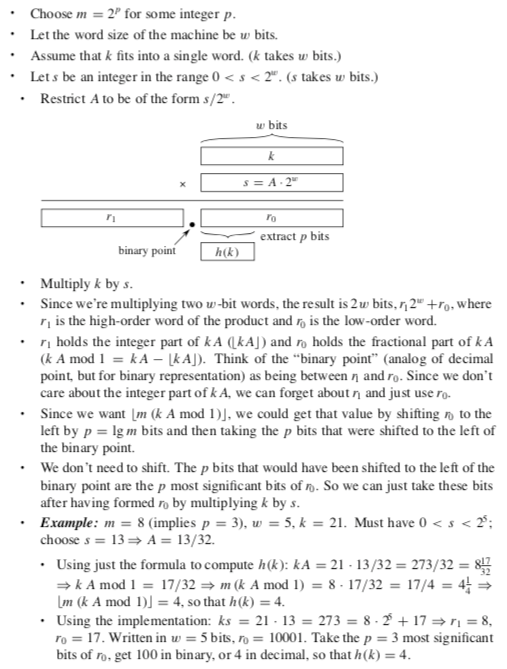

## Hash Table
In chaining, we place all the elements that hash to the same slot into the same linked list. Slot `j` contains a pointer to the head of the list of all stored elements that hash to `j`; if there are no such elements, slot `j` contains `NIL`.

Given a hash table `T` with `m` slots that stores `n` elements, we define the __load factor `α`__ for `T` as `n/m`, that is, the average number of elements stored in a chain.

### Worst case
The worst-case behavior of hashing with chaining is terrible: all `n` keys hash to the same slot, creating a list of length `n`. The worst-case time for searching is thus `θ(n)` plus the time to compute the hash function—no better than if we used one linked list for all the elements.

### Best case
The average-case performance of hashing depends on how well the __hash function `h`__ distributes the set of keys to be stored among the `m` slots, on the average.

For now we shall assume that any given element is equally likely to hash into any of the `m` slots, independently of where any other element has hashed to. We call this the assumption of __simple uniform hashing__.

In a hash table in which collisions are resolved by chaining, a search takes average-case time `θ(1+α)`, under the assumption of simple uniform hashing. As each list has the length `α` and the hash computation time is `θ(1)`. Where `α` is called __load factor__ and is equal to `n/m`.

## Hashing Functions
* A __Good Hash Function__ satisfies (approximately) the assumption of _simple uniform hashing_. In other words: `Pr{h(k1)=h(k2)}=1/m`.
* In practice, itís not possible to satisfy this assumption, since we donít know in advance the probability distribution that keys are drawn from, and the keys may not be drawn independently.

### Devision Method

`h(k) = k mod m`

`m` should not be power of `2`. A prime not too close to an exact power of `2` is often a good choice for `m`.

__Advantage__: Fast, since requires just one division operation.

__Disadvantage__: Have to avoid certain values of `m`. Powers of 2 are bad. If `m = 2^p` for integer `p`, then `h(k)` is just the least significant `p` bits of `k`.

### Multiplication method

`h(k) = ` &lfloor;`m(kA mod 1)`&rfloor; = &lfloor;`m(kA - `&lfloor;`kA`&rfloor;`)`&rfloor; , where `0 < A < 1`.

First, we multiply the key `k` by a constant `A` in the range `0 < A < 1` and extract the fractional part of `kA`. Then, we multiply this value by `m` and take the floor of the result.

The value of `m` is not critical. Although this method works with any value of the constant `A`, it works better with some values than with others. The optimal choice depends on the characteristics of the data being hashed. _Knut_ suggests that:

`A ≈ (√5 - 1)/2 = 0.6180339887...`

is likely to work reasonably well.

__Disadvantage__: Slower than division method.

__Advantage__: Value of `m` is not critical.

__(Relatively) easy implementation__:

### Universal hashing
If a malicious adversary chooses the keys to be hashed by some fixed hash function, then the adversary can choose n keys that all hash to the same slot, yielding an av- erage retrieval time of `θ(n)`. Any fixed hash function is vulnerable to such terrible worst-case behavior; the only effective way to improve the situation is to choose the hash function _randomly_ in a way that is _independent_ of the keys that are actually going to be stored. This approach, called __universal hashing__, can yield provably good performance on average, no matter which keys the adversary chooses.

In universal hashing, at the beginning of execution we select the hash function at random from a carefully designed class of functions.

Let `H` be a finite collection of hash functions that map a given universe `U` of keys into the range `{0, 1, ..., m-1}`. Such a collection is said to be __universal__ if for each pair of distinct keys `k, l ∈ U`, the number of hash functions `h ∈ H` for which `h(k) = h(l)` is at most `|H|/m`. In other words, with a hash function randomly chosen from `H`, the chance of a collision between distinct keys `k` and `l` is no more than the chance `1/m` of a collision if `h(k)` and `h(l)` were randomly and independently chosen from the set `{0, 1, ..., m-1}`.

__Theorem__: For `n` arbitrary distinct keys for random `h ∈ H`, `E[number of keys colliding in slots] <= 1 + α`. Which means that we have no more than `1 + α` items in each slot, if using the chaining to resolve the collision.

_Proof:_ Consider keys `k1, k2, ..., kn`. Let indicator `I[i, j] = {1, if h(ki)=h(kj). 0, if h(ki)≠h(kj)}`

So,

`E[number of keys coliding with ki] =`

` = E[Σ[i≠j](I[i, j]) + I[i, i]] =`

` = Σ[i≠j](E[I[i, j]]) + 1 =`

` = Σ[i≠j](Pr{I[i, j] = 1}) + 1 =`

` = Σ[i≠j](Pr{h(ki)=h(kj)}) + 1 <= `

By universality definition:

` <= Σ[i≠j](1/m) + 1 = 1 + n/m`

__Theorem__: The class of hash functions `H[u] = {h[a] | a ∈ {0, 1, ..., u - 1}}` is universal. Where:
*  `m` is prime
*  `u=m^r` for integar `r`
*  `h[a](k) = (ak) mod m`

> _Note:_ You take only one random number each time - `a`.

__Theorem__: The class of hash functions `H[p, m] = {h[a, b] | a, b ∈ Z[p], a≠0}` is universal. Where:
* `p` is prime and `p > m`
* `Z[p] = {0, 1, ..., p-1}`
* `h[a, b](k) = ((ak + b) mod p) mod m`

> _Note:_ You take two random numbers each time `a` and `b`.

__Carter and Wegman proposal: `p >= m`__

### Perfect hashing
_Static Dictionary Problem_ is the problem when you are given `n` keys upfront and the set of keys never change. You need to build the table which suport searching.

__Perfect Hash__ function for a set `S` is a hash function that maps distinct elements in `S` to a set of integers, with no collisions. So we will achieve:
* `O(1)` worst case time for search
* `O(n)` worst case space complexity
* Polynomial build time - `O(nlog^2(n))`

Proof of the Theorems is in [here](https://ocw.mit.edu/courses/electrical-engineering-and-computer-science/6-046j-introduction-to-algorithms-sma-5503-fall-2005/video-lectures/lecture-8-universal-hashing-perfect-hashing/lec8.pdf).

[More about Perfect Hashing](http://theory.stanford.edu/~matias/papers/fks.pdf)

---

### [Read More](http://staff.ustc.edu.cn/~csli/graduate/algorithms/book6/chap12.htm)
