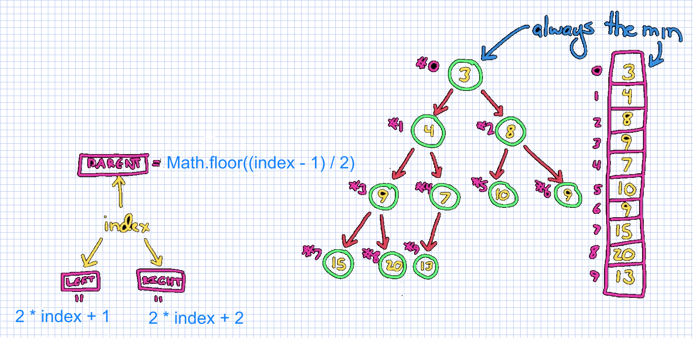

## Heap
A __Min Heap__ is a tree data structure with ordered nodes where the _min_ (or _max_ in __Max Heap__) value is the root of the tree and all children are less than (or greater than) their parent nodes.

__Binary Heap__ is a heap where each node has two children.

> So the min/max element in the heap is always at the root node.

We can map the heap to array the following way; each array index represents a node:

[Watch more about `Heap` here](https://www.youtube.com/watch?v=t0Cq6tVNRBA)