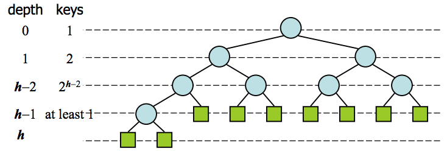
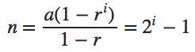

## Heap
A __Min Heap__ is a tree data structure with ordered nodes where the _min_ (or _max_ in __Max Heap__) value is the root of the tree and all children are less than (or greater than) their parent nodes.

__Binary Heap__ is a heap where each node has two children.

> So the min/max element in the heap is always at the root node.

We can map the heap to array the following way; each array index represents a node:

### __Lemma:__ Quantity of parent nodes in the binary heap is equal to &lfloor;`n/2`&rfloor;

### __Theorem:__ The height of binary heap is equal to `h(n)= ` &lceil;`log_2(n + 1) - 1`&rceil; where `n` is number of nodes

__Proof:__

At the first level, there is only one node, the root of the tree. At the second level are the root's two children. At the third, each of those two children's two children (making the total four at the third level).

So the amount of nodes in the binary heap is equal to:

`n = 2^0 + 2^1 + 2^2 + 2^3 + ... 2^h =` &sum;`i=0``h+1` (`2^i`)

`n` is a finite geometric series whose first element is `a = 1`, ratio is `r = 2`. Using the formula for a geometric series:

We get:

`n = 2^(h + 1) - 1` => `2^(h + 1) = n + 1` => `h =` &lceil;`log_2(n + 1) -1`&rceil;

The ceiling is required because nodes taking up part of a level warrant an extra count to the number of levels.

> It means the complexity of `heapifyDown()` method is equal `θ(logn)`.

[Watch more about `Heap` here](https://www.youtube.com/watch?v=t0Cq6tVNRBA)