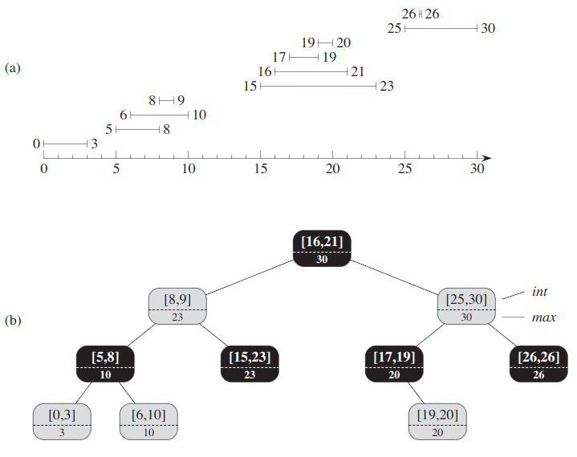

## Interval Tree
A __closed interval__ is an ordered pair of real numbers `[t1, t2]`, with `t1 ≤ t2`. The interval `[t1, t2]` represents the set `{t ∈ R: t1 ≤ t ≤ t2}`. __Open__ and __half-open intervals__ omit both or one of the endpoints from the set, respectively. In this section, we shall assume that intervals are closed; extending the results to open and half-open intervals is conceptually straightforward.

Intervals are convenient for representing events that each occupy a continuous period of time.  We might, for example, wish to query a database of time intervals to find out what events occurred during a given interval.

We say that intervals `i` and `i'` overlap if `i ∩ i' ≠ ∅`.

An __interval tree__ is a red-black tree that maintains a dynamic set of elements, with each element containing an interval.

Construction:
1. We choose a red-black tree in which each node contains an interval and the key of the node is the low endpoint of the interval. Thus, an inorder tree walk of the data structure lists the intervals in sorted order by low endpoint.
2. In addition to the intervals themselves, each node `x` contains a value `max`, which is the maximum value of any interval endpoint stored in the subtree rooted at `x`. Since any interval's high endpoint is at least as large as its low endpoint, `max[x]` is the maximum value of all right endpoints in the subtree rooted at `x`.
3. `max[x] = max( high[int[x]], max[left[x]], max[right[x]] )`

