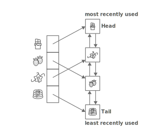

# Least Recently Used (LRU) Cache
A Least Recently Used (LRU) Cache organizes items in order of use, allowing you to quickly identify which item hasn't been used for the longest amount of time.

#### Strengths:
* Super fast accesses. LRU caches store items in order from most-recently used to least-recently used. That means both can be accessed in `O(1)` time.
* Super fast updates. Each time an item is accessed, updating the cache takes `O(1)` time.

#### Weaknesses:
* Space heavy. An LRU cache tracking nn items requires a linked list of length nn, and a hash map holding nn items. That's O(n)O(n) space, but it's still two data structures (as opposed to one).

## Least-Recently Used (LRU)" eviction strategy
If the cache has room for, say, `n` elements, then store the `n` elements accessed most recently.

## LRU Cache Implementation
An LRU cache is built by combining two data structures: a _doubly linked list_ and a _hash map_.

We'll set up our linked list with the most-recently used item at the head of the list and the least-recently used item at the tail:

This lets us access the LRU element in `O(1)` time by looking at the tail of the list.

What about accessing a specific item in the cache (for example, the chocolate cake recipe)?

In general, finding an item in a linked list is `O(n)` time, since we need to walk the whole list. But the whole point of a cache is to get quick lookups. How could we speed that up?

We'll add in a hash map that maps items to linked list nodes:

That lets us find an element in our cache's linked list in `O(1)` time, instead of `O(n)`.

## Accessing and Evicting
Putting things together, here are the steps we'd run through each time an item was accessed:
* Look up the item in our hash map.

* If the item is in the hash table, then it's already in our cache—this is called a "cache hit"
    
    1. Use the hash table to quickly find the corresponding linked list node.

    2. Move the item's linked list node to the head of the linked list, since it's now the most recently used (so it shouldn't get evicted any time soon).

* If the item isn't in the hash table, we have a cache miss. We need to load the item into the cache:

    1. Is our cache full? If so, we need to evict something to make room:
        * Grab the least-recently used cache item—it'll be at the tail of the linked list.
        * Evict that item from the cache by removing it from the linked list and the hash map.

    2. Create a new linked list node for the item. Insert it at the head of the linked list.

    3. Add the item to our hash map, storing the newly-created linked list node as the value.

## Complexity
All of those steps are `O(1)`, so put together it takes `O(1)` time to update our cache each time an element is accessed.
