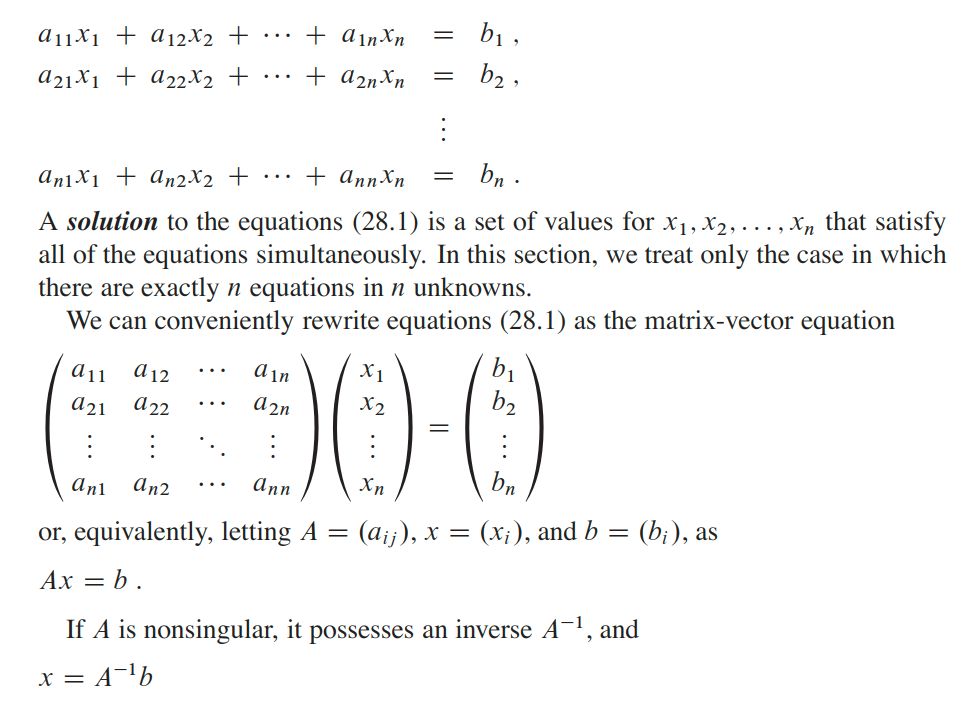
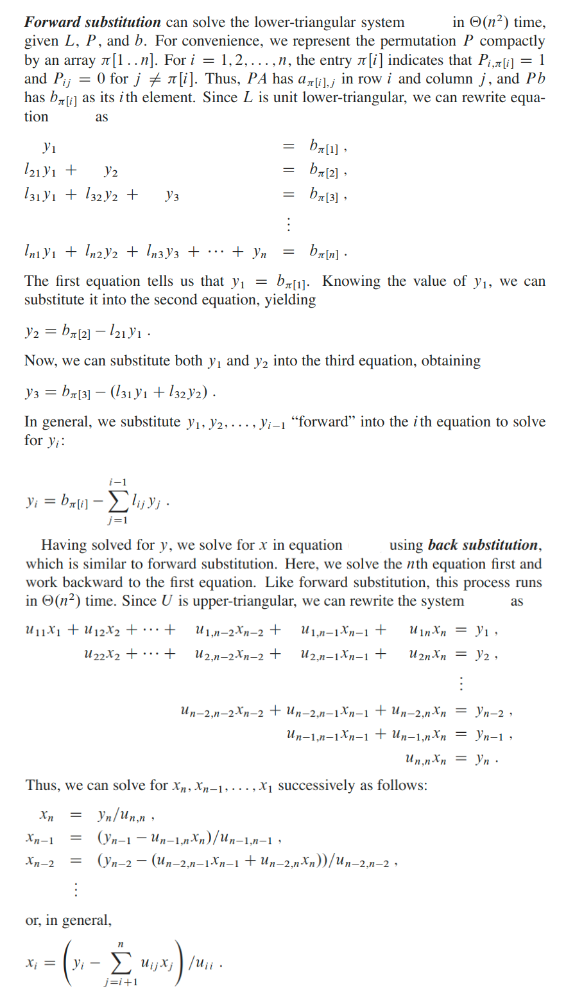
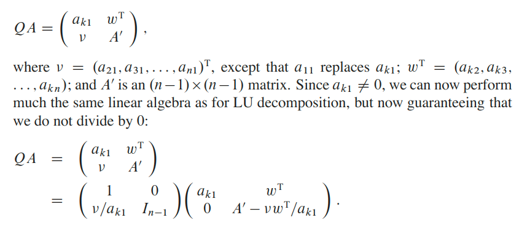
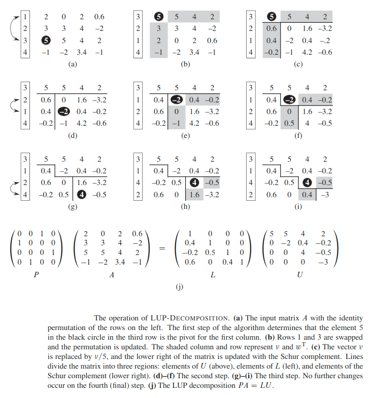

# Matrix
A __matrix__ is a rectangular array of numbers.

## Definitions
The __transpose__ of a matrix `A` is the matrix `A``T` obtained by exchanging the rows and columns of `A`.

A __vector__ is a one-dimensional array of numbers.

The unit vector `e``i` is the vector  whose `i`th  element  is `1` and  all  of  whose  other elements are `0`.

A __zero matrix__ is a matrix  all of  whose entries  are `0`.

The `n x n` __identity matrix__ `I``n` is a diagonal matrix with `1`s along the diagonal and other elements are `0`.

The __identity matrix__ (sometimes ambiguously called a _unit matrix_) of size `n` is the `n × n` square matrix with ones (`1`) on the main diagonal and zeros (`0`) elsewhere. The following equation is true: `IA = AI = A`.

A __triangular matrix__ is a special kind of square matrix. A square matrix is called __lower triangular__ if all the entries above the main diagonal are zero. Similarly, a square matrix is called __upper triangular__ if all the entries below the main diagonal are zero.

A __permutation matrix__ is a square binary matrix that has exactly one entry of `1` in each row and each column and `0`s elsewhere. Each such matrix, say `P`, represents a permutation of `m` elements and, when used to multiply another matrix, say `A`, results in permuting the rows or columns of the matrix `A`.

We define the __inverse__ of an `n x n` matrix `A` to be the `n x n` matrix, denoted `A``-1` (if it exists), such that `AA``-1`` = I``n`` = A``-1``A`.

A matrix without an inverse is called __non-invertible__, or __singular__. If a matrix has an inverse, it is called __invertible__, or __non-singular__.

A __symmetric matrix__ is a matrix whose transposed matrix is equal to itself (`A = A``T`).

A real square matrix `A` is __symmetric positive definite__ if it is:
* Symmetric
* Its quadratic form is positive (`x``T`` * A * x > 0`) for all nonzero vectors `x`.

## Solving systems of linear equations
We start with a set of linear equations in `n` unknowns `x_1, x_2, ..., x_n`:

is the solution vector. We can prove that `x` is the unique solution as follows. If there are two solutions, `x` and `x'`, then `Ax = Ax' = b`:

`x = Ix = (A``-1``A)x = A``-1``(Ax) = A``-1``(Ax') = (A``-1``A)x' = x'`

If the number of equations is less than the number `n` of unknowns — or, more generally,  if  the rank of `A` is less  than `n` — then the system  is __under-determined__.   An under-determined  system  typically  has  infinitely  many  solutions,  although  it  may  have  no  solutions  at  all  if  the  equations  are  inconsistent.

If  the number of equations exceeds the number `n` of unknowns, the system is __over-determined__, and there may not exist any solutions.

### LUP decomposition
One important  issue that arises  in practice  is __numerical stability__.   Due to the limited precision of floating-point  representations  in actual computers,  round-off errors in numerical computations may become amplified over the course of a computation, leading to incorrect results; we call such computations __numerically unstable__. That is where LUP decomposition can help.

The idea behind LUP decomposition is to find three `n x n` matrices `L` , `U` , and `P` such that

`PA = LU`

where:
* `L` is a unit lower-triangular matrix,
* `U` is an upper-triangular matrix,
* `P` is a permutation matrix.

We call matrices `L` , `U` , and `P` an LUP decomposition of the matrix `A`.

Once we have found an LUP decomposition  for `A`, we can solve equation `Ax = b`, by solving only triangular linear systems, as follows. 
1. Multiplying both sides of `Ax = b` by `P` yields the equivalent equation `PAx = Pb`.
2. Using our decomposition, we obtain `LUx = Pb`.
3. Define `y = Ux`, where `x` is the desired solution vector.
4. Solve the lower-triangular system `Ly = Pb` for the unknown vector `y` by a method called “_forward substitution_”.
5. Solve the upper-triangular system `Ux = y` for the unknown `x` by a method called “_back substitution_”.

Because the permutation  matrix `P` is  invertible,  multiplying  both  sides  of  equation by `P``-1` gives `P``-1``PA = P``-1``LU`, so that: `A = P``-1``LU`.

Hence, the vector `x` is our solution to `Ax = b`:

`Ax = P``-1``LUx = P``-1``Ly = P``-1``Pb = b`.

### Forward and Back Substitution

Watch [this](https://www.youtube.com/watch?v=o5viKb1jqhM) video for better understanding.

As you can see it is a very easy and quick way of solving the system of equations.

### Computing an LU decomposition
Now we show how to efficiently compute an LUP decomposition for `A`.

We start with the case in which `A` is an `n x n` non-singular matrix and `P` is absent (or, equivalently, `P = I`).  In this case, we factor `A = LU`.  We call the two matrices `L` and `U` an __LU decomposition__ of `A`.

We use a process known as __Gaussian Elimination__ to create an LU decomposition. We start by subtracting multiples of the first equation from the other equations in order to remove the first variable from those equations.  Then, we subtract multiples of the second equation from the third and subsequent equations so that now the first and second variables are removed from them.  We continue this process until the system that remains has an upper-triangular  form—in fact, it is the matrix `U`. Watch [this](https://www.youtube.com/watch?v=RgnWMBpQPXk) video to find out how to do it.

The matrix `L` is made up of the row multipliers that cause variables to be eliminated. Watch [this](https://www.youtube.com/watch?v=j48z_nY-oB8) video to find out how to do it.

To recap. This method is very efficient when you want to solve system of equations `Ax = b` with many different `b`s. As you compute the LU decomposition for `A` once.

### Computing an LUP decomposition
Generally, in solving a system of linear equations `Ax = b`, we must pivot on off-diagonal elements of `A` to avoid dividing by `0`.  Dividing by `0` would, of course, be disastrous.  But we also want to avoid dividing by a small value—even if `A` is non-singular — because numerical instabilities can result. _We therefore try to pivot on a large value._

Before we partition the matrix `A` , as we did for LU decomposition, we move a nonzero element, say `a[k][0]`, from somewhere in the first column to the `[0, 0]` position of the matrix.  For numerical stability, we choose `a[k][0]` as the element in the first column with the greatest absolute value.

> The first column cannot contain only `0`s, for then `A` would be singular, because its determinant would be `0`.

In order to preserve the set of equations, we exchange row `1` with row `k`, which is equivalent to multiplying `A` by a permutation matrix `Q` on the left.

#### Example

## Inverting matrices
Suppose that we have an LUP decomposition of a matrix `A` in the form of three matrices `L`, `U`, and `P` such that `PA = LU`. Using `lupSolve()`,  we can solve an equation of the form `Ax = b` in time `θ(n^2)`.  Since the LUP decomposition depends on `A` but not `b`, we can run `lupSolve()` on a second set of equations of the form `Ax = b'` in additional time `θ(n^2)`. In general,  once we have the LUP decomposition  of `A`,  we can  solve,  in time `θ(k * n^2)`, `k` versions  of  the  equation `Ax = b` that differ only in `b`.

We can think of the equation `AX = I` which defines the matrix `X`, the inverse of `A`, as a set of `n` distinct equations of the form `Ax = b`. To be precise, let `X``i` denote the `i`th column of `X`, and recall that the unit vector `e``i` is the `i`th column of `I`. We can then solve the above equation for `X` by using the LUP decomposition for `A` to solve each equation `AX``i`` = e``i`.

Separately for `X``i`. Once we have the LUP decomposition, we can compute each of the `n` columns `X``i` in time `θ(n^2)`, and so we can compute `X` from the LUP decomposition of `A` in time `θ(n^3)`. Since we can determine the LUP decomposition of `A` in time `θ(n^3)`, we can compute the inverse `A``-1` of a matrix `A` in time `θ(n^3)`.

## Symmetric positive-definite matrices and least-squares approximation
Symmetric positive-definite matrices are non-singular, and we can perform LU decomposition on them without having to worry about dividing by `0`.

#### Lemma
Any positive-definite matrix is nonsingular.

the `k`th __leading submatrix__ of `A`to be the matrix `A_k` consisting  of the intersection  of the first `k` rows and first `k` columns of `A`.

#### Lemma
If `A` is a symmetric positive-definite matrix, then every leading submatrix of `A` is symmetric and positive-definite.

### Application
One important application of symmetric positive-definite matrices arises in fitting curves to given sets of data points. Suppose that we are given a set of `m` data points:

`(x_1, y_1), (x_2, y_2), ..., (x_m, y_m)`.

where we know that the `y_i` are subject to measurement errors.  We would like to determine a function `F(x)` such that the approximation errors:

`Ƞ = F(x_i) - y_i` __(*)__

are small for `i = 1,2, ..., m`. The form of the function `F` depends on the problem at hand. Here, we assume that it has the form of a linearly weighted sum

`F(x) = ∑[j = 1 -> n](c_i * f_i(x))`

where the number of summands `n` and the specific basis functions `f_j` are chosen based on knowledge of the problem at hand.  A common choice is `f_i(x) = x``j - 1`, which means that:

`F(x) = c_1 + c_2 * x + c_3 + x^2 + ... + c_n * x^(n - 1)`

is a polynomial of degree `n - 1` in `x`. Thus, given `m` data points `(x_1, y_1), (x_2, y_2), ..., (x_m, y_m)`, we wish to calculate `n` coefficients `c_1, c_2, ..., c_n` that minimize the approximation errors `Ƞ_1, Ƞ_2, ..., Ƞ_m`.

[This](http://staff.ustc.edu.cn/~csli/graduate/algorithms/book6/chap31.htm) article have more details on the topic.

Watch [this](https://www.youtube.com/watch?v=AmQcoopBUTk) video to find out more about the __Least Square Method__.

---

#### [Read for more details about Positive Definitive Matrix](http://slpl.cse.nsysu.edu.tw/chiaping/la/pdm.pdf)
