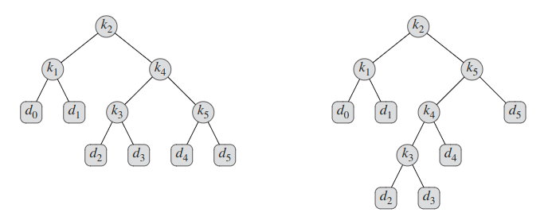
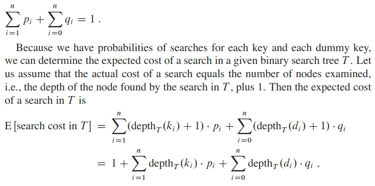
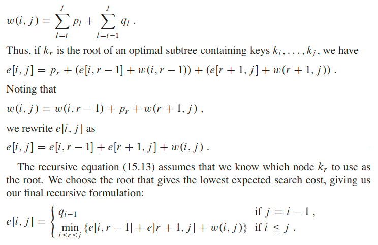

## Optimal Binary Search Tree
Suppose that we are designing a program to translate text from English to French. For each occurrence of each English word in the text, we need to look up its French equivalent. We could perform these lookup operations by building a binary search tree with `n` English words as keys and their French equivalents as satellite data. Because we will search the tree for each individual word in the text, we want the total time spent searching to be as low as possible. We could ensure an `O(lg n)` search time per occurrence by using a red-black tree or any other balanced binary search tree. Words appear with different frequencies, however, and a frequently used word such as the may appear far from the root while a rarely used word such as machicolation appears near the root. Such an organization would slow down the translation, since the number of nodes visited when searching for a key in a binary search tree equals one plus the depth of the node containing the key. We want words that occur frequently in the text to be placed nearer the root. Moreover, some words in the text might have no French translation, and such words would not appear in the binary search tree at all. How do we organize a binary search tree so as to minimize the number of nodes visited in all searches, given that we know how often each word occurs?

What we need is known as an optimal binary search tree. Formally, we are given a sequence `K = <k1, k2, ..., k3>` of `n` distinct keys in sorted order (so that `k1 < k2 < ... < kn`), and we wish to build a binary search tree from these keys. For each key `k_i` , we have a probability `p_i` that a search will be for `k_i`. Some searches may be for values not in `K`, and so we also have `n + 1` “dummy keys” `d0, d1, d2, ..., dn` representing values not in `K`. In particular, `d0` represents all values less than `k1`, `d_n` represents all values greater than `k_n`, and for `i = 1, 2, ..., n-1`, the dummy key `d_i` represents all values between `k_i` and `k_(i+1)`. For each dummy key `d_i`, we have a probability `q_i` that a search will correspond to `d_i`.

Every search is either successful (finding some key `k_i`) or unsuccessful (finding some dummy key `d_i`), and so we have:

An optimal binary search tree is not necessarily a tree whose overall height is smallest. Nor can we necessarily construct an optimal binary search tree by always putting the key with the greatest probability at the root.

We can label the nodes of any `n`-node binary tree with the keys `k1, k2, ..., kn` to construct a binary search tree, and then add in the dummy keys as leaves.

[Watch the YouTube video](https://www.youtube.com/watch?v=wAy6nDMPYAE) for more details.
