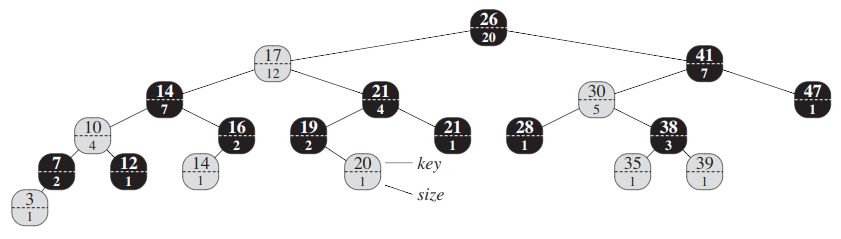

## Order Statistic Tree
The __`i`-th order statistic of a set__ of `n` elements, where `i ∈ {1, 2, ..., n}`, is simply the element in the set with the `i`th smallest key.

The __rank__ of an element is its position in the linear order of the set.

An order-statistic tree `T` is simply a red-black tree with additional  information stored in each node. Besides the usual red-black tree attributes, we have another attribute, `size`. This attribute contains the number of  (internal) nodes in the subtree rooted at the node (including the node itself), that is, the __size of the subtree__.

We do not require keys to be distinct in an order-statistic tree. In the presence of equal keys, the above notion of rank is not well defined. We remove this ambiguity for an order-statistic tree by defining the rank of an element as the position at which it would be printed in an _inorder walk_ of the tree. In tree below for example, the key `14` stored in a black node has rank `5`.

> Because the size of its left subtree is the number of nodes that come before the node in a inorder tree walk of the subtree rooted at the node. Thus the size of its left subtree + 1 is the __rank__ of the node.

### Complexity
Because each recursive call goes down one level in the order-statistic tree, the total time for `select()` is at worst proportional to the height of the tree. Since the tree is a red-black tree, its height is `O(lg n)`, where `n` is the number of nodes. Thus, the running time of `select()` is `O(lg n)` for a dynamic set of `n` elements.

Since each iteration of the while loop takes `O(1)` time, and `current` goes up one level in the tree with each iteration, the running time of `rank()` is at worst proportional to the height of the tree: `O(lg n)` on an `n`-node order-statistic tree.
