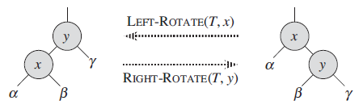

## Red-Black Tree
A __red-black tree__ is a binary search tree with one extra bit of storage per node: its _color_, which can be either `RED` or `BLACK`.

A red-black tree is a binary tree that satisfies the following red-black properties:
1. Every node is either red or black.
2. The root is black.
3. Every leaf is black.
4. If a node is red, then both its children are black.
5. For each node, all simple paths from the node to descendant leaves contain the same number of black nodes.

Red-black trees are one of many search-tree schemes that are “balanced” in order to guarantee that basic dynamic-set operations take `O(lg n)` time in the worst case.

We call the number of black nodes on any simple path from, but not including, a node `x` down to a leaf the __black-height__ of the node, denoted `bh(x)`.

__Lemma:__ A red-black tree with `n` internal nodes has height at most `2lg(n + 1)`.

As an immediate consequence of this lemma, we can implement the dynamic-set operations SEARCH, MINIMUM, MAXIMUM, SUCCESSOR, and PREDECESSOR in `O(lg n)` time on red-black trees, since each can run in `O(h)` time on a binary search tree of height `h` and any red-black tree on `n` nodes is a binary search tree with height `O(lg n)`.

### Rotations
Because INSERT and DELETE modify the tree, the result may violate the red-black properties. To restore these properties, we must change the colors of some of the nodes in the tree and also change the pointer structure. We change the pointer structure through __rotation__, which is a local operation in a search tree that preserves the binary-search-tree property.

### Insertion
