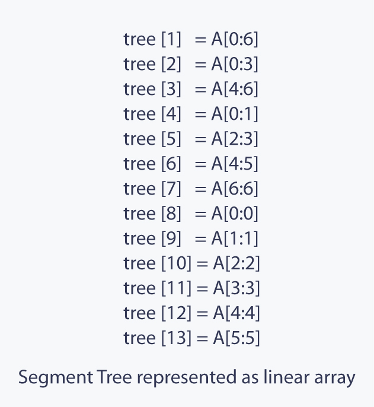

# Segment Tree
Segment Tree is a basically a binary tree used for storing the intervals or segments. Each node in the Segment Tree represents an interval. Consider an array `A` of size `N` and a corresponding Segment Tree `T`:
* The root of `T` will represent the whole array `A[0 ... N_1]`.
* Each leaf in the Segment Tree `T` will represent a single element `A[i]` such that `0 ≤ i < N`.
* The internal nodes in the Segment Tree `T` represents the union of elementary intervals `A[i ... j]` where `0 ≤ i < j < N`.

There are `N` leaves representing the `N` elements of the array. The first level of the tree contains a single node (the root), the second level will contain two vertices, in the third it will contain four vertices, until the number of vertices reaches  `n` . Thus the number of vertices in the worst case can be estimated by the sum:
`1 + 2 + 4 + ... + n = 1 + 2 + 4 + ... 2``⌈log``2``n⌉`` = 4n - 2 < 4n`.

The height of the Segment Tree is `log``2``N`, because when going down from the root to the leaves the size of the segments decreases approximately by half.

## Construction
Before constructing the segment tree, we need to decide:
1. The value that gets stored at each node of the segment tree. For example, in a sum segment tree, a node would store the sum of the elements in its range  `[l, r]` .
2. The merge operation that merges two siblings in a segment tree. For example, in a sum segment tree, the two nodes corresponding to the ranges  `a[l_1 ... r_1]`  and  `a[l_2 ... r_2]`  would be merged into a node corresponding to the range  `a[l_1 ... r_2]`  by adding the values of the two nodes.

We use a divide and conquer strategy to build the segment tree. In the divide step, we come top-down and recursively divide the range into two halves till there is only one element in the range.

Since a Segment Tree is a binary tree, a simple linear array can be used to represent the Segment Tree.

The main consideration is how to store the Segment Tree. Of course we can define an array structure and create objects, that store the boundaries of the segment, its sum and additionally also pointers to its child vertices. However this requires storing a lot of redundant information. We will use a simple trick, to make this a lot more efficient. We only store the sums in an array. The sum of the root vertex at index 1, the sums of its two child vertices at indices 2 and 3, the sums of the children of those two vertices at indices 4 to 7, and so on. It is easy to see, that the left child of a vertex at index  `i`  is stored at index  `2i` , and the right one at index  `2i + 1`.

Once the Segment Tree is built, its structure cannot be changed. We can update the values of nodes but we cannot change its structure. Segment tree provides two operations:
1. __Update__: Given `idx` and `val`, update array element `A[idx]` as `A[idx] = A[idx] + val`.
2. __Query__: Given `l` and `r` return the value of `A[l] + A[l+1] + A[l+2] + ... + A[r]` such that `0 ≤ l ≤ r < N`.

## Sum Query Complexity
Why is the complexity of this algorithm  `O(log n)`? To show this complexity we look at each level of the tree. It turns out, that for each level we only visit not more than four vertices. And since the height of the tree is  `O(log n)`, we receive the desired running time.

We can show that this proposition (at most four vertices each level) is true by induction. At the first level, we only visit one vertex, the root vertex, so here we visit less than four vertices. Now let's look at an arbitrary level. By induction hypothesis, we visit at most four vertices. If we only visit at most two vertices, the next level has at most four vertices. That trivial, because each vertex can only cause at most two recursive calls. So let's assume that we visit three or four vertices in the current level. From those vertices, we will analyze the vertices in the middle more carefully. Since the sum query asks for the sum of a continuous subarray, we know that segments corresponding to the visited vertices in the middle will be completely covered by the segment of the sum query. Therefore these vertices will not make any recursive calls. So only the most left, and the most right vertex will have the potential to make recursive calls. And those will only create at most four recursive calls, so also the next level will satisfy the assertion. We can say that one branch approaches the left boundary of the query, and the second branch approaches the right one.

Therefore we visit at most  `4 log n`  vertices in total, and that is equal to a running time of  `O(log n)`.

## More complex queries
It can be quite easy to change the Segment Tree in a direction, such that it computes different queries (e.g. computing the minimum / maximum instead of the sum), but it also can be very nontrivial.

### Finding the maximum
Let us slightly change the condition of the problem described above: instead of querying the sum, we will now make maximum queries.

The tree will have exactly the same structure as the tree described above. We only need to change the way  `T[v]`  is computed in the  `build`  and  `update`  functions.  `T[v]`  will now store the maximum of the corresponding segment. And we also need to change the calculation of the returned value of the  `sum`  function (replacing the summation by the maximum).

### Compute the greatest common divisor / least common multiple
In this problem we want to compute the GCD / LCM of all numbers of given ranges of the array.

This interesting variation of the Segment Tree can be solved in exactly the same way as the Segment Trees we derived for sum / minimum / maximum queries: it is enough to store the GCD / LCM of the corresponding vertex in each vertex of the tree. Combining two vertices can be done by computing the GCD / LCM of both vertices.

### Counting the number of zeros, searching for the  `k`-th zero
In this problem we want to find the number of zeros in a given range, and additionally find the index of the `k`-th zero using a second function.

Again we have to change the store values of the tree a bit: This time we will store the number of zeros in each segment in `T[]` .

## Range updates (Lazy Propagation)
All problems in the above sections discussed modification queries that only effected a single element of the array each. However the Segment Tree allows applying modification queries to an entire segment of contiguous elements, and perform the query in the same time  `O(log n)`.

We begin by considering problems of the simplest form: the modification query should add a number  `x`  to all numbers in the segment  `A[l ... r]` . The second query, that we are supposed to answer, asked simply for the value of  `A[i]` .

To make the addition query efficient, we store at each vertex in the Segment Tree how many we should add to all numbers in the corresponding segment. For example, if the query "add 3 to the whole array  `A[0 ... n-1]` " comes, then we place the number 3 in the root of the tree. In general we have to place this number to multiple segments, which form a partition of the query segment. Thus we don't have to change all  `O(n)`  values, but only  `O(log n)`  many.

If now there comes a query that asks the current value of a particular array entry, it is enough to go down the tree and add up all values found along the way.

So after the modification query is executed, some parts of the tree become irrelevant - some modifications remain unfulfilled in it.

For example if a modification query "assign a number to the whole array  `A[0 ... n-1]` " gets executed, in the Segment Tree only a single change is made - the number is placed in the root of the tree and this vertex gets marked. The remaining segments remain unchanged, although in fact the number should be placed in the whole tree.

Suppose now that the second modification query says, that the first half of the array  `A[0 ... n/2]`  should be assigned with some other number. To process this query we must assign each element in the whole left child of the root vertex with that number. But before we do this, we must first sort out the root vertex first. The subtlety here is that the right half of the array should still be assigned to the value of the first query, and at the moment there is no information for the right half stored.

The way to solve this is to push the information of the root to its children, i.e. if the root of the tree was assigned with any number, then we assign the left and the right child vertices with this number and remove the mark of the root. After that, we can assign the left child with the new value, without loosing any necessary information.

## Generalization to higher dimensions
A Segment Tree can be generalized quite natural to higher dimensions. If in the one-dimensional case we split the indices of the array into segments, then in the two-dimensional we make an ordinary Segment Tree with respect to the first indices, and for each segment we build an ordinary Segment Tree with respect to the second indices.

To make the construction process more understandable, you can forget for a while that the matrix is two-dimensional, and only leave the first coordinate. We will construct an ordinary one-dimensional Segment Tree using only the first coordinate. But instead of storing a number in a segment, we store an entire Segment Tree: i.e. at this moment we remember that we also have a second coordinate; but because at this moment the first coordinate is already fixed to some interval  `[l ... r]` , we actually work with such a strip  `A[l ... r, 0 ... m-1]`  and for it we build a Segment Tree.

## Implicit segment tree
Previously, we considered cases when we have the ability to build the original segment tree. But what to do if the original size is filled with some default element, but its size does not allow you to completely build up to it in advance?

We can solve this problem by not explicitly creating a segment tree. Initially, we will create only the root, and we will create the other vertexes only when we need them. In this case, we will use the implementation on pointers(before going to the vertex children, check whether they are created, and if not, create them). Each query has still only the complexity  `O(log n)`.
 

---

#### [An extensive documentation on Segment Tree](https://cp-algorithms.com/data_structures/segment_tree.html#preserving-the-history-of-its-values-persistent-segment-tree)

#### [Range Min Query Segment Tree](https://www.enjoyalgorithms.com/blog/segment-tree-data-structure-part1)
