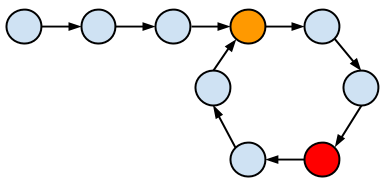

## Singly Linked List
A linked list is a data structure in which the objects are arranged in a linear order. Unlike an array, however, in which the linear order is determined by the array indices, the order in a linked list is determined by a pointer in each object.

Each element of a singly linked list `L` is an object with an attribute key and the pointer attribute: `next`.

## Floyd's Tortoise and Hare
The idea behind the algorithm is that, if you have two pointers in a linked list, one moving twice as fast (the hare) than the other (the tortoise), then if they intersect, there is a cycle in the linked list. If they don't intersect, then there is no cycle.

Where:
* Orange node - entrance to the cycle.
* Red node - point where the tortoise and the hare met.
* `F` - length of nodes outside of cycle (all nodes before the orange node).
* `C` - length of nodes inside of cycle (all nodes after the orange node, including the orange node itself).

Floyd's algorithm is separated into two distinct phases:
1. Detecting a cycle

    After `F` iterations, tortoise points to the orange node and hare points to some node `X`. where `F ≡ X (mod C)`. This is because hare traverses `2F` nodes over the course of `F` iterations, exactly `F` of which are in the cycle.

    After `C - X` more iterations, tortoise obviously points to node `C - X`, but (less obviously) hare also points to the same node. To see why, remember that hare traverses `2(C - X)` from its starting position of `X`:

    `X + 2(C - X) = 2C - X ≡ C - X (mod C)`

    Therefore, given that the list is cyclic, hare and tortoise will eventually both point to the same node

2. Finding the cycle's start

    We initialize two more pointers: `ptr1`, which points to the head of the list, and `ptr2`, which points to the node where they met (red node). Then, we advance each of them by `1` until they meet; the node where they meet is the entrance to the cycle, so we return it.

    We can harness the fact that hare moves twice as quickly as tortoise to assert that when hare and tortoise meet at node `X`, hare has traversed twice as many nodes. Using this fact, we deduce the following:

    To compute the intersection point, let's note that the hare has traversed twice as many nodes as the tortoise, i.e. `2d(tortoise) = d(hare)`, that means: `2(F + a) = F + nC + a`, where `n` is some integer. By further simplifying the expression, we get: `F + a = nC`.

    Therefore, `a = nC - F` and `a = (C - X) (mod C)`. Which means that the hare after `F` steps will reach the entrance of the cycle (orange node) at the same time as the tortoise from the head.
