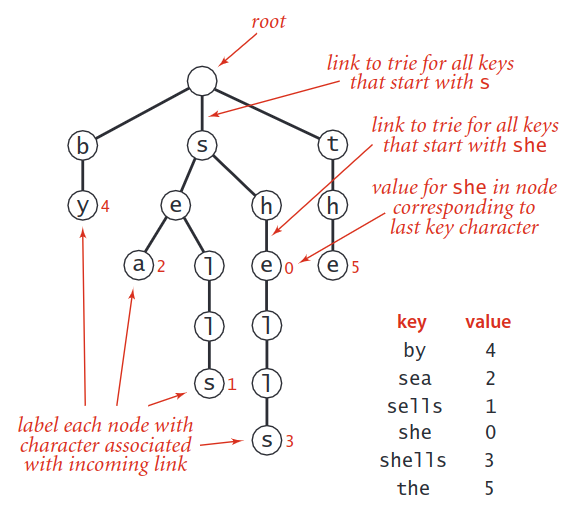
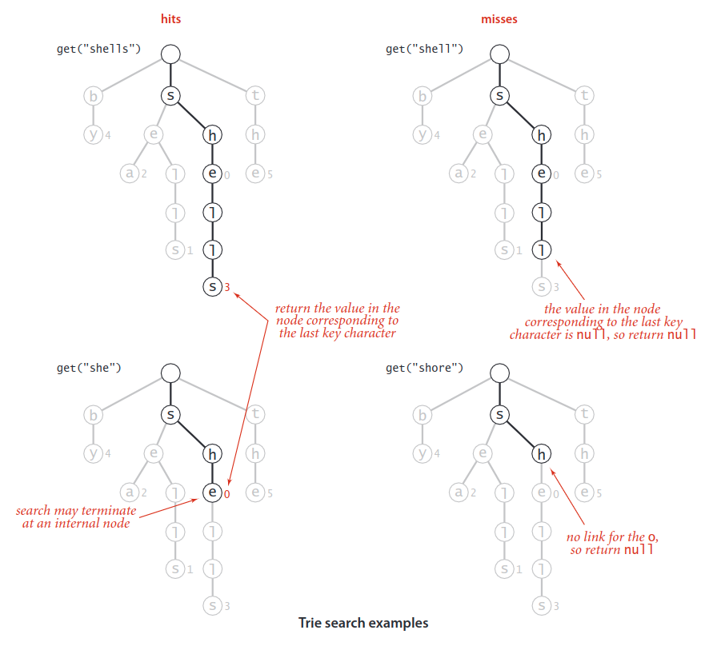
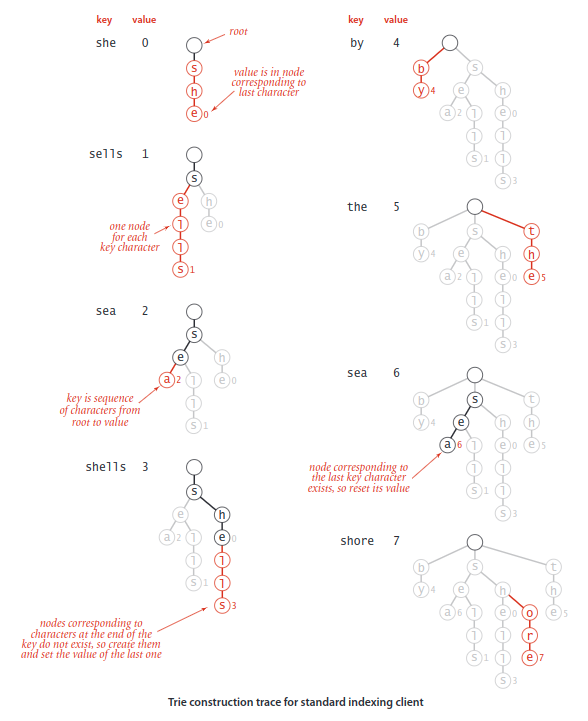
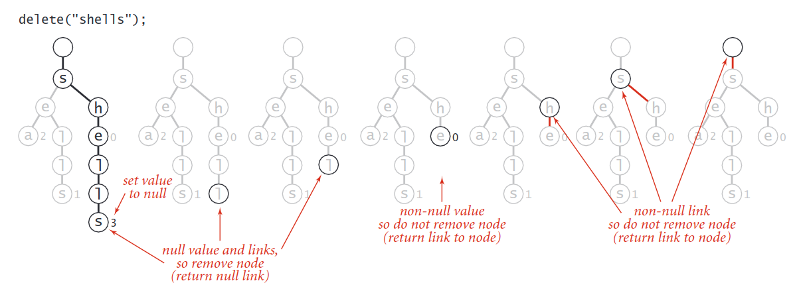

## Trie
In this section, we consider a search tree known as a __trie__, a data structure built from the characters of the string keys that allows us to use the characters of the search key to guide the search.

The __spell checking__ is the most popular application of Tries.

### Properties
As with search trees, tries are data structures composed of nodes that contain links that are either null or references to other nodes. Each node is pointed to by just one other node, which is called its parent (except for one node, the root, which has no nodes pointing to it), and each node may has `R` links, where `R` is the alphabet size.

Although  links  point  to  nodes,  we  can  view  each  link  as  point-ing  to  a  trie,  the  trie  whose  root  is  the  referenced  node.

Each node also has a corresponding __value__, which may be `null` or the value associated  with  one  of  the  string  keys  in the  symbol  table.  Specifically,  we  store the value associated with each key in the node corresponding to its last character. 

> Nodes with null values exist  to  facilitate  search  in  the  trie  and  do not correspond to keys.

### Search
Finding  the  value  associated with a given string key in a trie is a simple process, guided by the characters in the search key. Each node in the trie has a link corresponding to each possible string character.

* The value at the node corresponding to the last character in the key is not `null` (as in the searches for shells and she depicted at left above). This result is a  _search hit_ — the value associated with the key is the value in the node corresponding to its last character.
* The value in the node corresponding to the last character in the key is `null` (as in the search for shell depicted at top right above). This result is a  _search miss_: the key is not in the table.
* The search terminated with a `null` link (as in the search for shore depicted at bottom right above). This result is also a search miss. 

### Insertion
As with binary search trees, we insert by first doing a search: in a trie that means using the characters of the key to guide us down the trie until reach-ing the last character of the key or a null link. At this point, one of the following two conditions holds:
* We  encountered a `null` link before reaching the last character of the key.   In this case, there is no trie node corresponding to the last character in the key, so we need to create nodes for each of the characters in the key not yet encountered and set the value in the last one to the value to be associated with the key.
* We encountered the last character of the key before reaching a `null` link.  In this case, we set that node’s value to the value to be associated with the key (whether or not that value is `null`), as usual with our associative array convention.

In all cases, we examine or create a node in the trie for each key character.

Keys in the trie are implicitly represented by paths from the root that end at nodes with non-null values.

### Deletion
The  first  step  needed  to  delete  a  key-value  pair from a trie is to use a normal search to find the node cor-responding  to  the  key  and  set  the  corresponding  value  to `null`.

If  that  node  has  a  non-null  link  to  a  child,  then  no more  work  is  required;  if  all  the  links  are  null,  we  need  to remove the node from the data structure. If doing so leaves all the links null in its parent, we need to remove that node, and so forth. 

### Time Complexity
From a theoretical standpoint, the complexity of `search()` is optimal for search hit—we could not expect to do better than search time proportional to the length of the search key. Whatever algorithm or data structure we are using, we can-not know that we have found a key that we seek without examining all of its characters.

Suppose  that  we  are  searching  for  a  key  in  a trie and find that the link in the root node that corresponds to its first character is null. In this case, we know that the key is not in the table on the basis of examining just one node. This case is typical: one of the most important properties of tries is that search misses  typically  require  examining  just  a  few  nodes.  If  we  assume  that  the  keys  are drawn from the random string model (each character is equally likely to have any one of the R different character values) we can prove this fact:

#### Theorem.
The   average  number  of  nodes  examined  for  search  miss  in  a  trie built from `N` random keys over an alphabet of size `R` is ~ `log``R``N`. 

From a practical standpoint, the most important implication of this proposition is that search  miss  does  not  depend  on  the  key  length.

### Space Complexity
#### Theorem
The number of links in a  trie is between `RN` and `RNw`,  where `w` is the average key length.

Proof: Every key in the trie has a node containing its associated value that also may has `R` links, so the number of links is at most `RN`. If the first characters of all the keys are different, then there is a node with `R` links for every key character, so the number of links is `R` times the total number of key characters, or `RNw`.

---

#### [YouTube Video](https://www.youtube.com/watch?v=n8DLXdWr-v0&list=PLsy0Ac_lM3PjZuZpsYJbF8AOZ-iq8qNid)

#### [YouTube Video](https://www.youtube.com/watch?v=n8DLXdWr-v0&list=PLsy0Ac_lM3PjZuZpsYJbF8AOZ-iq8qNid)
