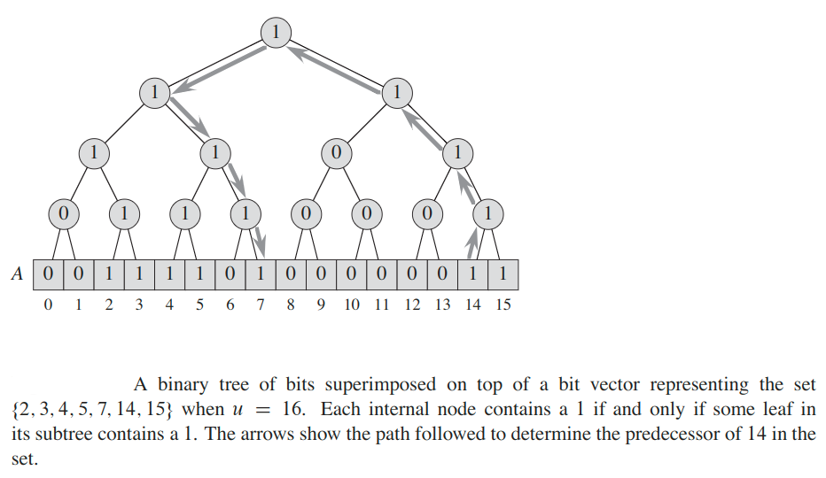
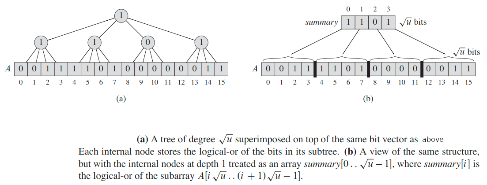
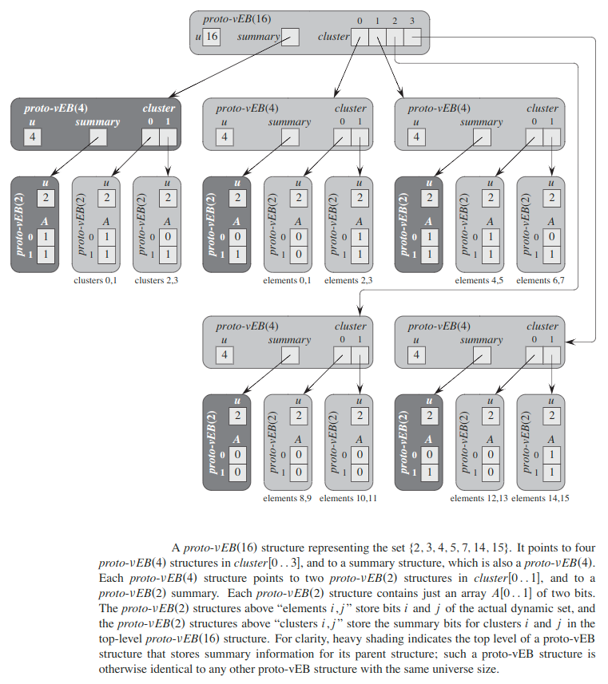
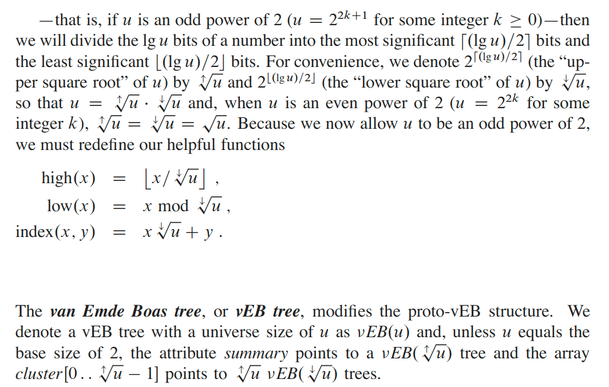
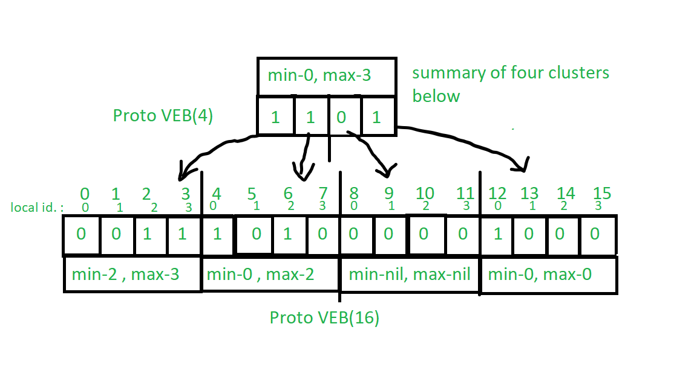
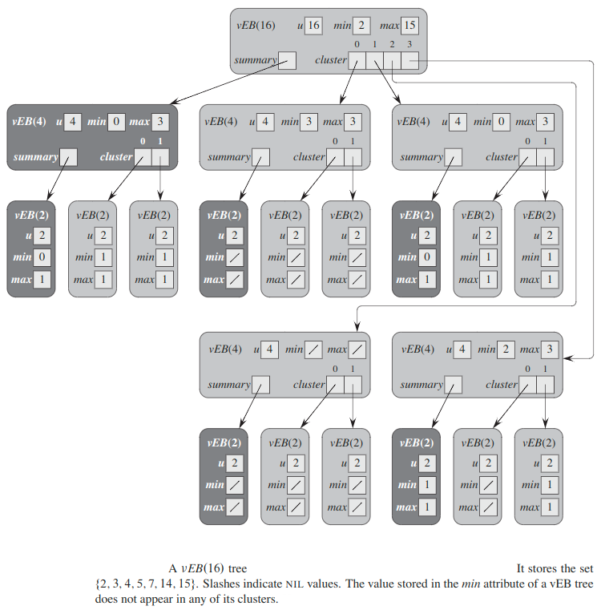

## van Emde Boas Trees
van Emde Boas trees support `search()`, `insert()`, `delete()`, `minimum()`, `maximum()`, `successor()`, and `predecessor()` in `O(lg(lg(n)))` time.

> We concentrate on keys and disallow duplicate keys to be stored.

We will use __`n`__ to denote the number of elements currently in the set and __`u`__ as the range of possible values, so that each _van Emde Boas tree_ operation  runs in `O(lg(lg(u)))` time.

We call the set `{0, 1, 2, ..., u-1}` the __universe__ of values that can be stored and `u` the __universe size__.

> We assume that `u` is an exact power of `2`, i.e., `u = 2^k` for some integer `k ≥ 1`.

### Preliminary approaches
To store a dynamic set of values from the universe `{0, 1, 2, ..., u-1}`, we maintain an array `A[0 ... u-1]` of `u` bits. The entry `A[x]` holds a `1` if the value `x` is in the dynamic set, and it holds a `0` otherwise. Although we can perform `insert()`, `delete()`, and `search()` operations in `O(1)` time with a bit vector, the remaining operations: `min()`, `max()`, `successor()`, and `predecessor()` each take `θ(u)` time in the worst case because we might have to scan through `u` elements.

We can short-cut long scans in the bit vector by superimposing (наложение) a binary tree of bits on top of it.

The entries of the bit vector form the leaves of the binary tree, and each internal node contains a `1` if and only if any leaf in its subtree contains a `1`. In other words, the bit stored in an internal node is the logical-or of its two children.

Since the height of the tree is `lg u` and each of the above operations makes at most one pass up the tree and at most one pass down, each operation takes `O(lg u)` time in the worst case.

### Superimposing a tree of constant height
What happens if we superimpose a tree with greater degree? Let us assume that the size of the universe is `u = 2^(2^k)` for some integer `k`, so that `√u` is an integer.

Instead of superimposing a binary tree on top of the bit vector, we superimpose a tree of degree `√u`. The height of the resulting tree is always `2`.

As  before, each  internal  node  stores  the  logical-or  of  the  bits  within  its  sub-tree, so that the `√u` internal nodes at depth `1` summarize each group of `√u` values.

We  can  think  of  these  nodes  as  an  array `summary[0 ... √u - 1]`, where `summary[i]` contains  a `1` if  and only  if  the sub-array `A[i√u ... (i + 1)√u - 1]` contains a `1`.   We call this `√u`-bit sub-array of `A` the __`i`-th cluster__.

For a given value of `x`, the bit `A[x]` appears  in  cluster  number &lfloor;`x/√u`&rfloor;.  Now `insert()` becomes an `O(1)` time  operation:  to  insert `x`, set both `A[x]` and `summary[`&lfloor;`x/√u`&rfloor;`]` to `1`. We can use the summary array to perform each of the operations `min()`, `max()`, `successor()`, `predecessor()`, and `delete()` in `O(√u)` time.

In each of the above operations, we search through at most two clusters of `√u` bits plus the summary array, and so each operation takes `O(√u)` time.

### A recursive structure
Now, we make the structure recursive, shrinking the universe size by the square root at each level of recursion.

For simplicity, we assume that `u = 2^(2^k)` for some integer `k`, so that `u, u^(1/2), u^(1/4), ...` are integers. Since the structure we examine here is only a precursor to the true van Emde Boas tree structure,  we tolerate  this restriction  in favor of aiding our understanding.

Recalling that our goal is to achieve running times of `O(lg(lg u))` for the operations, let’s think about how we might obtain such running times. From divide and conquer method, we saw that by changing variables, we could show that the recurrence `T(n) = 2T(`&lfloor;`√n`&rfloor;`) + lg(n)` has the solution `T(n) = O(lg(lg(n)))`.

The above recurrence will guide our search for a data structure.  We will design a recursive data structure that shrinks by a factor of `√u` in each level of its recursion. When an operation traverses this data structure, it will spend a constant amount of time at each level before recursing to the level below.

A given  value `x` resides  in cluster  number &lfloor;`x/√u`&rfloor;. If we view `x` as  a `lg u`-bit  binary  integer,  that  cluster number, &lfloor;`x/√u`&rfloor;, is given by the most significant `(lg u)/2` bits of `x`.  Within its cluster, `x` appears in position `x mod √u`, which is given by the least significant `(lg u)/2` bits of `x`.  We will need to index in this way, and so let us define some functions that will help us do so:

* `high(x) = `&lfloor;`x/√u`&rfloor;
* `low(x) = x mod √u`
* `index(x, y) = x√u + y`

The function `index(x, y)` builds an element number from `x` and `y`, treating `x` as the most significant bits of the element number and `y` as the least significant bits.

`x = index(high(x), low(x))`

### Proto van Emde Boas structures
For the universe `{0, 1, 2, ..., u-1}`, we define a __proto van Emde Boas__ structure, or __proto-vEB__ structure,  which we denote  as `proto-vEB(u)`,  recursively  as follows.
* Each `proto-vEB(u)` structure contains an attribute `u` giving its universe size.
* If `u = 2`, then it is the base size, and it contains an array `A[0 .. 1]` of two bits.
* Otherwise, `u = 2^(2^k)` for  some  integer `k ≥ 1`, so that `u ≥ 4`. In  addition to the universe size `u`, the data structure `proto-vEB(u)` contains the following attributes:
  * a pointer named summary to a `proto-vEB(√u)` structure and.
  * an array cluster `[0 .. √u-1]` of `√u` pointers, each to a `proto-vEB(√u))` structure.

In the two-level structure of the previous section, each node stores a summary array  of  size `√u`,  in  which  each  entry  contains  a  bit.   From  the  index  of  each entry,  we can compute the starting index of the sub-array of size `√u` that the bit summarizes.

In the proto-vEB structure, we use explicit pointers rather than index calculations. The array `summary` contains the summary bits stored recursively in a proto-vEB structure, and the array `cluster` contains `√u` pointers.

### The van Emde Boas tree
The proto-vEB structure of the previous section is close to what we need to achieve `O(lg(lg u))` running times. It falls short because we have to recurse too many times in most  of  the operations.

We observed that the assumption that we made about the universe size — that `u = 2^(2^k)` for some integer `k`—is unduly restrictive, confining the possible values of `u` an overly sparse set.  From this point on, therefore,  we will allow the universe size `u` to be any exact power of `2`, and when `√u` is not an integer

The vEB tree contains two attributes not found in a proto-vEB structure:
* `min` stores the minium element.
* `max` stores the maximum element.

Furthermore,  the  element  stored  in `min` does  not  appear  in  any  of  the  recursive vEB trees  that  the cluster array  points  to. Note that when a vEB tree contains two or more elements, we treat `min` and `max` differently:  the element stored in `min` does not appear in any of the clusters, but the element stored in `max` does.

Since the base size of node is `2`, a `vEB(2)` tree does not need the array `A` that the corresponding `proto-vEB(2)` structure  has. Instead,  we can  determine  its elements from its `min` and `max` attributes.  In a vEB tree with no elements, regardless of its universe size `u`, both `min` and `max` are `NIL`.

The `min` and `max` attributes will turn out to be key to reducing the number of recursive calls within the operations on vEB trees.

If `min` and `max` are defined but are equal to each other, then the vEB tree has exactly one element.

The `lg(lg(u))` is almost linear and increases very little while `u` changes noticeably.

This figure shows a `vEB(16)` tree `V` holding the set `{2, 3, 4, 5, 7, 14, 15}`. Because the smallest element is 2, `V.min` equals 2, and even though `high(2)= 0`, the element 2 does not appear  in the `vEB(4)` tree pointed to by `V.cluster[0]`  notice that `V.cluster[0].min` equals 3, and so 2 is not in this vEB tree.  Similarly,  since `V.cluster[0].min` equals 3, and 2 and 3 are the only elements in `V.cluster[0]`, the `vEB(2)` clusters within `V.cluster[0]` are empty.

### Time complexity
Even  if  the  universe  size `u` is  an  odd  power  of `2`,  the  difference  in  the  sizes of the summary vEB tree and the clusters will not turn out to affect the asymptotic running times of the vEB-tree operations.

The recursive procedures that implement the vEB-tree operations will all have running times characterized by the recurrence:

`T(u) ≤ T(√u) + O(1)`

Letting `m = lgu`, we rewrite it as: `T(2^m) ≤ T(2^(m/2)) + O(1)`

As `m/2 ≤ 2m/3` for all `m ≥ 2`, we have: `T(2^m) ≤ T(2^(2m/3)) + O(1)`

Letting `S(m) = T(2^m)`, we rewrite this last recurrence as: `S(m) ≤ S(2m/3) + O(1)`

which by master method, has the solution `S(m) = O(lg m)`. Thus, we have `T(u) = T(2^m) = S(m) = O(lg m) = O(lg(lg u))`.

It is the very first time we apply Master Method to a Data Structure.

### Space complexity
The total space requirement ofa van Emde Boas tree is `O(u)`, and it is straightforward  to create an empty tree in `O(u)` time. In contrast, we can create an empty red-black tree in constant time. Therefore, we might not want to use a van Emde Boas tree when we perform only a small  number  of  operations,  since  the  time  to create  the  data  structure  would exceed the time saved in the individual operations.  This drawback is usually not significant, since we typically use a simple data structure, such as an array or linked list, to represent a set with only a few elements.

#### Decreasing space complexity
We can decrease space requirements by storing cluster in a hash table instead of array. The hash table will stores only pointers to nonempty clusters. A search in the hash table for an empty cluster returns `undefined`, indicating that the cluster is empty.

To find the `i`-th cluster, we look up the key ii in the hash table, so that we can find the `i`-th cluster by a single search in the hash table.

The attribute `summary` is `undefined` if all clusters are empty.

Because the hash table is implemented with a dynamic table, the space it requires is proportional to the number of nonempty clusters. Which means the space complexity decreases to `O(n)`.

### Extra
To support duplicate keys, for each `u = 2` vEB tree, instead of storing just a bit in each of the entries of its array, it should store an integer representing how many elements of that value the vEB contains.

---

#### [Read More](https://www.geeksforgeeks.org/van-emde-boas-tree-set-1-basics-and-construction/)

#### [Watch Youtube Video](https://www.youtube.com/watch?v=hmReJCupbNU)

#### [Java implementation](https://github.com/MDhondt/vEB/blob/master/src/be/mdhondt/veb/VanEmdeBoasMap.java)
