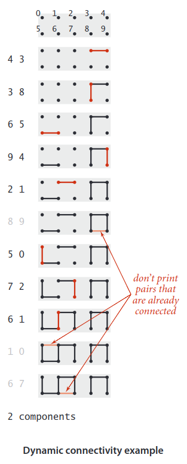
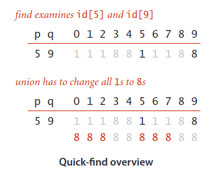
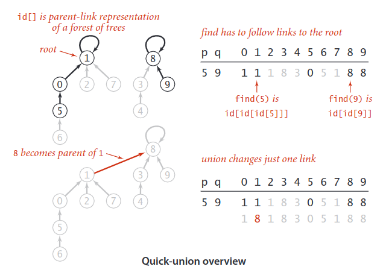
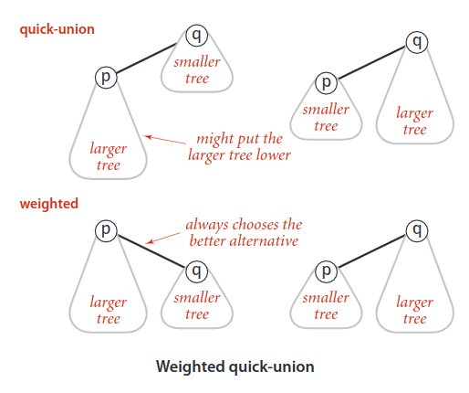
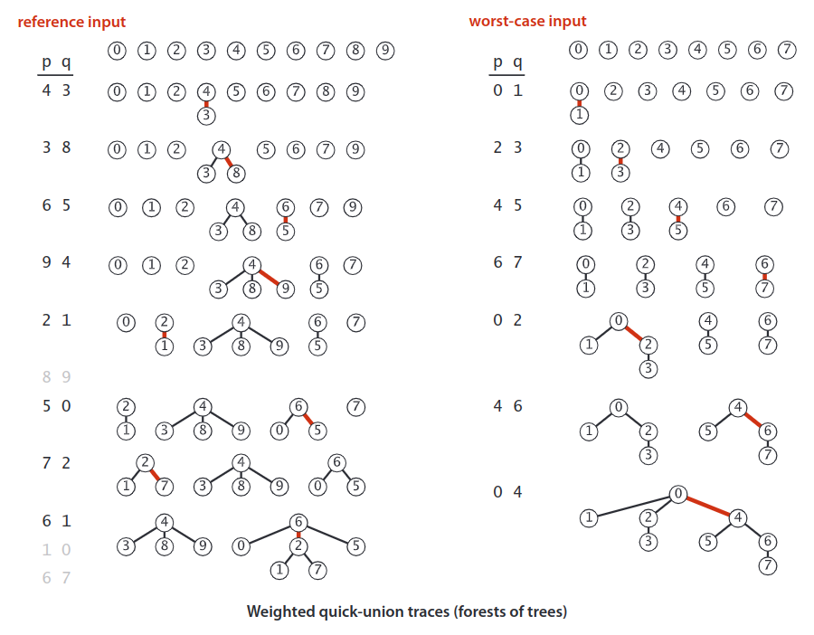
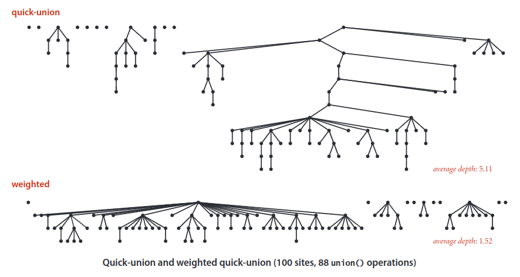
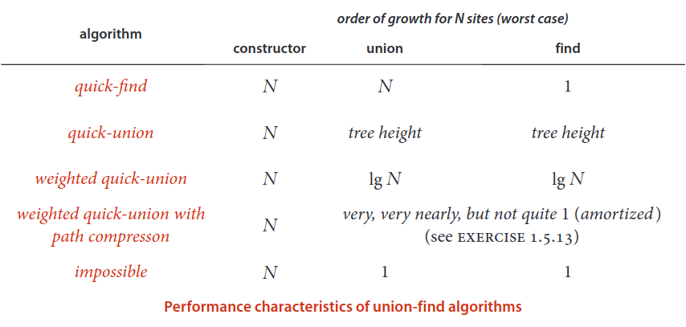

# Dynamic Connectivity
The input is a sequence of pairs of integers, where each integer represents an object of some type and we are to interpret the pair `p` `q` as meaning “`p` is connected to `q`.” We assume that “is connected to” is an equivalence relation, which means that it is:
* _Reflexive_: `p` is connected to `p`.
* _Symmetric_: If `p` is connected to `q`, then `q` is connected to `p`.
* _Transitive_: If `p` is connected to `q` and `q` is connected to `r`, then `p` is connected to `r`.

An  equivalence relation partitions the objects into _equivalence classes_. In this case, two objects are in the same equivalence class if and only if they are connected.

Our goal is to  write  a  program  to  filter  out  extraneous  pairs  (pairs  where  both  objects  are  in  the same equivalence class) from the sequence. In other words, when the program reads a pair `p` `q` from the input, it should write the pair to the output only if the pairs it has seen to that point do not imply that `p` is connected to `q`. If the previous pairs do imply that `p` is connected to `q`, then the program should ignore the pair `p` `q` and proceed to read in the next pair. The figure on the facing page gives an example of this process. To achieve the desired goal, we need to devise a data structure that can remember sufficient information about the pairs it has seen to be able to decide whether or not a new pair of objects is connected. Informally, we refer to the task of designing such a method as the __dynamic connectivity problem__.

To fix ideas, we will use networking terminology for the rest of this  section  and  refer  to  the  objects  as __sites__,  the  pairs  as __connections__, and the equivalence classes as __connected components__, or just __components__  for  short.  For  simplicity,  we  assume  that  we  have `N` sites with integer names, from `0` to `N-1`.

We always use the name of one of the sites in a component as the component identifier, so you can think of each component as being represented by one of its sites.

## Implementations
We shall consider three different implementations, all based on using the site-indexed `componentId[]` array, to determine whether two sites are in the same connected component.

### Quick Find
One  approach  is  to  maintain  the  invariant  that p  and q  are  connected if and only if `componentId[p]` is equal to `componentId[q]`.  In  other  words,  all  sites  in  a  component  must have  the  same  value  in `componentId[]`.  This  method  is  called quick-find  because `find(p)` just returns `componentId[p]`.

To maintain the invariant for the call `union(p, q)`, we first check whether they are already in the same component, in which case there is nothing to do. Otherwise, we are faced  with  the  situation  that  all  of  the `componentId[]` entries corresponding  to  sites  in  the  same  component  as `p` have  one  value  and  all  of  the `componentId[]` entries corresponding to sites in the same component  as `q` have another value. To combine the two components into one,  we  have  to  make  all  of  the `componentId[]` entries  corresponding  to  both  sets  of  sites  the  same  value,  as shown in the example below.

### Quick Union
The next algorithm that we consider is a complementary method that concentrates on speeding up the `union()` operation. It is based on the same data structure — the site-indexed `componentId[]` array but we interpret the values differently. Specifically, the `componentId[]` entry for  each  site  is  the  name  of  another site in the same component (possibly itself)—we refer to this connection as a _link_.

To implement `find()`, we start at the given site, follow its link to an-other site, follow that site’s link to yet another  site,  and  so  forth, following links until reaching a root (a site that has a link to itself).

> Two sites are in the same component if and only  if  this  process  leads  them  to  the same root.

To validate this process, we need `union(p, q)` to maintain this invariant, which is easily arranged: we follow links to find the roots associated with `p` and `q`, then rename  one  of  the  components  by  linking  one  of  these  roots  to  the  other;  hence  the name quick-union.

Representing  sites  as _nodes_ (labeled circles) and links as arrows from one node to an-other gives a graphical representation of the data structure that makes it relatively easy to  understand  the  operation  of  the  algorithm.  The  resulting  structures  are _trees_—in technical  terms.

The quick-union algorithm would seem to be faster than the quick-find algorithm, because it does not have to go through the entire array for each input pair.

Analyzing the cost of quick-union is more difficult than it was for quick-find, because the cost is more dependent on the nature of the input. In the best case, `find()` just needs one array access to find the identifier associated with a site, as in quick-find; in the worst case, it needs `2N + 1` array accesses (when all sites are connected).

> __Definition:__ The size of a tree is its number of nodes. The    depth of a node in a tree is the number of links on the path from it to the root. The height of a tree is the maximum depth among its nodes.

In the worst case, suppose that the input pairs come in the order `0-1`, then `0-2`, then `0-3`, and so forth. After `N-1` such pairs, we have `N` sites all in the same set, and the tree that is formed by the quick-union algorithm has height `N-1`. The  number  of  array  accesses  for the `union()` operation for the pair `0-i` is exactly `2i + 2` (site `0` is at depth `i` and site `i` at depth `0`). Thus, the total number of array accesses for the `find()` operations for these `N` pairs is `2 * (1 + 2 + . . . + N)`, which is an arithmetic progression. It equals to `2N * (1 + N) / 2 = N + N``2`

### Weighted Quick union
Fortunately, there  is  an easy modification to quick-union that allows us to  guarantee  that  bad  cases  such  as  this  one  do not occur.

Rather than arbitrarily connecting the second tree to the first for `union()`, we keep track of  the size  of  each  tree  and  always  connect  the smaller  tree  to  the  larger.

These tree structures look complex, but they have the simple property that the height of a tree of `2``n` nodes  is `n`.  Furthermore, when we merge two trees of `2``n` nodes, we get a tree of `2``n+1` nodes, and we increase the height of the tree to `n+1`. This observation generalizes to provide a proof that the weighted algorithm can guarantee _logarithmic_ performance.

> The depth of any node in a forest built by weighted quick-union for `N` sites is at most `lgN`.

_Proof_: We prove a stronger fact by (strong) induction: The height of every tree of size `k` in the forest is at most `lg k`. The base case follows from the fact that the tree height is `0` when `k` is `1`. By the inductive hypothesis, assume that the tree height of a tree of size `i` is at most `lg i` for all `i < k`. When we combine a tree of size `i` with a tree of size `j` with `i ≤ j` and `i + j = k`, we increase the depth of each node in the smaller set by `1`, but they are now in a tree of size `i + j = k`, so the property is preserved because `1 + lg i = lg(i + i ) ≤ lg(i + j ) = lg k`.

> For weighted quick-union with `N` sites, the worst-case order of growth of the cost of `find()`, `connected()`, and `union()` is `logN`.

> The weighted quick-union algorithm uses at most `c * M * lgN` array accesses to process `M` connections among `N` sites for a small constant `c`.

## Comparison

## Path compression
Can  we  find  an  algorithm  that  has guaranteed  constant-time-per-operation  performance?  This  question  is  an  extremely  difficult  one  that  plagued researchers for many years.

For example, the following meth-od, known as  __path compression__, is easy to implement. Ideally, we would like every node to link directly to the root of its tree, but we do not want to pay the price of changing a large number of links, as we did in the quick-find algorithm. We can approach the ideal simply by making all the nodes that we do examine directly link to the root.

To implement path compression, we just add another loop to `find()` that sets the `componentId[]` entry corresponding to each node encountered along the way to link directly to the root. The net result is to flatten the trees almost completely, approximating the ideal achieved by the quick-find algorithm.

> Weighted quick union with path compression is optimal but not  quite constant-time per operation.

That is, not only  is  weighted  quick-find  with  path  compression  not  constant-time  per  operation in the worst case (   amortized), but also there exists no algorithm that can guarantee to perform each union-find operation in amortized constant time.
