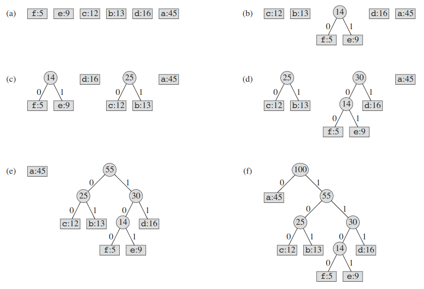
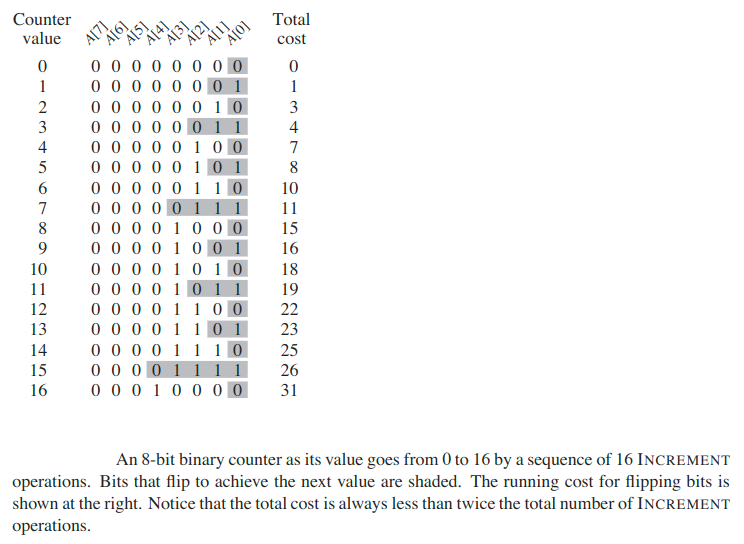
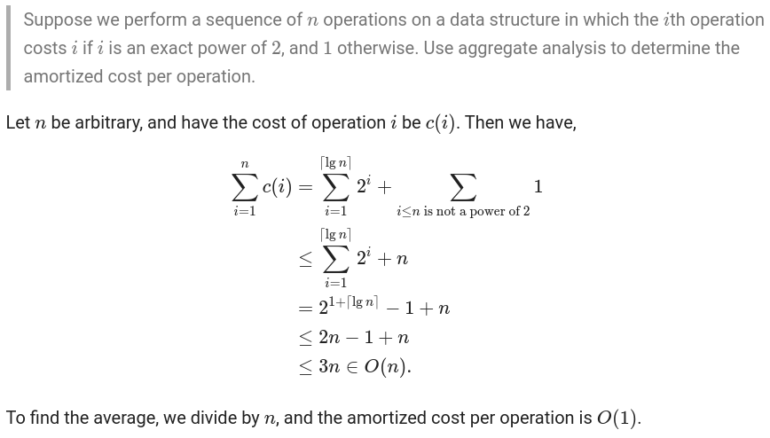
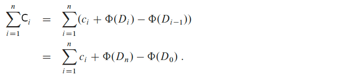
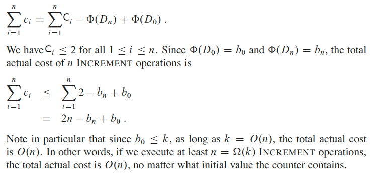
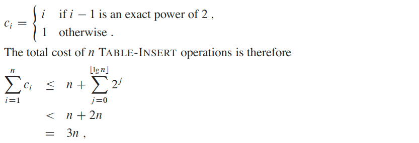
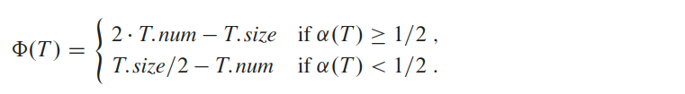

# Analyzing algorithms
__Algorithm__ - is any well-defined computational procedure that takes some value, or set of values, as _input_ and produces some value, or set of values, as _output_. An algorithm is thus a sequence of computational steps that transform the input into the output.

## Input Size
The best notion for __input size__ depends on the problem being studied.

For many problems, such as sorting or computing discrete Fourier transforms, the most natural measure is the _number of items_ in the input—for example, the array size `n` for sorting.

For many other problems, such as multiplying two integers, the best measure of input size is the total number of bits needed to represent the input in ordinary binary notation.

Sometimes, it is more appropriate to describe the size of the input with two numbers rather than one. For instance, if the input to an algorithm is a graph, the input size can be described by the numbers of vertices and edges in the graph.

> We shall indicate which input size measure is being used with each problem we study.

## Running Time
The __running time__ of an algorithm on a particular input is the number of primitive operations or _“steps”_ executed.

It is convenient to define the notion of step so that it is as machine-independent as possible. For the moment, let us adopt the following view.

A constant amount of time is required to execute each line of our pseudocode. One line may take a different amount of time than another line, but we shall assume that each execution of the ith line takes time `c[i]`, where `c[i]` is a constant.

This viewpoint is in keeping with the RAM model, and it also reflects how the pseudocode would be implemented on most actual computers.

## Order of growth
Look only at the leading term of the formula for running time.
* Drop lower-order terms.
* Ignore the constant coefficient in the leading term.

Example: For _insertion sort_ we already abstracted away the actual statement costs to conclude that the worst-case running time is `an^2 + bn + c`.
* Drop lower-order terms ⇒ `an^2`.
* Ignore constant coefficient ⇒ `n^2`.

But we cannot say that the worst-case running time `T(n)` equals `n^2`. It grows like `n^2`. But it doesnít equal `n^2`.

We say that the running time is `O(n^2)` to capture the notion that the _order of growth_ is `n^2`.

We usually consider one algorithm to be _more efficient_ than another if its worst-case running time has a smaller order of growth.

## Complexity of Algorithms

__Time complexity__: The number of computations the algorithm does.

__Auxiliary Space__: The extra space that is taken by an algorithm temporarily to finish its work

__Space Complexity__: Space complexity is the total space taken by the algorithm with respect to the input size plus the auxiliary space that the algorithm uses.


__[Youtube Playlist about Time and Space Complexity Analysis](https://www.youtube.com/watch?v=aGjL7YXI31Q&list=PLEbnTDJUr_IeHYw_sfBOJ6gk5pie0yP-0)__


# Growth of Functions
## Asymptotic notation
Asymptotic notation is a way to describe behavior of functions in the limit, describe growth of functions.

It is about focusing on whatís important by abstracting away low-order terms and constant factors.

Because `θ(g(n))` is a set, we could write `f(n) ∈ θ(g(n))` to indicate that f.n/ is a member of `θ(g(n))`. Instead, we will usually write `f(n) = θ(g(n))` to express the same notion.

A way to compare sizes of functions:
* __`θ` ≈ `=`__

    `θ(g(n))` = `{` `f(n)`: there exist positive constants `c1`, `c2`, and `n0` such that: `0 ≤ c1g(n) ≤ f(n) ≤ c2g(n)` for all `n ≥ n0` `}`

    > We say that `g(n)` is an asymptotically tight bound for `f(n)`.

    The definition of `θ(g(n))` requires that every member `f(n) ∈ θ(g(n))` be asymptotically _nonnegative_, that is, that `f(n)` be nonnegative whenever `n` is sufficiently large.

    Consequently, the function `g(n)` itself must be asymptotically nonnegative, or else the set `θ(g(n))` is empty.

    Previously we introduced an informal notion of `θ`-notation that amounted to throwing away lower-order terms and ignoring the leading coefficient of the highest-order term. Let us briefly justify this intuition by using the formal definition to show that `n^2/2 - 3n = θ(n2)`. To do so, we must determine positive constants `c1`, `c2`, and `n0` such that:

    `c1 * n^2 ≤ n^2/2 - 3n ≤ c2 * n^2`

    for all `n ≥ n0`. Dividing by `n^2` yields:

    `c1 ≤ 1/2 - 3/n ≤ c2`

    We can pick constants. For example: `c2 = 1/4`, `c1 < 1/4`, `n0 = 7`.

    > Intuitively, the lower-order terms of an asymptotically positive function can be ignored in determining asymptotically tight bounds because they are insignificant for large `n`. When `n` is large, even a tiny fraction of the highest-order term suffices (хватает) to dominate the lower-order terms. Thus, setting `c1` to a value that is slightly smaller than the coefficient of the highest-order term and setting `c2` to a value that is slightly larger permits the inequalities in the definition of `θ`-notation to be satisfied.

    > The coefficient of the highest-order term can likewise be ignored, since it only changes `c1` and `c2` by a constant factor equal to the coefficient.

* __`O` ≈ `≥`__

    The `θ`-notation asymptotically bounds a function from above and below. When we have only an __asymptotic upper bound__, we use `O`-notation.

    `O(g(n))` = `{` `f(n)`: there exist positive constants `c`, and `n0` such that: `0 ≤ f(n) ≤ cg(n)` for all `n ≥ n0` `}`

    `θ(g(n)) ⊆ O(g(n))` - `θ(g(n))` is a subset of `O(g(n))`

* __`Ω` ≈ `≤`__

    `Ω`-notation provides an __asymptotic lower bound__.

    `Ω(g(n))` = `{` `f(n)`: there exist positive constants `c`, and `n0` such that: `0 ≤ cg(n) ≤ f(n)` for all `n ≥ n0` `}`

* __`o` ≈ `>`__

    We use `o`-notation to denote an _upper bound_ that is _not asymptotically tight_.

    `o(g(n))` = `{` `f(n)`: for any positive constants `c > 0`, ther exists a constant `n0 > 0` such that: `0 ≤ f(n) < cg(n)` for all `n ≥ n0` `}`

    Example: `n^1.9999 = o(n2)`

    In `o`-notation, `f(n)` becomes insignificant (незначительный) relative to `g(n)` as `n` approaches infinity:

    

* __`ω` ≈ `<`__

    We use `ω`-notation to denote a _lower_ bound that is _not asymptotically tight_.

    `ω(g(n))` = `{` `f(n)`: for any positive constants `c > 0`, ther exists a constant `n0 > 0` such that: `0 ≤ cg(n) < f(n)` for all `n ≥ n0` `}`

    Example: `n^2 / 2 = ω(n)`

    in `ω`-notation, `f(n)` becomes arbitrarily large relative to `g(n)` as `n` approaches infinity.

    

The running time of insertion sort therefore belongs to both `Ω(n)` and `O(n^2)`.


> __Theorem__: `f(n) = θ(g(n))` if and only if `f(n) = O(g(n))` and `f(n) = Ω(g(n))`.

## Asymptotic notation in equations and inequalities
When asymptotic notation appears in a formula (`2n^2 + 3n + 1 = 2n^2 + θ(n)`), we interpret it as standing for some anonymous function that we do not care to name.

In case: `2n^2 + θ(n) = θ(n^2)`, the right-hand side of an equation provides a coarser (грубее) level of detail than the left-hand side.

### Comparing functions
Assume that `f(n)` and `g(n)` are asymptotically positive.
* Transitivity
    * `f(n) = θ(g(n)) and g(n) = θ(h(n)) imply f(n) = θ(h(n))`
    * `f(n) = O(g(n)) and g(n) = O(h(n)) imply f(n) = O(h(n))`
    * `f(n) = Ω(g(n)) and g(n) = Ω(h(n)) imply f(n) = Ω(h(n))`
    * `f(n) = o(g(n)) and g(n) = o(h(n)) imply f(n) = o(h(n))`
    * `f(n) = ω(g(n)) and g(n) = ω(h(n)) imply f(n) = ω(h(n))`
* Reflexivity
    * `f(n) = θ(f(n))`
    * `f(n) = O(f(n))`
    * `f(n) = Ω(f(n))`
* Symmetry
    * `f(n) = θ(g(n)) if and only if g(n) = θ(f(n))`
* Transpose symmetry
    * `f(n) = O(g(n)) if and only if g(n) = Ω(f(n))`
    * `f(n) = o(g(n)) if and only if g(n) = ω(f(n))`
    
We say that `f(n)` is __asymptotically smaller__ than `g(n)` if `f(n) = o(g(n))`, and `f(n)` is __asymptotically larger__ than `g(n)` if `f(n) = ω(g(n))`.

__Although any two real numbers can be compared, not all functions are asymptotically comparable. That is, for two functions `f(n)` and `g(n)`, it may be the case that neither `f(n) = O(g(n))` nor `f(n) = Ω(g(n))` holds.__ For example, we cannot compare the functions `n` and `n^(1 + sin n)` using asymptotic notation, since the value of the exponent in `n^(1 + sin n)` oscillates between `0` and `2`, taking on all values in between.

> __Assertion__: `max(f(n), g(n)) = Θ(f(n)+g(n))`

Prove:

Let `n0 = max(n1,n2)`. Some obvious things for `n > n0`:

`f(n) ≤ max(f(n),g(n))` and `g(n) ≤ max(f(n),g(n))`

Sum two above inequalities: `(f(n)+g(n))/2 ≤ max(f(n),g(n))`

We know: `max(f(n),g(n)) ≤ f(n)+g(n)`

From the last two inequalities, we get:

`0 ≤ (f(n)+g(n)) / 2 ≤ max(f(n),g(n)) ≤ f(n)+g(n)` for `n > n0`

Which is the definition of `Θ(f(n)+g(n))` with `c1 = 1/2`, `c2 = 1`.

## Standard Notations and Common Functions
* Monotonicity
    * `f(n)` is __monotonically increasing__ if `m ≤ n` ⇒ `f(m) ≤ f(n)`
    * `f(n)` is __monotonically decreasing__ if `m ≥ n` ⇒ `f(m) ≥ f(n)`
    * `f(n)` is __strictly increasing__ if `m<n` ⇒ `f(m) < f(n)`
    * `f(n)` is __strictly decreasing__ if `m>n` ⇒ `f(m) > f(n)`

* Floors and ceilings

    For any real number `x`, we denote the greatest integer less than or equal to `x` by __&lfloor;`x`&rfloor;__ (read _“the floor of `x`”_) and the least integer greater than or equal to `x` by __&lceil;`x`&rceil;__ (read _“the ceiling of x”_).
    
    For all real `x`, `x - 1 <` &lfloor;`x`&rfloor; `≤ x ≤` &lceil;`x`&rceil; `< x + 1`

    For any integer `n`, &lfloor;`n/2`&rfloor; + &lceil;`n/2`&rceil; = `n`

    

* Modular arithmetic

    For any integer `a` and any positive integer `n`, the value `a mod n` is the __remainder__ (or residue) of the quotient `a/n`: `a mod n = a - n` &lfloor;`a/n`&rfloor;

    It follows that: `0 ≤ a mod n < n`

    If `(a mod n) = (b mod n)`, we write `a ≡ b (mod n)` and say that `a` is __equivalent__ to `b`, modulo `n`. In other words, `a ≡ b (mod n)` if `a` and `b` have the same remainder when divided by `n`.

    Equivalently, `a ≡ b (mod n)` if and only if `n` is a divisor of `b - a`.

* Polynomials

    Given a nonnegative integer `d`, a __polynomial in `n` of degree `d`__ is a function `p(n)` of the form.

    

    where the constants `a0, a1, ... ad` are the _coefficients_ of the polynomial and `ad ≠ 0`.

    A polynomial is _asymptotically positive_ if and only if `ad > 0`.

    For an asymptotically positive polynomial `p(n)` of degree `d` , we have `p(n) = θ(n^d)`.

    We say that a function `f(n)` is __polynomially bounded__ if `f(n) = O(n^k)` for some constant `k`.

* Exponentials

    For all real `a > 0`, `m`, and `n`, we have the following identities:
    * `a^0 = 1`
    * `a^1 = a`
    * `a^-1 = 1/a`
    * `(a^m)^n = a^mn`
    * `(a^m)^n = (a^n)^m`
    * `a^m * a^n = a^(m+n)`

    When convenient, we shall assume `0^0 = 1`.

    As any exponential function with a base strictly greater than 1 grows faster than any polynomial function, `n^b = o(a^n)`

    

    For all real x, we have the inequality: `e^x ≥ 1 + x`, where equality holds only when `x = 0`.
    
    When `|x| ≤ 1`, we have the approximation `1 + x ≤ e^x ≤ 1 + x + x^2`

    

* Logarithms

    Notations:
    * `lg(n) = log_2(n)` (binary logarithm)
    * `ln(n) = log_e(n)` (natural logarithm)
    * `lg^k(n) = (lg(n))^k` (exponentiation)
    * `lg lg(n) = lg(lg(n))` (composition)

    For all real `a > 0`, `b > 0`, `c > 0`, `n`, and bases of algorithms are not `1`:
    * `a = b^(log_b(a))`
    * `log_c(ab) = log_c(a) + log_c(b)`
    * `log_b(a^n) = n log_b(a)`
    * `log_b(a) = log_c(a) / log_c(b)` (*)
    * `log_b(1/a) = -log_b(a)`
    * `log_b(a) = 1 / log_a(b)`
    * `a^(log_b(c)) = c^(log_b(a))`

    > __By equation (*), changing the base of a logarithm from one constant to another changes the value of the logarithm by only a constant factor, and so we shall often use the notation `lg n` when we don’t care about constant factors, such as in `O`-notation.__

    

    Any positive polynomial function grows faster than any polylogarithmic function: `lg^b(n) = o(n^1))`

    Some useful equations:

    

* Factorials

    A weak upper bound on the factorial function is `n! ≤ n^n`.
    * `n! = o(n^n)`
    * `n! = ω(2^n)`
    * `lg(n!) = θ(n lg(n))`

    Strirling's approximation:

    

    The following equation also holds for all `n ≥ 1`:

    

* Functional Iteration

    We use the notation `f^(i)(n)` to denote the function `f(n)` iteratively applied `i` times to an initial value of `n`.

    

    `lg^*(n) = min{i ≥ 0: lg^(i)(n) ≤ 1}`

* Fibonacci Numbers

    `F_0 = 0`, `F_1 = 1`, `F_i = F_i-1 + F_i-2` for `i ≥ 2`

    Thus, each Fibonacci number is the sum of the two previous ones, yielding the sequence: 0, 1, 1, 2, 3, 5, 8, 13, 21, 34, 55, ...

    Fibonacci numbers are related to the __golden ratio `φ`__ and to its _conjugate `Φ`_, which are the two roots of the equation `x^2 = x + 1`
    1. `φ = (1 + sqrt(5))/2 = 1.61803...`
    2. `Φ = (1 - sqrt(5))/2 = -0.61803...`

    Specifically, we have:
    * `F_i = (φ^i - Φ^i)/sqrt(5)`
    * `F_i =` &lfloor;`φ^i/sqrt(5) + 1/2`&rfloor;


# Designing Algorithms
## Incremental Approach
We can choose from a wide range of algorithm design techniques. An __incremental approach__: having sorted the subarray `A[1..j-1]` , we inserted the single element `A[j]` into its proper place, yielding the sorted subarray `A[1..j]`.

> For _insertion sort_, we used an _incremental approach_

## The Divide-and-Conquer Approach
The divide-and-conquer paradigm involves three steps at each level of the recursion:
* __Divide__ the problem into a number of subproblems that are smaller instances of the same problem.
* __Conquer__ the subproblems by solving them recursively. If the subproblem sizes are small enough, however, just solve the subproblems in a straightforward manner.
* __Combine__ these solutions to create a solution to the original problem.

> The _merge sort_ algorithm closely follows the _divide-and-conquer paradigm_

When an algorithm contains a recursive call to itself, we can often describe its running time by a __recurrence equation__ or __recurrence__, which describes the overall running time

A recurrence for the running time of a _divide-and-conquer algorithm_ falls out from the three steps of the basic paradigm. As before, we let `T(n)` be the running time on a problem of size `n`. If the problem size is small enough, say `n <= c` for some constant `c`, the straightforward solution takes constant time, which we write as `O(1)`. Suppose that our division of the problem yields `a` sub-problems, each of which is `1/b` the size of the original. (For merge sort, both `a` and `b` are `2`, but we shall see many divide-and-conquer algorithms in which `a != b`) It takes time `T(n/b)` to solve one subproblem of size `n/b`, and so it takes time `aT(n/b)` to solve `a` of them. If we take `D(n)` time to divide the problem into subproblems and `C(n)` time to combine the solutions to the subproblems into the solution to the original problem, we get the recurrence.


In practice, we neglect certain technical details when we state and solve recurrences.
* If we call MERGE-SORT on `n` elements when `n` is odd, we end up with subproblems of size &lfloor;`n/2`&rfloor; and &lceil;`n/2`&rceil;. Neither size is actually `n/2`, because `n/2` is not an integer when `n` is odd. Technically, the recurrence describing the worst-case running time of MERGE-SORT is really

    

* Since the running time of an algorithm on a constant-sized input is a constant, the recurrences that arise from the running times of algorithms generally have `T(n) = θ(1)` for sufficiently small `n`. Consequently, for convenience, we shall generally omit statements of the boundary conditions of recurrences and assume that `T(n)` is constant for small `n`. For example, we normally state recurrence as:

    `T(n) = 2T(n/2) + θ(n)`

    without explicitly giving values for small `n`. The reason is that although changing the value of `T(1)` changes the exact solution to the recurrence, the solution typically doesn’t change by more than a constant factor, and so the order of growth is unchanged.

## Solving recurrencies methods:
* __Substitution method__

    Algorithm:
    1. Guess the solution e.g. `T(n)`.
    2. Use induction to find the constants and show that the solution works. That is, replace `T(n)` with our guess.

    Example: `2T(n/2) + n`
    1. Guess: `T(n) = n * log(n) + n`
    2. Induction:

        

    3. `T(n) = θ(n * log(n) + n) = θ(n log(n))`

    Example: `T(n) = 2T(`&lfloor;`sqrt(n)`&rfloor;`) + lgn`
    1. Rename `m = lgn` => `T(2^m) = 2T(2^(m/2)) + m`
    2. Rename `S(m) = T(2^m)` => `S(m) = 2S(m/2) + m`
    3. Guess: `S(m) = θ(m log(m))`
    4. Induction: `T(n) = T(2^m) = S(m) = θ(m log(m)) = θ(lg(n)*lg(lg(n)))`

* __Recursion trees__

    Used to generate a guess. Then verify by substitution method.

    In a _recursion tree_, each node represents the cost of a single subproblem somewhere in the set of recursive function invocations. We sum the costs within each level of the tree to obtain a set of per-level costs, and then we sum all the per-level costs to determine the total cost of all levels of the recursion.

    Example: `T(n) = 3T(`&lfloor;`n/4`&rfloor;`) + θ(n^2)`
    1. Get rid of &lfloor; for simplicity => `T(n) = 3T(n/4) + c*n^2` for `c > 0`
    2. For convenience, assume `n` is exact power of `4`
    3. Build the tree: 

        

    4. The subproblem size for a node at depth `i` is `n/4^i`. Thus, the subproblem size hits `n = 1` when `n/4^i = 1` => `i = log_4(n)`. Thus the tree has `log_4(n) + 1` levels (at depth `0,1,2 ... log_4(n)`)
    5. Each level has three times more nodes than the level above, and so the number of nodes at depth `i` is `3^i`. And each node at depth `i` has a cost of `c(n/4^i)^2`. Multiplying, we see that the total cost over all nodes at depth `i`, for `i = 0,1,2 ... log_4(n) - 1`, is `3^i * c(n/4^i)^2 = c * n^2 * (3/16)^i`
    6. The bottom level, at depth `i = log_4(n)`, has `3^i = 3^(log_4(n)) = n^(log_4(3))` each contributing cost `T(1)`, for a total cost of `T(1) * n^(log_4(3))` which is `θ(n^(log_4(3))`, since we assume that `T(1)` is a constant.
    7. Now we add up the costs over all levels to determine the cost for the entire tree:

        

    8. This last formula looks somewhat messy until we realize that we can again take advantage of small amounts of sloppiness (неряшливость) and use an infinite decreasing geometric series as an upper bound.

        

    9. Thus we have derived a guess of `T(n) = O(n^2)`

* __Master method__

    The master method provides a “cookbook” method for solving recurrences of the form: `T(n) = a*T(n/b) + f(n)`

    __MASTER THEOREM__.

    

    In each of the three cases, we compare the function `f(n)` with the function `n^(log_b(a))`. Intuitively, the larger of the two functions determines the solution to the recurrence.
    * If, as in case 1, the function `n^(log_b(a))` is the larger, then the solution `T(n) = θ(n^(log_b(a)))`
    * If, as in case 3, the function `f(n)` is the larger, then the solution is `T(n) = θ(f(n))`
    * If, as in case 2, the two functions are the same size, we multiply by a logarithmic factor, and the solution is `T(n) = θ(n^(log_b(a)) * lg(n)) = θ(f(n) * lg(n))`

    Beyond this intuition, you need to be aware of some technicalities. In the first case, not only must `f(n)` be smaller than `n^(log_b(a))`, it must be _polynomially smaller_. That is, `f(n)` must be asymptotically smaller than `n^(log_b(a))` by a factor of `n^ε` for some constant `ε > 0`. In the third case, not only must `f(n)` be larger than `n^(log_b(a))`, it also must be _polynomially larger_ and in addition satisfy the “regularity” condition that `a*f(n/b) ≤ c*f(n)`. This condition is satisfied by most of the polynomially bounded functions that we shall encounter.

    > Note that the three cases do not cover all the possibilities for `f(n)`. There is a gap between cases 1 and 2 when `f(n)` is smaller than `n^(log_b(a))` but not polynomially smaller. Similarly, there is a gap between cases 2 and 3 when `f(n)` is larger than `n^(log_b(a))` but not polynomially larger. If the function `f(n)` falls into one of these gaps, or if the regularity condition in case 3 fails to hold, you cannot use the master method to solve the recurrence.

    In particular case for `f(n) = O(n^k)`:

    

## Dynamic programming
Dynamic programming, like the divide-and-conquer method, solves problems by combining the solutions to subproblems. ("Programming" in this context refers to a tabular method, not to writing computer code.) As we saw in Chapter 1, divide-and-conquer algorithms partition the problem into independent subproblems, solve the subproblems recursively, and then combine their solutions to solve the original problem. In contrast, dynamic programming is applicable when the subproblems are not independent, that is, when subproblems share subsubproblems. In this context, a divide-and-conquer algorithm does more work than necessary, repeatedly solving the common subsubproblems. A dynamic-programming algorithm solves every subsubproblem just once and then saves its answer in a table, thereby avoiding the work of recomputing the answer every time the subsubproblem is encountered.

Dynamic programming is typically applied to optimization problems. In such problems there can be many possible solutions. Each solution has a value, and we wish to find a solution with the optimal (minimum or maximum) value. We call such a solution an optimal solution to the problem, as opposed to the optimal solution, since there may be several solutions that achieve the optimal value.

The development of a dynamic-programming algorithm can be broken into a sequence of four steps.
1. Characterize the structure of an optimal solution.
2. Recursively define the value of an optimal solution.
3. Compute the value of an optimal solution in a bottom-up fashion.
4. Construct an optimal solution from computed information.

When we think about a dynamic-programming problem, we should understand the set of subproblems involved and how subproblems depend on one another. The __subproblem graph__ for the problem embodies exactly this information. See the subproblem graph for the _rod-cutting problem_ below.


The size of the subproblem graph can help us determine the running time of the dynamic programming algorithm. Since we solve each subproblem just once, the running time is the sum of the times needed to solve each subproblem.

See also these problems:
* Fibonacci Sequence (`problems/fibonacci.ts`)
* Rod Cutting Problem (`problems/rod-cutting.ts`)
* Matrix-chain multiplication (`problems/matrix-multiplication.ts`)
* Longest Common Subsequence (`problems/longest-common-subsequence.ts`)
* Longest Increasing Subsequence (`problems/longest-increasing-subsequence.ts`)

Following are the two main properties of a problem that suggest that the given problem can be solved using Dynamic programming:
* __Overlapping Subproblem__

    A given problems has Optimal Substructure Property if optimal solution of the given problem can be obtained by using optimal solutions of its subproblems.

    For example, the Shortest Path problem has following optimal substructure property: If a node x lies in the shortest path from a source node u to destination node v then the shortest path from u to v is combination of shortest path from u to x and shortest path from x to v. The standard All Pair Shortest Path algorithms like _Floyd–Warshall_ and _Bellman–Ford_ are typical examples of Dynamic Programming.

* __Optimal Substructure__

    Like Divide and Conquer, Dynamic Programming combines solutions to sub-problems. Dynamic Programming is mainly used when solutions of same subproblems are needed again and again. In dynamic programming, computed solutions to subproblems are stored in a table so that these don’t have to be recomputed. So Dynamic Programming is not useful when there are no common (overlapping) subproblems because there is no point storing the solutions if they are not needed again.

    Dynamic programming often uses optimal substructure in a bottom-up fashion.That is, we first find optimal solutions to subproblems and, having solved the sub-problems, we find an optimal solution to the problem.

In rod cutting Problem, we observed that the optimal way of cutting up a rod of length `n` (if we make any cuts at all) involves optimally cutting up the two pieces resulting from the first cut. In matrix-chain multiplication, we observed that an optimal parenthesization of set of matrices that splits the product between `A_k` and `A_k+1` contains within it optimal solutions to the problems of parenthesizing `<A_1, A_2, ..., A_k>` and `<A_k+1, A_k+2, ..., An>`.

Informally, the running time of a dynamic-programming algorithm depends on the  product  of  two  factors:   the  number  of  subproblems  overall  and  how  many choices we look at for each subproblem. In rod cutting, we had `O(n)` subproblems overall, and at most n choices to examine for each, yielding an `O(n^2)` running time. Matrix-chain multiplication had `O(n^2)` subproblems overall, and in each we had at most `n - 1` choices, giving an `O(n^3)` running time.

Usually, the subproblem graph gives an alternative way to perform the  same analysis. Each vertex corresponds to a subproblem, and the choices for a  subproblem are the edges incident to that subproblem.


## Greedy Algorithms
Algorithms  for optimization  problems typically  go through  a sequence  of  steps,with a set of choices at each step. For many optimization problems, using dynamic programming to determine the best choices is overkill; simpler, more efficient algorithms will do. A __greedy algorithm__ always makes the choice that looks best at the moment. That is, it makes a locally optimal choice in the hope that this choice will lead to a globally optimal solution.

### Greedy choice property
We can assemble a globally optimal solution by making locally optimal (greedy) choices. In other words, when we are considering which choice to make, we make the choice that looks best in the current problem, without considering results from subproblems.

Here is where greedy algorithms differ from dynamic programming. In dynamic programming, we make a choice at each step, but the choice usually depends on the solutions to subproblems. Consequently, we typically solve dynamic-programming problems in a bottom-up manner, progressing from smaller subproblems to larger subproblems.

In a greedy algorithm, we make whatever choice seems best at the moment and then solve the subproblem that remains. The choice made by a greedy algorithm may depend on choices so far, but it cannot depend on any future choices or on the solutions to subproblems. Thus, unlike dynamic programming, which solves the subproblems before making the first choice, a greedy algorithm  makes  its first choice before solving any subproblems.

A  dynamic-programming  algorithm  proceeds  bottom  up,  whereas  a  greedy  strategy  usually progresses in a top-down fashion, making one greedy choice after another, reducing each given problem instance to a smaller one.

### Optimal substructure
A problem exhibits __optimal substructure__ if an optimal solution to the  problem contains within it optimal solutions to subproblems. This property is a key ingredient of assessing the applicability of dynamic programming as well as greedy algorithms.

See also these problems:
* Activity Selection Problem (`problems/activity-selection.ts`)
* Huffman Code (`problems/huffman-code.ts`)

    

    This is the each steps of the Hoffman algorithm.


## Amortized Analysis
In an __amortized analysis__, we average the time required to perform a sequence of data-structure operations over all the operations performed. With amortized analysis, we can show that the average cost of an operation is small, if we average over a sequence of operations, even though a single operation within the sequence might be expensive.

> #### Amortized analysis differs from average-case analysis in that prob-ability is not involved; an amortized analysis guarantees the average performance of each operation in the worst case.

The most common techniques used in amortized analysis:
* ### Aggregate Analysis

    In aggregate analysis,  we show that for all `n`, a sequence of `n` operations  takes worst-case time `T(n)` in total. In the worst case, the average cost, or amortized cost, per operation is therefore `T(n)/n`. Note that this amortized cost applies to each operation,  even when there are several types of operations in the sequence.

    #### Incrementing a binary counter (Example)
    consider the problem of implementing a `k`-bit binary counter that counts upward from `0`. We use an array `A[0..k-1]` of bits, where `A.length = k`, as the counter. A binary number `x` that is stored in the counter has its lowest-order bit in `A[0]` and its highest-order bit in `A[k-1]`, so that `Σ[i=0 -> k-1](A[i] * 2^i)`. Initially, `x = 0`, and thus `A[i] = 0` for `i = 0, 1, ..., k-1`. To add `1` (modulo `2^k`) to the value in the counter, we use the following procedure.

    ```typescript
    function increment(A: number[]) {
        let i = 0;

        while (i < A.length && A[i] === 1) {
            A[i] = 0;
            i++;
        }

        if (i < A.length) {
            A[i] = 1;
        }
    }
    ```

    A cursory analysis yields a bound that is correct but not tight. A single execution of `increment()` takes time `θ(k)` in the worst case, in which array `A` contains all 1s. Thus, a sequence of `n` `increment()` operations on an initially zero counter takes time `O(nk)` in the worst case.

    We can tighten our analysis to yield a worst-case cost of `O(n)` for a sequence of `n` `increment()` operations by observing that not all bits flip each time `increment()` is called. As the table below shows, `A[0]` does flip each time `increment()` is called. The next bit up, `A[1]`, flips only every other time:  a sequence of `n` `increment()` operations on an initially zero counter causes `A[1]` to flip `⌊n/2⌋` times. Similarly,bit `A[2]` flips only every fourth time, or `⌊n/4⌋` times in a sequence of `n` `increment()` operations.

    

    In general, for `i = 0, 1, ..., k-1`, bit `A[i]` flips `⌊n/2^i⌋` times in a sequence  of `n` `increment()` operations on an initially zero counter.   For `i ≥ k`, bit `A[i]` does not exist, and so it cannot flip. The  total number of flips in the sequence is thus
    
    `Σ[i=0 -> k-1](⌊n/2^i⌋) < n * Σ[i=0 -> ∞](1/2^i) = 2n`

    by this equation. The worst-case time for a sequence of `n` `increment()` operations on an initially zero counter is therefore `O(n)`. The average cost of each operation, and therefore the amortized cost per operation, is `O(n)/n = O(1)`.

    #### One more example
    

* ### Accounting Method

    In the __accounting method__ of amortized analysis, we assign differing  charges to different operations, with some operations charged more or  less than they actually cost. We call the amount we charge an operation its __amortized cost__. When an operation’s amortized cost exceeds its actual cost, we assign the difference to specific objects in the data structure as __credit__. Credit can help pay for later operations whose amortized cost is less than their actual cost. Thus, we can view the amortized cost of an operation as being split between its actual cost and credit that is either deposited or used up.
    
    Different operations may have different amortized costs. This method differs from aggregate analysis,  in which all operations have the same amortized cost.

    The total credit stored in the data structure is the difference between the total amortized cost and the total actual cost. The total credit associated with the data structure must be nonnegative at all times. If we ever were to allow the total credit to become negative,  then the total  amortized costs incurred at that time would be below the total actual costs incurred. Thus, we must take care that the total credit in the data structure never becomes negative.

    #### Incrementing a binary counter (Example)
    we analyze the `increment()` operation on a binary counter that starts at zero. As we observed earlier, the running time of this operation is proportional to the number of bits flipped, which we shall use as our cost for this example. Let us once again use a dollar bill to represent each unit of cost (the flipping of a bit in this example).

    For the amortized analysis, let us charge an amortized cost of `2` dollars to set a bit to `1`. When a bit is set, we use `1` dollar (out of the `2` dollars charged) to pay for the actual setting of the bit, and we place the other dollar on the bit as credit to be used later when we flip the bit back to `0`. At any point in time, every `1` in the counter has a dollar of credit on it, and thus we can charge nothing to reset a bit to `0`; we just pay for the reset with the dollar bill on the bit.

    Now we can determine the amortized cost of `increment()`. The cost of resetting the bits within the `while` loop is paid for by the dollars on the bits that are reset. The `increment()` procedure sets at most one bit, in line 6, and therefore the amortized cost of an `increment()` operation is at most `2` dollars. The number of 1s in the counter never becomes negative, and thus the amount of credit stays nonnegative at all times. Thus, for `n` `increment()` operations, the total amortized cost is `O(n)`, which bounds the total actual cost.

* ### Potential Method

    Instead of representing prepaid work as credit stored with specific objects in the data structure, the __potential method__ of amortized analysis represents the prepaid work as “potential energy,” or just “potential,”  which can be released to pay for future operations.
    
    > #### We associate the potential with the data structure as a whole rather than with specific objects within the data structure.

    The potential method works as follows. We will perform `n` operations, starting with an initial data structure `D_0`. For each `i = 1, 2, ..., n`,we let `c_i` be the actual cost of the `i`-th operation and `D_i` be the data structure that results after applying the `i`-th operation to data structure `D_i-1`. A __potential function__ `Ф` maps each data structure `D_i` to a real number `Ф(D_i)`, which is the __potential__ associated with data structure `D_i`. The __amortized cost__ `C_i` of the `i`-th operation with respect to potential function `Ф` is defined by:

    `C_i = c_i + Ф(D_i) - Ф(D_i-1)`

    The amortized cost of each operation is therefore its actual cost plus the change in potential due to the operation. By above equation, the total amortized cost of the `n` operations is:

    

    In practice, we do not always know how many operations might be performed. Therefore, if we require that `Ф(D_i) ≥ Ф(D_0)` for all `i`, then we guarantee, as in the accounting method, that we pay in advance. We usually just define `Ф(D_0)` to be `0` and then show that `Ф(D_i) ≥ 0` for all `i`.

    #### Incrementing a binary counter (Example)
    We again look at incrementing a binary counter. This time, we define the potential of the counter after the ith `increment()` operation to be `b_i`, the number of 1s in the counter after the `i`-th operation.

    Let us compute the amortized cost of an `increment()` operation. Suppose that the `i`-th  `increment()` operation resets `t_i` bits. The actual cost of the operation is therefore at most `t_i + 1`, since in addition to resetting `t_i` bits, it sets at most one bit to 1. If `b_i > 0`, then the `i`-th operation resets all `k` bits, and so `b_i-1 = t_i = k`. If `b_i > 0`, then `b_i = b_i-1 - t_i + 1`. In either case, `b_i ≤ b_i-1 - t_i + 1`, and the potential difference is:

    `Ф(D_i) - A(D_i-1) ≤ (b_i-1 - t_i + 1) - b_i-1 = 1 - t_i`

    The amortized cost is therefore:

    `C_i = c_i + Ф(D_i) - Ф(D_i-1) ≤ (t_i + 1) + (1 - t_i) = 2`

    If the counter starts at zero, then `Ф(D_0) = 0`. Since `Ф(D_i) ≥ 0` for all `i`, the total amortized cost of a sequence of `n` `increment()` operations is an upper bound on the total actual cost, and so the worst-case cost of `n` `increment()` operations is `O(n)`.
    
    The potential method gives us an easy way to analyze the counter even when it does not start at zero. The counter starts with `b_0` 1s, and after `n` `increment()` operations it has `b_n` 1s, where `0 ≤ b_0, b_n ≤ k`. So:

    


### Dynamic Tables
We do not always know in advance how many objects some applications will store in a table.  We might allocate space for a table, only to find out later that it is not enough. We must then reallocate the table with a larger size and copy all objects stored in the original table over into the new, larger table. Similarly, if many objects have been deleted from the table, it may be worthwhile to reallocate the table with a smaller size.

The details of the data-structuring method used to organize the table are unimportant; we might use a stack, a heap, or a hash table. We might also use an array or collection of arrays to implement object storage.

We define the __load factor__ `α(T)` ̨of a nonempty table `T` to be the number of items stored in the table divided by the size (number of slots) of the table.

`α(T) = T.num / T.size`

Upon inserting an item into a full table, we can __expand__ the table by allocating a new table with more slots than the old table had. Because we always need the table to reside in contiguous memory, we must allocate a new array for the larger table and then copy items from the old table into the new table.

A common heuristic allocates a new table with twice as many slots as the old one. If the only table operations are insertions, then the load factor of the table is always at least `1/2`, and thus the amount of wasted space never exceeds half the total space in the table.

#### Aggregate Analysis
Let us analyze a sequence of `n` `TABLE-INSERT()` operations on an initially empty table. What is the cost `c_i` of the `i`-th operation? If the current table has room for the new item (or if this is the first operation), then `c_i = 1`, since we need only perform the one __elementary insertion__. If the current table is full, however, and an expansion occurs, then `ci = i`: the cost is `1` for the elementary insertion plus `i - 1` for the items that we must copy from the old table to the new table. If we perform `n` operations,  the worst-case cost of an operation is `O(n)`, which leads to an upper bound of `O(n^2)` on the total running time for `n` operations.

This bound is not tight, because we rarely expand the table in the course of `n` `TABLE-INSERT()` operations. Specifically, the `i`-th  operation  causes  an expansion only when `i - 1` is an exact power of `2`. The amortized cost of an operation is in fact `O(1)`, as we can show using aggregate analysis. The cost of the `i`-th operation is:



because at most `n` operations cost1and the costs of the remaining operations forma geometric series. Since the total cost of `n` `TABLE-INSERT()` operations is bounded by `3n`, the amortized cost of a single operation is at most `3`.

#### Potential Method
We start by defining a potential function `Ф` that is `0` immediately after an expansion but builds to the table size by the time the table is full, so that we can pay for the next expansion by the potential. The function:

`Ф(T) = 2 * T.num - T.size`

is one possibility. Immediately after an expansion, we have `T.num = T.size/2`,and thus `Ф(T) = 0`, as desired. Immediately before an expansion, we  have `T.num = T.size`, and thus `Ф(T) = T.num`, as desired. The initial value of  the potential is `0`, and since the table is always at least half full, `T.num ≥ T.size/2`, which implies that `Ф(T)` is always nonnegative.

To analyze the amortized cost of the `i`-th `TABLE-INSERT()` operation, we let `num_i` denote the number of items stored in the table after the `i`-th operation, `size_i` denote the total size of the table after the `i`-th operation, and `Ф_i` denote the potential after the `i`-th operation. Initially, we have `num_0 = 0`, `size_0 = 0`, and `Ф_0 = 0`.

If the `i`-th `TABLE-INSERT()` operation does not trigger an expansion, then we have `size_i = size_i-1` and the amortized cost of the operation is:

```
C_i = c_i + Ф_i - Ф_i-1 =
    = 1 + (2*num_i - size_i) - (2*num_i-1 - size_i-1) =
    = 1 + (2*num_i - size_i) - (2(num_i - 1) - size_i) =
    = 3
```

If the `i`-th operation does trigger an expansion, then we have `size_i = 2*size_i-1` and `size_i-1 = num_i-1 = num_i - 1`, which implies that `size_i = 2 * (num_i - 1)`. Thus, the amortized cost of the operation is

```
C_i = c_i + Ф_i - Ф_i-1 =
    = num_i + (2*num_i - size_i) - (2*num_i-1 - size_i-1) =
    = num_i + (2*num_i - 2*(num_i - 1)) - (2*(num_i - 1) - (num_i - 1)) =
    = num_i + 2 - (num_i - 1) =
    = 3
```

#### Table expansion and contraction
To implement a `TABLE-DELETE` operation, it is simple enough to remove the specified item from the table. In order to limit the amount of wasted space, however,we might wish to __contract__ the table when the load factor becomes too small. Table contraction is analogous to table expansion: when the number of items in the table drops too low, we allocate a new, smaller table and then copy the items from the old table into the new one. We can then free the storage for the old table by return-ing it to the memory-management system.  Ideally, we would like to preserve two properties:

1. The load factor of the dynamic table is bounded below by a positive constant.2. The amortized cost of a table operation is bounded above by a constant.

You might think that we should double the table size upon inserting an item into a full table and halve the size when a deleting  an item would cause the table to become less than half full. This strategy would guarantee that the load factor of the table never drops below `1/2`, but unfortunately, it can cause the amortized cost of an operation to be quite large.

Consider the following sequence of operations:

`insert, delete, delete, insert, insert, delete, delete, insert, insert, ....`

The first insertion causes the table to expand to size `n`. The two following deletions cause the table to contract back to size `n/2`. Two further insertions cause another expansion, and so forth. The cost of each expansion and contraction is `θ(n)`, and there are `θ(n)` of them. Thus, the total cost of the `n` operations is `θ(n)`, making the amortized cost of an operation `θ(n^2)`.

The downside of this strategy is obvious: after expanding the table, we do not delete enough items to pay for a contraction. Likewise, after contracting the table, we do not insert enough items to pay for an expansion.

We can improve upon this strategy by allowing the load factor of the table to drop below `1/2`. Specifically, we continue to double the table size upon inserting an item into a full table, but we halve the table size when deleting an item causes the table to become less than `1/4` full, rather than `1/2` full as before.

We start  by  defining  a potential function `Ф` that is `0` immediately after an expansion or contraction and builds as the load factor increases to `1` or decreases to `1/4`. Let us denote the load factor of a nonempty table `T` by `α(T) = T.num / T.size`. Since for an empty table `T.num = T.size = 0` and `α(T) = 1`, we always have `T.num = α(T) * T.size`, whether the table is empty or not. We shall use as our potential function:



Before proceeding with a precise analysis, we pause to observe some properties of the potential function. Notice that, when the load factor is:
* `1/2`, the potential is `0`.
* `1`, we have `T.size = T.num`, which implies `Ф(T) = T.num`, and thus the potential can pay for an expansion if an item is inserted.
* `1/4`, we have `T.size = 4*T.num`, which implies `Ф(T) = T.num`, and thus the potential can pay for a contraction if an item is deleted.

We start with the case in which the `i`-th operation is `TABLE-INSERT()`. Whether the table  expands or not, the amortized cost `C_i` of the operation is at most `3`. If `α_i-1 < 1/2`, the table cannot expand as a result of the operation, since the table expands only when `α_i-1 = 1`. If `α_i < 1/2` as well, then the amortized cost ofthe `i`-th operation is:

```
C_i = c_i + Ф_i - Ф_i-1 = 
    = 1 + (size_i / 2 - num_i) - (size_i-1 / 2 - num_i-1)
    = 1 + (size_i / 2 - num_i) - (size_i / 2 - (num_i - 1))
    = 0
```

If `α_i-1 < 1/2` but `α ≥ 1/2`, then:

```
C_i = c_i + Ф_i - Ф_i-1 = 
    = 1 + (2 * num_i - size_i) - (size_i-1 / 2 - num_i-1) = 
    = 1 + (2 * (num_i-1 + 1) - size_i-1) - (size_i-1 / 2 - num_i-1) = 
    = 3 * num_i-1 - 3/2 * size_i-1 + 3 =
    = 3 * α_i-1 * size_i-1 - 3/2 * size_i-1 + 3 <
    < 3/2 * size_i-1 - 3/2 * size_i-1 + 3 =
    = 3
```

Thus, the amortized cost of a `TABLE-INSERT()` operation is at most `3`.

We now turn to the case in which the `i`-th operation is `TABLE-DELETE()`. In this case, `num_i = num_i-1 - 1`. If `α_i-1 < 1/2`, then we must consider whether the operation causes the table to contract. If it does not, then `size_i = size_i-1` and the amortized cost of the operation is:

```
C_i = c_i + Ф_i - Ф_i-1 = 
    = 1 + (size_i / 2 - num_i) - (size_i-1 / 2 - num_i-1) =
    = 1 + (size_i / 2 - num_i) - (size_i / 2 - (num_i + 1)) =
    = 2
```

If `α_i-1 < 1/2` and the `i`-th operation does trigger a contraction, then the actual cost of the operation is `c_i = num_i + 1`, since we delete one item and move `num_i` items. We have `size_i / 2 = size_i-1 / 4 = num_i-1 = num_i + 1`, and the amortized cost of the operation is

```
C_i = c_i + Ф_i - Ф_i-1 = 
    = (num_i + 1) + (size_i / 2 - num_i) - (size_i-1 / 2 - num_i-1) =
    = (num_i + 1) + ((num_i + 1) - num_i) - ((2 * num_i + 2) - (num_i + 1)) =
    = 1
```

When the `i`-th operation is a `TABLE-DELETE()` and `α_i-1 ≥ 1/2`, the amortized cost is also bounded above by a constant.

In summary, since the amortized cost of each operation is bounded above bya constant, the actual time for any sequence of `n` operations on a dynamic table is `O(n)`.


---

[Introduction to Algorithms by Thomas H. Cormen, Charles E. Leiserson, and Ronald L. Rivest](http://staff.ustc.edu.cn/~csli/graduate/algorithms/book6/toc.htm)

[Solutions to Introduction to Algorithms Third Edition Book](https://walkccc.github.io/CLRS/)
