# Analyzing algorithms
__Algorithm__ - is any well-defined computational procedure that takes some value, or set of values, as _input_ and produces some value, or set of values, as _output_. An algorithm is thus a sequence of computational steps that transform the input into the output.

## Input Size
The best notion for __input size__ depends on the problem being studied.

For many problems, such as sorting or computing discrete Fourier transforms, the most natural measure is the _number of items_ in the input—for example, the array size `n` for sorting.

For many other problems, such as multiplying two integers, the best measure of input size is the total number of bits needed to represent the input in ordinary binary notation.

Sometimes, it is more appropriate to describe the size of the input with two numbers rather than one. For instance, if the input to an algorithm is a graph, the input size can be described by the numbers of vertices and edges in the graph.

> We shall indicate which input size measure is being used with each problem we study.

## Running Time
The __running time__ of an algorithm on a particular input is the number of primitive operations or _“steps”_ executed.

It is convenient to define the notion of step so that it is as machine-independent as possible. For the moment, let us adopt the following view.

A constant amount of time is required to execute each line of our pseudocode. One line may take a different amount of time than another line, but we shall assume that each execution of the ith line takes time `c[i]`, where `c[i]` is a constant.

This viewpoint is in keeping with the RAM model, and it also reflects how the pseudocode would be implemented on most actual computers.

## Order of growth
Look only at the leading term of the formula for running time.
* Drop lower-order terms.
* Ignore the constant coefficient in the leading term.

Example: For _insertion sort_ we already abstracted away the actual statement costs to conclude that the worst-case running time is `an^2 + bn + c`.
* Drop lower-order terms ⇒ `an^2`.
* Ignore constant coefficient ⇒ `n^2`.

But we cannot say that the worst-case running time `T(n)` equals `n^2`. It grows like `n^2`. But it doesnít equal `n^2`.

We say that the running time is `O(n^2)` to capture the notion that the _order of growth_ is `n^2`.

We usually consider one algorithm to be _more efficient_ than another if its worst-case running time has a smaller order of growth.

## Complexity of Algorithms

__Time complexity__: The number of computations the algorithm does.

__Auxiliary Space__: The extra space that is taken by an algorithm temporarily to finish its work

__Space Complexity__: Space complexity is the total space taken by the algorithm with respect to the input size plus the auxiliary space that the algorithm uses.

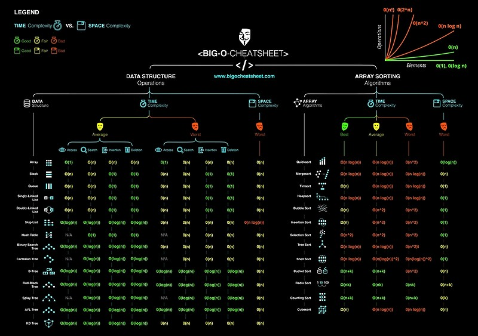

__[Youtube Playlist about Time and Space Complexity Analysis](https://www.youtube.com/watch?v=aGjL7YXI31Q&list=PLEbnTDJUr_IeHYw_sfBOJ6gk5pie0yP-0)__

# Growth of Functions
## Asymptotic notation
Asymptotic notation is a way to describe behavior of functions in the limit, describe growth of functions.

It is about focusing on whatís important by abstracting away low-order terms and constant factors.

Because `θ(g(n))` is a set, we could write `f(n) ∈ θ(g(n))` to indicate that f.n/ is a member of `θ(g(n))`. Instead, we will usually write `f(n) = θ(g(n))` to express the same notion.

A way to compare sizes of functions:
* __`θ` ≈ `=`__

    `θ(g(n))` = `{` `f(n)`: there exist positive constants `c1`, `c2`, and `n0` such that: `0 ≤ c1g(n) ≤ f(n) ≤ c2g(n)` for all `n ≥ n0` `}`

    > We say that `g(n)` is an asymptotically tight bound for `f(n)`.

    The definition of `θ(g(n))` requires that every member `f(n) ∈ θ(g(n))` be asymptotically _nonnegative_, that is, that `f(n)` be nonnegative whenever `n` is sufficiently large.

    Consequently, the function `g(n)` itself must be asymptotically nonnegative, or else the set `θ(g(n))` is empty.

    Previously we introduced an informal notion of `θ`-notation that amounted to throwing away lower-order terms and ignoring the leading coefficient of the highest-order term. Let us briefly justify this intuition by using the formal definition to show that `n^2/2 - 3n = θ(n2)`. To do so, we must determine positive constants `c1`, `c2`, and `n0` such that:

    `c1 * n^2 ≤ n^2/2 - 3n ≤ c2 * n^2`

    for all `n ≥ n0`. Dividing by `n^2` yields:

    `c1 ≤ 1/2 - 3/n ≤ c2`

    We can pick constants. For example: `c2 = 1/4`, `c1 < 1/4`, `n0 = 7`.

    > Intuitively, the lower-order terms of an asymptotically positive function can be ignored in determining asymptotically tight bounds because they are insignificant for large `n`. When `n` is large, even a tiny fraction of the highest-order term suffices (хватает) to dominate the lower-order terms. Thus, setting `c1` to a value that is slightly smaller than the coefficient of the highest-order term and setting `c2` to a value that is slightly larger permits the inequalities in the definition of `θ`-notation to be satisfied.

    > The coefficient of the highest-order term can likewise be ignored, since it only changes `c1` and `c2` by a constant factor equal to the coefficient.

* __`O` ≈ `≥`__

    The `θ`-notation asymptotically bounds a function from above and below. When we have only an __asymptotic upper bound__, we use `O`-notation.

    `O(g(n))` = `{` `f(n)`: there exist positive constants `c`, and `n0` such that: `0 ≤ f(n) ≤ cg(n)` for all `n ≥ n0` `}`

    `θ(g(n)) ⊆ O(g(n))` - `θ(g(n))` is a subset of `O(g(n))`

* __`Ω` ≈ `≤`__

    `Ω`-notation provides an __asymptotic lower bound__.

    `Ω(g(n))` = `{` `f(n)`: there exist positive constants `c`, and `n0` such that: `0 ≤ cg(n) ≤ f(n)` for all `n ≥ n0` `}`

* __`o` ≈ `>`__

    We use `o`-notation to denote an _upper bound_ that is _not asymp- totically tight_.

    `o(g(n))` = `{` `f(n)`: for any positive constants `c > 0`, ther exists a constant `n0 > 0` such that: `0 ≤ f(n) < cg(n)` for all `n ≥ n0` `}`

    Example: `n^1.9999 = o(n2)`

    In `o`-notation, `f(n)` becomes insignificant (незначительный) relative to `g(n)` as `n` approaches infinity:

    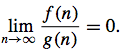

* __`ω` ≈ `<`__

    We use `ω`-notation to denote a _lower_ bound that is _not asymptotically tight_.

    `ω(g(n))` = `{` `f(n)`: for any positive constants `c > 0`, ther exists a constant `n0 > 0` such that: `0 ≤ cg(n) < f(n)` for all `n ≥ n0` `}`

    Example: `n^2 / 2 = ω(n)`

    in `ω`-notation, `f(n)` becomes arbitrarily large relative to `g(n)` as `n` approaches infinity.

    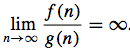

The running time of insertion sort therefore belongs to both `Ω(n)` and `O(n^2)`.

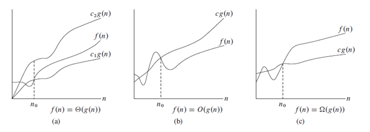

> __Theorem__: `f(n) = θ(g(n))` if and only if `f(n) = O(g(n))` and `f(n) = Ω(g(n))`.

## Asymptotic notation in equations and inequalities
When asymptotic notation appears in a formula (`2n^2 + 3n + 1 = 2n^2 + θ(n)`), we interpret it as standing for some anonymous function that we do not care to name.

In case: `2n^2 + θ(n) = θ(n^2)`, the right-hand side of an equation provides a coarser (грубее) level of detail than the left-hand side.

### Comparing functions
Assume that `f(n)` and `g(n)` are asymptotically positive.
* Transitivity
    * `f(n) = θ(g(n)) and g(n) = θ(h(n)) imply f(n) = θ(h(n))`
    * `f(n) = O(g(n)) and g(n) = O(h(n)) imply f(n) = O(h(n))`
    * `f(n) = Ω(g(n)) and g(n) = Ω(h(n)) imply f(n) = Ω(h(n))`
    * `f(n) = o(g(n)) and g(n) = o(h(n)) imply f(n) = o(h(n))`
    * `f(n) = ω(g(n)) and g(n) = ω(h(n)) imply f(n) = ω(h(n))`
* Reflexivity
    * `f(n) = θ(f(n))`
    * `f(n) = O(f(n))`
    * `f(n) = Ω(f(n))`
* Symmetry
    * `f(n) = θ(g(n)) if and only if g(n) = θ(f(n))`
* Transpose symmetry
    * `f(n) = O(g(n)) if and only if g(n) = Ω(f(n))`
    * `f(n) = o(g(n)) if and only if g(n) = ω(f(n))`
    
We say that `f(n)` is __asymptotically smaller__ than `g(n)` if `f(n) = o(g(n))`, and `f(n)` is __asymptotically larger__ than `g(n)` if `f(n) = ω(g(n))`.

__Although any two real numbers can be compared, not all functions are asymptotically comparable. That is, for two functions `f(n)` and `g(n)`, it may be the case that neither `f(n) = O(g(n))` nor `f(n) = Ω(g(n))` holds.__ For example, we cannot compare the functions `n` and `n^(1 + sin n)` using asymptotic notation, since the value of the exponent in `n^(1 + sin n)` oscillates between `0` and `2`, taking on all values in between.

> __Assertion__: `max(f(n), g(n)) = Θ(f(n)+g(n))`

Prove:

Let `n0 = max(n1,n2)`. Some obvious things for `n > n0`:

`f(n) ≤ max(f(n),g(n))` and `g(n) ≤ max(f(n),g(n))`

Sum two above inequalities: `(f(n)+g(n))/2 ≤ max(f(n),g(n))`

We know: `max(f(n),g(n)) ≤ f(n)+g(n)`

From the last two inequalities, we get:

`0 ≤ (f(n)+g(n)) / 2 ≤ max(f(n),g(n)) ≤ f(n)+g(n)` for `n > n0`

Which is the definition of `Θ(f(n)+g(n))` with `c1 = 1/2`, `c2 = 1`.

## Standard Notations and Common Functions
* Monotonicity
    * `f(n)` is __monotonically increasing__ if `m ≤ n` ⇒ `f(m) ≤ f(n)`
    * `f(n)` is __monotonically decreasing__ if `m ≥ n` ⇒ `f(m) ≥ f(n)`
    * `f(n)` is __strictly increasing__ if `m<n` ⇒ `f(m) < f(n)`
    * `f(n)` is __strictly decreasing__ if `m>n` ⇒ `f(m) > f(n)`

* Floors and ceilings

    For any real number `x`, we denote the greatest integer less than or equal to `x` by __&lfloor;`x`&rfloor;__ (read _“the floor of `x`”_) and the least integer greater than or equal to `x` by __&lceil;`x`&rceil;__ (read _“the ceiling of x”_).
    
    For all real `x`, `x - 1 <` &lfloor;`x`&rfloor; `≤ x ≤` &lceil;`x`&rceil; `< x + 1`

    For any integer `n`, &lfloor;`n/2`&rfloor; + &lceil;`n/2`&rceil; = `n`

    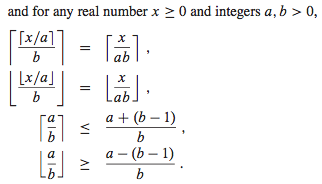

* Modular arithmetic

    For any integer `a` and any positive integer `n`, the value `a mod n` is the __remainder__ (or residue) of the quotient `a/n`: `a mod n = a - n` &lfloor;`a/n`&rfloor;

    It follows that: `0 ≤ a mod n < n`

    If `(a mod n) = (b mod n)`, we write `a ≡ b (mod n)` and say that `a` is __equivalent__ to `b`, modulo `n`. In other words, `a ≡ b (mod n)` if `a` and `b` have the same remainder when divided by `n`.

    Equivalently, `a ≡ b (mod n)` if and only if `n` is a divisor of `b - a`.

* Polynomials

    Given a nonnegative integer `d`, a __polynomial in `n` of degree `d`__ is a function `p(n)` of the form.

    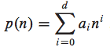

    where the constants `a0, a1, ... ad` are the _coefficients_ of the polynomial and `ad ≠ 0`.

    A polynomial is _asymptotically positive_ if and only if `ad > 0`.

    For an asymptotically positive polynomial `p(n)` of degree `d` , we have `p(n) = θ(n^d)`.

    We say that a function `f(n)` is __polynomially bounded__ if `f(n) = O(n^k)` for some constant `k`.

* Exponentials

    For all real `a > 0`, `m`, and `n`, we have the following identities:
    * `a^0 = 1`
    * `a^1 = a`
    * `a^-1 = 1/a`
    * `(a^m)^n = a^mn`
    * `(a^m)^n = (a^n)^m`
    * `a^m * a^n = a^(m+n)`

    When convenient, we shall assume `0^0 = 1`.

    As any exponential function with a base strictly greater than 1 grows faster than any polynomial function, `n^b = o(a^n)`

    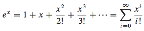

    For all real x, we have the inequality: `e^x ≥ 1 + x`, where equality holds only when `x = 0`.
    
    When `|x| ≤ 1`, we have the approximation `1 + x ≤ e^x ≤ 1 + x + x^2`

    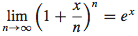

* Logarithms

    Notations:
    * `lg(n) = log_2(n)` (binary logarithm)
    * `ln(n) = log_e(n)` (natural logarithm)
    * `lg^k(n) = (lg(n))^k` (exponentiation)
    * `lg lg(n) = lg(lg(n))` (composition)

    For all real `a > 0`, `b > 0`, `c > 0`, `n`, and bases of algorithms are not `1`:
    * `a = b^(log_b(a))`
    * `log_c(ab) = log_c(a) + log_c(b)`
    * `log_b(a^n) = n log_b(a)`
    * `log_b(a) = log_c(a) / log_c(b)` (*)
    * `log_b(1/a) = -log_b(a)`
    * `log_b(a) = 1 / log_a(b)`
    * `a^(log_b(c)) = c^(log_b(a))`

    > __By equation (*), changing the base of a logarithm from one constant to another changes the value of the logarithm by only a constant factor, and so we shall often use the notation `lg n` when we don’t care about constant factors, such as in `O`-notation.__

    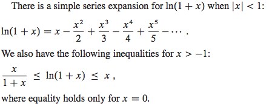

    Any positive polynomial function grows faster than any polylogarithmic function: `lg^b(n) = o(n^1))`

    Some useful equations:

    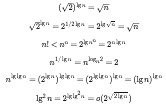

* Factorials

    A weak upper bound on the factorial function is `n! ≤ n^n`.
    * `n! = o(n^n)`
    * `n! = ω(2^n)`
    * `lg(n!) = θ(n lg(n))`

    Strirling's approximation:

    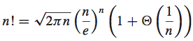

    The following equation also holds for all `n ≥ 1`:

    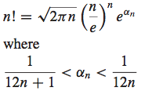

* Functional Iteration

    We use the notation `f^(i)(n)` to denote the function `f(n)` iteratively applied `i` times to an initial value of `n`.

    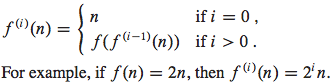

    `lg^*(n) = min{i ≥ 0: lg^(i)(n) ≤ 1}`

* Fibonacci Numbers

    `F_0 = 0`, `F_1 = 1`, `F_i = F_i-1 + F_i-2` for `i ≥ 2`

    Thus, each Fibonacci number is the sum of the two previous ones, yielding the sequence: 0, 1, 1, 2, 3, 5, 8, 13, 21, 34, 55, ...

    Fibonacci numbers are related to the __golden ratio `φ`__ and to its _conjugate `Φ`_, which are the two roots of the equation `x^2 = x + 1`
    1. `φ = (1 + sqrt(5))/2 = 1.61803...`
    2. `Φ = (1 - sqrt(5))/2 = -0.61803...`

    Specifically, we have:
    * `F_i = (φ^i - Φ^i)/sqrt(5)`
    * `F_i =` &lfloor;`φ^i/sqrt(5) + 1/2`&rfloor;

# Designing Algorithms
## Incremental Approach
We can choose from a wide range of algorithm design techniques. An __incremental approach__: having sorted the subarray `A[1..j-1]` , we inserted the single element `A[j]` into its proper place, yielding the sorted subarray `A[1..j]`.

> For _insertion sort_, we used an _incremental approach_

## The Divide-and-Conquer Approach
The divide-and-conquer paradigm involves three steps at each level of the recursion:
* __Divide__ the problem into a number of subproblems that are smaller instances of the same problem.
* __Conquer__ the subproblems by solving them recursively. If the subproblem sizes are small enough, however, just solve the subproblems in a straightforward manner.
* __Combine__ these solutions to create a solution to the original problem.

> The _merge sort_ algorithm closely follows the _divide-and-conquer paradigm_

When an algorithm contains a recursive call to itself, we can often describe its running time by a __recurrence equation__ or __recurrence__, which describes the overall running time

A recurrence for the running time of a _divide-and-conquer algorithm_ falls out from the three steps of the basic paradigm. As before, we let `T(n)` be the running time on a problem of size `n`. If the problem size is small enough, say `n <= c` for some constant `c`, the straightforward solution takes constant time, which we write as `O(1)`. Suppose that our division of the problem yields `a` subproblems, each of which is `1/b` the size of the original. (For merge sort, both `a` and `b` are `2`, but we shall see many divide-and-conquer algorithms in which `a != b`) It takes time `T(n/b)` to solve one subproblem of size `n/b`, and so it takes time `aT(n/b)` to solve `a` of them. If we take `D(n)` time to divide the problem into subproblems and `C(n)` time to combine the solutions to the subproblems into the solution to the original problem, we get the recurrence.

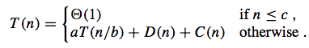

In practice, we neglect certain technical details when we state and solve recur- rences.
* If we call MERGE-SORT on `n` elements when `n` is odd, we end up with subproblems of size &lfloor;`n/2`&rfloor; and &lceil;`n/2`&rceil;. Neither size is actually `n/2`, because `n/2` is not an integer when `n` is odd. Technically, the recurrence describing the worst-case running time of MERGE-SORT is really

    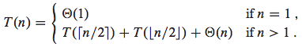

* Since the running time of an algorithm on a constant-sized input is a constant, the recurrences that arise from the running times of algorithms generally have `T(n) = θ(1)` for sufficiently small `n`. Consequently, for convenience, we shall generally omit statements of the boundary conditions of recurrences and assume that `T(n)` is constant for small `n`. For example, we normally state recurrence as:

    `T(n) = 2T(n/2) + θ(n)`

    without explicitly giving values for small `n`. The reason is that although changing the value of `T(1)` changes the exact solution to the recurrence, the solution typically doesn’t change by more than a constant factor, and so the order of growth is unchanged.

## Solving recurrencies methods:
* __Substitution method__

    Algorithm:
    1. Guess the solution e.g. `T(n)`.
    2. Use induction to find the constants and show that the solution works. That is, replace `T(n)` with our guess.

    Example: `2T(n/2) + n`
    1. Guess: `T(n) = n * log(n) + n`
    2. Induction:

        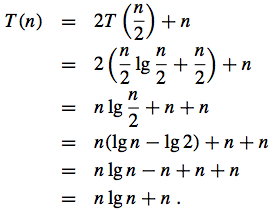

    3. `T(n) = θ(n * log(n) + n) = θ(n log(n))`

    Example: `T(n) = 2T(`&lfloor;`sqrt(n)`&rfloor;`) + lgn`
    1. Rename `m = lgn` => `T(2^m) = 2T(2^(m/2)) + m`
    2. Rename `S(m) = T(2^m)` => `S(m) = 2S(m/2) + m`
    3. Guess: `S(m) = θ(m log(m))`
    4. Induction: `T(n) = T(2^m) = S(m) = θ(m log(m)) = θ(lg(n)*lg(lg(n)))`

* __Recursion trees__

    Used to generate a guess. Then verify by substitution method.

    In a _recursion tree_, each node represents the cost of a single subproblem somewhere in the set of recursive function invocations. We sum the costs within each level of the tree to obtain a set of per-level costs, and then we sum all the per-level costs to determine the total cost of all levels of the recursion.

    Example: `T(n) = 3T(`&lfloor;`n/4`&rfloor;`) + θ(n^2)`
    1. Get rid of &lfloor; for simplicity => `T(n) = 3T(n/4) + c*n^2` for `c > 0`
    2. For convenience, assume `n` is exact power of `4`
    3. Build the tree: 

        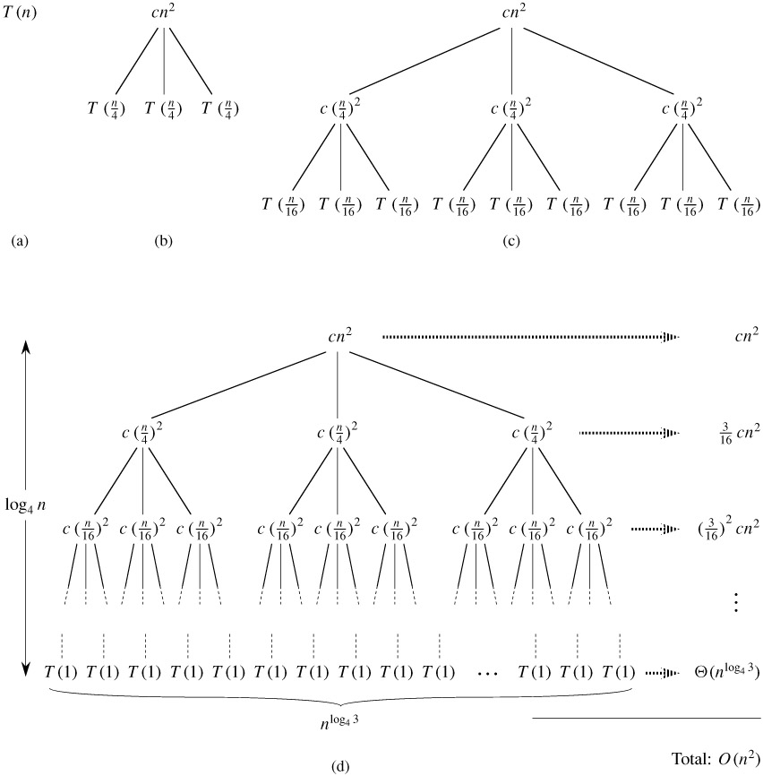

    4. The subproblem size for a node at depth `i` is `n/4^i`. Thus, the subproblem size hits `n = 1` when `n/4^i = 1` => `i = log_4(n)`. Thus the tree has `log_4(n) + 1` levels (at depth `0,1,2 ... log_4(n)`)
    5. Each level has three times more nodes than the level above, and so the number of nodes at depth `i` is `3^i`. And each node at depth `i` has a cost of `c(n/4^i)^2`. Multiplying, we see that the total cost over all nodes at depth `i`, for `i = 0,1,2 ... log_4(n) - 1`, is `3^i * c(n/4^i)^2 = c * n^2 * (3/16)^i`
    6. The bottom level, at depth `i = log_4(n)`, has `3^i = 3^(log_4(n)) = n^(log_4(3))` each contributing cost `T(1)`, for a total cost of `T(1) * n^(log_4(3))` which is `θ(n^(log_4(3))`, since we assume that `T(1)` is a constant.
    7. Now we add up the costs over all levels to determine the cost for the entire tree:

        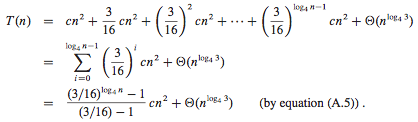

    8. This last formula looks somewhat messy until we realize that we can again take advantage of small amounts of sloppiness (неряшливость) and use an infinite decreasing geometric series as an upper bound.

        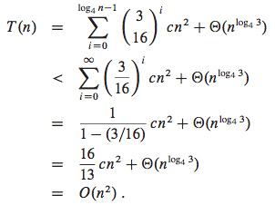

    9. Thus we have derived a guess of `T(n) = O(n^2)`

* __Master method__

    The master method provides a “cookbook” method for solving recurrences of the form: `T(n) = a*T(n/b) + f(n)`

    __MASTER THEOREM__.

    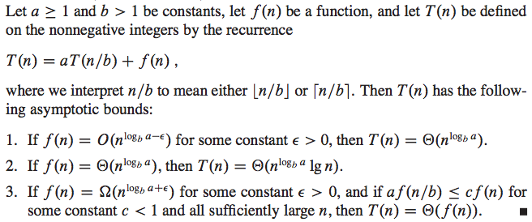

    In each of the three cases, we compare the function `f(n)` with the function `n^(log_b(a))`. Intuitively, the larger of the two functions determines the solution to the recurrence.
    * If, as in case 1, the function `n^(log_b(a))` is the larger, then the solution `T(n) = θ(n^(log_b(a)))`
    * If, as in case 3, the function `f(n)` is the larger, then the solution is `T(n) = θ(f(n))`
    * If, as in case 2, the two functions are the same size, we multiply by a logarithmic factor, and the solution is `T(n) = θ(n^(log_b(a)) * lg(n)) = θ(f(n) * lg(n))`

    Beyond this intuition, you need to be aware of some technicalities. In the first case, not only must `f(n)` be smaller than `n^(log_b(a))`, it must be _polynomially smaller_. That is, `f(n)` must be asymptotically smaller than `n^(log_b(a))` by a factor of `n^ε` for some constant `ε > 0`. In the third case, not only must `f(n)` be larger than `n^(log_b(a))`, it also must be _polynomially larger_ and in addition satisfy the “regularity” condition that `a*f(n/b) ≤ c*f(n)`. This condition is satisfied by most of the polynomially bounded functions that we shall encounter.

    > Note that the three cases do not cover all the possibilities for `f(n)`. There is a gap between cases 1 and 2 when `f(n)` is smaller than `n^(log_b(a))` but not polynomially smaller. Similarly, there is a gap between cases 2 and 3 when `f(n)` is larger than `n^(log_b(a))` but not polynomially larger. If the function `f(n)` falls into one of these gaps, or if the regularity condition in case 3 fails to hold, you cannot use the master method to solve the recurrence.

    In particular case for `f(n) = O(n^k)`:

    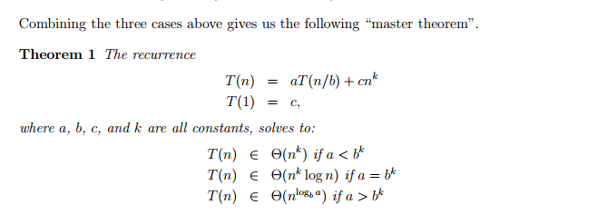

## Dynamic programming
Dynamic programming, like the divide-and-conquer method, solves problems by combining the solutions to subproblems. ("Programming" in this context refers to a tabular method, not to writing computer code.) As we saw in Chapter 1, divide-and-conquer algorithms partition the problem into independent subproblems, solve the subproblems recursively, and then combine their solutions to solve the original problem. In contrast, dynamic programming is applicable when the subproblems are not independent, that is, when subproblems share subsubproblems. In this context, a divide-and-conquer algorithm does more work than necessary, repeatedly solving the common subsubproblems. A dynamic-programming algorithm solves every subsubproblem just once and then saves its answer in a table, thereby avoiding the work of recomputing the answer every time the subsubproblem is encountered.

Dynamic programming is typically applied to optimization problems. In such problems there can be many possible solutions. Each solution has a value, and we wish to find a solution with the optimal (minimum or maximum) value. We call such a solution an optimal solution to the problem, as opposed to the optimal solution, since there may be several solutions that achieve the optimal value.

The development of a dynamic-programming algorithm can be broken into a sequence of four steps.
1. Characterize the structure of an optimal solution.
2. Recursively define the value of an optimal solution.
3. Compute the value of an optimal solution in a bottom-up fashion.
4. Construct an optimal solution from computed information.

When we think about a dynamic-programming problem, we should understand the set of subproblems involved and how subproblems depend on one another. The __subproblem graph__ for the problem embodies exactly this information. See the subproblem graph for the _rod-cutting problem_ below.

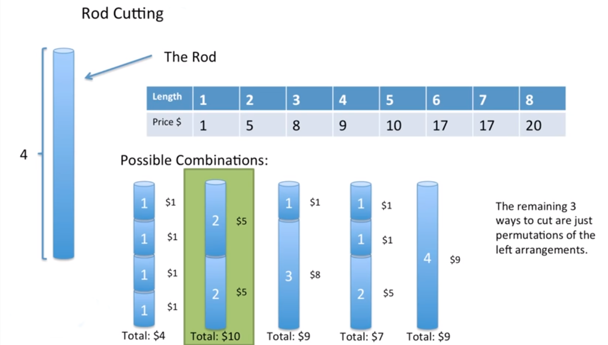

The size of the subproblem graphGD.V; E/can help us determine the running time of the dynamic programming algorithm. Since we solve each subproblem just once, the running time is the sum of the times needed to solve each subproblem.

See also:
* Rod Cutting Problem (`problems/rod-cutting.ts`)

---

[Introduction to Algorithms by Thomas H. Cormen, Charles E. Leiserson, and Ronald L. Rivest](http://staff.ustc.edu.cn/~csli/graduate/algorithms/book6/toc.htm)

[Solutions to Introduction to Algorithms Third Edition Book](https://walkccc.github.io/CLRS/)
