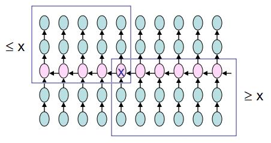

## Median of Medians

|  | Worst | Average | Best |
|:--|:-:|:-:|---|
| __Time Complexity__ | `O(n)` | `θ(n)` | `Ω(n)` |
| __Space Complexity__ | `O(1)` | `θ(1)` | `Ω(1)` |

the _Median of Medians_ is an approximate (median) selection algorithm, frequently used to supply a good pivot for an exact selection algorithm, mainly the quickselect, that selects the `k`th largest element. Median of medians finds an approximate median in linear time.

It divides its input into groups of at most five elements, computes the median of each of those groups using some subroutine, then recursively computes the true median of the `n/5` medians found in the previous step.

__Run insertion sort on each group. Takes `O(1)` time per group since each group has `≤ 5` elements.__

> Number `5` is not important, it could be e.g. `7` without changing the algorithm much. Finding the median of small lists by brute force (sorting) takes a small amount of time, so the length of the sublists must be fairly small. However, adjusting the sublist size to `3`, for example, does change the running time for the worse (`O(n log n)`).

> The median-of-medians algorithm could use a sublist size greater than `5`, `7` for example, and maintain a linear running time. However, we need to keep the sublist size as small as we can so that sorting the sublists can be done in what is effectively constant time.

### Time Complexity
The median-of-medians algorithm runs in `O(n)` time. `n` is divided into` n/5` sublists of five elements each. If `M` is the list of all of the medians from these sublists, then` M` has `n/5` - one median for each of the` n/5` sublists. Let's call the median of this list (the median of the medians) `p`. Half of the `n/5` elements in` M` are less than `p`. Half of `n/5 = n/10`. For each of these `n/10` elements, there are two elements that are smaller than it (since these elements were medians in the lists of five elements - two elements were smaller and two elements were larger). Therefore, there are `3n/10 <p` and in the worst case, the algorithm may have to recurse on the remaining `7n/10` elements.

The time for dividing lists, finding the medians of the sublists, and partitioning takes `T(n) = T(n/5) + O(n)` time, with the recursion factored in, the overall recurrence to describe the median-of-medians algorithm is:

`T(n) ≤ T(n/5) + T(7n/10) + O(n)`

    = cn/5 + c(7n/10) + O(n)
    = cn/5 + c + 7cn/10 + O(n)
    = 9cn/10 + O(n)
    = O(n)

### Space Complexity
After the first call median of medians will spit out a smaller array, now we need to evaluate the `i`th element of this smaller array. Note that the `i`th element of this smaller array is the result, so i do not need to pass back any information to the earlier call.

In quick sort, i need to put back the sorted small arrays back into the correct position and so recursion occurs. With median of medians, after the loop (tail recursion), i will be left with the answer.

Recursion depth = `O(1)`