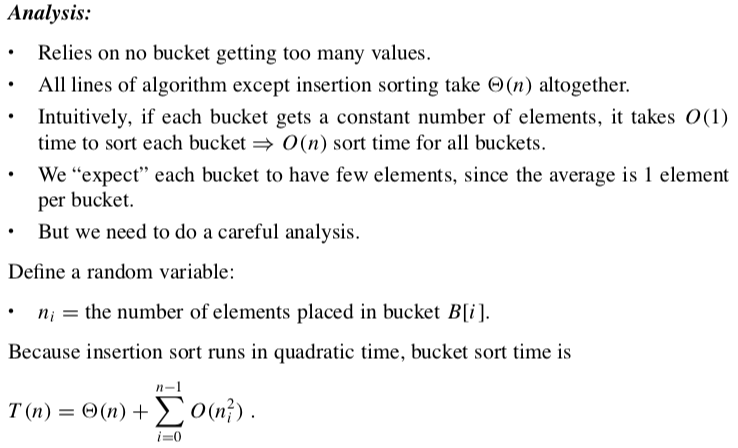
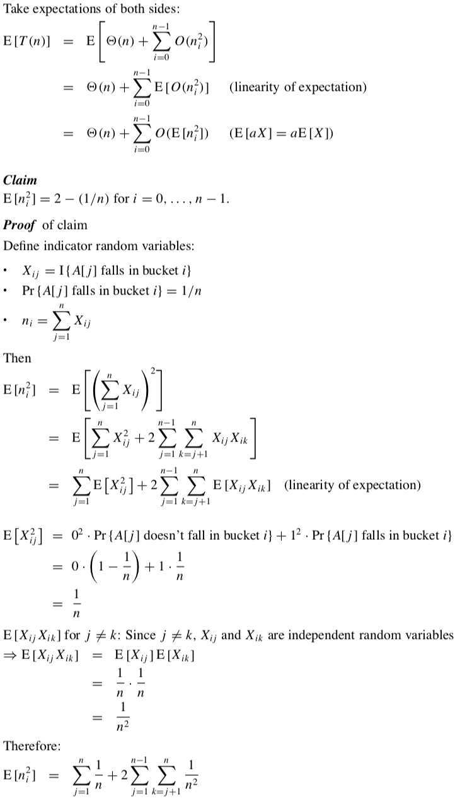
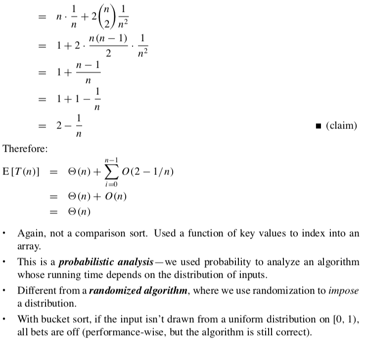

## Bucket Sort

|  | Worst | Average | Best |
|:--|:-:|:-:|:-:|
| __Time Complexity__ | `O(n^2)` | `θ(n)` | `Ω(n)` |
| __Space Complexity__ | `O(n)` | `θ(n)` | `Ω(n)` |
| __Stable__ | Yes | |

Bucket sort, or bin sort, is a sorting algorithm that works by distributing the elements of an array into a number of buckets.

> Bucket sort is a way of sorting floating point numbers in linear time.

Bucket sort is mainly useful when input is __uniformly distributed__ over a range. But when the difference between number is large => Bucket Sort degrades to Insertion Sort which has `O(n^2)` time complexity. Because almost all array items will fall in one bucket.

If each bucket has size `1` then bucket sort degenerates to Counting Sort.

Count Sort is used as helper algorithm as it is very efficient for numbers not far from each other.

Bucket sort works as follows:
* Set up an array of initially empty _"buckets"_.
* __Scatter:__ Go over the original array, putting each object in its bucket.
* Sort each non-empty bucket.
* __Gather:__ Visit the buckets in order and put all elements back into the original array.

### [Example](https://www.cs.usfca.edu/~galles/visualization/BucketSort.html)

### Complexity

