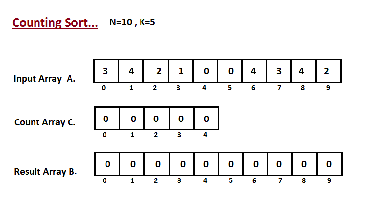

## Counting Sort

|  | Worst | Average | Best |
|:--|:-:|:-:|---|
| __Time Complexity__ | `O(k + n)` | `θ(k + n)` | `Ω(k + n)` |
| __Space Complexity__ | `O(k + n)` | `θ(k + n)` | `Ω(k + n)` |

Counting sort is an integer sorting algorithm that assumes that each of the `n` input elements in a list has a key value ranging from `0` to `k`, for some integer `k`.

> Counting Sort is __stable__ algorithm.

In the most general case, the input to counting sort consists of a collection of n items, each of which has a non-negative integer key whose maximum value is at most `k`.

Counting sort is used as sub-routing in other sorting algorithms. It can also be used stand-alone to sort an array if the range of elements in the array is small as compared to the total number of elements in the array.

Counting sort beats the lower bound of `Ω(n lgn)`, because it is not a comparison sort.

