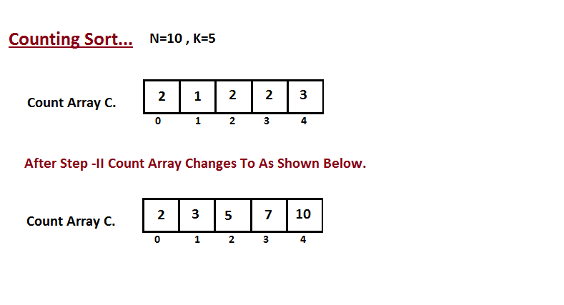

## Counting Sort

|  | Worst | Average | Best |
|:--|:-:|:-:|---|
| __Time Complexity__ | `O(k + n)` | `θ(k + n)` | `Ω(k + n)` |
| __Space Complexity__ | `O(k + n)` | `θ(k + n)` | `Ω(k + n)` |
| __Stable__ | Yes |
| __In Place__ | No |

Counting sort is an integer sorting algorithm that assumes that each of the `n` input elements in a list has a key value ranging from `0` to `k`, for some integer `k`.

In the most general case, the input to counting sort consists of a collection of n items, each of which has a non-negative integer key whose maximum value is at most `k`.

Counting sort is used as sub-routing in other sorting algorithms. It can also be used stand-alone to sort an array if the range of elements in the array is small as compared to the total number of elements in the array.

Counting sort beats the lower bound of `Ω(n lgn)`, because it is not a comparison sort.

### Algorithm
* __Step I__

    In first step we calculate the count of all the elements of the input array `A`. Then Store the result in the count array `C`. The way we count is depected below.
    
    

* __Step II__

    In second step we calculate how many elements exist in the input array `A` which are less than or equals for the given index. `Ci` = numbers of elements less than or equals to `i` in input array.

    

* __Step III__

    In this step we place the input array `A` element at sorted position by taking help of constructed count array `C`, i.e what we constructed in step two. We used the result array `B` to store the sorted elements. Here we handled the index of `B` start from zero.

    