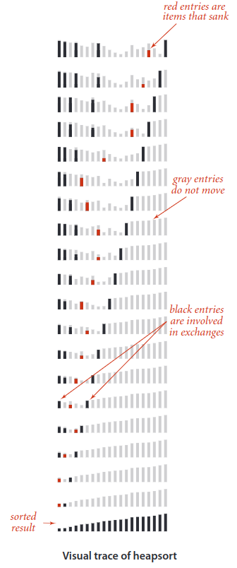

## Heapsort
Heapsort is a comparison-based algorithm that uses a binary heap data structure to sort elements. It divides its input into a sorted and an unsorted region, and it iteratively shrinks the unsorted region by extracting the largest element and moving that to the sorted region.

Heapsort primarily competes with quicksort. Quicksort is typically somewhat faster due to some factors, but the worst-case running time for quicksort is `O(n^2)`, which is unacceptable for large data sets. Thus, because of the `O(n*logn)` upper bound on heapsort's running time and constant upper bound on its auxiliary storage.

Heapsort also competes with merge sort, which has the same time bounds. Merge sort requires `Ω(n)` auxiliary space, but heapsort requires only a constant amount. Heapsort typically runs faster in practice on machines with small or slow data caches, and does not require as much external memory.

On the other hand, merge sort has several advantages over heapsort:
* Merge sort on arrays has considerably better data cache performance, often outperforming heapsort on modern desktop computers because merge sort frequently accesses contiguous memory locations; heapsort references are spread throughout the heap.
* Heapsort is not a stable sort; merge sort is stable.
* Merge sort parallelizes well and can achieve close to linear speedup with a trivial implementation; heapsort is not an obvious candidate for a parallel algorithm.
* Merge sort can be adapted to operate on singly linked lists with `O(1)` extra space. Heapsort can be adapted to operate on doubly linked lists with only `O(1)` extra space overhead.
* Merge sort is used in _external sorting_; heapsort is not. Locality of reference is the issue.

> My current implementation of the algorithm erquires `O(n)` auxiliary space. But it can be optimized to use constant auxiliary space by putting the min at the end of the passed array in each iteration.

### Complexity
We have `θ(n)` from biulding heap and `θ(n logn)` from the loop with heapification. Overall complexity: `θ(n*logn + n) = θ(n logn)`.

|  | Worst | Average | Best |
|:--|:-:|:-:|---|
| __Time Complexity__ | `O(n logn)` | `θ(n logn)` | `Ω(n logn)` |
| __Space Complexity__ | `O(1)` | `θ(1)` | `Ω(1)` |
| __Stable__ | No |
| __In Place__ | Yes |

### Usage

> __Heapsort has reliable time complexity and doesn’t require any extra buffer space. As a result, it is useful in software that requires reliable speed over optimal average runtime, and/or has limited memory to operate with the data. Thus, systems with real time requirements and memory constraints benefit the most from this algorithm.__

### Example

> __External sorting__ is a class of sorting algorithms that can handle massive amounts of data. External sorting is required when the data being sorted do not fit into the main memory of a computing device (usually `RAM`) and instead they must reside in the slower external memory, usually a _hard disk drive_. Thus, external sorting algorithms are external memory algorithms and thus applicable in the external memory model of computation.