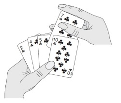

## Insertion Sort

|  | Worst | Average | Best |
|:--|:-:|:-:|---|
| __Time Complexity__ | `O(n^2)` | `θ(n^2)` | `Ω(n)` |
| __Space Complexity__ | `O(1)` | `θ(1)` | `Ω(1)` |

* __Efficient for (quite) small data sets__, much like other quadratic sorting algorithms
* More efficient in practice than most other simple quadratic (i.e., `O(n^2)`) algorithms such as _selection sort_ or _bubble sort_.
* __Adaptive__, i.e., efficient for data sets that are already substantially sorted: the time complexity is `O(nk)` when each element in the input is no more than `k` places away from its sorted position
* __Stable__; i.e., does not change the relative order of elements with equal keys
* __In-place__; i.e., only requires a constant amount `O(1)` of additional memory space
* __Online__; i.e., can sort a list as it receives it

__Insertion sort is one of the fastest algorithms for sorting very small arrays, even faster than _quicksort_;__ indeed, _good quicksort_ implementations use _insertion sort_ for arrays smaller than a certain threshold.

Insertion sort works the way many people sort a hand of playing cards. We start with an empty left hand and the cards face down on the table. We then remove one card at a time from the table and insert it into the correct position in the left hand. To find the correct position for a card, we compare it with each of the cards already in the hand, from right to left, the cards held in the left hand are sorted, and these cards were originally the top cards of the pile on the table.

### Example:

