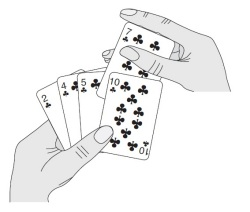

## Insertion Sort
Insertion sort works the way many people sort a hand of playing cards. We start with an empty left hand and the cards face down on the table. We then remove one card at a time from the table and insert it into the correct position in the left hand. To find the correct position for a card, we compare it with each of the cards already in the hand, from right to left, the cards held in the left hand are sorted, and these cards were originally the top cards of the pile on the table.

Insertion  sort  works  well  for  certain  types  of  nonrandom  arrays  that  often  arise  in practice, even if they are huge. For example, as just mentioned, consider what happens when you use insertion sort on an array that is already sorted. Each item is immediately determined to be in its proper place in the array, and the total running time is linear. (The running time of selection sort is quadratic for such an array.) The same is true for arrays whose keys are all equal (hence the condition in Proposition B that the keys must be distinct).

> Insertion sort is an efficient method for __partially sorted__ arrays; selection sort is not. Indeed, when the  number  of  inversions  is  low,  insertion  sort  is  likely  to  be  faster  than  any  sorting method.

Insertion  sort  is  slow  for  large  unordered  arrays  because  the  only  exchanges  it  does  involve  adjacent  entries,  so  items can move through the array only one place at a time.

### Properties
* __Efficient for (quite) small data sets__, much like other quadratic sorting algorithms
* More efficient in practice than most other simple quadratic (i.e., `O(n^2)`) algorithms such as _selection sort_ or _bubble sort_.
* __Adaptive__, i.e., efficient for data sets that are already substantially sorted: the time complexity is `O(nk)` when each element in the input is no more than `k` places away from its sorted position
* __Stable__; i.e., does not change the relative order of elements with equal keys
* __In-place__; i.e., only requires a constant amount `O(1)` of additional memory space
* __Online__; i.e., can sort a list as it receives it
* Running time is sensitive to input

### Complexity
|  | Worst | Average | Best |
|:--|:-:|:-:|---|
| __Time Complexity__ | `O(n^2)` | `θ(n^2)` | `Ω(n)` |
| __Space Complexity__ | `O(1)` | `θ(1)` | `Ω(1)` |
| __Stable__ | Yes |
| __In Place__ | Yes |

### Usage
> __It is efficient at sorting extremely short arrays due to a very low constant factor in its complexity. It is also extremely good at sorting arrays that are already “almost” sorted. A common use is for re-sorting arrays that have had some small updates to their elements.__

### Example

