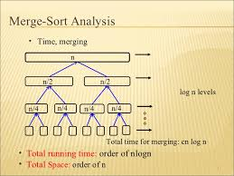
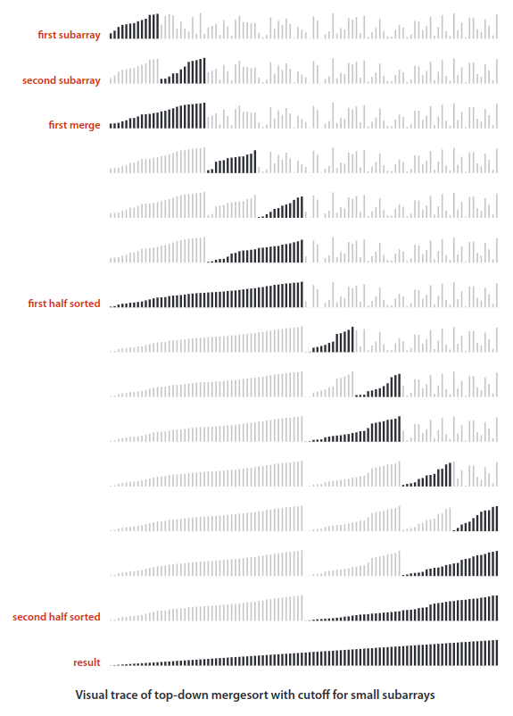
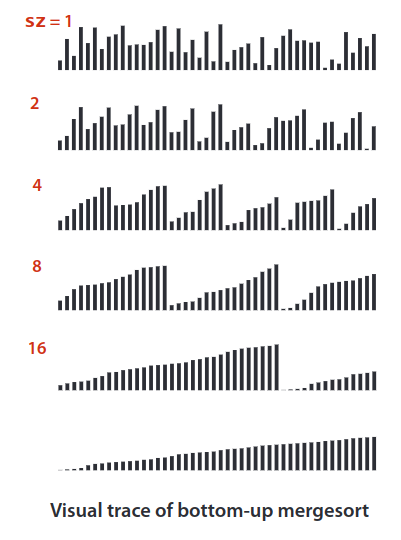

## Merge Sort
The idea behind the Merge Sort is  based  on  a  simple  operation known  as _merging_:  combining  two  ordered  arrays  to  make  one  larger  ordered  array.

Merge Sort - is an efficient, general-purpose, comparison-based sorting algorithm.

One of mergesort’s most attractive properties is that it guarantees to sort any array of `N` items in time proportional to `N logN`.

Its prime disadvantage is that it uses extra space proportional to `N`.

* A divide and conquer algorithm
* Merge sort is more efficient than quicksort for some types of lists if the data to be sorted can only be efficiently accessed sequentially (like _linked list_).

|  | Worst | Average | Best |
|:--|:-:|:-:|---|
| __Time Complexity__ | `O(n logn)` | `θ(n logn)` | `Ω(n logn)` |
| __Space Complexity__ | `O(n + logn` | `θ(n + logn)` | `Ω(n + logn)` |
| __Stable__ | Yes |
| __In Place__ | No |

### Time Complexity
* `Divide`: The divide step just computes the middle of the subarray, which takes constant time. Thus, `D(n) = O(1)`.
* `Conquer`: We recursively solve two sub-problems, each of size `n/2`, which contributes `2T(n/2)` to the running time.
* `Combine`: We have already noted that the MERGE procedure on an `n`-element sub-array takes time `O(n)`, and so `C(n) = O(n)`.

Explanation:
1. `T(n) = T(n/2) + T(n/2) + n = 2T(n/2) + n`
2. `T(n) = 2(2T(n/4) + n/2) + n = 4T(n/4) + 2n`
3. `T(n) = 4(2T(n/8) + n/4) + 2n = 8T(n/8) + 3n`
    
    ...

4. `T(n) = 2^k * T(n/2^k) + kn`

    We need to find out `k`. We know that `T(1) = 1`. We also know that in the last step of the algorithm `T(n/2^k) = 1`, as we going to have two elements to compare. This equation can help us to find out the value of `k`.

    `n/2^k = 1` => `n = 2^k` => apply `log2` to both sides => `log2(n) = log2(2^k)` => `log2(n) = k * log2(2)` => `k = log2(n)`

5. Replace all `k` with `log2(n)`:

    `T(n) = n * T(n/n) + n * log2(n) = n + n * log2(n) = O(n * logn)`

Solution: `O(n * logn)`

### Space complexity
Merge sort requires `n + logn` space. Where `n` - is the size of the auxiliary array and the `logn` - is the size of the stack required for recursion.

[Youtube Video about Merge Sort Complexity](https://www.youtube.com/watch?v=sfmaf4QpVTw&index=8&list=PLEbnTDJUr_IeHYw_sfBOJ6gk5pie0yP-0)

### Usage
Merge sort has a much smaller constant factor than Heapsort, but requires O(n) buffer space to store intermediate data, which is very expensive. Its main selling point is that it is stable, as compared to Heapsort which isn’t. In addition, its implementation is very parallelizable.

### Example:

### Improvement
Switching to insertion sort for small subarrays (length 15 or less, say) will improve the running time of a typical mergesort. Because, insertion sort (or selection sort)  is  simple  and  therefore  likely  to  be  faster  than  mergesort  for  tiny  subarrays.

Also, we can reduce the running time to be linear for arrays that are already in order by adding a test to skip the call to `merge()` if `a[mid]` is less than or equal to `a[mid+1]`. With this change, we still do all the recursive calls, but the running time for any sorted subarray is linear.

It is possible to eliminate the time (but not the space) taken to copy to the auxiliary array used for merging. To do so, we use two invocations of the sort method: one takes its input from the given array and puts the sorted output in the auxiliary array; the other takes its input from the auxiliary array and puts the sorted output in the given array. With this approach, in a bit of recursive trickery, we can arrange the recursive calls such that the computation switches the roles of the input array and the auxiliary array at each level

## Bottom-up Merge Sort
Even though we are thinking in terms of merging together  two  large  subarrays,  the  fact  is  that  most  merges  are  merging  together  tiny subarrays. Another way to implement mergesort is to organize the merges so that we do all the merges of tiny subarrays on one pass, then do a second pass to merge those sub-arrays  in  pairs,  and  so  forth,  continuing  until  we do a merge that encompasses the whole array.

We start by doing a pass of 1-by-1 merges (considering individual items as subarrays  of  size  1),  then  a  pass  of  2-by-2  merges (merge  subarrays  of  size  2  to  make  subarrays  of size 4), then 4-by-4 merges, and so forth.

> A version of bottom-up mergesort is the method of choice for sorting  data organized in a linked list. This method rearranges the links to sort the list in place (without creating any new list nodes).

### Sequentially accessed data structures
In data structures, a data structure is said to have __sequential access__ if one can only visit the values it contains in one particular order. The canonical example is the _linked list_. Indexing into a list that has sequential access requires `O(n)` time, where `n` is the index. As a result, many algorithms such as _quicksort_ and _binary search_ degenerate into bad algorithms that are even less efficient than their naive alternatives; these algorithms are impractical without __random access__. On the other hand, some algorithms, typically those that do not have index, require only sequential access, such as _mergesort_, and face no penalty.

