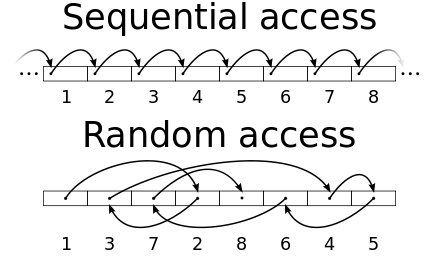

## Merge Sort

|  | Worst | Average | Best |
|:--|:-:|:-:|---|
| __Time Complexity__ | `O(n logn)` | `θ(n logn)` | `Ω(n logn)` |
| __Space Complexity__ | `O(n)` | `θ(n)` | `Ω(n)` |
| __Stable__ | Yes |
| __In Place__ | No |

Merge Sort - is an efficient, general-purpose, comparison-based sorting algorithm.

* A divide and conquer algorithm
* Merge sort is more efficient than quicksort for some types of lists if the data to be sorted can only be efficiently accessed sequentially (like _linked list_).

### Time Complexity
* `Divide`: The divide step just computes the middle of the subarray, which takes constant time. Thus, `D(n) = O(1)`.
* `Conquer`: We recursively solve two subproblems, each of size `n=2`, which contributes `2T(n/2)` to the running time.
* `Combine`: We have already noted that the MERGE procedure on an `n`-element subarray takes time `O(n)`, and so `C(n) = O(n)`.

Explanation:
1. `T(n) = T(n/2) + T(n/2) + n = 2T(n/2) + n`
2. `T(n) = 2(2T(n/4) + n/2) + n = 4T(n/4) + 2n`
3. `T(n) = 4(2T(n/8) + n/4) + 2n = 8T(n/8) + 3n`
    
    ...

4. `T(n) = 2^k * T(n/2^k) + kn`

    We need to find out `k`. We know that `T(1) = 1`. We also know that in the last step of the algorithm `T(n/2^k) = 1`, as we going to have two elements to compare. This equation can help us to find out the value of `k`.

    `n/2^k = 1` => `n = 2^k` => apply `log2` to both sides => `log2(n) = log2(2^k)` => `log2(n) = k * log2(2)` => `k = log2(n)`

5. Replace all `k` with `log2(n)`:

    `T(n) = nT(n/n) + n * log2(n) = n + n * log2(n) = O(n * logn)`

Solution: `O(n * logn)`

#Usage

> __Merge sort has a much smaller constant factor than Heapsort, but requires O(n) buffer space to store intermediate data, which is very expensive. Its main selling point is that it is stable, as compared to Heapsort which isn’t. In addition, its implementation is very parallelizable.__

### Example:

### Sequentially accessed data structures
In data structures, a data structure is said to have __sequential access__ if one can only visit the values it contains in one particular order. The canonical example is the _linked list_. Indexing into a list that has sequential access requires `O(n)` time, where `n` is the index. As a result, many algorithms such as _quicksort_ and _binary search_ degenerate into bad algorithms that are even less efficient than their naive alternatives; these algorithms are impractical without __random access__. On the other hand, some algorithms, typically those that do not have index, require only sequential access, such as _mergesort_, and face no penalty.

