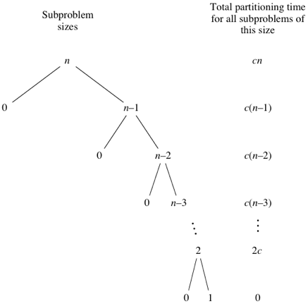
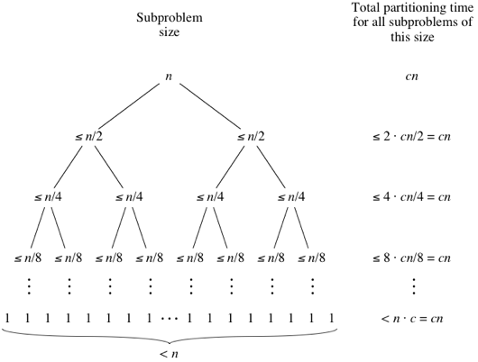
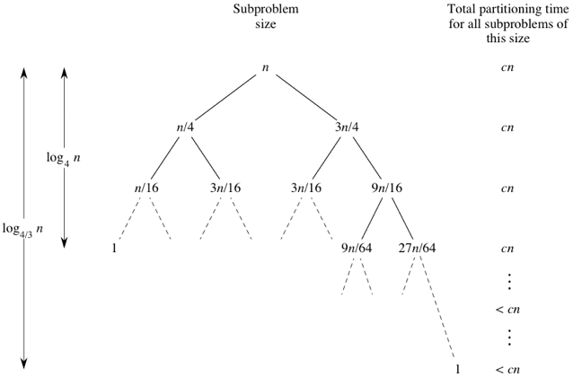
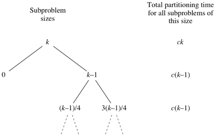

## Quick Sort

|  | Worst | Average | Best |
|:--|:-:|:-:|---|
| __Time Complexity__ | `O(n^2)` | `θ(n logn)` | `Ω(n logn)` |
| __Space Complexity__ | `O(n)` | `θ(n)` | `Ω(logn)` |

Quicksort is a comparison-based algorithm that uses divide-and-conquer to sort an array.

Here is the three-step divide-and-conquer process for sorting a typical subarray `A[p..r]`:
* __Divide:__ Partition `A[p..r]`, into two (possibly empty) subarrays `A[p..q−1]` and `A[q+1..r]`, such that each element in the first subarray `A[p..q−1]` is `≤ A[q]` and `A[q]` is `≤` each element in the second subarray `A[q+1..r]`.
* __Conquer:__ Sort the two subarrays `A[p..q-1]` and `A[q+1..r]` by recursive calls to quicksort.
* __Combine:__ Because the subarrays are already sorted, no work is needed to combine them: the entire array `A[p..r]` is now sorted.

> Most quicksort implementations are not stable, though stable implementations do exist.

### Complexity
* __Worst-case running time__

    When quicksort always has the most unbalanced partitions possible (already sorted array), then the original call takes `cn` time for some constant `c`, the recursive call on `n-1` elements takes `c(n-1)` time, the recursive call on `n-2` elements takes `c(n-2)` time, and so on. Here's a tree of the subproblem sizes with their partitioning times:

    

    When we total up the partitioning times for each level, we get:

    `cn + c(n−1) + c(n−2) + ⋯ + 2c = c(n + (n−1) + (n−2) + ⋯ + 2) = c((n+1)(n/2) − 1) = Θ(n^2)`

    The last line is because `1 + 2 + 3 + ⋯ + n` is the arithmetic series.

* __Best-case running time__

    Quicksort's best case occurs when the partitions are as evenly balanced as possible: their sizes either are equal or are within 1 of each other. The former case occurs if the subarray has an odd number of elements and the pivot is right in the middle after partitioning, and each partition has `(n-1)/2` elements.

    

    Overall complexity: `Θ(n*log_2(n)) = Θ(n*lgn)`

* __Average-case running time__

    Let's imagine that we don't always get evenly balanced partitions, but that we always get at worst a 3-to-1 split. That is, imagine that each time we partition, one side gets `3n/4` elements and the other side gets `n/4`. (To keep the math clean, let's not worry about the pivot.) Then the tree of subproblem sizes and partitioning times would look like this:

    

    There are `log_4/3(n)` levels and each leves requires `cn` time. Overall time complexity: `Θ(n*log_4/3(n)) = Θ(n*lgn)`

    The other case we'll look at to understand why quicksort's average-case running time is `O(n*lgn)` is what would happen if the half of the time that we don't get a 3-to-1 split, we got the worst-case split. Let's suppose that the 3-to-1 and worst-case splits alternate, and think of a node in the tree with k kk elements in its subarray. Then we'd see a part of the tree that looks like this:

    

    Therefore, even if we got the worst-case split half the time and a split that's 3-to-1 or better half the time, the running time would be about twice the running time of getting a 3-to-1 split every time. Again, that's just a constant factor, and it gets absorbed into the big-O notation.

### Example
