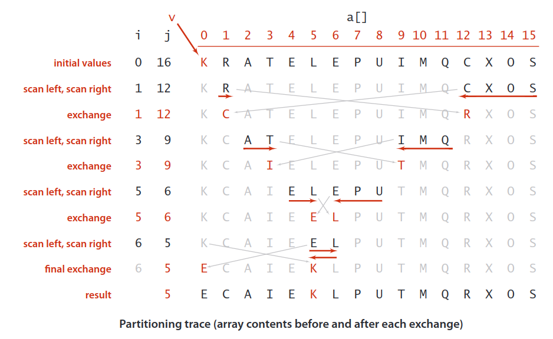
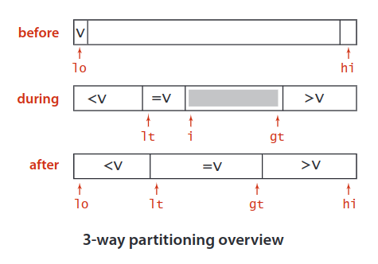
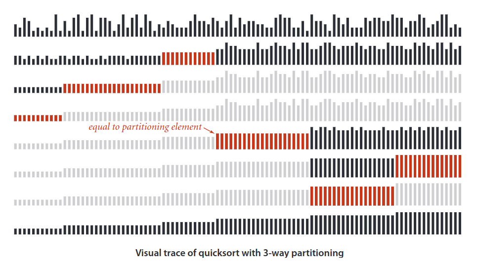

## Quick Sort
Quicksort is a comparison-based algorithm that uses divide-and-conquer to sort an array in-place.

Quicksort  is  popular  because  it  is  not  difficult  to implement, works well for a variety of different kinds of input data, and is substantially faster than any other sorting method in typical applications. The quicksort algorithm’s desirable  features  are  that  it  is  in-place (uses only a small auxiliary stack) and that it requires time proportional to `N log N` on the average to sort an array of length `N`.

Furthermore,  quicksort  has  a  shorter  inner  loop  than  most  other  sorting  algorithms, which means that it is fast in practice as well as in theory. Its primary drawback is that it is fragile in the sense that some care is involved in the implementation to be sure to avoid bad performance.

Here is the three-step divide-and-conquer process for sorting a typical subarray `A[p..r]`:
* __Divide:__ Partition `A[p..r]`, into two (possibly empty) subarrays `A[p..q−1]` and `A[q+1..r]`, such that each element in the first subarray `A[p..q−1]` is `≤ A[q]` and `A[q]` is `≤` each element in the second subarray `A[q+1..r]`.
* __Conquer:__ Sort the two subarrays `A[p..q-1]` and `A[q+1..r]` by recursive calls to quicksort.
* __Combine:__ Because the subarrays are already sorted, no work is needed to combine them: the entire array `A[p..r]` is now sorted.

> Most quicksort implementations are not stable, though stable implementations do exist.

|  | Worst | Average | Best |
|:--|:-:|:-:|---|
| __Time Complexity__ | `O(n^2)` | `θ(n logn)` | `Ω(n logn)` |
| __Space Complexity__ | `O(logn)` | `θ(logn)` | `Ω(logn)` |
| __Stable__ | No |
| __In Place__ | Yes |

### Complexity
* __Worst-case running time__

    The worst case happens when:
    1. Input sorted or reverse sorted
    2. Partition around min or max element.
    3. One side of partition always has no element.

    When quicksort always has the most unbalanced partitions possible (already sorted array), then the original call takes `cn` time for some constant `c`, the recursive call on `n-1` elements takes `c(n-1)` time, the recursive call on `n-2` elements takes `c(n-2)` time, and so on. Here's a tree of the subproblem sizes with their partitioning times:

    

    When we total up the partitioning times for each level, we get:

    `cn + c(n−1) + c(n−2) + ⋯ + 2c = c(n + (n−1) + (n−2) + ⋯ + 2) = c((n+1)(n/2) − 1) = Θ(n^2)`

    The last line is because `1 + 2 + 3 + ⋯ + n` is the arithmetic series.

    > The Space Complexity is the height of the tree which is equal to `n` (size of the stack).

* __Best-case running time__

    Quicksort's best case occurs when the partitions are as evenly balanced as possible: their sizes either are equal or are within 1 of each other. The former case occurs if the subarray has an odd number of elements and the pivot is right in the middle after partitioning, and each partition has `(n-1)/2` elements.

    

    Overall complexity: `Θ(n*log_2(n)) = Θ(n*lgn)`

    > The Space Complexity is the height of the tree which is equal to `log_2(n)` (size of the stack).

* __Average-case running time__

    Let's imagine that we don't always get evenly balanced partitions, but that we always get at worst a 3-to-1 split. That is, imagine that each time we partition, one side gets `3n/4` elements and the other side gets `n/4`. (To keep the math clean, let's not worry about the pivot.) Then the tree of subproblem sizes and partitioning times would look like this:

    

    There are `log_4/3(n)` levels and each leves requires `cn` time. Overall time complexity: `Θ(n*log_4/3(n)) = Θ(n*lgn)`

    The other case we'll look at to understand why quicksort's average-case running time is `O(n*lgn)` is what would happen if the half of the time that we don't get a 3-to-1 split, we got the worst-case split. Let's suppose that the 3-to-1 and worst-case splits alternate, and think of a node in the tree with k kk elements in its subarray. Then we'd see a part of the tree that looks like this:

    

    Therefore, even if we got the worst-case split half the time and a split that's 3-to-1 or better half the time, the running time would be about twice the running time of getting a 3-to-1 split every time. Again, that's just a constant factor, and it gets absorbed into the big-O notation.

    > The Space Complexity is the height of the tree which is equal to `log__4/3(n)` (size of the stack).

> __Optimal pivot is in the middle, because when you move it to the left or to the right (or take biggest or smallest item), you increase depth of recursion. In the worst case you will get O(n^2) except of O(n*log2(n)) when taking the middle.__

### Example

## Randomized Quick Sort
Approaches:
* In order to avoid worst case we can randomize the input before applying the QuickSort algorithm.
* Randomize choices made within the algorithm. We will select a randomly chosen element from the subarray `A[p..r]`. We do so by first exchanging `A[r]` with an element chosen at random from `A[p..r]`. __By randomly sampling the range `p,...,r`, we ensure that the pivot element `x = A[r]` is equally likely to be any of the `r - p + 1` elements in the subarray. Because we randomly choose the pivot element, we expect the split of the input array to be reasonably well balanced on average.__

The __Expected Worst Case__ time complexity of Randomized QuickSort is `O(2*n*lgn)`.

If, in each level of recursion, the split induced by `RANDOMIZED-PARTITION` puts any constant fraction of the elements on one side of the partition, then the recursion tree has depth `O(lg n)`, and `O(n)` work is performed at each level. Even if we add a few new levels with the most unbalanced split possible between these levels, the total time remains `(n*lg n)`.

> In terms of the number of comparisons it makes, _Randomized Quicksort_ is equivalent to randomly shuffling the input and then handing it off to _Naive Quicksort_.

The `QUICKSORT` and `RANDOMIZED-QUICKSORT` procedures differ only in how they select pivot elements. 

### Usage
Quicksort is sensitive to the data provided. Without usage of random pivots, it uses `O(n^2)` time for sorting a full sorted array. But by swapping random unsorted elements with the first element, and sorting afterwards, the algorithm becomes less sensitive to data would otherwise cause worst-case behavior (e.g. already sorted arrays).

> __Heapsort or Merge sort, it has a very low constant factor to its execution speed, which generally gives it a speed advantage when working with lots of random data.__

In practice:
* Quicksort is a great general-purpose sorting algorithm.
* Quicksort is typically over twice as fast as merge sort.
* Quicksort behaves well even with caching and virtual memory.

### Improvements
* Switch to _insertion sort_ for tiny arrays

    The optimum value of the cutoff `M` is system-dependent, but any value between __5__ and __15__ is likely to work well in most situations.

* __Median-of-three partitioning__

    A second easy way to improve the performance of quicksort is to use the median of a small sample of items taken from the subarray as the partitioning item. Doing so will give a slightly better partition, but at the cost of computing the median. It turns out that most of the  available improvement comes from choosing a sample of size `3` and then partitioning on the middle item.
    
    As a bonus, we can use the sample items as _sentinels_ at the ends of the array and remove both array bounds tests in `partition()`.

* Entropy-optimal sorting

    > __Entropy__ is defined as a lack of order or predictability.

    Arrays with large numbers of duplicate keys arise frequently in applications. In such situations, the quicksort implementation  that we have considered has acceptable performance, but it can be substantially improved.

One  straightforward  idea  is  to  partition  the  array  into     three  parts,  one  each  for items  with  keys  smaller  than,  equal  to,  and  larger  than  the  partitioning  item’s  key.

See function `threeWaySort()` for more implementation details.

Though this code was developed not long after quicksort, it fell out of favor  because  it  uses  many  more  exchanges than the standard 2-way partitioning method for  the  common  case  when  the  number  of duplicate keys in the array is not high.

3-way partitioning makes quicksort asymptotically faster than mergesort   and other methods in practical situations involving large numbers of equal keys. Mergesort  is  linearithmic  for  a  randomly  ordered  array  that  has  only  a constant number of distinct key values, but quicksort with 3-way partitioning is linear for such an array.

Given `N` keys with `k` distinct key values, for each `i` from `1` to `k` define `f_i` to be frequency of occurrence of the `i` th key value and `p_i` to be `f_i / N`, the probability that the `i` th key value is found when a random entry of the array is sampled. The __Shannon Entropy__ of the keys is defined as:

`H = - (p_1*lg(p_1) + p_2*lg(p_2) + ... + p_k*lg(p_k))`

#### Theorem. No compare-based sorting algorithm can guarantee to sort `N` items  with fewer than `NH - N` compares, where `H` is the Shannon entropy, defined from the frequencies of key values.

#### Theorem. Quicksort with 3-way partitioning uses `~ (2*ln2)*N*H` compares to sort `N` items, where `H` is the Shannon entropy, defined from the frequencies of key values.

> Note that `H = lgN` when the keys are all distinct (all the probabilities are `1/N`)

The  worst  case for  3-way  partitioning  happens  when  the  keys  are  distinct;  when  duplicate  keys  are present, it can do much better than mergesort. More important, these two properties together imply that quicksort with 3-way partitioning is entropy-optimal,  in  the  sense that the average number of compares used by the best possible compare-based sorting algorithm and the average number of compares used by 3-way quicksort are within a constant factor of one another, for any given distribution of input key values.

---

[Read More](https://www.codesdope.com/course/algorithms-quicksort/)
