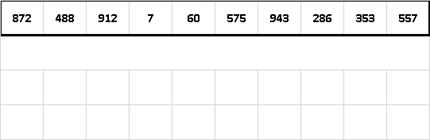
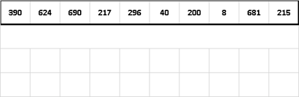

## Radix Sort

|  | Worst | Average | Best |
|:--|:-:|:-:|---|
| __Time Complexity__ | `O(wn)` | `θ(wn)` | `Ω(wn)` |
| __Space Complexity__ | `O(w + n)` | `θ(w + n)` | `Ω(w + n)` |
| __Stable__ | Yes | |

> `w` - word size (e.g. number of digits)

_Radix Sort_ - a non-comparative integer sorting algorithm that sorts data with integer keys by grouping keys by the individual digits which share the same significant position and value. A positional notation is required, but because integers can represent strings of characters (e.g., names or dates) and specially formatted floating point numbers, radix sort is not limited to integers.

In essence radix sort is like this: sort elements by last digit. Then sort elements by second to last digit up till we reach first digit and after that all elements are in sorted order.

Since comparison sorts cannot perform better than `O(n lgn)`, LSD radix sort is considered one of the best alternatives provided the word size `w` is expected to be less than `log n`.

Radix sorts can be implemented to start at either the __most significant digit__ (`MSD`) or __least significant digit__ (`LSD`). For example, when sorting the number 1234 into a list, one could start with the 1 or the 4.

Note that this recursive sorting algorithm has particular application to parallel computing, as each of the bins can be sorted independently. In this case, each bin is passed to the next available processor.

### LSD Example:

### MSD Example:
