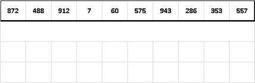
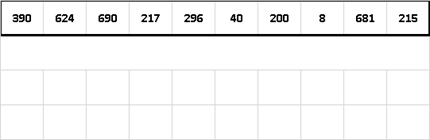

## Radix Sort

|  | Worst | Average | Best |
|:--|:-:|:-:|---|
| __Time Complexity__ | `O(d(n + b))` | `θ(d(n + b))` | `Ω(d(n + b))` |
| __Space Complexity__ | `O(n)` | `θ(n)` | `Ω(n)` |
| __Stable__ | Yes |
| __In Place__ | No |

_Radix Sort_ - a non-comparative integer sorting algorithm. It avoids comparison by creating and distributing elements into buckets according to their radix. Because integers can be used to represent strings (by hashing the strings to integers), radix sort works on data types other than just integers.

In essence radix sort is like this: sort elements by last digit. Then sort elements by second to last digit up till we reach first digit and after that all elements are in sorted order. So in base `10` (the decimal system), radix sort would sort by the digits in the 1's place, then the 10’s place, and so on.

Radix sorts can be implemented to start at either the __most significant digit__ (`MSD`) or __least significant digit__ (`LSD`). For example, when sorting the number 1234 into a list, one could start with the 1 or the 4.

Note that this recursive sorting algorithm has particular application to parallel computing, as each of the bins can be sorted independently. In this case, each bin is passed to the next available processor.

In the modern era, radix sorts are most commonly applied to collections of binary strings and integers. It has been shown in some benchmarks to be faster than other more general-purpose sorting algorithms.

### Complexity
Let `n` be a positive integer. The base `b` representation of `n` has `d` digits if `b``d−1` `≤ n < b``d`, which is the case if `d − 1 ≤ log_b(n) < d`, or `⌊log_b(n)⌋ = d−1`.

Radix sort takes in a list of `n` integers which are in base `b` (the radix) and so each number has at most `d` digits where `d = ⌊(log_b(k) + 1)⌋` and `k` is the largest number in the list. For example, three digits are needed to represent decimal `104` (in base `10`). It is important that radix sort can work with any base since the running time of the algorithm, `O(d(n+b))`, depends on the base it uses. The algorithm runs in linear time when `b` and `n` are of the same size magnitude, so knowing `n`, `b` can be manipulated to optimize the running time of the algorithm.

Radix sort uses counting sort on each digit. Each pass over `n` `d`-digit numbers will take `O(n + b)` time, and there are `d` passes total. Therefore, the total running time of radix sort is `O(d(n+b))`. When `d` is a constant and `b` isn't much larger than `n` (in other words, `b = O(n)`), then radix sort takes linear time.

> The constant factor of radix sort is pretty high.

### LSD Example:

### MSD Example:
