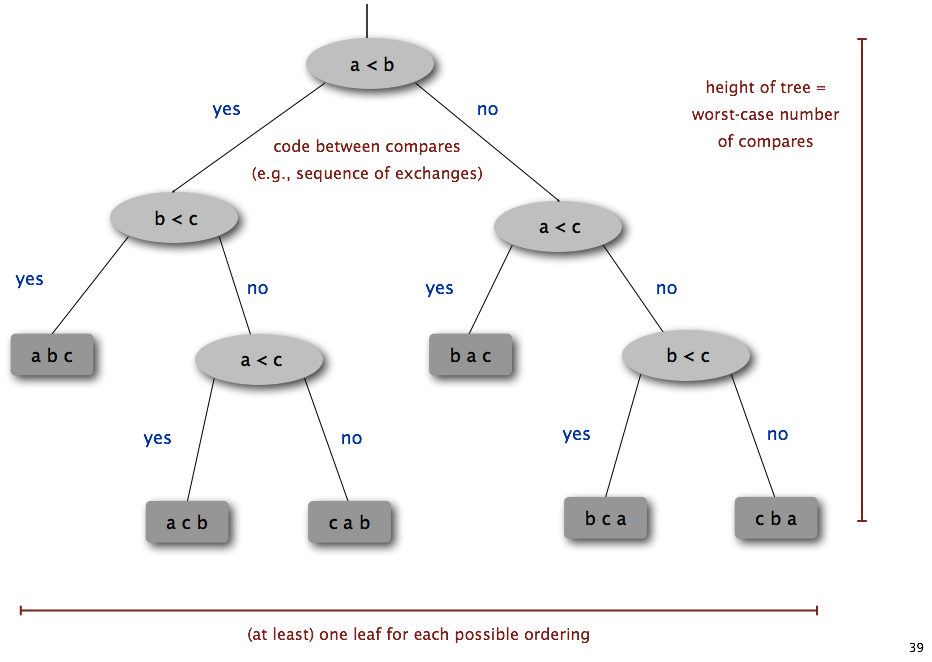
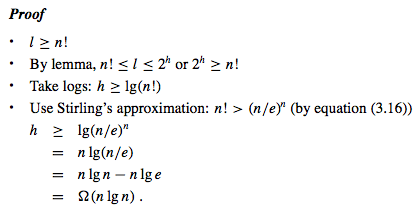

# Sorting Algorithms
Sorting algorithm is an algorithm that puts elements of a list in a certain order.

Sorting algorithms are often classified by:
* __Computational complexity__ (worst, average and best behavior) in terms of the size of the list (`n`). Comparison-based sorting algorithms need at least `Ω(n log n)` comparisons for most inputs.
* __Computational complexity__ of swaps (for "in-place" algorithms).
* __Memory usage__ (and use of other computer resources). In particular, some sorting algorithms are "in-place". Strictly, an in-place sort needs only `O(1)` memory beyond the items being sorted; sometimes `O(log(n))` additional memory is considered "in-place".
* __Recursion__. Some algorithms are either recursive or non-recursive, while others may be both (e.g., merge sort).
* __Stability__. Stable sorting algorithms maintain the relative order of records with equal keys (i.e., values).
* Whether or not they are a __comparison sort__. A comparison sort examines the data only by comparing two elements with a comparison operator.
* __General method__: insertion, exchange, selection, merging, etc. Exchange sorts include bubble sort and quicksort. Selection sorts include shaker sort and heapsort.
* Whether the algorithm is __serial__ or __parallel__.
* __Adaptability__: Whether or not the presortedness of the input affects the running time. Algorithms that take this into account are known to be adaptive.

## Decision Tree
In a comparison sort, we use only comparisons between elements to gain order information about an input sequence.

We can view comparison sorts abstractly in terms of decision trees. A __decision tree__ is a full binary tree that represents the comparisons between elements that are performed by a particular sorting algorithm operating on an input of a given size.

> In short __decision tree__ is a abstraction of any comparison sort.

Control, data movement, and all other aspects of the algorithm are ignored. Each internal node indicates a comparison `a[i] ≤ a[j]`. When we come to a leaf, the sorting algorithm has established the ordering.

> The __execution__ of the sorting algorithm corresponds to tracing a simple path from the root of the decision tree down to a leaf.

> __Worst-case__ number of comparisons for a given comparison sort algorithm equals the height of its decision tree.

### Lemma: Any binary tree of height `h` has `≤ 2^h` leaves.

### Theorem: Any comparison sort algorithm requires `Ω(n lgn)` comparisons in the worst case.

### Corollary: _HeapSort_ and _MergeSort_ are asymptotically optimal comparison sorts.

__[More about Sorting Algorithms](https://en.wikipedia.org/wiki/Sorting_algorithm)__