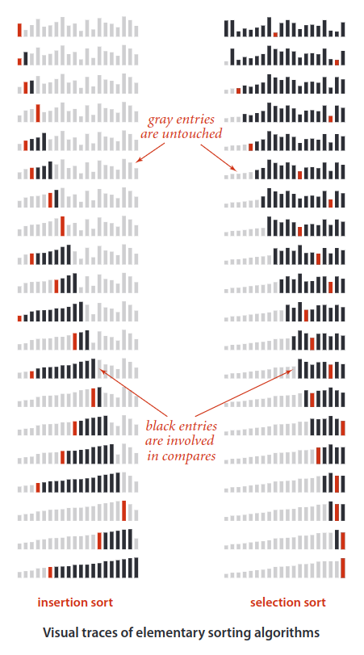

## Selection Sort
The idea behind selection sort is simple: First, find the smallest item in the array and exchange it with the first entry (itself if the first entry is already the smallest). Then, find the next smallest item and exchange it with the sec-ond entry. Continue in this way until the entire array is sorted.

Selection sort is a sorting algorithm, specifically an in-place comparison sort. It is inefficient on large lists, and generally performs worse than the similar insertion sort.

Selection sort is noted for its simplicity, and it has performance advantages over more complicated algorithms in certain situations, particularly where auxiliary memory is limited.

### Properties
* Running time is insensitive to input
* Data movement is minimal

### Complexity

Examination of the code reveals that, for each `i` from `0` to `N - 1`, there is one exchange and `N - 1 - i` compares, so the totals are `N` exchanges and `(N - 1) + (N - 2) + . . . + 2 + 1 + 0 = N(N - 1) / 2  ~ N^2 / 2` compares.

|  | Worst | Average | Best |
|:--|:-:|:-:|---|
| __Time Complexity__ | `O(n^2)` | `θ(n^2)` | `Ω(n^2)` |
| __Space Complexity__ | `O(1)` | `θ(1)` | `Ω(1)` |
| __Stable__ | No |
| __In Place__ | Yes |

### Example

