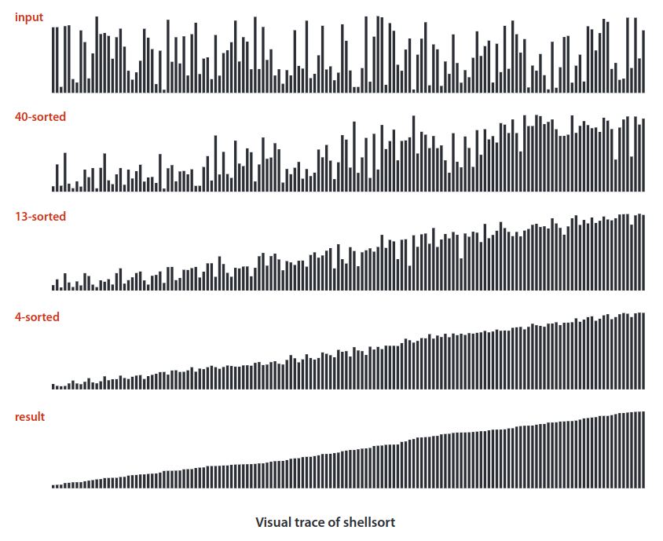

## Shellsort
Shellsort  is  a  simple  extension  of  insertion  sort  that  gains speed  by  allowing  exchanges  of  array  entries  that  are  far  apart,  to  produce  partially sorted arrays that can be efficiently sorted, eventually by insertion sort.

The idea is to rearrange the array to give it the property that taking every `h`th entry (starting anywhere) yields a sorted subsequence. Such an array is said to be __`h`-sorted__. Put another  way, an __`h`-sorted__  array  is  `h` independent sorted subsequences, interleaved (чередующийся) together. By `h`-sorting for some large values of `h`, we can move items in the array long distances and thus make it easier to `h`-sort for smaller values of `h`.  Using  such a procedure for any sequence of values of `h` that ends in `1` will produce a sorted array: that is __shellsort__.

How do we decide what increment sequence to use? In general, this question is a difficult one to answer. The performance of the algorithm depends not just on the number of increments, but also on arithmetical interactions among the increments such as the  size  of  their  common  divisors and other properties. Many different   increment   sequences have  been  studied  in  the  literature,  but  no  provably  best sequence  has  been  found.

Shellsort  is  useful  even  for large    arrays,    particularly    by contrast  with  selection  sort  and insertion  sort.  It  also  performs well  on  arrays  that  are  in  arbitrary order (not necessarily random).

> Shellsort is an in-place comparison sort.

> __Shellsort is not stable__

> Shellsort  is  much faster  than  insertion  sort  and selection sort, and its speed advantage increases with the array size.

Experienced  programmers  sometimes  choose  shellsort  because  it  has  acceptable running time even for moderately large arrays; it requires a small amount of code; and it uses no extra space.

### Complexity
The  most  important result in the present context is the knowledge that the running time of shellsort is  not  necessarily  quadratic: for  example,  it  is  known  that  the  worst-case  number  of compares for the implemented algorithm is proportional to `N``3/2`.

> The beast case happens when the array is partially sorted.

|  | Worst | Average | Best |
|:--|:-:|:-:|---|
| __Time Complexity__ | `O(n^2)` | `θ(n^(3/2))` | `Ω(n * log n)` |
| __Space Complexity__ | `O(1)` | `θ(1)` | `Ω(1)` |
| __Stable__ | No |
| __In Place__ | Yes |

### Example
[Youtube Video](https://www.youtube.com/watch?v=ddeLSDsYVp8)