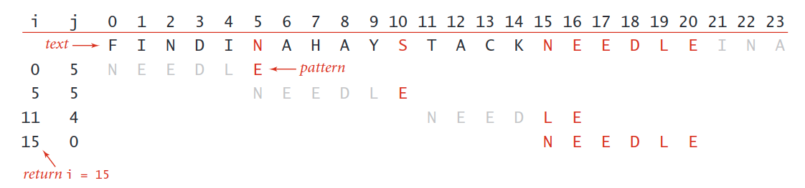
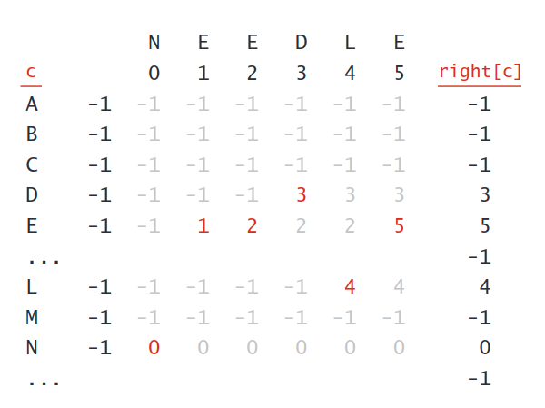

# String Algorithms
## String Sort
We consider two fundamental different approaches to string sorting:
1. The first approach examines the characters in the keys in a right-to-left order. Such methods are generally referred to as __least-significant-digit__ (__LSD__) string sorts.

    Use of the term _digit_ instead of character traces back to the application of the same basic meth-od to numbers of various types. Thinking of a string as a base-256 number, considering characters  from  right  to  left  amounts  to  considering  first  the  least  significant  digits.
    
    This approach is the method of choice for string-sorting applications where all the keys are the same length.

    > __LSD string sort stably sorts fixed-length strings.__

    > __LSD string sort uses `~7WN + 3WR` array accesses and extra  space  proportional  to `N + R`  to  sort `N`  items  whose  keys  are `W`-character strings taken from an `R`-character alphabet.__

    > __The running time of LSD in the worst case is linear.__

    For typical applications, `R` is far smaller than `N`, so it implies that the total running time is proportional to `WN`. An input array of `N` strings that each have `W`-characters has a total of `WN` characters, so the running time of LSD string sort is linear in the size of the input.

2. The  second  approach  examines  the  characters  in  the  keys  in  a  left-to-right  order, working with the most significant character first.  These methods are generally referred to  as  __most-significant-digit__  (__MSD__)  string  sorts—we  will  consider  two  such  methods in this section.

   * __MSD__ 

        MSD string sorts are attractive because they can get a sorting job done without necessarily examining all of the input characters.  MSD string sorts are similar to quicksort, because they partition the array to be sorted into independent pieces such that  the  sort  is  completed  by  recursively  applying  the  same  method  to  the  subarrays. The  difference  is  that  MSD  string  sorts  use  just  the  first  character  of  the  sort  key  to do  the  partitioning,  while  quicksort  uses  comparisons  that  could  involve  examining the whole key.

        The strings are not necessarily same length.

        We  use  key-indexed  counting  to  sort  the  strings  according  to their first character, then (recursively) sort the subarrays corresponding to each character (excluding the first character, which we know to be the same for  each  string  in  each  subarray).

        > __MSD string sort stably sorts various-length strings.__

        Pitfalls:
        * Small subarrays

            Using Insertion sort for small subarrays in MSD is MUST. Mainly due to high memory consumption ("count" array). Especially for large alphabets.

        * Equal strings

            MSD can  be  relatively  slow  for  subarrays  containing  large numbers  of  equal  keys.  If  a  substring  occurs  sufficiently often  that  the  cutoff  for  small  subarrays  does  not  ap-ply,  then  a  recursive  call  is  needed  for  every  character in  all  of  the  equal  keys. Thus,  the  worst  case  for  MSD  string  sorting  is  when  all keys are equal.

        * Extra space

            To do the partitioning, MSD uses two auxiliary arrays: the temporary  array for distributing keys (`auxiliary[]`) and the array that holds the counts that are trans-formed into partition indices (`count[]`).  The `auxiliary[]` array is of size `N` and can be created outside the recursive `sort()` method. This extra space can be eliminated by sacrificing stability, but it is often not a major concern in practical applications of MSD string sort. Space for the `count[]` array, on the other hand, can be an important issue (because it cannot be created outside the recursive helper method).

            > __To sort `N` random strings from an `R`-character alphabet, MSD string sort examines about `N * log``R``N` characters, on average.__

            > __The running time of MSD in the worst case is linear.__

   * __3-way String Quicksort__

        To sort an array of strings, we 3-way partition them on their first character, then (recursively) sort the three resulting subarrays: the strings whose first character is less than the partitioning character, the strings whose first character is equal to the partitioning character (excluding their first character in the sort), and the strings whose first character is greater than the partitioning character.

        Three-way string quicksort divides the array into only three parts, so it involves more data movement than MSD string sort when the number of nonempty partitions is large because it has to do  a  series  of  3-way  partitions to get the effect of the multiway partition. On  the  other  hand, MSD   string   sort   can   create large numbers of (empty) sub-arrays,   whereas   3-way   string quicksort always has just three. Thus,  3-way  string  quicksort adapts  well  to  handling  equal keys,  keys  with  long  common prefixes,   keys  that  fall  into  a small range, and small arrays—all    situations    where    MSD string sort runs slowly.

        lso, like quicksort, 3-way string quicksort does not use extra space (other than the implicit stack to  support  recursion),  which  is  an  important  advantage  over  MSD  string  sort,  which requires space for both frequency counts and an auxiliary array.  

        It is worthwhile to consider various standard improvements to the implementation
        1. Use insertion sort for small subarrays
        2. As with any quicksort, it is generally worthwhile to shuffle the array beforehand or to use a random paritioning item by swapping the first item with a ran-dom one. The primary reason to do so is to protect against worst-case performance in the case that the array is already sorted or nearly sorted.

        > To sort an array of `N` random strings, 3-way string quicksort uses `~2N * lnN` character compares, on the average.

        Researchers  have studied  this  algorithm  in  depth  and  have  proved  that  no  algorithm  can  beat  3-way string quicksort (measured by number of character compares) by more than a constant factor,  under  very  general  assumptions.  To  appreciate  its  versatility,  note  that  3-way string quicksort has no direct dependencies on the size of the alphabet.

The number of characters in the alphabet is an important parameter when analyzing  string  sorts.  Though  we  focus  on  extended ASCII  strings (`R  = 256`),  we  will  also consider strings taken from much smaller alphabets (such as genomic sequences) and from much larger alphabets (such as the `65,536` - character Unicode alphabet that is an international standard for encoding natural languages).

### String Sorting Algorithms Comparison

## Substring Search
__Substring search__: given a text string of length `N` and a pattern string of length `M`, find  an  occurrence  of  the  pattern  within  the  text.

While searching a pattern in a string, we compare each string's character against pattern. If a match is detected we move to the next character in patter. But when we reach a mismatch, the next compare will be against the first character of pattern. It means we start again. It is called backtracking.

Its worst-case running time is proportional to `M * N`.

### Knuth-Morris-Pratt substring search
The Knuth-Morris-Pratt (KMP) algorithm is an algorithm that is used to search for a substring (`W`), in a given string (`S`), in `O(m+n)` time (where `m` and `n` are the lengths of `W` and `S`).

The key idea used to achieve this time complexity is to minimize the amount of backtracking when a character of `W` does not match with that of `S`. This can only be done if we know two things:
1. Whether or not a proper prefix of `W` occurs more than once in `S` ​after at least one character has been correctly found; if it does, it can be skipped when resuming the process of matching after a mismatch.
2. Length of the proper prefix.

Before starting the actual algorithm, a one-dimensional array is initialized with the number of characters that can be skipped after a mismatch. `lps[i]` represents the number of characters that can be skipped when `W[i+1]` does not match with a character in `S`.

__`lsp`__ stands for longest proper prefix which is also suffix.

When a mismatch occurs, all the previous characters match correctly; ​this implies that if a prefix of `W` occurred in this set of matching characters, then that prefix is also a suffix of `W`.

In other words, `lps[i]` will represent the length of the longest proper prefix of `W`, which is also a proper suffix of `W` (considering `W` till the `i`th index only).

For the word `ACA` we have the following proper prefixes: ` `, `A`, `AC`, and the suffixes: ` `, `A`, `CA`, `ACA`. Thus, the longest proper prefix that is equal to the suffix is `A`.

#### Theorem
Knuth-Morris-Pratt substring search accesses no more than `m + n` characters to search for a pattern of length `m` in a text of length `n`.

Proof: `computeLPS()` runs in `O(m)` + `knuthMorrisPratt()` runs in `O(n)` time.

### Boyer-Moore substring search
When  backup  in  the  text  string  is  not  a  prob-lem, we can develop a significantly faster substring-searching method by scanning the   pattern from right to left when trying to match it against the text.

The figure below shows a search for the pattern `NEEDLE` in the text `FINDINAHAYSTACKNEEDLE`.

Proceeding from right to left to match the pattern, we first compare the rightmost `E` in the pattern with the `N` (the character at position 5) in the text. Since `N` appears in the pattern, we slide the pattern five positions to the right to line up the `N` in the text with the (rightmost) `N` in the pattern. Then we compare the rightmost `E` in the pattern with the `S` (the character at position 10) in the text. This is also a mismatch, but `S` does not appear in the pattern, so we can slide the pattern six positions to the right.We match the rightmost `E` in the pattern against the `E` at position 16 in the text, then find a mis-match and discover the `N` at position 15 and slide to the right five positions, as at the beginning. Finally, we verify, moving from right to left starting at position 20, that the pattern is in the text. This method brings us to the match position at a cost of only four character compares (and six more to verify the match)!

To implement the mismatched character heuristic, we use an array `right[]` that gives, for each character in the alphabet, the index of  its __rightmost  occurrence__  in  the  pattern  (or `-1` if the character is not in the pattern). This value tells us precisely how far to skip if that character appears in the text and causes a mismatch during the string search.

#### Theorem
On typical inputs, substring search with the Boyer-Moore mismatched character heuristic uses `~N/M` character compares to search for a pattern of length `M` in a text of length `N`.

> However running time in the worst case is O(N * M).

### Rabin-Karp fingerprint search
The method developed by M.O. Rabin and R.A. Karp is a completely different approach to substring search that is based on hashing. We compute a hash function for the pattern and then look for a match by using the same hash function for each possible `M`-character substring of the text. If we find a text substring with the same hash value as the pattern, we can check for a match.

A  straightforward  implementation  based on  this  description  would  be  much  slower  than  a  brute-force  search  (since  computing a hash function that involves every character is likely to be much more expensive than just comparing characters), but Rabin and Karp showed that it is easy to compute hash functions for M-character substrings in constant time (after some preprocessing), which leads to a linear-time substring search in practical situations.

we need a function `H` (called a hashing function), which takes a string s and maps it to an integer `H(s) = x`. From now on, we’ll call `x` the hash value of `s`.

Perhaps one of the simplest hashing functions we can use is the sum of ASCII codes of the letters in the string. For simplicity, we’ll use `int(x)` to denote the ASCII code of `x`.

`H(s[0..n-1]) = int(s[0]) + int(s[1]) + ... + int(s[n-1])`

> When two distinct strings have the same hash value, is called a __collision__.

As a rule, the fewer collisions a hashing function causes, the better it is. Our hashing function has lots of collisions since it doesn’t take into account the order and position of letters. 

If we use a good hashing function, the expected complexity would become `O(n + k * t)`, where `t` is the number of matches. The reason behind this is that a good hashing function would rarely cause collisions. Therefore, we’d rarely need to compare two substrings when there is no match.

Furthermore, if we only want to check if the pattern exists or not, the complexity would become `O(n+k)`, because we can break after the first occurrence.

We’ll try to represent strings as numbers in base `R`, where `R` is the size of extended ASCII alphabet. In general, a string `s` with length `n` would have the following hash value:

`int(s[0]) * R``n-1`` + int(s[1]) * R``n-2`` + ... + int(s[n-2]) * R + int(s[n-1])`

Since we’re representing the string in a valid number system, hash values for distinct strings will be distinct. However, the hash values would become huge when representing a long string. Therefore, it would be inefficient to compute and store them.

Instead, we’ll calculate the hash value modulo `q`, where `q` is a large prime (usually around `10``9`). The larger the prime is, the fewer collisions it would cause.

Notice that we have:

`prefix[i] = prefix[i-1] * R + int(s[i])`.

This will allow us to calculate the prefix array in linear time.

Also, we’d need to calculate an array `Pow` that stores the different powers of the prime `R`.

However, we still need to find a way to calculate the hash value of any substring in constant time. As an example, let’s say we want to calculate the value of `H(s[2...4])`. The result should be `int(s[2]) * R^2 + int(s[3]) * R + int(s[4])`. This value is available in `prefix[4]`, but we need to remove the terms corresponding to `s[0]` and `s[1]`. These two terms are available in `prefix[1]`. However, when moving from `prefix[1]` to `prefix[4]`, they were multiplied `4 - 1 = 3` times by `R`. To remove them, we need to multiply `prefix[1]` by `R^3` and then subtract it from `prefix[4]`. Therefore, `H(s[2...4]) = prefix[4] - prefix[1] * R``4-1`.

As a rule,

`H(s[L...R]) = prefix[R] - prefix[L-1] * R``R-L+1`.

> The complexity of the precalculation is `O(n)`, where `n` is the length of the string. Also, the complexity of the hashing function is `O(1)`.

Using this hashing function lowers the probability of collisions. Therefore, we can achieve the expected complexity of Rabin-Karp in most cases. However, the algorithm would still be slow when there are many matches, regardless of the hashing function.

## Regular Expressions

---

#### [Video Lectures](https://youtube.com/playlist?list=PLsy0Ac_lM3PjZuZpsYJbF8AOZ-iq8qNid)

#### [Knuth-Morris-Pratt KMP String Matching Algorithm](https://www.youtube.com/watch?v=V5-7GzOfADQ)

#### [Read More about Knuth-Morris-Pratt Algorithms](https://towardsdatascience.com/pattern-search-with-the-knuth-morris-pratt-kmp-algorithm-8562407dba5b)

#### [Rabin-Karp String Matching Algorithm](https://www.youtube.com/watch?v=qQ8vS2btsxI)
